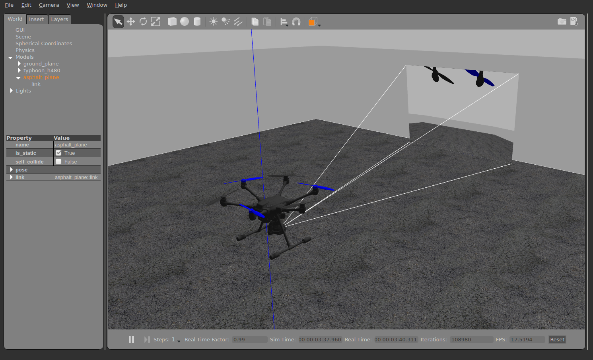

# 짐벌 콘트롤 설정

기체에 카메라(또는 다른 장치)를 달아 장착하는 짐벌을 제어하려면, 어떻게 제어할 지, PX4가 어떻게 명령을 내릴지 설정해야합니다. 이 페이지에서는 설정 방법을 설명합니다.

PX4에는 제각각의 입출력 방식을 가진 일반 마운트/짐벌 제어 드라이버가 있습니다.
- 입력에서는 (임무 수행이나 조사 활동시) RC나 MAVLink 명령 중 짐벌 제어 방식을 정의합니다.
- 출력에서는 MAVLink 명령 또는 비행 제어 장치 AUX PWM 포트 중 어떤 방식으로 짐벌을 연결할 지 정의합니다. 어떤 입력 방식이든 출력을 처리할 용도로 선택할 수 있으며, 두 방식 모두 매개변수로 구성해야합니다.

## 매개변수

[마운트](../advanced_config/parameter_reference.md#mount) 매개변수는 마운트 드라이버 구성에 활용합니다.

가장 중요한 부분은 입력([MNT_MODE_IN](../advanced_config/parameter_reference.md#MNT_MODE_IN)) 상태와 출력([MNT_MODE_OUT](../advanced_config/parameter_reference.md#MNT_MODE_OUT)) 모드입니다. 초기 값으로 입력은 활성화되어 있지 않고 드라이버도 작동하지 않습니다. 입력 상태를 선택하고 나면, 기체 구동을 다시 시작하여 마운트 드라이버를 시작하십시오.

입력 상태를 `AUTO`(자동)로 설정하면, 가장 최근의 입력 상태로 자동으로 전환합니다. MAVLink에서 RC로 전환하려면, 스틱을 크게 움직이십시오.

## MAVLink 짐벌(MNT_MODE_OUT=MAVLINK)

MAVLink 짐벌을 활성화하려면, 매개변수 [MNT_MODE_IN](../advanced_config/parameter_reference.md#MNT_MODE_IN)을 `MAVLINK_DO_MOUNT`로 설정하고 [MNT_MODE_OUT](../advanced_config/parameter_reference.md#MNT_MODE_OUT)을 `MAVLINK`로 설정합니다.

짐벌은 \[MAVLink 주변 기기 (GCS/OSD/보조)\](../peripherals/mavlink_peripherals.md#mavlink-peripherals-gcsosdcompanion) 에서 다루는 방법과 같이 *어떤 여분의 직렬 포트*에든 연결할 수 있습니다([직렬 포트 구성](../peripherals/serial_configuration.md#serial-port-configuration)도 참고).

일반 구성은 비행 제어장치의 TELEM2 포트(TELEM2가 비어있다고 가정)에 짐벌을 직렬 연결하는 방식입니다. 이렇게 구성하려면, 다음과 같이 설정합니다:
- [MAV_1_CONFIG](../advanced_config/parameter_reference.md#MAV_1_CONFIG)에서 **TELEM2**까지(`MAV_1_CONFIG`가 이미 보조 컴퓨터에 사용되고 있는 경우(예: `MAV_2_CONFIG` 사용))
- [MAV_1_MODE](../advanced_config/parameter_reference.md#MAV_1_MODE)에서 **NORMAL**로
- 제조업체 권장 전송 속도에 대한 [SER_TEL2_BAUD](../advanced_config/parameter_reference.md#SER_TEL2_BAUD).

이렇게 하면 사용자가 [MAV_CMD_DO_MOUNT_CONTROL](https://mavlink.io/en/messages/common.html#MAV_CMD_DO_MOUNT_CONTROL)와 [MAV_CMD_DO_MOUNT_CONFIGURE](https://mavlink.io/en/messages/common.html#MAV_CMD_DO_MOUNT_CONFIGURE)를 사용하여 짐벌에 명령을 실행합니다.


## 비행 콘트롤러의 짐벌(MNT_MODE_OUT=AUX)

짐벌은 출력 모드를 `MNT_MODE_OUT=AUX`로 설정하여 비행 콘트롤러 AUX 포트에 연결할 수 있습니다.

A mixer file is required to define the mapping for the output pins and the [mount mixer](https://github.com/PX4/PX4-Autopilot/blob/release/1.13/ROMFS/px4fmu_common/mixers/mount.aux.mix) is automatically selected (this overrides any AUX mixer provided by the airframe configuration).

출력 할당은 다음과 같습니다:
- **AUX1**: 상하 회전각(Pitch)
- **AUX2**: 좌우 회전각(Roll)
- **AUX3**: 방위 회전각(Yaw)
- **AUX4**: 촬영/복귀

### 믹서 구성 사용자 정의

:::tip
믹서 작동 방식과 믹서 파일 형식에 대한 설명은 [믹싱 및 액추에이터](../concept/mixing.md)를 참고하십시오.
:::

출력은 SD 카드에 `etc/mixers/mount.aux.mix` [믹서 파일을 생성](../concept/system_startup.md#starting-a-custom-mixer)하여 사용자가 정의할 수 있습니다.

마운트에 대한 기본 믹서 설정은 다음과 같습니다.

```
# roll
M: 1
O:      10000  10000      0 -10000  10000
S: 2 0  10000  10000      0 -10000  10000

# pitch
M: 1
O:      10000  10000      0 -10000  10000
S: 2 1  10000  10000      0 -10000  10000

# yaw
M: 1
O:      10000  10000      0 -10000  10000
S: 2 2  10000  10000      0 -10000  10000
```


## SITL

Typhoon H480 모델은 사전에 설정된 시뮬레이션 짐벌과 함께 제공됩니다.

실행하려면 다음을 사용하십시오.
```
make px4_sitl gazebo_typhoon_h480
```

다른 모델이나 시뮬레이터에서 마운트 드라이버를 테스트하려면 `vmount start`를 사용하여 드라이버가 실행되는 지 확인한 다음, 해당 매개변수를 설정하십시오.


## 시험
드라이버는 간단한 테스트 명령을 제공합니다. 먼저 `vmount stop`으로 중지합니다. 다음은 SITL에서의 테스트 방법을 설명합니다. 이 명령은 실제 장치에서도 작동합니다.

다음을 사용하여 시뮬레이션을 시작합니다(이를 위해 매개변수를 변경할 필요는 없음).
```
make px4_sitl gazebo_typhoon_h480
```
예를 들어 시동 여부를 확인하십시오. `commander takeoff` 명령어를 실행한 다음, 다음 명령을 사용하여 짐벌(예)을 제어합니다:
```
vmount test yaw 30
```

시뮬레이션된 짐벌은 자체적으로 안정적이므로, MAVLink 명령을 보내는 경우 `stabilize` 플래그를 `false`로 설정합니다.



