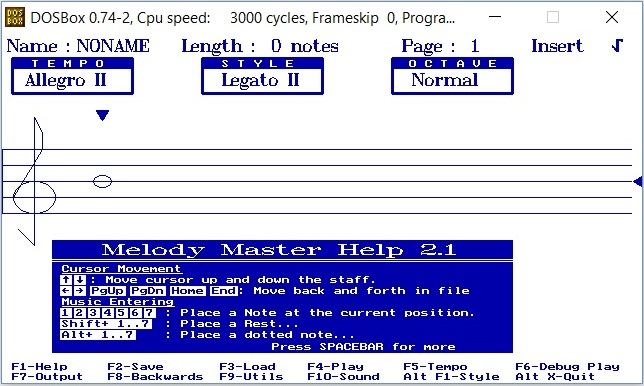

# 시스템 알림음

PX4는 중요한 시스템 상태와 문제를 음성으로 알리는 여러가지 [표준 알림음](../getting_started/tunes.md)을 지정해두었습니다(예시: 시스템 시작, 이륙 준비 완료, 배터리 경고 등)

알림음은 문자열([안시 악보 표기](http://artscene.textfiles.com/ansimusic/information/ansimtech.txt))로 정의하며 [튠즈](https://github.com/PX4/PX4-Autopilot/tree/master/src/lib/tunes) 라이브러리를 통해 코드로 재생합니다. 튠즈 라이브러리에는 기본 시스템 음 목록이 들어있습니다. 해당 내용은 [lib/tunes/tune_definition.desc](https://github.com/PX4/PX4-Autopilot/blob/master/src/lib/tunes/tune_definition.desc) 파일을 참고하십시오.

PX4에는 기본음 또는 사용자 지정음을 재생(시험)할 때 활용할 모듈이 있습니다.

이 주제에서는 알림음을 만들고 시스템 알림 음으로 추가하는 일반 과정을 안내해드리겠습니다.


## 알림음 만들기

음 문자열은 [안시 악보 표기 방식](http://artscene.textfiles.com/ansimusic/information/ansimtech.txt)으로 정의합니다.

새 알림음을 만드는 가장 쉬운 방법은 음악 편집기를 활용하는 방법입니다.
:::

안시 뮤직은 안시 BBS 시스템을 사용하던 시절에 유명한 방식이었기에, 최고의 편집 도구는 DOS 유틸리티입니다. 윈도우에서는 *도스박스*에서 *멜로디 마스터*를 사용하는 선택지가 있습니다.

안시 뮤직은 안시 BBS 시스템을 사용하던 시절에 유명한 방식이었기에, 최고의 편집 도구는 DOS 유틸리티입니다. 윈도우에서는 *도스박스*에서 *멜로디 마스터*를 사용하는 선택지가 있습니다.

프로그램을 사용하는 단계는 다음과 같습니다:

1. [도스박스](http://www.dosbox.com/)를 다운로드하여 설치합니다
1. [멜로디 마스터](ftp://archives.thebbs.org/ansi_utilities/melody21.zip)를 다운로드하고 새 디렉터리로 압축을 해제합니다
1. *도스박스* 콘솔을 엽니다
1. 멜로디 마스터 디렉터리를 아래와 같이 도스박스에서 마운트하십시오:
   ```
   mount c C:\<path_to_directory>\Melody21
   ```
1. 다음 명령으로 *Melody Master*를 시작하십시오
   ```
   c:
   start
   ```
1. 일부 화면을 통해 선택지를 누른 후, **1**을 눌러 *멜로디 마스터*를 띄우십시오: 

   화면의 절반 하단부에서 도구 사용에 필요한 키보드 단축키를 안내해줍니다(악보를 움직이고 음표 길이를 선택할 수 있는 등의 작업 가능).
1. 음악을 저장할 준비가 끝나면:
   - **F2** 키를 눌러 이름 부여하고, 멜로디 마스터 설치 디렉터리의 */Music*  하위 폴더에 저장하십시오.
   - **F7** 키를 누른 후 우측 화면에서 하단으로 스크롤 이동하여 출력 형식을 ANSI로 설정하십시오. 파일은 멜로디 마스터 디렉터리 *루트*에 내보냅니다(동일한 이름이나, 파일 형식에 맞는 확장자가 따로 붙음).
1. 파일을 여십시오. 출력 내용은 다음과 같습니다:

   

1. PX4에서 재생할 수 있는 문자열은 `MNT`와 `P64` 사이의 `150L1O3DL16CL32<B>C<AEL16A` 입니다.


## 알림음 시험

PX4에서 재생할 알림음을 새로 추가할 준비가 끝났다면, [tune_control](../modules/modules_system.md#tunecontrol) 라이브러리를 활용하십시오. 예를 들어, 우리가 위 과정을 거쳐 "만든" 재생음을 시험하려면 다음 명령을 콘솔 또는 셸(예: [MAVLink 셸](../debug/mavlink_shell.md))에 입력하십시오:
```sh
tune_control play -m "150L1O3DL16CL32<B>C<AEL16A"
```

:::note
별개로, `tune_control` 이 실제 하드웨어(모의 시험 환경 아님)에 대해 유일하게 나타납니다.
:::

## 기존 알림음 바꾸기

알림음은 [tune_definition.desc](https://github.com/PX4/PX4-Autopilot/blob/master/src/lib/tunes/tune_definition.desc)에 지정되어 있습니다.

기존 알림음을 바꾸려면, 파일을 별도로 복사한 후, `PX4_DEFINE_TUNE` 에 정의한 알림음 문자열을 새로 바꾸시면 됩니다.


## 새 알림음 추가


곧 추가 예정.


<!-- 

1. Assumption is that you need to define a new `PX4_DEFINE_TUNE` with its own number in the file.
2. Need to look at how tunes are played. Problem for another day.

-->