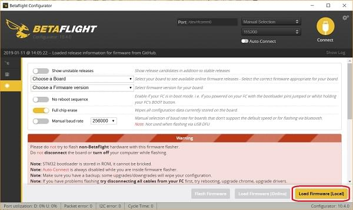

# Betaflight 시스템 부트로더 설치

이 페이지 문서는 Betaflight가 사전 설치되어 되어 있는 보드(예.[OmnibusF4 SD](../flight_controller/omnibus_f4_sd.md)또는 [Kakute F7](../flight_controller/kakutef7.md))에 PX4 부트로더를 설치하는 방법을 다룹니다.

부트로더 설치에는 2가지 선택지가 있습니다: *Betaflight Configurator*를 이용하는 것(더 쉽습니다)과, 소스로 부터 빌드하는 방법이 있습니다.

<a id="betaflight_configurator"></a>

### Betaflight Configurator로 부트로더 업데이트

이제 보드에 PX4 펌웨어를 설치할 수 있습니다.
1. 미리 빌드되어 있는 부트로더 바이너리를 다운 받아야 합니다. (보드에 따라 다를 수 있습니다.)
1. 운영체제에 맞게 [Betaflight Configurator](https://github.com/betaflight/betaflight-configurator/releases)를 다운로드 합니다. 운영체제에 맞게 [Betaflight Configurator](https://github.com/betaflight/betaflight-configurator/releases)를 다운로드 합니다.
:::
1. PC에 보드를 연결하고 Configurator를 실행합니다.
1. **Load Firmware [Local]** 버튼을 누릅니다. 
1. 파일시스템으로부터 부트로더 바이너리를 선택하고 보드에 설치(flash)합니다.

다음 명령어로 [Bootloader](https://github.com/PX4/Bootloader)를 다운로드하고 빌드하십시오:

### 소스를 사용하여 부트로더 업데이트하기

#### 부트로더 소스 다운로드

Flight controllers that have bootloader PX4-Autopilot `make` targets, can build the bootloader from the PX4-Autopilot source. The list of controllers for which this applies can be obtained by running the following `make` command, and noting the make targets that end in `_bootloader`

```
$make list_config_targets

...
cuav_nora_bootloader
cuav_x7pro_bootloader
cubepilot_cubeorange_bootloader
holybro_durandal-v1_bootloader
holybro_kakuteh7_bootloader
matek_h743-mini_bootloader
matek_h743-slim_bootloader
modalai_fc-v2_bootloader
mro_ctrl-zero-classic_bootloader
mro_ctrl-zero-h7_bootloader
mro_ctrl-zero-h7-oem_bootloader
mro_pixracerpro_bootloader
px4_fmu-v6u_bootloader
px4_fmu-v6x_bootloader
```

To build for these flight controllers, download and build the [PX4-Autopilot source](https://github.com/PX4/PX4-Autopilot), and then make the target using the following commands:

```bash
git clone --recursive  https://github.com/PX4/PX4-Autopilot.git
cd PX4-Autopilot
make <target> # For example: holybro_kakuteh7mini_bootloader
```

For other flight controllers download and build the [Bootloader source](https://github.com/PX4/Bootloader) and then make using the appropriate targets:

```
git clone --recursive  https://github.com/PX4/Bootloader.git
cd Bootloader
make <target> # For example: omnibusf4sd_bl or kakutef7_bl
```

#### 부트로더 설치하기

아래 방법들로 설치를 시도하는 것은 무서워할 필요가 없습니다.

아래 방법 중 하나를 사용하여 플래시를 시도하는 것을 두려워하지 마십시오.

:::note
STM32 MCU는 벽돌로 만들 수 없습니다. 
DFU는 플래싱으로 덮어쓸 수 없으며 플래싱이 실패하더라도, 항상 새 펌웨어를 설치할 수 있습니다.
:::

##### DFU 모드로 진입

두 방법 모두 보드가 DFU 모드에 있어야 합니다. DFU 모드로 들어가려면 USB 케이블을 컴퓨터에 연결하는 동안 부팅 버튼을 누르고 있습니다. 보드의 전원이 켜진 후 버튼을 놓을 수 있습니다.

##### dfu-util

:::note
The [Holybro Kakute H7 v2](../flight_controller/kakuteh7v2.md) and mini flight controllers may require that you first run an additional command to erase flash parameters (in order to fix problems with parameter saving):

```
dfu-util -a 0 --dfuse-address 0x08000000:force:mass-erase:leave -D build/<target>/<target>.bin
```

The command may generate an error which can be ignored. Once completed, enter DFU mode again to complete the regular flashing.
:::

To flash the bootloader onto the flight controller:

```
dfu-util -a 0 --dfuse-address 0x08000000 -D  build/<target>/<target>.bin
```

비행 컨트롤러를 재부팅하면 부팅 버튼을 누르지 않고 부팅됩니다.

##### dfuse

여기에서 dfuse 설명서를 참조하십시오. https://www.st.com/resource/en/user_manual/cd00155676.pdf

**<target>.bin** 파일을 플래시합니다.


<span id="reinstall_betaflight"></span>
## Betaflight 재설치

*Betaflight*로 다시 전환하려면:
- PX4 매개변수를 백업하십시오. SD 카드로 [내보내기](../advanced/parameters_and_configurations.md#exporting-and-loading-parameters)
- **bootloader** 버튼을 누른 채 USB 케이블을 연결합니다.
- 그리고 *Betaflight-configurator*를 이용하여 원래대로 *Betaflight*를 플래시 합니다.

