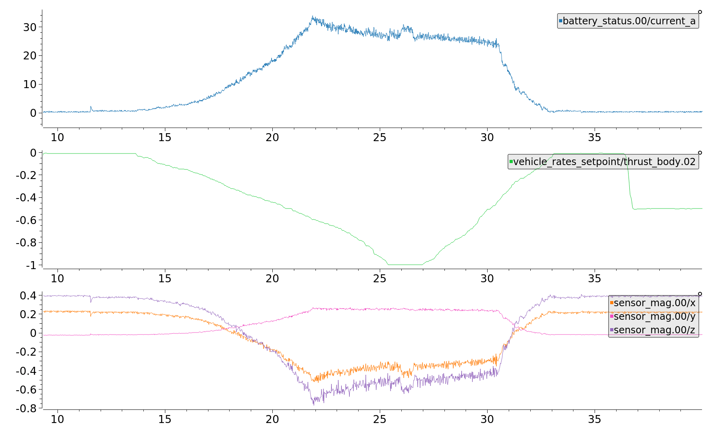
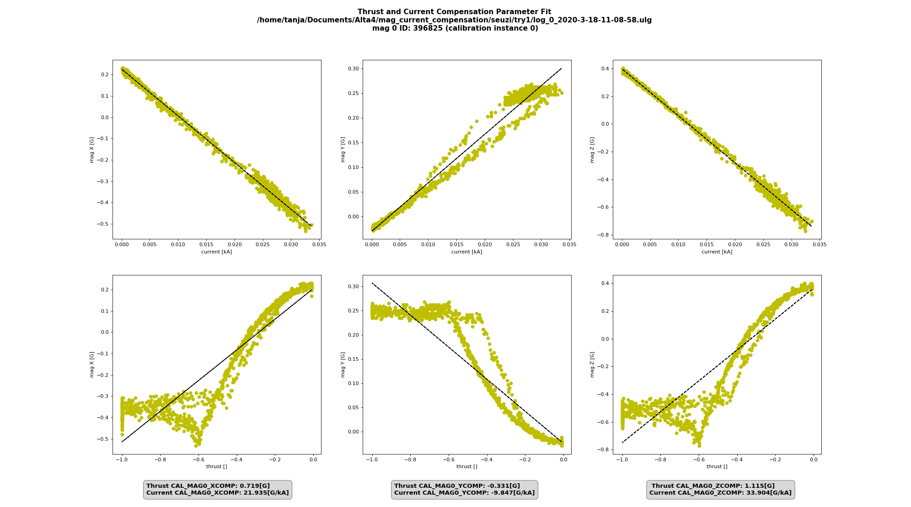

# 나침반 전력 보상

나침반 (지자기센서)은 자기장을 유도하여 나침반의 읽음값을 변화시킬 수 있으므로 큰 전류를 전달하는 케이블에서 최대한 멀리 설치해야합니다.

이 항목에서는 나침반 이동이 현실적이 아닌 경우에 대해 유도된 자기장을 보정하는 방법에 대해 설명합니다.

> ** 팁 ** 자기장 강도는 케이블과의 거리에 따라 2차 식(포물선)의 형태로 급격하게 감소하기 때문에 나침반을 전원 공급 케이블에서 멀리 옮기는 것이 문제를 해결하는 가장 쉽고 효과적인 방법입니다.

<span></span>
> ** 주의 ** 이 프로세스는 멀티 콥터에 대한 설명이지만, 다른 차량 유형에도 동일하게 적용됩니다.

## 전력 보상은 언제 적용됩니까? {#when}

전력 보상을 수행하는 것은 다음 사항이 모두 해당되는 경우에만 권장됩니다.
1. 나침반이 전원 공급 케이블에서 멀어 질 수 없을 때
1. 나침반 판독값과 추력 설정점 및 배터리 전류 간에는 강한 상관 관계가 있을 때

1. 드론 케이블들이 모두 제자리에 고정되어 이동할 수 없는 경우. (전류가 흐르는 케이블을 이동시킬 수 있는 경우에는 계산된 보정 매개 변수가 유효하지 않음)

## 나침반 보상 방법 {#how}

1. 지원하는 펌웨어 버전이 드론이 전력 보상을 실행하는지 확인합니다.  (현재 마스터 또는 v.1.11.0의 릴리스)
1. [ 표준 나침반 교정](../config/compass.md#compass-calibration)을 수행하십시오.
1. 부팅시 데이터 로깅을 활성화하기 위해 [SDLOG_MODE](../advanced_config/parameter_reference.md#SDLOG_MODE) 매개 변수를 2로 설정하십시오.
1. 더 많은 데이터 포인트를 취득을 위해 [ SDLOG_PROFILE](../advanced_config/parameter_reference.md#SDLOG_PROFILE) 매개 변수를 *high rate *(bit 2)으로 설정하십시오.
1. 드론이 움직이지 않도록 고정하고 프로펠러를 부착하십시오(모터가 비행 중과 동일한 전류를 소비하게 됩니다). 이 예에서는 스트랩을 사용하여 드론을 고정시킵니다.

   
1. 드론에 전원을 공급하고 [ACRO 비행 모드](../flight_modes/acro_mc.md)로 전환하십시오 (이 모드를 사용하면 드론이 스트랩으로 인하여 발생하는 움직임을 보상하지 않도록 합니다).
   - 차량을 장착하고 스로틀을 천천히 최대로 올립니다.
   - 스로틀을 천천히 0으로 낮추십시오
   - 차량 해제> **주의** 테스트를 신중하게 수행하고 진동을 면밀히 모니터링하십시오.
1. ulog를 검색하고 mag_compensation.py의 python 스크립트를 사용하여 보상 매개 변수를 식별하십시오.
   ```cmd
   python mag_compensation.py ~/path/to/log/logfile.ulg
   ```

   > ** 참고** 로그에 배터리 전류 측정값이 포함되어 있지 않은 경우, Python 스크립트에서 그 해당 라인들을 주석 처리하여 추력만 계산하도록 해야합니다.
1. 스크립트는 추력 및 전류에 대한 매개 변수 식별값을 돌려받아 콘솔에 인쇄할 것입니다. 스크립트에서 나타나는 그림은 각 나침반 인스턴스에 대한 "적합성"과 제안된 값으로 데이터가 보상된 경우의 모습을 보여줍니다. 전류 측정이 가능한 경우, 전류 보상을 사용하면 일반적으로 더 나은 결과를 얻을 수 있습니다. 다음은 현재 적합도는 양호하지만 관계가 선형이 아니므로 추력 매개 변수를 사용할 수 없는 로그의 예입니다. 

1. 파라미터가 식별되면 [CAL_MAG_COMP_TYP](../advanced_config/parameter_reference.md#CAL_MAG_COMP_TYP)를 1 (추력 파라미터 사용시) 또는 2 (전류 파라미터 사용시)로 설정하여 전력 보정을 활성화해야합니다. 또한 각 나침반의 각 축에 대한 보정 매개 변수를 설정해야합니다.

   
