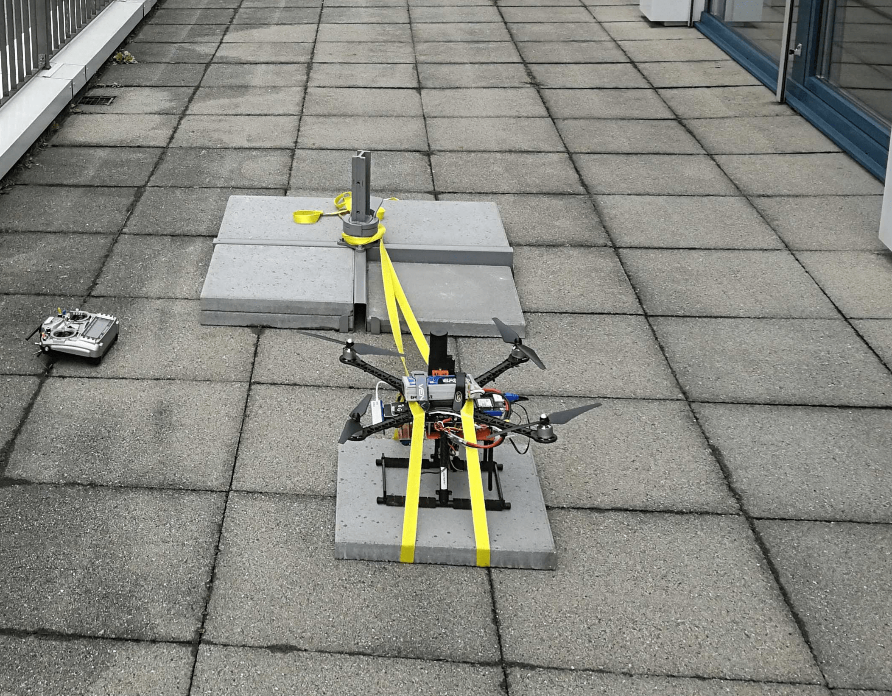

# 나침반 전력 보정

케이블은 나침반 판독 값을 왜곡시킬 수 있는 자기장을 유도하므로, 큰 전류가 흐르는 케이블에서 최대한 멀리 나침반(자력계)을 장착해야합니다.

이 항목에서는 나침반 이동이 현실적으로 불가능할 경우에 유도된 자기장을 보정하는 방법을 설명합니다.

:::tip
자기장 강도는 케이블과의 거리의 제곱에 반비례하여 급격하게 감소하기 때문에, 나침반을 전원 공급 케이블에서 멀리 설치하는 것이 문제를 해결하는 가장 쉽고 효과적인 방법입니다.
:::

:::note
이 섹션에서는 멀티콥터에 국한하여 설명하지만, 다른 기체에도 동일하게 적용할 수 있습니다.
:::

<span id="when"></span>
## 전력 보정은 언제 적용됩니까?

전력 보정은 아래의 사항들이 모두 해당되는 경우에만 권장됩니다.
1. 나침반과 전력 공급 케이블 사이의 거리를 띄울 수 없을 때.
1. 나침반 센서 값이 모터 추력 설정값 또는 배터리 전류와 강한 상관관계를 보일 때. 

1. 드론 케이블이 모두 제자리에 고정되어 이동할 수 없는 경우. (전류가 흐르는 케이블이 움직일 수 있다면 계산된 보정 매개 변수가 유효하지 않습니다)

<span id="how"></span>
## 나침반 보정 방법

1. 드론의 펌웨어 버전이 전력 보정을 지원하는지 확인하십시오.  (현재 마스터 버전 또는 v.1.11.0 릴리즈)
1. [표준 나침반 캘리브레이션](../config/compass.md#compass-calibration)을 수행하십시오.
1. 부팅시 데이터 로깅을 활성화하기 위해 [SDLOG_MODE](../advanced_config/parameter_reference.md#SDLOG_MODE) 매개 변수를 2로 설정하십시오.
1. 더 많은 데이터 포인트를 취득을 위해 [ SDLOG_PROFILE](../advanced_config/parameter_reference.md#SDLOG_PROFILE) 매개 변수를 *high rate *(bit 2)으로 설정하십시오.
1. 드론이 움직이지 않도록 고정하고 프로펠러를 부착하십시오(모터가 비행 중과 동일한 전류를 소비하게 됩니다). 이 예시에서는 끈으로 드론을 고정시킵니다.

   
1. 드론에 전원을 공급하고 [ACRO 비행 모드](../flight_modes/acro_mc.md)로 전환하십시오 (이 모드를 사용하면 드론이 끈에 의해 발생하는 움직임을 보정하지 않도록 합니다).
   - 기체에 시동을 걸고 스로틀을 천천히 최대로 올립니다.
   - 스로틀을 천천히 0까지 낮춥니다.
   - 기체 시동을 끄십시오. > **참고** 진동을 면밀히 관찰하고, 신중하게 테스트를 진행하십시오.

:::note
테스트를 면밀하게 실시하고, 진동을 자세히 모니터링 하십시오.
:::
1. ulog를 검색하고, python 스크립트 [mag_compensation.py](https://github.com/PX4/Firmware/blob/master/src/lib/mag_compensation/python/mag_compensation.py)를 사용하여 보정 매개변수를 확인하십시오.
   ```bash
   python mag_compensation.py ~/path/to/log/logfile.ulg
   ```

:::note
로그에 배터리 전류 측정값이 포함되어 있지 않은 경우, python 스크립트에서 해당 라인을 주석 처리하여 추력만 계산하여야합니다.
:::
1. 스크립트는 추력 및 전류에 대한 매개변수 식별값을 계산하여 콘솔에 인쇄할 것입니다. 스크립트에서 나타나는 그림은 각 나침반 인스턴스에 대한 "적합성"과 제안된 값으로 데이터가 보정된 경우의 모습을 보여줍니다. 전류 측정이 가능한 경우,  일반적으로 전류 보정을 사용하면 더 나은 결과를 얻을 수 있습니다. 다음은 현재 적합도는 양호하지만 관계가 선형이 아니므로 추력 매개 변수를 사용할 수 없는 로그의 예입니다. 

1. 파라미터가 식별되면 [CAL_MAG_COMP_TYP](../advanced_config/parameter_reference.md#CAL_MAG_COMP_TYP)를 1 (추력 파라미터 사용시) 또는 2 (전류 파라미터 사용시)로 설정하여 전력 보정을 활성화해야합니다. 또한 각 나침반의 각 축에 대한 보정 매개 변수를 설정해야합니다.

   
