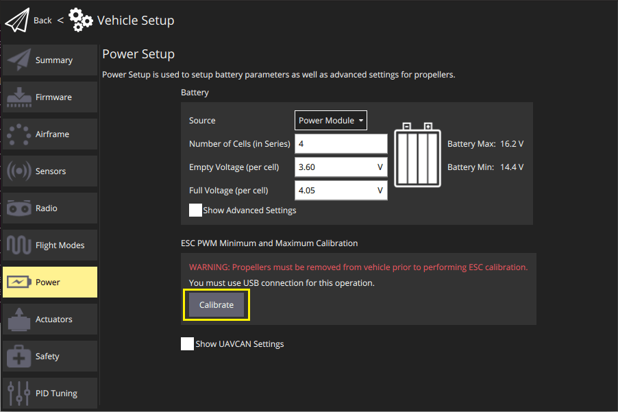
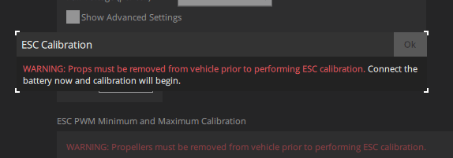
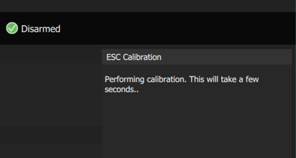
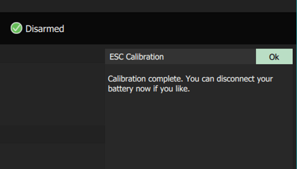

# ESC 캘리브레이션

:::note
These instructions are only relevant to [PWM ESCs](../peripherals/pwm_escs_and_servo.md) and [OneShot ESCs](../peripherals/oneshot.md) ([DShot](../peripherals/dshot.md) and [UAVCAN](../uavcan/escs.md) ESCs do not require calibration). :::

전자속도 콘트롤러 (ESC)는 비행 콘트롤러(FC)의 PWM 입력 값을 기반으로 모터 속도와 방향을 조절합니다. ESC 입력 범위는 설정 가능하며, 동일한 모델의 ESC에도 응답 범위가 다를 수 있습니다.

비행 콘트롤러에서 입력하는 최대/최소 PWM 입력값으로 ESC를 업데이트합니다. 결과적으로, 모든 ESC와 모터는 같은 방식으로 (전체 입력 범위에 걸쳐) 비행 콘트롤러 입력에 반응합니다.

특히, 저비용 ESC는 보정이 중요합니다.

## 전제 조건

시스템에는 전원 모듈이 포함되어야합니다. PX4는 측정된 전압으로 배터리 연결 여부를 판별합니다.

## 단계

ESC를 보정하려면 :

1. 프로펠러를 분리하십시오.

:::warning
프로펠러를 장착한 상태에서 ESC 보정을 하지 마십시오.

   ESC 보정중에는 모터가 회전하지 않아야 합니다. 그러나, ESC가 보정 시퀀스를 제대로 지원/감지하지 않으면 모터를 최대 속도로 실행하여 PWM 입력에 응답합니다. :::
1. 배터리를 분리하고 USB만을 사용하여 비행 컨트롤러를 연결하십시오.(그 외 다른 연결 방법을 사용하지 마십시오.)
1. *QGroundControl* **설정 > 전원**을 연 다음 **캘리브레이션 시작** 버튼을 누릅니다.

   

1. 다음 메시지가 나타나면 배터리를 연결하십시오.

   

   캘리브레이션이 자동으로 시작됩니다.

   

1. 캘리브레이션이 완료되면 배터리를 분리하라는 메시지가 표시됩니다.

   

:::note
고품질의 컨트롤러는 공장에서 보정후에 판매됩니다. *이론*적으로는 [PWM_MAIN_MINn](../advanced_config/parameter_reference.md#PWM_MAIN_MIN)/[PWM_AUX_MINn](../advanced_config/parameter_reference.md#PWM_AUX_MIN) 와[PWM_MAIN_MAXn](../advanced_config/parameter_reference.md#PWM_MAIN_MAX)/[PWM_AUX_MAXn](../advanced_config/parameter_reference.md#PWM_AUX_MAX) 매개변수만 ESC 기술 사양에 제공된 값으로 변경할 수 있습니다. 그러나, 실제로는 PWM 입력 범위가 고품질 콘트롤러에서도 출고시 설정값과 다를 수 있으므로, 보정을 하는 것이 좋습니다.
:::