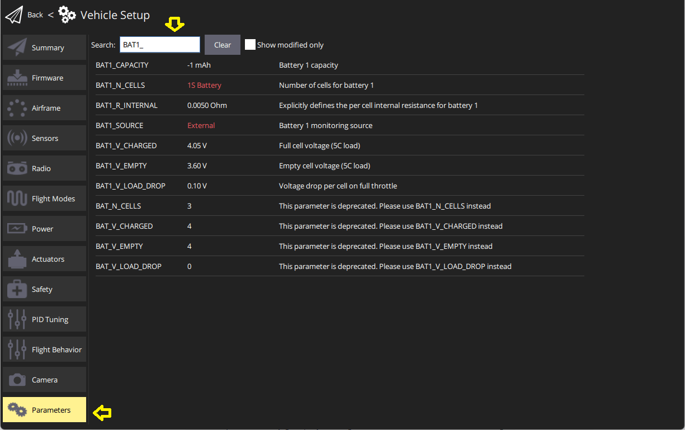
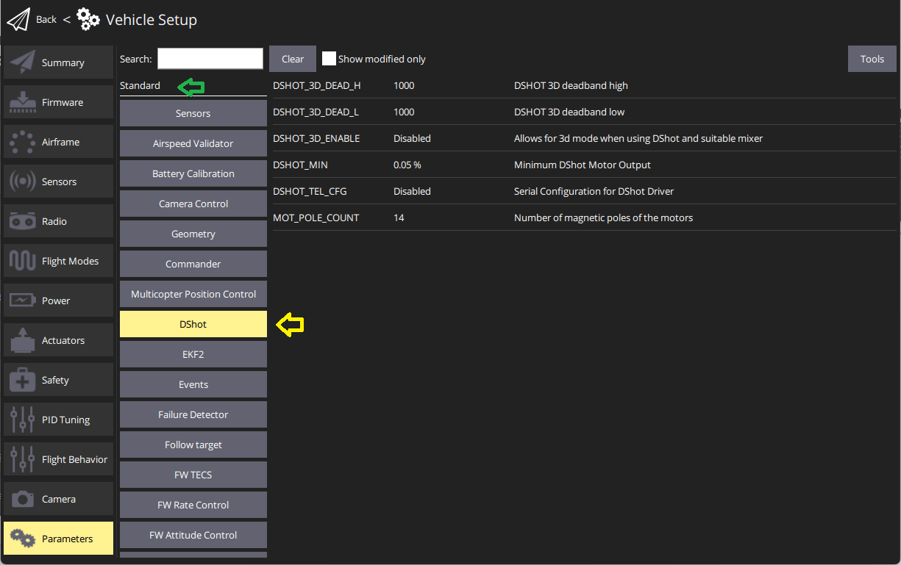
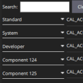
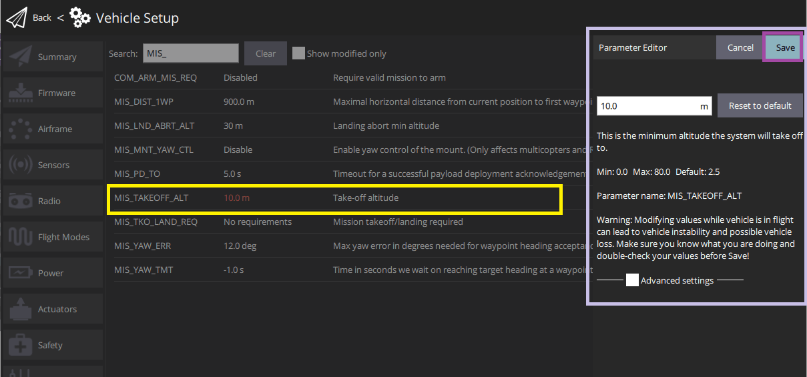
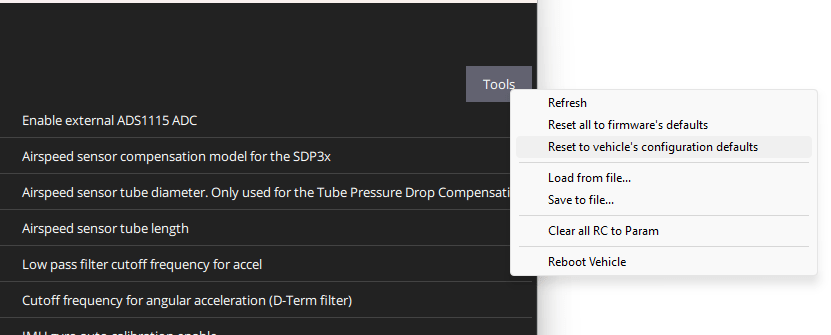

# 파라미터 검색 및 수정

PX4에서는 [매개변수](../advanced_config/parameter_reference.md)를 통하여 [멀티콥터 PID 계수](../config_mc/pid_tuning_guide_multicopter.md), 캘리브레이션 정보 등을 수정합니다.

The _QGroundControl Parameters_ screen allows you to find and modify **any** of the parameters associated with the vehicle. The screen is accessed by clicking the **Q** application icon > **Vehicle Setup**, and then _Parameters_ in the sidebar.

:::note
Most of the more commonly used parameters are more conveniently set using the dedicated setup screens, as described in the [Standard Configuration](../config/README.md) section. The _Parameters_ screen is needed when modifying less commonly modified parameters - for example while tuning a new vehicle.
:::

:::warning
일부 매개 변수는 비행중에 변경할 수 있지만, 권장하지 않습니다 (가이드에 명시적으로 언급된 경우는 제외).
:::

## 매개변수 검색

You can search for a parameter by entering a term in the _Search_ field. This will show you a list of all parameter names and descriptions that contain the entered substring (press **Clear** to reset the search, and use the **Show modified only** checkbox to filter out unchanged parameters).

You can also browse the parameters by type and group by clicking on the buttons to the left (in the image below the _DShot_ group in the _Standard_ parameters is selected).

You can expand/collapse the "type" groupings as shown. Note that the groups at the bottom named _Component X_ are attached [DroneCAN peripherals](../dronecan/README.md#qgc-cannode-parameter-configuration) ("X" is the node id). [QGC can set the parameters](../dronecan/README.md#qgc-cannode-parameter-configuration) of these peripherals if they are attached to the Flight Controller when QGC is started.

:::tip
매개 변수를 찾을 수없는 경우에는 [다음 섹션](#missing)을 참조하십시오.
:::

## 누락된 매개변수

매개변수는 일반적으로 다른 매개변수에 조건부이거나 펌웨어에 없기 때문에 표시되지 않습니다 (아래 참조).

### 조건부 매개변수

비활성화된 매개변수에 조건부인 경우 표시되지 않을 수 있습니다.

일반적으로 [전체 매개변수 참조](../advanced_config/parameter_reference.md) 및 기타 문서를 검색하여 조건부 매개변수를 찾을 수 있습니다. 특히 [직렬 포트 구성 매개변수](../peripherals/serial_configuration.md)는 직렬 포트에 할당된 서비스에 따라 달라집니다.

### 펌웨어에 없는 매개변수

다른 버전의 PX4를 사용 중이거나 관련 모듈이 포함되지 않은 빌드인 경우에는 매개 변수가 펌웨어에 없을 수도 있습니다.

각 PX4 버전에 새로운 매개변수가 추가되고 기존 매개변수가 제거되거나 이름이 변경될 수 있습니다. You can check whether a parameter _should_ be present by reviewing the [full parameter reference](../advanced_config/parameter_reference.md) for the version you're targeting. 소스 트리 및 릴리스 정보에서 매개 변수를 검색할 수 있습니다.

매개 변수가 펌웨어에 존재하지 않는 경우는 관련 모듈이 포함되지 않은 경우입니다. This is a problem (in particular) for _FMUv2 firmware_, which omits many modules so that PX4 can fit into the 1MB of available flash. 이 문제를 해결 방법으로 두 가지 옵션이 있습니다.

- 모든 모듈을 포함하는 FMUv3 펌웨어를 실행하도록 보드를 업데이트 할 수 있는지 확인하십시오. [펌웨어 > FMUv2 부트 로더 업데이트](../config/firmware.md#bootloader)
- 보드에서 FMUv2 펌웨어 만 실행할 수있는 경우에는 누락된 모듈을 활성화한 상태에서 [PX4를 다시 빌드](../dev_setup/building_px4.md)하여야 합니다. You need reconfigure the PX4 firmware itself through make px4_fmuv2_default boardconfig where you can enabled/disable modules.

  :::note
You may also need to disable other modules in order to fit the rebuilt firmware into 1MB flash.
제거할 모듈을 찾으려면 시행 착오가 수반되며, 기체의 요구 사항에 따라 달라집니다.
:::

## 매개변수 변경

매개변수를 변경하려면 그룹 또는 검색 목록에서 매개변수를 클릭하십시오. 그러면 값을 수정하는 사이드 대화 상자가 열립니다 (이 대화 상자는 매개변수에 대한 추가 세부 정보- 변경 사항을 적용하기 위해서는 재부팅하여야 하는 지를 알려줍니다.)

:::note
**저장** 버튼을 클릭하여 매개변수를 기체에 업로드합니다. 매개변수에 따라 변경된 내용을 적용하기 위해서 비행 컨트롤러 재부팅이 필요합니다.
:::

## 도구

화면의 오른쪽 상단의 **도구** 메뉴에서 추가 옵션을 선택할 수 있습니다.

**새로 고침**  모든 매개변수를 기체로부터 재로딩합니다.

**Reset all to firmware defaults**  Reset all parameters to their original default values in the firmware.

**Reset to vehicle's configuration defaults**  Reset all parameters to their original default values for the particular selected airfame configuration.

**파일에서 불러오기 / 파일에 저장**  기존 파일에서 매개변수를 불러오거나 현재 매개변수 설정을 파일에 저장합니다.

**Clear all RC to Param**  This clears all associations between RC transmitter controls and parameters. 자세한 내용은 [라디오 설정 > 매개변수 튜닝 채널](../config/radio.md#param-tuning-channels)를 참조하십시오.

**기체 재부팅**  기체을 재부팅합니다 (일부 파라미터를 변경후에 요구됩니다).
