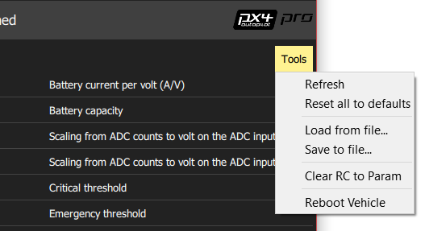

# 파라미터 구성

많은 PX4의 동작은 [파라미터](../advanced_config/parameter_reference.md) (예: [멀티콥터 PID 계수](../config_mc/pid_tuning_guide_multicopter.md), 캘리브레이션 정보 등)를 사용해 조정됩니다.

*QGroundControl 파라미터 화면*에서 기체와 관련된 **어떤 파라미터**도 수정할 수 있습니다. 상단 메뉴의 톱니 바퀴 아이콘을 클릭한 다음 좌측 메뉴의 파라미터를 클릭하여 파라미터 화면에 진입합니다.

> **참고** 파라미터 화면은 일반적으로 수정이 더 필요한 파라미터에 액세스할 때 필요합니다 (예: 새 기체 튜닝) 가장 일반적으로 사용되는 파라미터는 [기본 설정](../config/README.md) 섹션에 설명된 전용 설정 화면을 통해 보다 편리하게 설정됩니다.

> **참고** 일부 파라미터는 비행 중에 변경할 수 있지만 권장하지 않습니다 (가이드에 명시된 경우 제외).

## 파라미터 찾기

*검색* 필드에 용어를 입력하여 파라미터를 검색 할 수 있습니다. 검색은 입력된 하위 문자열을 포함하는 모든 파라미터 이름 및 설명을 나열합니다 (검색을 초기화하려면 **지우기**를 누릅니다).

왼쪽 버튼을 클릭하여 그룹별로 파라미터를 탐색할 수 있습니다 (*Battery Calibration* 그룹 아래의 이미지가 선택됨).

## 파라미터 변경

파라미터의 값을 변경하려면 그룹 또는 검색 목록에서 파라미터 행을 클릭하십시오. 그러면 값을 업데이트 할 수있는 사이드 대화 상자가 열립니다 (이 대화 상자는 파라미터에 대한 추가 세부 정보- 변경 사항을 적용하려면 재부팅 필요 여부 포함-를 제공합니다.)

> **참고** **저장**을 클릭하면 파라미터가 연결된 기체에 자동으로 업로드됩니다. 파라미터 변경 사항을 기체에 적용하려면 비행 컨트롤러를 재부팅해야합니다.

## 도구

화면의 오른쪽 상단에있는 **도구** 메뉴에서 추가 옵션을 선택할 수 있습니다.

**새로 고침**  파라미터 값을 기체로부터 다시 요청해 새로고침합니다.

**기본값으로 재설정**  모든 파라미터를 펌웨어 기본값으로 재설정합니다.

**파일에서 불러오기 / 파일에 저장**  기존 파일에서 파라미터를 불러오거나 현재 파라미터 설정을 파일에 저장합니다.

**Clear RC to Param**  RC 송신기 컨트롤과 파라미터 간의 모든 관련 항목을 지웁니다. 자세한 내용은 [라디오 설정> Param Tuning Channels](../config/radio.md#param-tuning-channels)를 참조하십시오.

**기체 재부팅**  기체을 재부팅합니다 (일부 파라미터의 변경 후 요구됩니다).