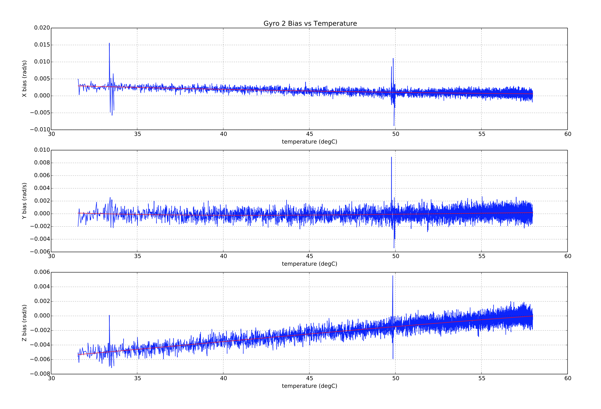
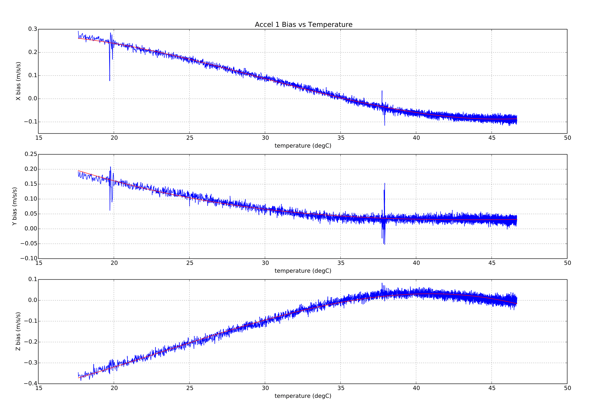
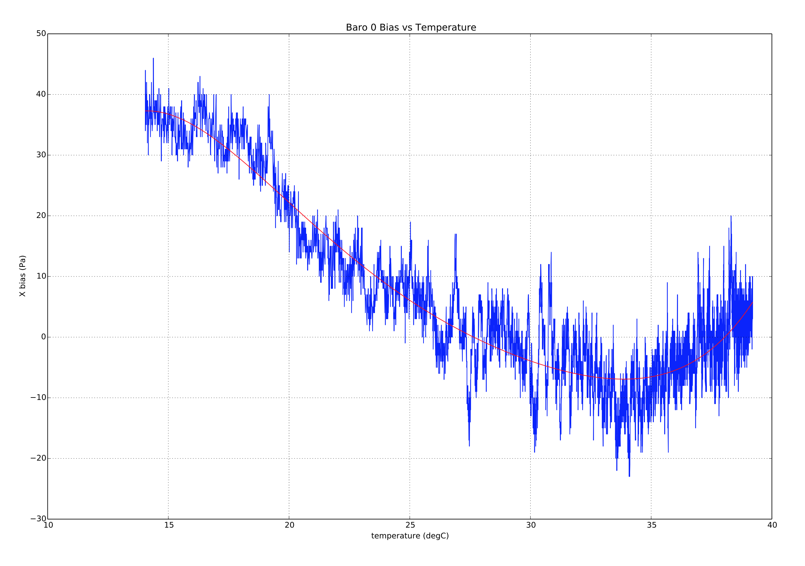

# 온도 교정과 보상

PX4에는 센서 바이어스에 대한 센서 온도 변화의 영향에 대해 속도 자이로, 가속도계와 기압 센서를 보정합니다.

[테스트 환경](#test_setup)과 [보정 절차](#calibration_procedures)에 대하여 자세히 설명합니다. 마지막에는 [구현](#implementation) 과정을 대하여 설명합니다.

:::note
열 교정 후 열 교정 매개변수(`TC_*`)는 각 센서의 *모든* 교정과 보상에 사용됩니다. 따라서, 모든 후속 표준 보정은 "정상"`SYS_CAL_*` 보정 매개변수가 아닌 `TC_*` 매개변수들을 수정합니다(일부 경우, 이러한 매개변수가 재설정될 수 있음).
:::

:::note
작성 시점에서 (PX4 v1.11) 자력계의 열 교정은 아직 지원되지 않습니다.
:::

## 테스트 설정 / 모범 사례

다음 섹션에 설명된 [교정 절차](#calibration_procedures)는 보드가 최저 작동에서 최고 작동 / 최고 작동 상태로 가열되므로 *환경 챔버* (온도 및 습도 제어 환경)에서 이상적으로 실행됩니다. 보정을 시작전에 보드를 *냉각*합니다 (최소 온도로 냉각하고 평형에 도달하도록 허용).

냉기의 경우 일반 가정용 냉동고를 사용하여 -20C를 달성할 수 있으며, 상업용 냉동고는 -40C 정도를 달성할 수 있습니다. 보드는 밀봉된 구멍을 통해 나오는 전원 리드와 함께 실리카 패킷이 들어있는 지퍼/정전기 방지 백에 넣어야 합니다. 냉기 후 백을 테스트 환경으로 옮길 수 있으며 동일한 백에서 테스트를 계속할 수 있습니다.

:::note
백/실리카는 보드에 결로 현상을 방지하기 위하여 사용합니다.
:::

상업용 환경 챔버없이 교정을 수행할 수 있습니다. 내부 공기량이 매우 적은 스티로폼 상자를 사용하여 간단한 환경 용기를 만들 수 있습니다. 이렇게하면 자동조종장치가 비교적 빠르게 공기를 자체 가열할 수 있습니다 (상자에 주변 실내 압력과 동일하게 만들 수 있는 작은 구멍이 있지만 여전히 내부를 가열할 수 있어야 합니다).

이러한 종류의 설정을 사용하여 보드를 약 70C까지 가열할 수 있습니다. 일화적인 증거는 많은 일반적인 보드가 부작용 없이 이 온도로 가열될 수 있음을 시사합니다. 확실하지 않은 경우에는, 제조업체에 안전 작동 범위를 확인하십시오.

:::tip
온보드 열 보정 상태를 확인하려면 MAVlink 콘솔(또는 NuttX 콘솔)을 사용하여 센서에서 보고된 내부 온도를 확인하십시오.
:::

## 교정 절차

PX4는 두 가지 보정 절차를 지원합니다.

* [온보드](#onboard_calibration) - 보드 자체에서 보정합니다. 이 방법을 사용하려면 테스트 설정으로 달성할 수있는 온도 상승 양에 대한 지식이 필요합니다.
* [오프 보드](#offboard_calibration) - 보정 매개변수는 보정중 수집된 로그 정보를 기반으로 개발 컴퓨터에서 계산합니다. 이 방법으로 사용자는 데이터의 품질과 곡선 맞춤을 시각적으로 확인할 수 있습니다.

오프 보드 접근 방식은 더 복잡하고 느리지만, 테스트 설정에 대한 지식이 덜 필요하고 검증하기가 용이합니다.

### 온보드 교정 절차

온보드 보정은 전적으로 장치에서 실행됩니다. 테스트 설정으로 달성할 수있는 온도 상승 양에 대한 지식이 필요합니다.

온보드 보정을 수행하려면 :

1. 보정전에 프레임 유형이 설정되어 있는 지 확인하십시오. 그렇지 않으면, 보드가 설정시 보정 매개변수가 손실될 수 있습니다.
2. 보드에 전원을 공급하고 `SYS_CAL_*` 매개변수를 1로 설정하여 다음 시작시 필요한 센서의 보정을 활성화합니다. [^1]
3. [SYS_CAL_TDEL](../advanced_config/parameter_reference.md#SYS_CAL_TDEL) 매개변수를 온보드 캘리브레이터가 완료하는 데 필요한 온도 상승 정도로 설정합니다. 이 매개변수가 너무 작으면 보정이 일찍 완료되고, 보정 온도 범위가 보드가 완전히 예열될 때 보정하기에 충분하지 않습니다. 매개변수 값이 너무 크면, 온보드 캘리브레이터가 완료되지 않습니다. 이 매개 변수를 설정시 보드 자체 발열로 인한 온도 상승 부분을 허용하여야 합니다. 센서의 온도 상승량을 알 수 없는 경우에는 오프 보드 방식을 사용하는 것이 좋습니다.
4. [SYS_CAL_TMIN](../advanced_config/parameter_reference.md#SYS_CAL_TMIN) 매개변수를 교정기가 사용할 최저 온도로 설정합니다. 이를 통해 교정 최소 온도에 대한 제어를 유지하면서 저온 흡수 시간을 줄이기 위하여 더 낮은 저온 흡수 주변 온도를 사용할 수 있습니다. 센서의 데이터가 이 매개변수로 설정된 값보다 낮으면, 캘리브레이터에서 사용되지 않습니다.
5. [SYS_CAL_TMAX](../advanced_config/parameter_reference.md#SYS_CAL_TMAX) 매개변수를 교정기에서 허용 가능한 최고 시작 센서 온도로 설정합니다. 시작 온도가 이 매개변수로 설정된 값보다 높으면 오류가 발생하면서 보정이 종료됩니다. 서로 다른 센서에서 측정된 온도 변화가 `SYS_CAL_TMAX`와 `SYS_CAL_TMIN` 사이의 간격을 초과하면 보정을 시작할 수 없습니다.
6. 전원을 제거하고 `SYS_CAL_TMIN` 매개변수에 지정된 시작 온도 이하로 보드를 냉각시킵니다. 센서가 안정화 될 수 있도록 보정이 시작되기 전에 시작시 10 초의 지연이 있으며 센서는이 기간 동안 내부적으로 예열됩니다.
7. 보드를 고정 [^2]으로 유지한 체로 전원을 공급하고 `SYS_CAL_TDEL` 매개변수로 지정된 온도 상승을 달성 할 수있을 만큼 충분히 높은 온도로 예열합니다. 완료율은 보정중 시스템 콘솔에 표시됩니다. [^3]
8. 보정이 완료되면 전원을 제거하고, 다음 단계를 수행하기 전에 보정 범위 내의 온도로 보드를 냉각합니다.
9. `commander calibrate accel`을 사용하거나 *QGroundControl*을 통하여 시스템 콘솔을 통해 6 포인트 가속 보정을 수행합니다. 보드를 처음 설정하는 경우에는 자이로와 자력계 보정도 수행하여야 합니다.
10. 보정중 갑작스러운 오프셋 변경으로 인하여 내비게이션 추정기가 혼란스럽고 일부 매개변수는 다음 시작까지 이를 사용하는 알고리즘에 의해 로드되지 않기 때문에 센서 보정 후 비행하기 전에 항상 보드에 전원을 다시 공급해야합니다. 

### 오프보드 교정 절차

오프보드 보정은 보정 테스트 중에 수집된 데이터를 사용하여 개발 컴퓨터에서 실행됩니다. 이 방법은 데이터 품질과 곡선 맞춤을 시각적으로 제공합니다.

오프보드 보정을 수행하려면 :

1. 보정전에 프레임 유형이 설정되어 있는 지 확인하십시오. 그렇지 않으면, 보드가 설정시 보정 매개변수가 손실될 수 있습니다.
2. 보드 전원을 켜고 [TC_A_ENABLE](../advanced_config/parameter_reference.md#TC_A_ENABLE), [TC_B_ENABLE](../advanced_config/parameter_reference.md#TC_B_ENABLE) 및 [TC_G_ENABLE](../advanced_config/parameter_reference.md#TC_G_ENABLE) 매개변수를 `1`으로 설정합니다.
3. 모든 [CAL_GYRO*](../advanced_config/parameter_reference.md#CAL_GYRO0_ID) 및 [CAL_ACC*](../advanced_config/parameter_reference.md#CAL_ACC0_ID) 매개변수를 기본값으로 설정합니다.
4. [SDLOG_MODE](../advanced_config/parameter_reference.md#SDLOG_MODE) 매개변수를 2로 설정하여 부팅에서 데이터 로깅을 활성화합니다. 
5. *열 교정*(비트 2)에 대한 [SDLOG_PROFILE](../advanced_config/parameter_reference.md#SDLOG_PROFILE) 확인란을 설정하여 교정에 필요한 원시 센서 데이터를 기록합니다.
6. 보드를 작동에 필요한 최소 온도로 냉각합니다.
7. 전원을 공급하고 보드를 <a href="#fn:2" class="footnote-ref">2</a>로 유지하고, 필요한 최대 작동 온도까지 천천히 올립니다. <a href="#fn:3" class="footnote-ref">3</a>
8. 전원을 제거하고 .ulog 파일을 추출하십시오.
9. **Firmware/Tools** 디렉토리에서 터미널 창을 열고 Python 보정 스크립트를 실행합니다. 
        sh
        python process_sensor_caldata.py <full path name to .ulog file> 그러면 측정된 데이터와 각 센서의 곡선 맞춤을 보여주는 
    
    **.pdf** 파일과 보정 매개변수가 포함된 **.params** 파일이 생성됩니다.
10. 보드에 전원을 공급하고 *QGroundControl*을 연결하고 *QGroundControl*을 사용하여 생성된 **.params** 파일의 매개변수를 보드로 로드합니다. 매개변수의 갯수가 많이지므로, 로드 시간이 길어질 수 있습니다.
11. 매개변수 로드가 완료된 후 `SDLOG_MODE`를 1로 설정하여 일반 로깅을 다시 활성화하고 전원을 제거하십시오.
12. *QGroundControl*을 사용하여 보드에 전원을 공급하고 일반적인 가속도계 센서 보정을 수행합니다. 보드의 교정 온도 범위 내에서, 이 단계를 수행하여야 합니다. 갑작스러운 오프셋 변경으로 인하여 내비게이션 추정기가 혼란할 수 있고, 일부 매개변수는 다음 시작까지 이를 사용하는 알고리즘에 의해 로드되지 않기 때문에 이 단계 후에는 보드에 전원을 공급하여야 합니다.

## 구현 상세

교정은 내부 온도 범위에서 센서 값의 변화를 측정하고 데이터에 대해 다항식 맞춤을 수행하여 센서 데이터를 수정에 사용하는 계수 세트 (매개변수로 저장됨)를 계산하는 프로세스를 의미합니다. 보상은 온도에 따른 오프셋 변경을 수정하기 위하여 센서 판독 값에서 차감되는 오프셋을 계산하기 위해 내부 온도를 사용하는 프로세스를 의미합니다.

관성 속도 자이로와 가속도계 센서 오프셋은 3차 다항식을 사용하여 계산되는 반면, 기압 센서 오프셋은 5차 다항식을 사용하여 계산됩니다. 맞춤 예시는 아래와 같습니다.

### 교정 매개변수 저장

기존 매개변수 시스템 구현에서는 구조체의 각 값을 별도의 항목으로 저장하는 것으로 제한됩니다. 이 제한을 해결하기 위하여 다음 논리적 명명 규칙이 [열 보상 매개변수](../advanced_config/parameter_reference.md#thermal-compensation)에 사용됩니다.

    TC_[type][instance]_[cal_name]_[axis]
    

여기서:

* `type` : 센서 유형을 나타내는 단일 문자입니다. 여기서 `G` = 속도 자이로 스코프, `A` = 가속도계 및 `B` = 기압계.
* `instance` : 정수 0,1 또는 2로 동일한 `type`의 센서를 최대 3 개까지 보정할 수 있습니다.
* `cal_name` : 교정치 식별 문자열입니다. 다음의 값을 가질 수 있습니다.
    
    * `Xn` : n은 계수의 차수인 다항식 계수입니다. `X3*(온도 - 기준 온도)** 3`.
    * `SCL` : 축척 비율.
    * `TREF` : 기준 온도(deg C).
    * `TMIN` : 최소 유효 온도(deg C).
    * `TMAX` : 최대 유효 온도(deg C).

* `axis` : 보정 데이터가 기준 보드 프레임의 X, Y 또는 Z 축을 나타내는 정수 0,1 또는 2입니다. 기압 센서의 경우 `axis` 접미사가 생략됩니다.

예제:

* [TC_G0_X3_0](../advanced_config/parameter_reference.md#TC_G0_X3_0)은 첫 번째 자이로 x 축에 대한 `^3` 계수입니다.
* [TC_A1_TREF](../advanced_config/parameter_reference.md#TC_A1_TREF)는 두 번째 가속도계의 기준 온도입니다.

### 교정 매개 변수 사용법

열 오프셋에 대한 수정(교정 매개변수 사용)은 [센서 모듈](../modules/modules_system.md#sensors)에서 수행됩니다. 측정 온도에서 기준 온도를 차감하여 다음과 같은 델타 온도를 얻습니다.

    delta = measured_temperature - reference_temperature
    

그런 다음 델타 온도를 사용하여 오프셋을 계산합니다.

    offset = X0 + X1*delta + X2*delta**2 + ... + Xn*delta**n
    

오프셋 및 온도 스케일 계수는 아래의 경우의 센서 측정을 수정하는 데 사용됩니다.

    corrected_measurement = (raw_measurement - offset) * scale_factor
    

온도가 `*_TMIN` 및 `*_TMAX` 매개변수로 설정된 테스트 범위를 초과하면 측정 온도가 제한 범위 내에 유지되도록 클리핑됩니다.

가속도계, 기압계 또는 속도 자이로 스코프 데이터의 수정은 [TC_A_ENABLE](../advanced_config/parameter_reference.md#TC_A_ENABLE), [TC_B_ENABLE](../advanced_config/parameter_reference.md#TC_B_ENABLE) 또는 [TC_G_ENABLE](../advanced_config/parameter_reference.md#TC_G_ENABLE) 매개변수를 각각 1로 설정하여 활성화됩니다.

### 레거시 `CAL_*` 매개변수 및 지휘관 제어 보정과의 호환성

레거시 온도에 구애받지 않는 PX4 속도 자이로 및 가속도계 센서 교정은 커맨더 모듈에 의해 수행되며 오프셋 조정이 포함되며 가속도계 교정의 경우 스케일 팩터 교정 매개변수가 포함됩니다. 오프셋 및 배율 매개변수는 각 센서의 드라이버 내에 적용됩니다. 이러한 매개변수는 [CAL 매개변수 그룹](../advanced_config/parameter_reference.md#sensor-calibration)에 있습니다.

온보드 온도 보정은 이벤트 모듈에 의해 제어되며 센서 결합 uORB 주제가 게시되기 전에 센서 모듈 내에서 보정이 적용됩니다. 즉, 열 보정을 사용하는 경우 열 보정을 수행하기 전에 모든 해당 레거시 오프셋과 배율 매개변수를 기본값 0 및 단일로 설정하여야 합니다. 온보드 온도 보정이 수행되면 자동으로 수행되지만 오프 보드 보정이 수행되는 경우 레거시 `CAL*OFF` 및 `CAL*SCALE`이 중요합니다. 매개변수는 교정 데이터가 기록되기 전에 재설정됩니다.

`TC_G_ENABLE` 매개변수를 1로 설정하여 자이로 열 보정을 활성화한 경우 커맨더 제어 자이로 보정을 수행할 수 있지만, 필요한 양만큼 보정 곡선을 위아래로 이동하는 데 사용됩니다. 각도 속도 오프셋을 제로화합니다. X0 계수를 조정하여 이를 달성합니다.

`TC_A_ENABLE` 매개변수를 1로 설정하여 가속 열 보상을 활성화한 경우, 커맨더 제어 6 점 가속 교정을 계속 수행할 수 있지만 `*OFF`를 조정하는 대신 `CAL` 매개 변수 그룹의 `*SCALE` 매개변수,이 매개변수는 기본값과 열 보상 `X0` 및 `SCL` 매개변수로 설정됩니다. 

### 제한 사항

스케일 팩터는 서로 다른 온도에서 측정이 어려움으로 인하여 온도가 변하지 않는 것으로 간주됩니다. 이는 가속도계 교정의 유용성을 안정적인 스케일 팩터를 가진 센서 모델로 제한합니다. 이론적으로 IMU 내부 온도를 어느 정도 제어 가능한 열 챔버 또는 IMU 히터를 사용하면 일련의 6면 가속도계 교정을 수행하고 오프셋과 배율 계수 모두에 대해 가속도계를 수정할 수 있습니다. 필요한 보드 이동을 교정 알고리즘과 통합하는 것이 복잡하기 때문에 이 기능은 포함되지 않았습니다.

* * *

[^1]: 보정이 시작되면 [SYS_CAL_ACCEL](../advanced_config/parameter_reference.md#SYS_CAL_ACCEL), [SYS_CAL_BARO](../advanced_config/parameter_reference.md#SYS_CAL_BARO) 및 [SYS_CAL_GYRO](../advanced_config/parameter_reference.md#SYS_CAL_GYRO) 매개변수가 0으로 재설정됩니다.

[^2]: 기압 센서 오프셋을 보정하려면 안정적인 기압 환경이 필요합니다. 기압은 날씨에는 느리게 변하고 건물 내부에서는 외부 바람과 HVAC 작동으로 인해 빠르게 변할 수 있습니다.[&#8617;](#fnref2:2){.footnote-backref}

[^3]: 일부 상황에서 결로로 인하여 보드를 손상을 방지하기 위하여 냉각한 보드를 데울 때주의하여야합니다.[&#8617;](#fnref2:3){.footnote-backref}