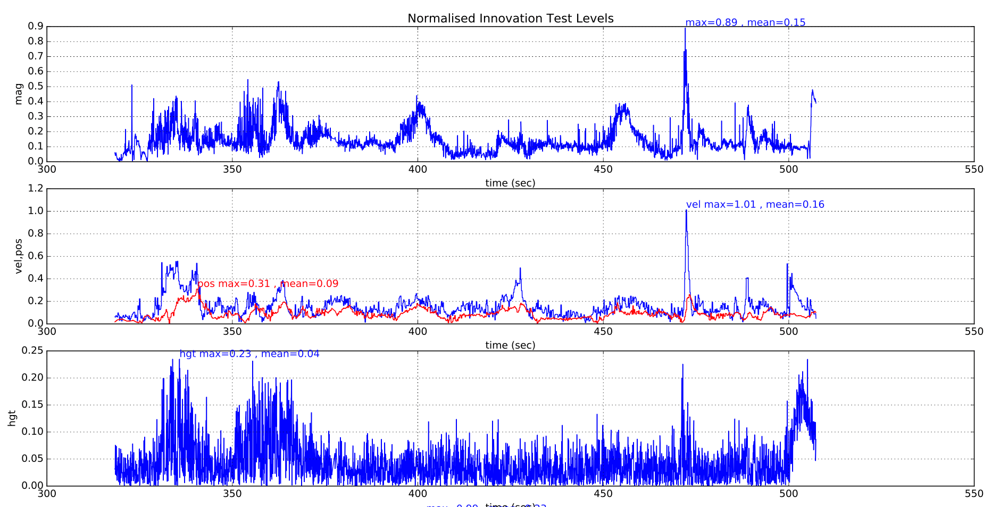

# ECL EKF 사용

이 튜토리얼은 ECL EKF 알고리즘에 관한 일반적인 질문에 대한 답변들입니다.

:::tip
*PX4 Developer Summit 2019*의 [PX4 State Estimation Overview](https://youtu.be/HkYRJJoyBwQ) 비디오 (Dr. Paul Riseborough) 추정기에 대한 개요와 2018/2019년의 주요 변경 사항과 2020년까지 개선 사항을 설명합니다.
:::

## ECL EKF는 무엇입니까?

ECL(Estimation and Control Library)은 EKF(Extended Kalman Filter) 알고리즘을 사용하여 센서 측정을 처리하고 다음 상태의 추정치를 제공합니다.

* 북쪽, 동쪽, 아래쪽 지역 지구 프레임에서 X, Y, Z 본체의 회전을 정의하는 쿼터니언
* IMU의 속도 - 북쪽, 동쪽, 아래쪽 (m/s)
* IMU에서의 위치 - 북쪽, 동쪽, 아래쪽 (m)
* IMU 델타 각도 편향 추정값 - X, Y, Z (rad)
* IMU 델타 속도 바이어스 추정값 - X, Y, Z (m/s)
* 지구 자기장 요소 - 북쪽, 동쪽, 아래쪽 \(gauss\)
* 기체 프레임 자기장 바이어스 - X,Y,Z \(gauss\)
* 풍속 - 북쪽, 동쪽 \(m/s\)

EKF는 IMU와 관련된 각 측정에서 다른 시간 지연을 허용하기 위하여, 지연된 '융합 시간 지평'에서 실행됩니다. 각 센서의 데이터는 FIFO 버퍼링되고, EKF에 의해 버퍼에서 검색되어 적절한 시간에 사용됩니다. 각 센서에 대한 지연 보상은 [EKF2 _*_DELAY](../advanced_config/parameter_reference.md#ekf2) 매개변수로 제어합니다.

보완 필터는 버퍼링 된 IMU 데이터를 사용하여 '퓨전 시간 수평선'에서 현재 시간으로 상태를 전달하는 데 사용됩니다. 이 필터의 시간 상수는 [EKF2_TAU_VEL](../advanced_config/parameter_reference.md#EKF2_TAU_VEL) 및 [EKF2_TAU_POS](../advanced_config/parameter_reference.md#EKF2_TAU_POS) 매개변수로 제어합니다.

:::note
'퓨전 시간 지평'지연 및 버퍼 길이는 `EKF2_*_DELAY` 매개변수 중 가장 큰 매개변수로 결정합니다. 센서를 사용하지 않는 경우에는 시간 지연을 0으로 설정하는 것이 좋습니다. '퓨전 시간 지평' 지연을 줄이면 상태를 현재 시간으로 전달하는 데 사용되는 보완 필터의 오류가 줄어 듭니다.
:::

위치와 속도 상태는 제어 루프로 출력되기 전에 IMU와 본체 프레임 간의 오프셋을 고려하여 조정됩니다. 본체 프레임에 상대적인 IMU의 위치는 `EKF2_IMU_POS_X, Y, Z` 매개변수로 설정합니다.

EKF는 상태 예측에만 IMU 데이터를 사용합니다. IMU 데이터는 EKF 유도에서 관측치로 사용되지 않습니다. 공분산 예측, 상태 업데이트와 공분산 업데이트에 대한 대수 방정식은 Matlab 기호 도구 상자를 사용하여 파생되었으며, [Matlab 기호 파생](https://github.com/PX4/PX4-ECL/blob/master/EKF/matlab/scripts/Terrain%20Estimator/GenerateEquationsTerrainEstimator.m)를 참고하십시오.

## 단일 EKF 인스턴스 실행

*기본 동작*은 EKF의 단일 인스턴스를 실행하는 것입니다. 이 경우 센서 선택 및 페일 오버는 EKF에서 데이터를 수신하기 전에 수행됩니다. 이는 데이터 손실과 같은 제한된 수의 센서 오류에 대한 보호를 제공하지만, EKF 및 제어 루프의 보상 능력을 초과하는 부정확한 데이터를 제공하는 센서에 대해서는 보호하지 않습니다.

단일 EKF 인스턴스를 실행하기위한 매개 변수는 다음과 같습니다.

* [EKF2_MULTI_IMU](../advanced_config/parameter_reference.md#EKF2_MULTI_IMU) = 0
* [EKF2_MULTI_MAG](../advanced_config/parameter_reference.md#EKF2_MULTI_MAG) = 0
* [SENS_IMU_MODE](../advanced_config/parameter_reference.md#SENS_IMU_MODE) = 1
* [SENS_MAG_MODE](../advanced_config/parameter_reference.md#SENS_MAG_MODE) = 1

## 다중 EKF 인스턴스 실행

IMU와 자력계의 갯수와 자동조종장치의 CPU 용량에 따라 EKF 다중 인스턴스를 실행이 가능합니다. 이는 광범위한 센서 오류에 대한 보호를 제공하며, 서로 다른 센서 조합을 사용하는 EKF 인스턴스에서 달성됩니다. EKF 인스턴스의 내부 일관성을 비교함으로써 EKF 선택기는 최상의 데이터 일관성으로 EKF와 센서 조합을 결정할 수 있습니다. 이를 통하여 IMU 바이어스의 갑작스런 변화, 포화 또는 고착된 데이터 등과 같은 오류를 감지하고 격리할 수 있습니다.

총 EKF 인스턴스 수는 [EKF2_MULTI_IMU](../advanced_config/parameter_reference.md#EKF2_MULTI_IMU) 및 [EKF2_MULTI_MAG](../advanced_config/parameter_reference.md#EKF2_MULTI_MAG)에서 선택한 IMU 수와 자력계 수의 곱이며 공식은 다음과 같습니다.

> N_instances = MAX([EKF2_MULTI_IMU](../advanced_config/parameter_reference.md#EKF2_MULTI_IMU) , 1) x MAX([EKF2_MULTI_MAG](../advanced_config/parameter_reference.md#EKF2_MULTI_MAG) , 1)

예를 들어, 2 개의 IMU와 2 개의 자력계가 있는 자동조종장치는 각 인스턴스가 다음 센서 조합을 사용하는 총 4 개의 EKF 인스턴스에 대해 EKF2_MULTI_IMU = 2와 EKF2_MULTI_MAG = 2로 실행할 수 있습니다.

* EKF 인스턴스 1 : IMU 1, 자력계 1
* EKF 인스턴스 2 : IMU 1, 자력계 2
* EKF 인스턴스 3 : IMU 2, 자력계 1
* EKF 인스턴스 4 : IMU 2, 자력계 2

처리 가능한 IMU 또는 자력계 센서의 최대 갯수는 이론상 최대 4 x 4 = 16 EKF 인스턴스에 대해 각각 4 개입니다. 실제적으로는, 사용 가능한 컴퓨팅 리소스에 의해 제한됩니다. 이 기능을 개발하는 동안 STM32F7 CPU 기반 HW를 사용한 테스트에서 허용 가능한 처리로드 및 메모리 사용률을 가진 4 개의 EKF 인스턴스가 입증되었습니다.

:::warning
비행 전에 CPU 및 메모리 사용률을 확인하기위한 지상 기반 테스트를 수행하여야 합니다.
:::

[EKF2_MULTI_IMU](../advanced_config/parameter_reference.md#EKF2_MULTI_IMU)> = 3이면 EKF 선택기가 결함이있는 IMU를 더 빠르게 격리하기 위해 중앙값 선택 전략을 적용 할 수 있기 때문에, 큰 속도의 자이로 오류에 대한 장애 조치 시간이 더욱 단축됩니다.

다중 EKF 인스턴스에 대한 설정은 다음 매개변수로 제어됩니다.

* [SENS_IMU_MODE](../advanced_config/parameter_reference.md#SENS_IMU_MODE) : IMU 센서 다양성 (예 : [EKF2_MULTI_IMU](../advanced_config/parameter_reference.md#EKF2_MULTI_IMU) > 1)으로 다중 EKF 인스턴스를 실행하는 경우 0으로 설정합니다.
  
  1 (단일 EKF 작동의 기본값)로 설정하면 센서 모듈이 EKF에서 사용하는 IMU 데이터를 선택합니다. 이것은 센서의 데이터 손실에 대한 보호 기능를 제공하지만, 잘못된 센서 데이터에 대해서는 보호하지 않습니다. 0으로 설정하면 센서 모듈이 선택하지 않습니다.

* [SENS_MAG_MODE](../advanced_config/parameter_reference.md#SENS_MAG_MODE) : 자력계 센서 다양성 (예 : [EKF2_MULTI_MAG](../advanced_config/parameter_reference.md#EKF2_MULTI_MAG) > 1)으로 다중 EKF 인스턴스를 실행하는 경우 0으로 설정합니다.
  
  1 (단일 EKF 작동의 기본값)로 설정하면 센서 모듈이 EKF에서 사용하는 자력계 데이터를 선택합니다. 이것은 센서의 데이터 손실에 대한 보호 기능를 제공하지만, 잘못된 센서 데이터에 대해서는 보호하지 않습니다. 0으로 설정하면 센서 모듈이 선택하지 않습니다.

* [EKF2_MULTI_IMU](../advanced_config/parameter_reference.md#EKF2_MULTI_IMU) : 이 매개변수는 다중 EKF에서 사용하는 IMU 센서의 수를 지정합니다. `EKF2_MULTI_IMU` <= 1이면 첫 번째 IMU 센서만 사용됩니다. [SENS_IMU_MODE](../advanced_config/parameter_reference.md#SENS_IMU_MODE) = 1이면 센서 모듈에서 선택한 센서가됩니다. `EKF2_MULTI_IMU`> = 2이면 지정된 수의 IMU 센서에 대해 최대 4 개 또는 존재하는 IMU 수까지 별도의 EKF 인스턴스가 실행됩니다.

* [EKF2_MULTI_MAG](../advanced_config/parameter_reference.md#EKF2_MULTI_MAG) : 이 매개변수는 다중 EKF에서 사용하는 자력계 센서의 수를 지정합니다. `EKF2_MULTI_MAG` <= 1이면 첫 번째 자력계 센서만 사용됩니다. [SENS_MAG_MODE](../advanced_config/parameter_reference.md#SENS_MAG_MODE) = 1이면 센서 모듈에서 선택한 센서가 사용됩니다. `EKF2_MULTI_MAG`> = 2이면 별도의 EKF 인스턴스가 지정된 수의 자력계 센서에 대해 최대 4 개 또는 존재하는 자력계의 수보다 작은 수에 대하여 실행됩니다.

:::note
다중 EKF 인스턴스 비행 로그의 [EKF2 재생](../debug/system_wide_replay.md#ekf2-replay)은 지원되지 않습니다. EKF 재생을 위해 녹화를 활성화하려면 [단일 EKF 인스턴스](#running-a-single-ekf-instance)를 활성화하도록 매개변수를 설정하여야 합니다.
:::

## EKF는 어떤 센서 측정값을 사용하나요?

EKF에는 다양한 센서 측정 조합으로 작동하는 여러가지 모드가 있습니다. 시작시 필터는 센서의 최소 가능한 조합을 확인하고 초기 기울기, 편 요각 및 높이 정렬이 완료된 후 회전, 수직 속도, 수직 위치, IMU 델타 각도 바이어스 및 IMU 델타 속도 바이어스 추정치를 제공하는 모드로 들어갑니다.

이 모드에는 IMU 데이터, 요(자기계 또는 외부 비전) 소스와 고도 데이터 소스가 필요합니다. 이 최소 데이터 세트는 모든 EKF 모드에 필요합니다. 그런 다음 다른 센서 데이터를 사용하여 추가 상태를 추정할 수 있습니다.

### 관성계

* 3축 본체 고정 관성 측정 장치 델타 각도와 최소 속도 100Hz의 델타 속도 데이터. Note: 원뿔 보정은 EKF에서 사용하기 전에 IMU 델타 각도 데이터에 적용되어야 합니다.

### 자력계

최소 5Hz 속도의 3축 본체 고정 자력계 데이터 (또는 외부 비전 시스템 포즈 데이터)가 필요합니다. 자력계 데이터는 두 가지 방법으로 사용할 수 있습니다.

* 자력계는 기울기 추정과 자기 편각을 사용하여 요 각도를 측정합니다. 이 요 각도는 EKF에서 관찰로 사용됩니다. 이 방법은 정확도가 떨어지고, 본체 필드 오프셋의 학습을 허용하지 않지만, 자기 이상과 대규모 스타트업 자이로 바이어스에 더 강력합니다. 지상에서 시동에 사용되는 기본 방법입니다.
* XYZ 자력계 판독 값은 별도의 관측치로 사용됩니다. 이 방법은 더 정확하고 본체 프레임 오프셋을 학습할 수 있지만, 지구 자기장 환경이 느리게 변하고 심각한 외부 자기 이상이있을 때 성능이 저하된다고 가정합니다.

이러한 모드를 선택하는 데 사용되는 로직은 [EKF2_MAG_TYPE](../advanced_config/parameter_reference.md#EKF2_MAG_TYPE) 매개변수로 설정됩니다.

이 옵션은 [이중 안테나 GPS에서 yaw](#yaw_measurements)를 사용하여 교체하거나 IMU와 GPS 속도 데이터를 사용하여 [차량 움직임에서 요를 추정](#yaw_from_gps_velocity)하여 자력계 없이 작동할 수 있습니다.

### 고도

고도 데이터 소스 - GPS, 기압, 거리 측정기 또는 최소 5Hz 속도의 외부 비전이 필요합니다.

:::note
높이 데이터의 기본 소스는 [EKF2_HGT_MODE](../advanced_config/parameter_reference.md#EKF2_HGT_MODE) 매개변수에 의해 제어됩니다.
:::

이러한 측정 값이 없으면, EKF가 시작되지 않습니다. 이러한 측정이 감지되면, EKF는 상태를 초기화하고 틸트와 요 정렬을 완료합니다. 틸트와 요 정렬이 완료되면 EKF는 추가 센서 데이터를 사용할 수 있는 모드로 전환할 수 있습니다.

#### 정압 위치 오차 보정

기압 고도는 차량 풍속과 방향으로 인한 공기 역학적 장애로 인해 발생하는 오류가 존재합니다. 이것은 항공학에서 *정압 위치 오류*로 알려져 있습니다. ECL/EKF2 추정기 라이브러리를 사용하는 EKF2 모듈은 풍속 상태 추정이 활성화된 경우, 오류 보상 방법을 제공합니다.

고정익에서 작동하는 플랫폼의 경우 풍속 상태 추정에는 [대기속도](#airspeed) 또는 [Synthetic Sideslip](#synthetic-sideslip) 융합이 활성화되어 있어야 합니다.

멀티콥터의 경우 [Drag Specific Forces](#mc_wind_estimation_using_drag)의 융합을 활성화하고 조정하여 필요한 풍속 상태 추정치를 제공할 수 있습니다.

EKF2 모듈은 오류를 높이 추정치로 변환하기 전에, 기압에서 더하거나 빼는 동적 압력의 비율을 지정하는 신체 고정 타원체로 오류를 모델링합니다. 이 기능을 사용하는 방법에 대한 정보는 아래의 매개변수 문서를 참조하십시오.

* [EKF2_PCOEF_XP](../advanced_config/parameter_reference.md#EKF2_PCOEF_XP)
* [EKF2_PCOEF_XN](../advanced_config/parameter_reference.md#EKF2_PCOEF_XN)
* [EKF2_PCOEF_YP](../advanced_config/parameter_reference.md#EKF2_PCOEF_YP)
* [EKF2_PCOEF_YN](../advanced_config/parameter_reference.md#EKF2_PCOEF_YN)
* [EKF2_PCOEF_Z](../advanced_config/parameter_reference.md#EKF2_PCOEF_Z)

### GPS

#### 위치 및 속도 측정

아래의 조건이 충족되면 GPS를 사용하여 위치와 속도를 측정합니다.

* GPS 사용은 [EKF2_AID_MASK](../advanced_config/parameter_reference.md#EKF2_AID_MASK) 매개변수로 활성화됩니다.
* GPS 품질 검사를 통과하였습니다. 이 검사는 [EKF2_GPS_CHECK](../advanced_config/parameter_reference.md#EKF2_GPS_CHECK) 및 `EKF2_REQ _*` 매개변수에 의해 제어됩니다.
* GPS 고도는 [EKF2_HGT_MODE](../advanced_config/parameter_reference.md#EKF2_HGT_MODE) 매개변수 설정을 통해 EKF에서 직접 사용할 수 있습니다.

#### 방향(Yaw) 측정

[Trimble MB-Two RTK GPS 수신기](https://www.trimble.com/Precision-GNSS/MB-Two-Board.aspx)와 같은 GPS 수신기는 방향 측정을 제공하여 자력계를 대체할 수 있습니다. 이것은 자기 이상이 강한 환경이나 지구의 자기장이 높은 기울기를 갖는 환경에서 매우 유용합니다. [EKF2_AID_MASK](../advanced_config/parameter_reference.md#EKF2_AID_MASK) 매개 변수에서 비트 위치 7을 1 (128 추가)로 설정하면 GPS 방향 측정을 사용할 수 있습니다.

#### GPS 속도에서 방향 측정

The EKF runs an additional multi-hypothesis filter internally that uses multiple 3-state Extended Kalman Filters (EKF's) whose states are NE velocity and yaw angle. These individual yaw angle estimates are then combined using a Gaussian Sum Filter (GSF). The individual 3-state EKF's use IMU and GPS horizontal velocity data (plus optional airspeed data) and do not rely on any prior knowledge of the yaw angle or magnetometer measurements. This provides a backup to the yaw from the main filter and is used to reset the yaw for the main 24-state EKF when a post-takeoff loss of navigation indicates that the yaw estimate from the magnetometer is bad. This will result in an `Emergency yaw reset - magnetometer use stopped` message information message at the GCS.

Data from this estimator is logged when ekf2 replay logging is enabled and can be viewed in the `yaw_estimator_status` message. The individual yaw estimates from the individual 3-state EKF yaw estimators are in the `yaw` fields. The GSF combined yaw estimate is in the `yaw_composite` field. The variance for the GSF yaw estimate is in the `yaw_variance` field. All angles are in radians. Weightings applied by the GSF to the individual 3-state EKF outputs are in the`weight` fields.

This also makes it possible to operate without any magnetometer data or dual antenna GPS receiver for yaw provided some horizontal movement after takeoff can be performed to enable the yaw to become observable. To use this feature, set [EKF2_MAG_TYPE](../advanced_config/parameter_reference.md#EKF2_MAG_TYPE) to `none` (5) to disable magnetometer use. Once the vehicle has performed sufficient horizontal movement to make the yaw observable, the main 24-state EKF will align it's yaw to the GSF estimate and commence use of GPS.

#### Dual Receivers

Data from GPS receivers can be blended using an algorithm that weights data based on reported accuracy (this works best if both receivers output data at the same rate and use the same accuracy). The mechanism also provides automatic failover if data from a receiver is lost (it allows, for example, a standard GPS to be used as a backup to a more accurate RTK receiver). This is controlled by the [EKF2_GPS_MASK](../advanced_config/parameter_reference.md#EKF2_GPS_MASK) parameter.

The [EKF2_GPS_MASK](../advanced_config/parameter_reference.md#EKF2_GPS_MASK) parameter is set by default to disable blending and always use the first receiver, so it will have to be set to select which receiver accuracy metrics are used to decide how much each receiver output contributes to the blended solution. Where different receiver models are used, it is important that the [EKF2_GPS_MASK](../advanced_config/parameter_reference.md#EKF2_GPS_MASK) parameter is set to a value that uses accuracy metrics that are supported by both receivers. For example do not set bit position 0 to `true` unless the drivers for both receivers publish values in the `s_variance_m_s` field of the `vehicle_gps_position` message that are comparable. This can be difficult with receivers from different manufacturers due to the different way that accuracy is defined, e.g. CEP vs 1-sigma, etc.

The following items should be checked during setup:

* Verify that data for the second receiver is present. This will be logged as `vehicle_gps_position_1` and can also be checked when connected via the *nsh console* using the command `listener vehicle_gps_position -i 1`. The [GPS_2_CONFIG](../advanced_config/parameter_reference.md#GPS_2_CONFIG) parameter will need to be set correctly.
* Check the `s_variance_m_s`, `eph` and `epv` data from each receiver and decide which accuracy metrics can be used. If both receivers output sensible `s_variance_m_s` and `eph` data, and GPS vertical position is not being used directly for navigation, then setting [EKF2_GPS_MASK](../advanced_config/parameter_reference.md#EKF2_GPS_MASK) to 3 is recommended. Where only `eph` data is available and both receivers do not output `s_variance_m_s` data, set [EKF2_GPS_MASK](../advanced_config/parameter_reference.md#EKF2_GPS_MASK) to 2. Bit position 2 would only be set if the GPS had been selected as a primary height source with the [EKF2_HGT_MODE](../advanced_config/parameter_reference.md#EKF2_HGT_MODE) parameter and both receivers output sensible `epv` data.
* The output from the blended receiver data is logged as `ekf_gps_position`, and can be checked whilst connect via the nsh terminal using the command `listener ekf_gps_position`.
* Where receivers output at different rates, the blended output will be at the rate of slower receiver. Where possible receivers should be configured to output at the same rate.

#### GNSS Performance Requirements

For the ECL to accept GNSS data for navigation, certain minimum requirements need to be satisfied over a period of time, defined by [EKF2_REQ_GPS_H](../advanced_config/parameter_reference.md#EKF2_REQ_GPS_H) (10 seconds by default).

Minima are defined in the [EKF2_REQ_*](../advanced_config/parameter_reference.md#EKF2_REQ_EPH) parameters and each check can be en-/disabled using the [EKF2_GPS_CHECK](../advanced_config/parameter_reference.md#EKF2_GPS_CHECK) parameter.

The table below shows the different metrics directly reported or calculated from the GNSS data, and the minimum required values for the data to be used by ECL. In addition, the *Average Value* column shows typical values that might reasonably be obtained from a standard GNSS module (e.g. u-blox M8 series) - i.e. values that are considered good/acceptable.

| Metric               | Minimum required                                                                            | Average Value | Units                       | Notes                                                                                                                                       |
| -------------------- | ------------------------------------------------------------------------------------------- | ------------- | --------------------------- | ------------------------------------------------------------------------------------------------------------------------------------------- |
| eph                  | <&nbsp;3 ([EKF2_REQ_EPH](../advanced_config/parameter_reference.md#EKF2_REQ_EPH))         | 0.8           | m                           | Standard deviation of horizontal position error                                                                                             |
| epv                  | <&nbsp;5 ([EKF2_REQ_EPV](../advanced_config/parameter_reference.md#EKF2_REQ_EPV))         | 1.5           | m                           | Standard deviation of vertical position error                                                                                               |
| Number of satellites | ≥6&nbsp;([EKF2_REQ_NSATS](../advanced_config/parameter_reference.md#EKF2_REQ_NSATS))      | 14            | -                           |                                                                                                                                             |
| sacc                 | <&nbsp;0.5 ([EKF2_REQ_SACC](../advanced_config/parameter_reference.md#EKF2_REQ_SACC))     | 0.2           | m/s                         | Standard deviation of horizontal speed error                                                                                                |
| fix type             | ≥&nbsp;3                                                                                    | 4             | -                           | 0-1: no fix, 2: 2D fix, 3: 3D fix, 4: RTCM code differential, 5: Real-Time Kinematic, float, 6: Real-Time Kinematic, fixed, 8: Extrapolated |
| PDOP                 | <&nbsp;2.5 ([EKF2_REQ_PDOP](../advanced_config/parameter_reference.md#EKF2_REQ_PDOP))     | 1.0           | -                           | Position dilution of precision                                                                                                              |
| hpos drift rate      | <&nbsp;0.1 ([EKF2_REQ_HDRIFT](../advanced_config/parameter_reference.md#EKF2_REQ_HDRIFT)) | 0.01          | m/s                         | Drift rate calculated from reported GNSS position (when stationary).                                                                        |
| vpos drift rate      | <&nbsp;0.2 ([EKF2_REQ_VDRIFT](../advanced_config/parameter_reference.md#EKF2_REQ_VDRIFT)) | 0.02          | 2\] Velocity NED \(m/s\) | Drift rate calculated from reported GNSS altitude (when stationary).                                                                        |
| hspd                 | <&nbsp;0.1 ([EKF2_REQ_HDRIFT](../advanced_config/parameter_reference.md#EKF2_REQ_HDRIFT)) | 0.01          | m/s                         | Filtered magnitude of reported GNSS horizontal velocity.                                                                                    |
| vspd                 | <&nbsp;0.2 ([EKF2_REQ_VDRIFT](../advanced_config/parameter_reference.md#EKF2_REQ_VDRIFT)) | 0.02          | m/s                         | Filtered magnitude of reported GNSS vertical velocity.                                                                                      |

:::note
The `hpos_drift_rate`, `vpos_drift_rate` and `hspd` are calculated over a period of 10 seconds and published in the `ekf2_gps_drift` topic. Note that `ekf2_gps_drift` is not logged!
:::

### Range Finder

Range finder distance to ground is used by a single state filter to estimate the vertical position of the terrain relative to the height datum.

If operating over a flat surface that can be used as a zero height datum, the range finder data can also be used directly by the EKF to estimate height by setting the [EKF2_HGT_MODE](../advanced_config/parameter_reference.md#EKF2_HGT_MODE) parameter to 2.

### Airspeed

Equivalent Airspeed (EAS) data can be used to estimate wind velocity and reduce drift when GPS is lost by setting [EKF2_ARSP_THR](../advanced_config/parameter_reference.md#EKF2_ARSP_THR) to a positive value. Airspeed data will be used when it exceeds the threshold set by a positive value for [EKF2_ARSP_THR](../advanced_config/parameter_reference.md#EKF2_ARSP_THR) and the vehicle type is not rotary wing.

### Synthetic Sideslip

Fixed wing platforms can take advantage of an assumed sideslip observation of zero to improve wind speed estimation and also enable wind speed estimation without an airspeed sensor. This is enabled by setting the [EKF2_FUSE_BETA](../advanced_config/parameter_reference.md#EKF2_FUSE_BETA) parameter to 1.

### Drag Specific Forces

Multi-rotor platforms can take advantage of the relationship between airspeed and drag force along the X and Y body axes to estimate North/East components of wind velocity. This is enabled by setting bit position 5 in the [EKF2_AID_MASK](../advanced_config/parameter_reference.md#EKF2_AID_MASK) parameter to true. The relationship between airspeed and specific force (IMU acceleration) along the X and Y body axes is controlled by the [EKF2_BCOEF_X](../advanced_config/parameter_reference.md#EKF2_BCOEF_X) and [EKF2_BCOEF_Y](../advanced_config/parameter_reference.md#EKF2_BCOEF_Y) parameters which set the ballistic coefficients for flight in the X and Y directions respectively. The amount of specific force observation noise is set by the [EKF2_DRAG_NOISE](../advanced_config/parameter_reference.md#EKF2_DRAG_NOISE) parameter.

These can be tuned by flying the vehicle in [Position mode](../flight_modes/position_mc.md) repeatedly forwards/backwards between rest and maximum speed, adjusting [EKF2_BCOEF_X](../advanced_config/parameter_reference.md#EKF2_BCOEF_X) so that the corresponding innovation sequence in the `ekf2_innovations_0.drag_innov[0]` log message is minimised. This is then repeated for right/left movement with adjustment of [EKF2_BCOEF_Y](../advanced_config/parameter_reference.md#EKF2_BCOEF_Y) to minimise the `ekf2_innovations_0.drag_innov[1]` innovation sequence. Tuning is easier if this testing is conducted in still conditions.

If you are able to log data without dropouts from boot using [SDLOG_MODE = 1](../advanced_config/parameter_reference.md#SDLOG_MODE) and [SDLOG_PROFILE = 2](../advanced_config/parameter_reference.md#SDLOG_PROFILE), have access to the development environment, and are able to build code, then we recommended you fly *once* and perform the tuning via [EKF2 Replay](../debug/system_wide_replay.md#ekf2-replay) of the flight log.

:::note
The recording and [EKF2 replay](../debug/system_wide_replay.md#ekf2-replay) of flight logs with multiple EKF instances is not supported. To enable recording for EKF replay you must set the parameters to enable a [single EKF instance](#running-a-single-ekf-instance).
:::

### Optical Flow

[Optical flow](../sensor/optical_flow.md) data will be used if the following conditions are met:

* Valid range finder data is available.
* Bit position 1 in the [EKF2_AID_MASK](../advanced_config/parameter_reference.md#EKF2_AID_MASK) parameter is true.
* The quality metric returned by the flow sensor is greater than the minimum requirement set by the [EKF2_OF_QMIN](../advanced_config/parameter_reference.md#EKF2_OF_QMIN) parameter.

### External Vision System

Position, velocity or orientation measurements from an external vision system, e.g. Vicon, can be used:

* External vision system horizontal position data will be used if bit position 3 in the [EKF2_AID_MASK](../advanced_config/parameter_reference.md#EKF2_AID_MASK) parameter is true.
* External vision system vertical position data will be used if the [EKF2_HGT_MODE](../advanced_config/parameter_reference.md#EKF2_HGT_MODE) parameter is set to 3.
* External vision system velocity data will be used if bit position 8 in the [EKF2_AID_MASK](../advanced_config/parameter_reference.md#EKF2_AID_MASK) parameter is true.
* External vision system orientation data will be used for yaw estimation if bit position 4 in the [EKF2_AID_MASK](../advanced_config/parameter_reference.md#EKF2_AID_MASK) parameter is true.
* External vision reference frame offset will be estimated and used to rotate the external vision system data if bit position 6 in the [EKF2_AID_MASK](../advanced_config/parameter_reference.md#EKF2_AID_MASK) parameter is true.

Either bit 4 (`EV_YAW`) or bit 6 (`EV_ROTATE`) should be set to true, but not both together. Following [EKF2_AID_MASK](../advanced_config/parameter_reference.md#EKF2_AID_MASK) values are supported when using with an external vision system.

| EKF_AID_MASK value | Set bits                      | Description                                                    |
| -------------------- | ----------------------------- | -------------------------------------------------------------- |
| 321                  | GPS + EV_VEL + ROTATE_EV    | Heading w.r.t. North (**Recommended**)                         |
| 73                   | GPS + EV_POS + ROTATE_EV    | Heading w.r.t. North (*Not recommended*, use `EV_VEL` instead) |
| 24                   | EV_POS + EV_YAW             | Heading w.r.t. external vision frame                           |
| 72                   | EV_POS + ROTATE_EV          | Heading w.r.t. North                                           |
| 272                  | EV_VEL + EV_YAW             | Heading w.r.t. external vision frame                           |
| 320                  | EV_VEL + ROTATE_EV          | Heading w.r.t. North                                           |
| 280                  | EV_POS + EV_VEL + EV_YAW    | Heading w.r.t. external vision frame                           |
| 328                  | EV_POS + EV_VEL + ROTATE_EV | Heading w.r.t. North                                           |

The EKF considers uncertainty in the visual pose estimate. This uncertainty information can be sent via the covariance fields in the MAVLink [ODOMETRY](https://mavlink.io/en/messages/common.html#ODOMETRY) message or it can be set through the parameters [EKF2_EVP_NOISE](../advanced_config/parameter_reference.md#EKF2_EVP_NOISE), [EKF2_EVV_NOISE](../advanced_config/parameter_reference.md#EKF2_EVV_NOISE) and [EKF2_EVA_NOISE](../advanced_config/parameter_reference.md#EKF2_EVA_NOISE). You can choose the source of the uncertainty with [EKF2_EV_NOISE_MD](../advanced_config/parameter_reference.md#EKF2_EV_NOISE_MD).

## How do I use the 'ecl' library EKF?

Set the [SYS_MC_EST_GROUP](../advanced_config/parameter_reference.md#SYS_MC_EST_GROUP) parameter to 2 to use the ecl EKF.

## What are the advantages and disadvantages of the ecl EKF over other estimators?

Like all estimators, much of the performance comes from the tuning to match sensor characteristics. Tuning is a compromise between accuracy and robustness and although we have attempted to provide a tune that meets the needs of most users, there will be applications where tuning changes are required.

For this reason, no claims for accuracy relative to the legacy combination of `attitude_estimator_q` + `local_position_estimator` have been made and the best choice of estimator will depend on the application and tuning.

### Disadvantages

* The ecl EKF is a complex algorithm that requires a good understanding of extended Kalman filter theory and its application to navigation problems to tune successfully. It is therefore more difficult for users that are not achieving good results to know what to change.
* The ecl EKF uses more RAM and flash space.
* The ecl EKF uses more logging space.

### Advantages

* The ecl EKF is able to fuse data from sensors with different time delays and data rates in a mathematically consistent way which improves accuracy during dynamic maneuvers once time delay parameters are set correctly.
* The ecl EKF is capable of fusing a large range of different sensor types.
* The ecl EKF detects and reports statistically significant inconsistencies in sensor data, assisting with diagnosis of sensor errors.
* For fixed wing operation, the ecl EKF estimates wind speed with or without an airspeed sensor and is able to use the estimated wind in combination with airspeed measurements and sideslip assumptions to extend the dead-reckoning time available if GPS is lost in flight.
* The ecl EKF estimates 3-axis accelerometer bias which improves accuracy for tailsitters and other vehicles that experience large attitude changes between flight phases.
* The federated architecture (combined attitude and position/velocity estimation) means that attitude estimation benefits from all sensor measurements. This should provide the potential for improved attitude estimation if tuned correctly.

## How do I check the EKF performance?

EKF outputs, states and status data are published to a number of uORB topics which are logged to the SD card during flight. The following guide assumes that data has been logged using the *.ulog file format*. The **.ulog** format data can be parsed in python by using the [PX4 pyulog library](https://github.com/PX4/pyulog).

Most of the EKF data is found in the [estimator_innovations](https://github.com/PX4/PX4-Autopilot/blob/master/msg/estimator_innovations.msg) and [estimator\_status](https://github.com/PX4/PX4-Autopilot/blob/master/msg/estimator_status.msg) uORB messages that are logged to the .ulog file.

A python script that automatically generates analysis plots and metadata can be found [here](https://github.com/PX4/PX4-Autopilot/blob/master/Tools/ecl_ekf/process_logdata_ekf.py). To use this script file, cd to the `Tools/ecl_ekf` directory and enter `python process_logdata_ekf.py <log_file.ulg>`. This saves performance metadata in a csv file named **<log_file>.mdat.csv** and plots in a pdf file named `<log_file>.pdf`.

Multiple log files in a directory can be analysed using the [batch\_process\_logdata\_ekf.py](https://github.com/PX4/PX4-Autopilot/blob/master/Tools/ecl_ekf/batch_process_logdata_ekf.py) script. When this has been done, the performance metadata files can be processed to provide a statistical assessment of the estimator performance across the population of logs using the [batch\_process\_metadata\_ekf.py](https://github.com/PX4/PX4-Autopilot/blob/master/Tools/ecl_ekf/batch_process_metadata_ekf.py) script.

### Output Data

* Attitude output data is found in the [vehicle\_attitude](https://github.com/PX4/PX4-Autopilot/blob/master/msg/vehicle_attitude.msg) message.
* Local position output data is found in the [vehicle\_local\_position](https://github.com/PX4/PX4-Autopilot/blob/master/msg/vehicle_local_position.msg) message.
* Global \(WGS-84\) output data is found in the [vehicle\_global\_position](https://github.com/PX4/PX4-Autopilot/blob/master/msg/vehicle_global_position.msg) message.
* Wind velocity output data is found in the [wind\_estimate](https://github.com/PX4/PX4-Autopilot/blob/master/msg/wind_estimate.msg) message.

### States

Refer to states\[32\] in [estimator\_status](https://github.com/PX4/PX4-Autopilot/blob/master/msg/estimator_status.msg). The index map for states\[32\] is as follows:

* \[0 ... 3\] Quaternions
* \[4 ... 6\] Velocity NED \(m/s\)
* \[7 ... 9\] Position NED \(m\)
* \[10 ... 12\] IMU delta angle bias XYZ \(rad\)
* \[13 ... 15\] IMU delta velocity bias XYZ \(m/s\)
* \[16 ... 18\] Earth magnetic field NED \(gauss\)
* \[19 ... 21\] Body magnetic field XYZ \(gauss\)
* \[22 ... 23\] Wind velocity NE \(m/s\)
* \[24 ... 32\] Not Used

### State Variances

Refer to covariances\[28\] in [estimator\_status](https://github.com/PX4/PX4-Autopilot/blob/master/msg/estimator_status.msg). The index map for covariances\[28\] is as follows:

* \[0 ... 3\] Quaternions
* \[4 ... 6\] Velocity NED \(m/s\)^2
* \[7 ... 9\] Position NED \(m^2\)
* \[10 ... 12\] IMU delta angle bias XYZ \(rad^2\)
* \[13 ... 15\] IMU delta velocity bias XYZ \(m/s\)^2
* \[16 ... 18\] Earth magnetic field NED \(gauss^2\)
* \[19 ... 21\] Body magnetic field XYZ \(gauss^2\)
* \[22 ... 23\] Wind velocity NE \(m/s\)^2
* \[24 ... 28\] Not Used

### Observation Innovations

The observation `estimator_innovations`, `estimator_innovation_variances`, and `estimator_innovation_test_ratios` message fields are defined in [estimator_innovations.msg](https://github.com/PX4/PX4-Autopilot/blob/master/msg/estimator_innovations.msg). The messages all have the same field names/types (but different units).

:::note
The messages have the same fields because they are generated from the same field definition. The `# TOPICS` line (at the end of [the file](https://github.com/PX4/PX4-Autopilot/blob/master/msg/estimator_innovations.msg)) lists the names of the set of messages to be created):

    # TOPICS estimator_innovations estimator_innovation_variances estimator_innovation_test_ratios
    

:::

Some of the observations are:

* Magnetometer XYZ (gauss, gauss^2) : `mag_field[3]`
* Yaw angle (rad, rad^2) : `heading`
* True Airspeed (m/s, (m/s)^2) : `airspeed`
* Synthetic sideslip (rad, rad^2) : `beta`
* Optical flow XY (rad/sec, (rad/s)^2) : `flow`
* Height above ground (m, m^2) : `hagl`
* Drag specific force ((m/s)^2): `drag`
* Velocity and position innovations : per sensor

In addition, each sensor has its own fields for horizontal and vertical position and/or velocity values (where appropriate). These are largely self documenting, and are reproduced below:

    # GPS
    float32[2] gps_hvel # horizontal GPS velocity innovation (m/sec) and innovation variance ((m/sec)**2)
    float32    gps_vvel # vertical GPS velocity innovation (m/sec) and innovation variance ((m/sec)**2)
    float32[2] gps_hpos # horizontal GPS position innovation (m) and innovation variance (m**2)
    float32    gps_vpos # vertical GPS position innovation (m) and innovation variance (m**2)
    
    # External Vision
    float32[2] ev_hvel  # horizontal external vision velocity innovation (m/sec) and innovation variance ((m/sec)**2)
    float32    ev_vvel  # vertical external vision velocity innovation (m/sec) and innovation variance ((m/sec)**2)
    float32[2] ev_hpos  # horizontal external vision position innovation (m) and innovation variance (m**2)
    float32    ev_vpos  # vertical external vision position innovation (m) and innovation variance (m**2)
    
    # Fake Position and Velocity
    float32[2] fake_hvel  # fake horizontal velocity innovation (m/s) and innovation variance ((m/s)**2)
    float32    fake_vvel  # fake vertical velocity innovation (m/s) and innovation variance ((m/s)**2)
    float32[2] fake_hpos  # fake horizontal position innovation (m) and innovation variance (m**2)
    float32    fake_vpos  # fake vertical position innovation (m) and innovation variance (m**2)
    
    # Height sensors
    float32 rng_vpos  # range sensor height innovation (m) and innovation variance (m**2)
    float32 baro_vpos # barometer height innovation (m) and innovation variance (m**2)
    
    # Auxiliary velocity
    float32[2] aux_hvel # horizontal auxiliar velocity innovation from landing target measurement (m/sec) and innovation variance ((m/sec)**2)
    float32    aux_vvel # vertical auxiliar velocity innovation from landing target measurement (m/sec) and innovation variance ((m/sec)**2)
    

### Output Complementary Filter

The output complementary filter is used to propagate states forward from the fusion time horizon to current time. To check the magnitude of the angular, velocity and position tracking errors measured at the fusion time horizon, refer to `output_tracking_error[3]` in the `ekf2_innovations` message.

The index map is as follows:

* [0] Angular tracking error magnitude (rad)
* [1] Velocity tracking error magnitude (m/s). The velocity tracking time constant can be adjusted using the [EKF2_TAU_VEL](../advanced_config/parameter_reference.md#EKF2_TAU_VEL) parameter. Reducing this parameter reduces steady state errors but increases the amount of observation noise on the NED velocity outputs.
* [2] Position tracking error magnitude \(m\). The position tracking time constant can be adjusted using the [EKF2_TAU_POS](../advanced_config/parameter_reference.md#EKF2_TAU_POS) parameter. Reducing this parameter reduces steady state errors but increases the amount of observation noise on the NED position outputs.

### EKF Errors

The EKF contains internal error checking for badly conditioned state and covariance updates. Refer to the filter\_fault\_flags in [estimator\_status](https://github.com/PX4/PX4-Autopilot/blob/master/msg/estimator_status.msg).

### Observation Errors

There are two categories of observation faults:

* Loss of data. An example of this is a range finder failing to provide a return.
* The innovation, which is the difference between the state prediction and sensor observation is excessive. An example of this is excessive vibration causing a large vertical position error, resulting in the barometer height measurement being rejected.

Both of these can result in observation data being rejected for long enough to cause the EKF to attempt a reset of the states using the sensor observations. All observations have a statistical confidence checks applied to the innovations. The number of standard deviations for the check are controlled by the `EKF2_*_GATE` parameter for each observation type.

Test levels are available in [estimator\_status](https://github.com/PX4/PX4-Autopilot/blob/master/msg/estimator_status.msg) as follows:

* `mag_test_ratio`: ratio of the largest magnetometer innovation component to the innovation test limit
* `vel_test_ratio`: ratio of the largest velocity innovation component to the innovation test limit
* `pos_test_ratio`: ratio of the largest horizontal position innovation component to the innovation test limit
* `hgt_test_ratio`: ratio of the vertical position innovation to the innovation test limit
* `tas_test_ratio`: ratio of the true airspeed innovation to the innovation test limit
* `hagl_test_ratio`: ratio of the height above ground innovation to the innovation test limit

For a binary pass/fail summary for each sensor, refer to innovation\_check\_flags in [estimator\_status](https://github.com/PX4/PX4-Autopilot/blob/master/msg/estimator_status.msg).

### GPS Quality Checks

The EKF applies a number of GPS quality checks before commencing GPS aiding. These checks are controlled by the [EKF2_GPS_CHECK](../advanced_config/parameter_reference.md#EKF2_GPS_CHECK) and `EKF2_REQ_*` parameters. The pass/fail status for these checks is logged in the [estimator_status](https://github.com/PX4/PX4-Autopilot/blob/master/msg/estimator_status.msg).gps\_check\_fail\_flags message. This integer will be zero when all required GPS checks have passed. If the EKF is not commencing GPS alignment, check the value of the integer against the bitmask definition `gps_check_fail_flags` in [estimator_status](https://github.com/PX4/PX4-Autopilot/blob/master/msg/estimator_status.msg).

### EKF Numerical Errors

The EKF uses single precision floating point operations for all of its computations and first order approximations for derivation of the covariance prediction and update equations in order to reduce processing requirements. This means that it is possible when re-tuning the EKF to encounter conditions where the covariance matrix operations become badly conditioned enough to cause divergence or significant errors in the state estimates.

To prevent this, every covariance and state update step contains the following error detection and correction steps:

* If the innovation variance is less than the observation variance (this requires a negative state variance which is impossible) or the covariance update will produce a negative variance for any of the states, then: 
  * The state and covariance update is skipped
  * The corresponding rows and columns in the covariance matrix are reset
  * The failure is recorded in the [estimator_status](https://github.com/PX4/PX4-Autopilot/blob/master/msg/estimator_status.msg) filter\_fault\_flags message
* State variances (diagonals in the covariance matrix) are constrained to be non-negative.
* An upper limit is applied to state variances.
* Symmetry is forced on the covariance matrix.

After re-tuning the filter, particularly re-tuning that involve reducing the noise variables, the value of `estimator_status.gps_check_fail_flags` should be checked to ensure that it remains zero.

## What should I do if the height estimate is diverging?

The most common cause of EKF height diverging away from GPS and altimeter measurements during flight is clipping and/or aliasing of the IMU measurements caused by vibration. If this is occurring, then the following signs should be evident in the data

* [estimator_innovations](https://github.com/PX4/PX4-Autopilot/blob/master/msg/estimator_innovations.msg).vel\_pos\_innov\[2\] and [estimator_innovations](https://github.com/PX4/PX4-Autopilot/blob/master/msg/estimator_innovations.msg).vel\_pos\_innov\[5\] will both have the same sign.
* [estimator_status](https://github.com/PX4/PX4-Autopilot/blob/master/msg/estimator_status.msg).hgt\_test\_ratio will be greater than 1.0

The recommended first step is to ensure that the autopilot is isolated from the airframe using an effective isolation mounting system. An isolation mount has 6 degrees of freedom, and therefore 6 resonant frequencies. As a general rule, the 6 resonant frequencies of the autopilot on the isolation mount should be above 25Hz to avoid interaction with the autopilot dynamics and below the frequency of the motors.

An isolation mount can make vibration worse if the resonant frequencies coincide with motor or propeller blade passage frequencies.

The EKF can be made more resistant to vibration induced height divergence by making the following parameter changes:

* Double the value of the innovation gate for the primary height sensor. If using barometric height this is [EKF2_BARO_GATE](../advanced_config/parameter_reference.md#EKF2_BARO_GATE).
* Increase the value of [EKF2_ACC_NOISE](../advanced_config/parameter_reference.md#EKF2_ACC_NOISE) to 0.5 initially. If divergence is still occurring, increase in further increments of 0.1 but do not go above 1.0

Note that the effect of these changes will make the EKF more sensitive to errors in GPS vertical velocity and barometric pressure.

## What should I do if the position estimate is diverging?

The most common causes of position divergence are:

* High vibration levels. 
  * Fix by improving mechanical isolation of the autopilot.
  * Increasing the value of [EKF2_ACC_NOISE](../advanced_config/parameter_reference.md#EKF2_ACC_NOISE) and [EKF2_GYR_NOISE](../advanced_config/parameter_reference.md#EKF2_GYR_NOISE) can help, but does make the EKF more vulnerable to GPS glitches.
* Large gyro bias offsets. 
  * Fix by re-calibrating the gyro. Check for excessive temperature sensitivity (&gt; 3 deg/sec bias change during warm-up from a cold start and replace the sensor if affected of insulate to slow the rate of temperature change.
* Bad yaw alignment 
  * Check the magnetometer calibration and alignment.
  * Check the heading shown QGC is within 15 deg truth
* Poor GPS accuracy 
  * Check for interference
  * Improve separation and shielding
  * Check flying location for GPS signal obstructions and reflectors \(nearby tall buildings\)
* Loss of GPS

Determining which of these is the primary cause requires a methodical approach to analysis of the EKF log data:

* Plot the velocity innovation test ratio - [estimator_status](https://github.com/PX4/PX4-Autopilot/blob/master/msg/estimator_status.msg).vel\_test\_ratio
* Plot the horizontal position innovation test ratio - [estimator\_status](https://github.com/PX4/PX4-Autopilot/blob/master/msg/estimator_status.msg).pos\_test\_ratio
* Plot the height innovation test ratio - [estimator_status](https://github.com/PX4/PX4-Autopilot/blob/master/msg/estimator_status.msg).hgt\_test\_ratio
* Plot the magnetometer innovation test ratio - [estimator_status](https://github.com/PX4/PX4-Autopilot/blob/master/msg/estimator_status.msg).mag\_test\_ratio
* Plot the GPS receiver reported speed accuracy - [vehicle\_gps\_position](https://github.com/PX4/PX4-Autopilot/blob/master/msg/vehicle_gps_position.msg).s\_variance\_m\_s
* Plot the IMU delta angle state estimates - [estimator\_status](https://github.com/PX4/PX4-Autopilot/blob/master/msg/estimator_status.msg).states\[10\], states\[11\] and states\[12\]
* Plot the EKF internal high frequency vibration metrics: 
  * Delta angle coning vibration - [estimator_status](https://github.com/PX4/PX4-Autopilot/blob/master/msg/estimator_status.msg).vibe\[0\]
  * High frequency delta angle vibration - [estimator_status](https://github.com/PX4/PX4-Autopilot/blob/master/msg/estimator_status.msg).vibe\[1\]
  * High frequency delta velocity vibration - [estimator_status](https://github.com/PX4/PX4-Autopilot/blob/master/msg/estimator_status.msg).vibe\[2\]

During normal operation, all the test ratios should remain below 0.5 with only occasional spikes above this as shown in the example below from a successful flight:

The following plot shows the EKF vibration metrics for a multirotor with good isolation. The landing shock and the increased vibration during takeoff and landing can be seen. Insufficient data has been gathered with these metrics to provide specific advice on maximum thresholds.

The above vibration metrics are of limited value as the presence of vibration at a frequency close to the IMU sampling frequency (1 kHz for most boards) will cause offsets to appear in the data that do not show up in the high frequency vibration metrics. The only way to detect aliasing errors is in their effect on inertial navigation accuracy and the rise in innovation levels.

In addition to generating large position and velocity test ratios of &gt; 1.0, the different error mechanisms affect the other test ratios in different ways:

### Determination of Excessive Vibration

High vibration levels normally affect vertical position and velocity innovations as well as the horizontal components. Magnetometer test levels are only affected to a small extent.

\(insert example plots showing bad vibration here\)

### Determination of Excessive Gyro Bias

Large gyro bias offsets are normally characterised by a change in the value of delta angle bias greater than 5E-4 during flight (equivalent to ~3 deg/sec) and can also cause a large increase in the magnetometer test ratio if the yaw axis is affected. Height is normally unaffected other than extreme cases. Switch on bias value of up to 5 deg/sec can be tolerated provided the filter is given time settle before flying. Pre-flight checks performed by the commander should prevent arming if the position is diverging.

\(insert example plots showing bad gyro bias here\)

### Determination of Poor Yaw Accuracy

Bad yaw alignment causes a velocity test ratio that increases rapidly when the vehicle starts moving due inconsistency in the direction of velocity calculated by the inertial nav and the GPS measurement. Magnetometer innovations are slightly affected. Height is normally unaffected.

\(insert example plots showing bad yaw alignment here\)

### Determination of Poor GPS Accuracy

Poor GPS accuracy is normally accompanied by a rise in the reported velocity error of the receiver in conjunction with a rise in innovations. Transient errors due to multipath, obscuration and interference are more common causes. Here is an example of a temporary loss of GPS accuracy where the multi-rotor started drifting away from its loiter location and had to be corrected using the sticks. The rise in [estimator_status](https://github.com/PX4/PX4-Autopilot/blob/master/msg/estimator_status.msg).vel\_test\_ratio to greater than 1 indicates the GPs velocity was inconsistent with other measurements and has been rejected.

This is accompanied with rise in the GPS receivers reported velocity accuracy which indicates that it was likely a GPS error.

If we also look at the GPS horizontal velocity innovations and innovation variances, we can see the large spike in North velocity innovation that accompanies this GPS 'glitch' event.

### Determination of GPS Data Loss

Loss of GPS data will be shown by the velocity and position innovation test ratios 'flat-lining'. If this occurs, check the other GPS status data in `vehicle_gps_position` for further information.

The following plot shows the NED GPS velocity innovations `ekf2_innovations_0.vel_pos_innov[0 ... 2]`, the GPS NE position innovations `ekf2_innovations_0.vel_pos_innov[3 ... 4]` and the Baro vertical position innovation `ekf2_innovations_0.vel_pos_innov[5]` generated from a simulated VTOL flight using SITL Gazebo.

The simulated GPS was made to lose lock at 73 seconds. Note the NED velocity innovations and NE position innovations 'flat-line' after GPS is lost. Note that after 10 seconds without GPS data, the EKF reverts back to a static position mode using the last known position and the NE position innovations start to change again.

### Barometer Ground Effect Compensation

If the vehicle has the tendency during landing to climb back into the air when close to the ground, the most likely cause is barometer ground effect.

This is caused when air pushed down by the propellers hits the ground and creates a high pressure zone below the drone. The result is a lower reading of pressure altitude, leading to an unwanted climb being commanded. The figure below shows a typical situation where the ground effect is present. Note how the barometer signal dips at the beginning and end of the flight.

You can enable *ground effect compensation* to fix this problem:

* From the plot estimate the magnitude of the barometer dip during takeoff or landing. In the plot above one can read a barometer dip of about 6 meters during landing.
* Then set the parameter [EKF2_GND_EFF_DZ](../advanced_config/parameter_reference.md#EKF2_GND_EFF_DZ) to that value and add a 10 percent margin. Therefore, in this case a value of 6.6 meters would be a good starting point.

If a terrain estimate is available (e.g. the vehicle is equipped with a range finder) then you can additionally specify [EKF2_GND_MAX_HGT](../advanced_config/parameter_reference.md#EKF2_GND_MAX_HGT), the above ground-level altitude below which ground effect compensation should be activated. If no terrain estimate is available this parameter will have no effect and the system will use heuristics to determine if ground effect compensation should be activated.

## Further Information

* [PX4 State Estimation Overview](https://youtu.be/HkYRJJoyBwQ), *PX4 Developer Summit 2019*, Dr. Paul Riseborough): Overview of the estimator, and major changes from 2018/19, and the expected improvements through 2019/20.