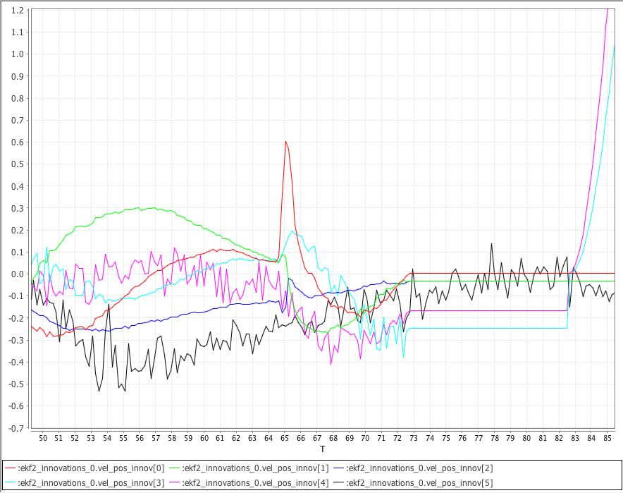

# ECL EKF 사용

이 섹션은 ECL EKF 알고리즘에 관한 질문에 대한 답변들입니다.

:::tip
*PX4 Developer Summit 2019*의 [PX4 State Estimation Overview](https://youtu.be/HkYRJJoyBwQ) 비디오 (Dr. Paul Riseborough) 추정기에 대한 개요와 2018년과 2019년의 주요 변경 사항과 2020년의 개선 사항을 설명합니다.
:::

## ECL EKF는 무엇입니까?

ECL(Estimation and Control Library)은 EKF(Extended Kalman Filter) 알고리즘으로 센서 측정 데이터를 처리하여 상태의 추정치를 제공합니다.

* 북쪽, 동쪽, 아래쪽 지역 지구 프레임에서 X, Y, Z 본체의 회전을 정의하는 쿼터니언
* IMU의 속도 - 북쪽, 동쪽, 아래쪽 (m/s)
* IMU에서의 위치 - 북쪽, 동쪽, 아래쪽 (m)
* IMU 델타 각도 편향 추정값 - X, Y, Z (rad)
* IMU 델타 속도 바이어스 추정값 - X, Y, Z (m/s)
* 지구 자기장 요소 - 북쪽, 동쪽, 아래쪽 \(gauss\)
* 기체 프레임 자기장 바이어스 - X,Y,Z \(gauss\)
* 풍속 - 북쪽, 동쪽 \(m/s\)

EKF는 IMU와 관련된 각 측정에서 다른 시간 지연을 허용하기 위하여, 지연된 '융합 시간 지평'에서 실행됩니다. 각 센서의 데이터는 FIFO 버퍼링되고, EKF에 의해 버퍼에서 검색되어 적절한 시간에 사용됩니다. 각 센서에 대한 지연 보상은 [EKF2 _*_DELAY](../advanced_config/parameter_reference.md#ekf2) 매개변수로 제어합니다.

보완 필터는 버퍼링 된 IMU 데이터를 사용하여 '퓨전 시간 수평선'에서 현재 시간으로 상태를 전달하는 데 사용됩니다. 이 필터의 시간 상수는 [EKF2_TAU_VEL](../advanced_config/parameter_reference.md#EKF2_TAU_VEL) 및 [EKF2_TAU_POS](../advanced_config/parameter_reference.md#EKF2_TAU_POS) 매개변수로 제어합니다.

:::note
'퓨전 시간 지평'지연 및 버퍼 길이는 `EKF2_*_DELAY` 매개변수 중 가장 큰 매개변수로 결정합니다. 센서를 사용하지 않는 경우에는 시간 지연을 0으로 설정하는 것이 좋습니다. '퓨전 시간 지평' 지연을 줄이면 상태를 현재 시간으로 전달하는 데 사용되는 보완 필터의 오류가 줄어 듭니다.
:::

위치와 속도 상태는 제어 루프로 출력되기 전에 IMU와 본체 프레임 간의 오프셋을 고려하여 조정됩니다. 본체 프레임에 상대적인 IMU의 위치는 `EKF2_IMU_POS_X, Y, Z` 매개변수로 설정합니다.

EKF는 상태 예측에만 IMU 데이터를 사용합니다. IMU 데이터는 EKF 유도에서 관측치로 사용되지 않습니다. 공분산 예측, 상태 업데이트와 공분산 업데이트에 대한 대수 방정식은 Matlab 기호 도구 상자를 사용하여 파생되었으며, [Matlab 기호 파생](https://github.com/PX4/PX4-ECL/blob/master/EKF/matlab/scripts/Terrain%20Estimator/GenerateEquationsTerrainEstimator.m)를 참고하십시오.

## 단일 EKF 인스턴스 실행

*기본 동작*은 EKF의 단일 인스턴스를 실행하는 것입니다. 이 경우 센서 선택 및 페일 오버는 EKF에서 데이터를 수신하기 전에 수행됩니다. 이는 데이터 손실과 같은 제한된 수의 센서 오류에 대한 보호를 제공하지만, EKF 및 제어 루프의 보상 능력을 초과하는 부정확한 데이터를 제공하는 센서에 대해서는 보호하지 않습니다.

단일 EKF 인스턴스를 실행하기위한 매개 변수는 다음과 같습니다.

* [EKF2_MULTI_IMU](../advanced_config/parameter_reference.md#EKF2_MULTI_IMU) = 0
* [EKF2_MULTI_MAG](../advanced_config/parameter_reference.md#EKF2_MULTI_MAG) = 0
* [SENS_IMU_MODE](../advanced_config/parameter_reference.md#SENS_IMU_MODE) = 1
* [SENS_MAG_MODE](../advanced_config/parameter_reference.md#SENS_MAG_MODE) = 1

## 다중 EKF 인스턴스 실행

IMU와 자력계의 갯수와 자동조종장치의 CPU 용량에 따라 EKF 다중 인스턴스를 실행이 가능합니다. 이는 광범위한 센서 오류에 대한 보호를 제공하며, 서로 다른 센서 조합을 사용하는 EKF 인스턴스에서 달성됩니다. EKF 인스턴스의 내부 일관성을 비교함으로써 EKF 선택기는 최상의 데이터 일관성으로 EKF와 센서 조합을 결정할 수 있습니다. 이를 통하여 IMU 바이어스의 갑작스런 변화, 포화 또는 고착된 데이터 등과 같은 오류를 감지하고 격리할 수 있습니다.

총 EKF 인스턴스 수는 [EKF2_MULTI_IMU](../advanced_config/parameter_reference.md#EKF2_MULTI_IMU) 및 [EKF2_MULTI_MAG](../advanced_config/parameter_reference.md#EKF2_MULTI_MAG)에서 선택한 IMU 수와 자력계 수의 곱이며 공식은 다음과 같습니다.

> N_instances = MAX([EKF2_MULTI_IMU](../advanced_config/parameter_reference.md#EKF2_MULTI_IMU) , 1) x MAX([EKF2_MULTI_MAG](../advanced_config/parameter_reference.md#EKF2_MULTI_MAG) , 1)

예를 들어, 2 개의 IMU와 2 개의 자력계가 있는 자동조종장치는 각 인스턴스가 다음 센서 조합을 사용하는 총 4 개의 EKF 인스턴스에 대해 EKF2_MULTI_IMU = 2와 EKF2_MULTI_MAG = 2로 실행할 수 있습니다.

* EKF 인스턴스 1 : IMU 1, 자력계 1
* EKF 인스턴스 2 : IMU 1, 자력계 2
* EKF 인스턴스 3 : IMU 2, 자력계 1
* EKF 인스턴스 4 : IMU 2, 자력계 2

처리 가능한 IMU 또는 자력계 센서의 최대 갯수는 이론상 최대 4 x 4 = 16 EKF 인스턴스에 대해 각각 4 개입니다. 실제적으로는, 사용 가능한 컴퓨팅 리소스에 의해 제한됩니다. 이 기능을 개발하는 동안 STM32F7 CPU 기반 HW를 사용한 테스트에서 허용 가능한 처리로드 및 메모리 사용률을 가진 4 개의 EKF 인스턴스가 입증되었습니다.

:::warning
비행 전에 CPU 및 메모리 사용률을 확인하기위한 지상 기반 테스트를 수행하여야 합니다.
:::

[EKF2_MULTI_IMU](../advanced_config/parameter_reference.md#EKF2_MULTI_IMU)> = 3이면 EKF 선택기가 결함이있는 IMU를 더 빠르게 격리하기 위해 중앙값 선택 전략을 적용 할 수 있기 때문에, 큰 속도의 자이로 오류에 대한 장애 조치 시간이 더욱 단축됩니다.

다중 EKF 인스턴스에 대한 설정은 다음 매개변수로 제어됩니다.

* [SENS_IMU_MODE](../advanced_config/parameter_reference.md#SENS_IMU_MODE) : IMU 센서 다양성 (예 : [EKF2_MULTI_IMU](../advanced_config/parameter_reference.md#EKF2_MULTI_IMU) > 1)으로 다중 EKF 인스턴스를 실행하는 경우 0으로 설정합니다.
  
  1 (단일 EKF 작동의 기본값)로 설정하면 센서 모듈이 EKF에서 사용하는 IMU 데이터를 선택합니다. 이것은 센서의 데이터 손실에 대한 보호 기능를 제공하지만, 잘못된 센서 데이터에 대해서는 보호하지 않습니다. 0으로 설정하면 센서 모듈이 선택하지 않습니다.

* [SENS_MAG_MODE](../advanced_config/parameter_reference.md#SENS_MAG_MODE) : 자력계 센서 다양성 (예 : [EKF2_MULTI_MAG](../advanced_config/parameter_reference.md#EKF2_MULTI_MAG) > 1)으로 다중 EKF 인스턴스를 실행하는 경우 0으로 설정합니다.
  
  1 (단일 EKF 작동의 기본값)로 설정하면 센서 모듈이 EKF에서 사용하는 자력계 데이터를 선택합니다. 이것은 센서의 데이터 손실에 대한 보호 기능를 제공하지만, 잘못된 센서 데이터에 대해서는 보호하지 않습니다. 0으로 설정하면 센서 모듈이 선택하지 않습니다.

* [EKF2_MULTI_IMU](../advanced_config/parameter_reference.md#EKF2_MULTI_IMU) : 이 매개변수는 다중 EKF에서 사용하는 IMU 센서의 수를 지정합니다. `EKF2_MULTI_IMU` <= 1이면 첫 번째 IMU 센서만 사용됩니다. [SENS_IMU_MODE](../advanced_config/parameter_reference.md#SENS_IMU_MODE) = 1이면 센서 모듈에서 선택한 센서가됩니다. `EKF2_MULTI_IMU`> = 2이면 지정된 수의 IMU 센서에 대해 최대 4 개 또는 존재하는 IMU 수까지 별도의 EKF 인스턴스가 실행됩니다.

* [EKF2_MULTI_MAG](../advanced_config/parameter_reference.md#EKF2_MULTI_MAG) : 이 매개변수는 다중 EKF에서 사용하는 자력계 센서의 수를 지정합니다. `EKF2_MULTI_MAG` <= 1이면 첫 번째 자력계 센서만 사용됩니다. [SENS_MAG_MODE](../advanced_config/parameter_reference.md#SENS_MAG_MODE) = 1이면 센서 모듈에서 선택한 센서가 사용됩니다. `EKF2_MULTI_MAG`> = 2이면 별도의 EKF 인스턴스가 지정된 수의 자력계 센서에 대해 최대 4 개 또는 존재하는 자력계의 수보다 작은 수에 대하여 실행됩니다.

:::note
다중 EKF 인스턴스 비행 로그의 [EKF2 재생](../debug/system_wide_replay.md#ekf2-replay)은 지원되지 않습니다. EKF 재생을 위해 녹화를 활성화하려면 [단일 EKF 인스턴스](#running-a-single-ekf-instance)를 활성화하도록 매개변수를 설정하여야 합니다.
:::

## EKF는 어떤 센서 측정값을 사용하나요?

EKF에는 다양한 센서 측정 조합으로 작동하는 여러가지 모드가 있습니다. 시작시 필터는 센서의 최소 가능한 조합을 확인하고 초기 기울기, 편 요각 및 높이 정렬이 완료된 후 회전, 수직 속도, 수직 위치, IMU 델타 각도 바이어스 및 IMU 델타 속도 바이어스 추정치를 제공하는 모드로 들어갑니다.

이 모드에는 IMU 데이터, 요(자기계 또는 외부 비전) 소스와 고도 데이터 소스가 필요합니다. 이 최소 데이터 세트는 모든 EKF 모드에 필요합니다. 그런 다음 다른 센서 데이터를 사용하여 추가 상태를 추정할 수 있습니다.

### 관성계

* 3축 본체 고정 관성 측정 장치 델타 각도와 최소 속도 100Hz의 델타 속도 데이터. Note: 원뿔 보정은 EKF에서 사용하기 전에 IMU 델타 각도 데이터에 적용되어야 합니다.

### 자력계

최소 5Hz 속도의 3축 본체 고정 자력계 데이터 (또는 외부 비전 시스템 포즈 데이터)가 필요합니다. 자력계 데이터는 두 가지 방법으로 사용할 수 있습니다.

* 자력계는 기울기 추정과 자기 편각을 사용하여 요 각도를 측정합니다. 이 요 각도는 EKF에서 관찰로 사용됩니다. 이 방법은 정확도가 떨어지고, 본체 필드 오프셋의 학습을 허용하지 않지만, 자기 이상과 대규모 스타트업 자이로 바이어스에 더 강력합니다. 지상에서 시동에 사용되는 기본 방법입니다.
* XYZ 자력계 판독 값은 별도의 관측치로 사용됩니다. 이 방법은 더 정확하고 본체 프레임 오프셋을 학습할 수 있지만, 지구 자기장 환경이 느리게 변하고 심각한 외부 자기 이상이있을 때 성능이 저하된다고 가정합니다.

이러한 모드를 선택하는 데 사용되는 로직은 [EKF2_MAG_TYPE](../advanced_config/parameter_reference.md#EKF2_MAG_TYPE) 매개변수로 설정됩니다.

이 옵션은 [이중 안테나 GPS에서 yaw](#yaw_measurements)를 사용하여 교체하거나 IMU와 GPS 속도 데이터를 사용하여 [차량 움직임에서 요를 추정](#yaw_from_gps_velocity)하여 자력계 없이 작동할 수 있습니다.

### 고도

고도 데이터 소스 - GPS, 기압, 거리 측정기 또는 최소 5Hz 속도의 외부 비전이 필요합니다.

:::note
높이 데이터의 기본 소스는 [EKF2_HGT_MODE](../advanced_config/parameter_reference.md#EKF2_HGT_MODE) 매개변수에 의해 제어됩니다.
:::

이러한 측정 값이 없으면, EKF가 시작되지 않습니다. 이러한 측정이 감지되면, EKF는 상태를 초기화하고 틸트와 요 정렬을 완료합니다. 틸트와 요 정렬이 완료되면 EKF는 추가 센서 데이터를 사용할 수 있는 모드로 전환할 수 있습니다.

#### 정압 위치 오차 보정

기압 고도는 차량 풍속과 방향으로 인한 공기 역학적 장애로 인해 발생하는 오류가 존재합니다. 이것은 항공학에서 *정압 위치 오류*로 알려져 있습니다. ECL/EKF2 추정기 라이브러리를 사용하는 EKF2 모듈은 풍속 상태 추정이 활성화된 경우, 오류 보상 방법을 제공합니다.

고정익에서 작동하는 플랫폼의 경우 풍속 상태 추정에는 [대기속도](#airspeed) 또는 [Synthetic Sideslip](#synthetic-sideslip) 융합이 활성화되어 있어야 합니다.

멀티콥터의 경우 [Drag Specific Forces](#mc_wind_estimation_using_drag)의 융합을 활성화하고 조정하여 필요한 풍속 상태 추정치를 제공할 수 있습니다.

EKF2 모듈은 오류를 높이 추정치로 변환하기 전에, 기압에서 더하거나 빼는 동적 압력의 비율을 지정하는 신체 고정 타원체로 오류를 모델링합니다. 이 기능을 사용하는 방법에 대한 정보는 아래의 매개변수 문서를 참조하십시오.

* [EKF2_PCOEF_XP](../advanced_config/parameter_reference.md#EKF2_PCOEF_XP)
* [EKF2_PCOEF_XN](../advanced_config/parameter_reference.md#EKF2_PCOEF_XN)
* [EKF2_PCOEF_YP](../advanced_config/parameter_reference.md#EKF2_PCOEF_YP)
* [EKF2_PCOEF_YN](../advanced_config/parameter_reference.md#EKF2_PCOEF_YN)
* [EKF2_PCOEF_Z](../advanced_config/parameter_reference.md#EKF2_PCOEF_Z)

### GPS

#### 위치 및 속도 측정

아래의 조건이 충족되면 GPS를 사용하여 위치와 속도를 측정합니다.

* GPS 사용은 [EKF2_AID_MASK](../advanced_config/parameter_reference.md#EKF2_AID_MASK) 매개변수로 활성화됩니다.
* GPS 품질 검사를 통과하였습니다. 이 검사는 [EKF2_GPS_CHECK](../advanced_config/parameter_reference.md#EKF2_GPS_CHECK) 및 `EKF2_REQ _*` 매개변수에 의해 제어됩니다.
* GPS 고도는 [EKF2_HGT_MODE](../advanced_config/parameter_reference.md#EKF2_HGT_MODE) 매개변수 설정을 통해 EKF에서 직접 사용할 수 있습니다.

#### 방향(Yaw) 측정

[Trimble MB-Two RTK GPS 수신기](https://www.trimble.com/Precision-GNSS/MB-Two-Board.aspx)와 같은 GPS 수신기는 방향 측정을 제공하여 자력계를 대체할 수 있습니다. 이것은 자기 이상이 강한 환경이나 지구의 자기장이 높은 기울기를 갖는 환경에서 매우 유용합니다. [EKF2_AID_MASK](../advanced_config/parameter_reference.md#EKF2_AID_MASK) 매개 변수에서 비트 위치 7을 1 (128 추가)로 설정하면 GPS 방향측정을 사용할 수 있습니다.

#### GPS 방향 측정

EKF는 상태가 북동향 속도 및 편요각인 여러 3상 EKF(Extended Kalman Filter)를 사용하는 추가 다중 가설 필터를 내부적으로 실행합니다. 이러한 개별 요각 추정값은 GSF(Gaussian Sum Filter)를 사용하여 결합됩니다. 개별 3상 EKF는 IMU와 GPS 수평 속도 데이터(선택 사항인 대기 속도 데이터 포함)를 사용하며 요각 또는 자력계 측정에 대한 사전 지식에 의존하지 않습니다. 이것은 메인 필터에서 yaw에 대한 백업을 제공하며, 이륙후 탐색 손실이 자력계의 yaw 추정치가 좋지 않을 때, 메인 24 상태 EKF에 대한 yaw를 재설정하는 데 사용됩니다. 이로 인하여, GCS에서 `긴급 요 재설정 - 자기계 사용 중지` 메시지 정보 메시지가 표시됩니다.

이 추정기의 데이터는 EKF2 재생 로깅이 활성화된 경우 기록되며 `yaw_estimator_status` 메시지에서 조회 가능합니다. 개별 3상 EKF yaw 추정기의 개별 yaw 추정치는 `yaw` 필드에 있습니다. GSF 결합 yaw 추정치는 `yaw_composite` 필드에 있습니다. GSF yaw 추정값의 분산은 `yaw_variance` 필드에 있습니다. 모든 각도는 라디안을 사용합니다. GSF의 개별 3상 EKF 출력에 적용하는 가중치는 `weight` 필드에 있습니다.

이는 또한 이륙후 약간의 수평 이동을 수행하여 yaw를 관찰할 수있는 경우에는 자력계 데이터 또는 yaw 측정 이중 GPS 수신기 없이 작동할 수 있습니다. 이 기능을 사용하려면 [EKF2_MAG_TYPE](../advanced_config/parameter_reference.md#EKF2_MAG_TYPE)을 `없음` (5)으로 설정하여 자력계 사용을 비활성화합니다. 기체가 요를 관찰 가능하도록 충분히 수평 이동을 수행하면 주 24상 EKF가 요를 GSF 추정에 맞춰 정렬하고 GPS 사용을 시작합니다.

#### 이중 수신기

GPS 수신기의 데이터는 보고된 정확도를 기반으로 데이터에 가중치를 부여하는 알고리즘을 사용하여 혼합할 수 있습니다 (두 수신기가 동일한 속도로 데이터를 출력하고 동일한 정확도를 사용하는 경우가 가장 효과적입니다). 또한, 이 메커니즘은 수신기의 데이터가 손실된 경우 자동 장애 조치를 제공합니다 (예를 들어, 표준 GPS를보다 정확한 RTK 수신기에 대한 백업으로 사용할 수 있음). This is controlled by the [SENS_GPS_MASK](../advanced_config/parameter_reference.md#SENS_GPS_MASK) parameter.

The [SENS_GPS_MASK](../advanced_config/parameter_reference.md#SENS_GPS_MASK) parameter is set by default to disable blending and always use the first receiver, so it will have to be set to select which receiver accuracy metrics are used to decide how much each receiver output contributes to the blended solution. Where different receiver models are used, it is important that the [SENS_GPS_MASK](../advanced_config/parameter_reference.md#SENS_GPS_MASK) parameter is set to a value that uses accuracy metrics that are supported by both receivers. 예를 들어, 두 수신기의 드라이버가 `vehicle_gps_position` 메시지의 `s_variance_m_s` 필드에 비교 가능한 값을 게시하지 않는 한 비트 위치 0을 `true`로 설정하지 마십시오. 정확도가 정의되는 방식(예: CEP 대 1- 시그마 등)이 다르므로, 제조업체가 다른 수신기에서는 정확하지 않을 수 있습니다.

설치 중에 다음 항목들을 확인하여야 합니다.

* 두 번째 수신기의 데이터가 있는 지 확인합니다. 이는 `vehicle_gps_position_1`으로 기록되며 `listener vehicle_gps_position -i 1` 명령을 사용하여 *nsh 콘솔*을 통해 연결되었을 때 확인할 수 있습니다. [GPS_2_CONFIG](../advanced_config/parameter_reference.md#GPS_2_CONFIG) 매개변수를 올바르게 설정하여야 합니다.
* 각 수신기에서 `s_variance_m_s`, `eph` 및 `epv` 데이터를 확인하고 사용할 수있는 정확도 메트릭을 결정합니다. If both receivers output sensible `s_variance_m_s` and `eph` data, and GPS vertical position is not being used directly for navigation, then setting [SENS_GPS_MASK](../advanced_config/parameter_reference.md#SENS_GPS_MASK) to 3 is recommended. Where only `eph` data is available and both receivers do not output `s_variance_m_s` data, set [SENS_GPS_MASK](../advanced_config/parameter_reference.md#SENS_GPS_MASK) to 2. 비트 위치 2는 GPS가 [EKF2_HGT_MODE](../advanced_config/parameter_reference.md#EKF2_HGT_MODE) 매개변수를 사용하여 기본 고도 소스로 선택되었고 두 수신기 모두 합리적인 `epv` 데이터를 출력하는 경우에만 설정됩니다.
* 혼합 수신기 데이터의 출력은 `ekf_gps_position`으로 기록되며, `listener ekf_gps_position` 명령을 사용하여 nsh 터미널을 연결하여 확인할 수 있습니다.
* 수신기가 다른 속도로 출력하는 경우에는 혼합 출력은 더 느린 수신기의 속도로 결정됩니다. 가능한 경우 수신기는 동일한 속도로 출력하도록 설정하는 것이 바람직합니다.

#### GNSS 성능 요구 사항

ECL 탐색을 위한 GNSS 데이터를 허용하려면 [EKF2_REQ_GPS_H](../advanced_config/parameter_reference.md#EKF2_REQ_GPS_H) (기본적으로 10 초)에 정의 된 일정 기간 동안 특정 최소 요구 사항을 충족하여야 합니다.

최소값은 [EKF2_REQ _*](../advanced_config/parameter_reference.md#EKF2_REQ_EPH) 매개변수에 정의되어 있으며, 각 검사는 [EKF2_GPS_CHECK](../advanced_config/parameter_reference.md#EKF2_GPS_CHECK) 매개변수를 사용하여 활성화/비활성화 할 수 있습니다.

아래의 표는 GNSS 데이터에서 직접 보고되거나 계산된 다양한 메트릭과 ECL에서 사용할 데이터에 필요한 최소치를 나타냅니다. 또한 *평균값*은 표준 GNSS 모듈(예 : u-blox M8 시리즈)에서 합리적으로 얻을 수있는 일반적인 값(양호/허용되는 값)을 나타냅니다.

| 메트릭             | 최소 요구 사항                                                                                    | 평균   | 단위  | 참고                                                                                                              |
| --------------- | ------------------------------------------------------------------------------------------- | ---- | --- | --------------------------------------------------------------------------------------------------------------- |
| eph             | <&nbsp;3 ([EKF2_REQ_EPH](../advanced_config/parameter_reference.md#EKF2_REQ_EPH))         | 0.8  | 미터  | 수평 위치의 표준 편차                                                                                                    |
| epv             | <&nbsp;5 ([EKF2_REQ_EPV](../advanced_config/parameter_reference.md#EKF2_REQ_EPV))         | 1.5  | 미터  | 수직 위치의 표준 편차                                                                                                    |
| 위성 개수           | ≥6&nbsp;([EKF2_REQ_NSATS](../advanced_config/parameter_reference.md#EKF2_REQ_NSATS))      | 14   | -   |                                                                                                                 |
| sacc            | <&nbsp;0.5 ([EKF2_REQ_SACC](../advanced_config/parameter_reference.md#EKF2_REQ_SACC))     | 0.2  | m/s | 수평 속도의 표준 편차                                                                                                    |
| fix type        | ≥&nbsp;3                                                                                    | 4    | -   | 0-1: 수정 없음, 2: 2D 수정, 3: 3D 수정, 4: RTCM 차등 코드, 5: Real-Time Kinematic, float, 6: Real-Time Kinematic, 고정, 8: 외삽 |
| PDOP            | <&nbsp;2.5 ([EKF2_REQ_PDOP](../advanced_config/parameter_reference.md#EKF2_REQ_PDOP))     | 1.0  | -   | 정밀도의 위치 희석                                                                                                      |
| hpos drift rate | <&nbsp;0.1 ([EKF2_REQ_HDRIFT](../advanced_config/parameter_reference.md#EKF2_REQ_HDRIFT)) | 0.01 | m/s | 보고된 GNSS 위치에서 계산된 드리프트 율 (정지시).                                                                                 |
| vpos drift rate | <&nbsp;0.2 ([EKF2_REQ_VDRIFT](../advanced_config/parameter_reference.md#EKF2_REQ_VDRIFT)) | 0.02 | m/s | 보고된 GNSS 고도에서 계산된 드리프트 율 (정지시).                                                                                 |
| hspd            | <&nbsp;0.1 ([EKF2_REQ_HDRIFT](../advanced_config/parameter_reference.md#EKF2_REQ_HDRIFT)) | 0.01 | m/s | 보고된 GNSS 수평 속도의 필터링 크기.                                                                                         |
| vspd            | <&nbsp;0.2 ([EKF2_REQ_VDRIFT](../advanced_config/parameter_reference.md#EKF2_REQ_VDRIFT)) | 0.02 | m/s | 보고된 GNSS 수직 속도의 필터링 크기.                                                                                         |

:::note
`hpos_drift_rate`, `vpos_drift_rate` 및 `hspd`는 10초 동안 계산되며 `ekf2_gps_drift` 토픽에 게시됩니다. `ekf2_gps_drift`는 로그에 기록되지 않습니다!
:::

### 거리 측정기

지면까지의 거리 측정기는 단일 상태 필터에서 높이 기준을 기준으로 지형의 수직 위치를 추정합니다.

높이가 0인 기준으로 사용할 수 있는 평평한 표면에서 작동하는 경우 EKF에서 직접 범위 파인더 데이터를 사용하여 [EKF2_HGT_MODE](../advanced_config/parameter_reference.md#EKF2_HGT_MODE) 매개변수를 2로 설정하여 높이를 추정 할 수 있습니다.

### 대기속도

EAS(Equivalent Airspeed) 데이터는 [EKF2_ARSP_THR](../advanced_config/parameter_reference.md#EKF2_ARSP_THR)을 양수 값으로 설정하여 풍속을 추정하고 GPS 손실시 드리프트 감소에 사용할 수 있습니다. 대기 속도 데이터는 [EKF2_ARSP_THR](../advanced_config/parameter_reference.md#EKF2_ARSP_THR)에 대해 양의 값으로 설정된 임계 값을 초과하고 차량 유형이 회전익이 아닌 경우에 사용됩니다.

### 합성 사이드슬립

고정익 플랫폼은 바람 속도 추정을 개선하기 위하여 가정된 측면 슬립 관측을 이용하여 풍속 센서없이 풍속 추정이 가능합니다. [EKF2_FUSE_BETA](../advanced_config/parameter_reference.md#EKF2_FUSE_BETA) 매개변수를 1로 설정하면 활성화됩니다.

### 항력을 사용한 멀티콥터 바람 추정

멀티콥터 플랫폼은 풍속의 북쪽/동쪽 속도를 추정하기 위하여 X 및 Y 본체축의 대기 속도와 항력 사이의 관계를 활용할 수 있습니다. 이는 [EKF2_AID_MASK](../advanced_config/parameter_reference.md#EKF2_AID_MASK) 매개변수의 비트 위치 5를 true로 설정하여 활성화됩니다. 본체의 X축과 Y축의 속도와 특정 힘(IMU 가속)간의 관계는 X와 Y 방향에서 비행에 대한 탄도 계수를 설정하는 [EKF2_BCOEF_X](../advanced_config/parameter_reference.md#EKF2_BCOEF_X) 및 [EKF2_BCOEF_Y](../advanced_config/parameter_reference.md#EKF2_BCOEF_Y) 매개변수에 의해 제어됩니다. 특정 힘의 관찰 소음은 [EKF2_DRAG_NOISE](../advanced_config/parameter_reference.md#EKF2_DRAG_NOISE) 매개변수로 설정됩니다.

[위치 모드](../flight_modes/position_mc.md)에서 기체를 휴식과 최대 속도 사이에서 반복적으로 앞/뒤로 비행하고 [EKF2_BCOEF_X](../advanced_config/parameter_reference.md#EKF2_BCOEF_X)를 조정하여 `ekf2_innovations_0drag_innov [0] `의 해당 혁신 시퀀스가 되도록 조정할 수 있습니다. 그런 다음 `ekf2_innovations_0.drag_innov [1]` 혁신 시퀀스를 최소화하기 위하여 [EKF2_BCOEF_Y](../advanced_config/parameter_reference.md#EKF2_BCOEF_Y)의 조정으로 오른쪽/왼쪽 이동에 대하여 반복됩니다. 이 테스트가 정지 상태에서 수행되면 튜닝이 더 쉽습니다.

[SDLOG_MODE = 1](../advanced_config/parameter_reference.md#SDLOG_MODE) 및 [SDLOG_PROFILE = 2](../advanced_config/parameter_reference.md#SDLOG_PROFILE)를 사용하여 부팅에서 드롭 아웃없이 데이터를 기록 할 수 있고 개발 환경에 액세스할 수 있고 코드를 빌드할 수 있는 경우 *한 번* 비행하고 비행 로그의 [EKF2 Replay](../debug/system_wide_replay.md#ekf2-replay)를 통해 튜닝을 수행하는 것이 좋습니다.

:::note
아중 EKF 인스턴스가 있는 비행 로그의 기록 및 [EKF2 재생](../debug/system_wide_replay.md#ekf2-replay)은 지원되지 않습니다. EKF 재생을 위해 녹화를 활성화하려면 [단일 EKF 인스턴스](#running-a-single-ekf-instance)를 활성화하도록 매개변수를 설정하여야 합니다.
:::

### 광류

다음 조건이 충족되면 [광류](../sensor/optical_flow.md) 데이터가 사용됩니다.

* 유효한 거리 센서 데이터를 사용할 수 있습니다.
* [EKF2_AID_MASK](../advanced_config/parameter_reference.md#EKF2_AID_MASK) 매개변수의 비트 위치 1이 참입니다.
* 유량 센서가 반환하는 품질 메트릭이 [EKF2_OF_QMIN](../advanced_config/parameter_reference.md#EKF2_OF_QMIN) 매개변수로 설정된 최소 요구 사항보다 큽니다.

### 외부 비전 시스템 

외부 비전 시스템을 이용하여 위치, 속도 또는 방향 측정(예 : Vicon)을 할 수 있습니다.

* [EKF2_AID_MASK](../advanced_config/parameter_reference.md#EKF2_AID_MASK) 매개변수의 비트 위치 3이 참이면 외부 비전 시스템의 수평 위치 데이터가 사용됩니다.
* [EKF2_HGT_MODE](../advanced_config/parameter_reference.md#EKF2_HGT_MODE) 매개변수가 3으로 설정된 경우 외부 비전 시스템의 수직 위치 데이터가 사용됩니다.
* [EKF2_AID_MASK](../advanced_config/parameter_reference.md#EKF2_AID_MASK) 매개변수의 비트 위치 8이 참이면 외부 비전 시스템의 속도 데이터가 사용됩니다.
* [EKF2_AID_MASK](../advanced_config/parameter_reference.md#EKF2_AID_MASK) 매개변수의 비트 위치 4가 참인 경우 외부 비전 시스템의 방향 데이터가 요 추정에 사용됩니다.
* [EKF2_AID_MASK](../advanced_config/parameter_reference.md#EKF2_AID_MASK) 매개변수의 비트 위치 6이 참인 경우 외부 비전 참조 프레임 오프셋이 추정되고 외부 비전 시스템 데이터를 회전하는 데 사용됩니다.

비트 4(`EV_YAW`) 또는 비트 6(`EV_ROTATE`)은 true로 설정하여야 하고, 둘 다 함께 설정해서는 안 됩니다. 외부 비전 시스템과 함께 사용할 때, 다음 [EKF2_AID_MASK](../advanced_config/parameter_reference.md#EKF2_AID_MASK) 값이 지원됩니다.

| EKF_AID_MASK 값 | 비트 설정                         | 설명                                             |
| ---------------- | ----------------------------- | ---------------------------------------------- |
| 321              | GPS + EV_VEL + ROTATE_EV    | Heading w.r.t. North (**추천**)                  |
| 73               | GPS + EV_POS + ROTATE_EV    | Heading w.r.t. North (*비추천*, 대신 `EV_VEL`을 추천함) |
| 24               | EV_POS + EV_YAW             | Heading w.r.t. 외부 비전 프레임                       |
| 72               | EV_POS + ROTATE_EV          | Heading w.r.t. North                           |
| 272              | EV_VEL + EV_YAW             | Heading w.r.t. 외부 비전 프레임                       |
| 320              | EV_VEL + ROTATE_EV          | Heading w.r.t. North                           |
| 280              | EV_POS + EV_VEL + EV_YAW    | Heading w.r.t. 외부 비전 프레임                       |
| 328              | EV_POS + EV_VEL + ROTATE_EV | Heading w.r.t. North                           |

EKF는 시각적 포즈 추정에서 불확실성을 고려합니다. 이 불확실성 정보는 MAVLink [ODOMETRY](https://mavlink.io/en/messages/common.html#ODOMETRY) 메시지의 공분산 필드를 통해 전송하거나, 매개변수 [EKF2_EVP_NOISE](../advanced_config/parameter_reference.md#EKF2_EVP_NOISE), [EKF2_EVV_NOISE](../advanced_config/parameter_reference.md#EKF2_EVV_NOISE) 및 [EKF2_EVA_NOISE](../advanced_config/parameter_reference.md#EKF2_EVA_NOISE)을 통해 설정할 수 있습니다. . [EKF2_EV_NOISE_MD](../advanced_config/parameter_reference.md#EKF2_EV_NOISE_MD)를 사용하여 불확실성 원인을 선택할 수 있습니다.

## ECL 라이브러리 EKF를 어떻게 사용합니까?

ecl EKF를 사용하려면 [SYS_MC_EST_GROUP](../advanced_config/parameter_reference.md#SYS_MC_EST_GROUP) 매개변수를 2로 설정하십시오.

## 다른 추정치들과 비교하여 ecl EKF의 장단점은 무엇입니까?

모든 추정기와 마찬가지로 성능의 대부분은 센서 특성과 일치하도록 튜닝이 좌우합니다. 튜닝은 정확성과 견고성 사이의 절충안이며 대부분의 사용자의 요구를 충족하는 튜닝을 시도했지만, 튜닝 변경이 필요한 응용 프로그램이 있을 것입니다.

이러한 이유로 `attitude_estimator_q` + `local_position_estimator`의 레거시 조합과 관련된 정확성에 대한 주장은 이루어지지 않았으며, 최적의 추정기 선택은 애플리케이션의 튜닝에 따라 달라집니다.

### 단점

* ecl EKF는 확장칼만필터에 대한 이해와 탐색 문제를 적용한 튜닝이 필요한복잡한 알고리즘입니다. 따라서, 좋은 결과를 얻지 못한 사용자는 무엇을 변경해야하는지 파악하는 것이 더 어렵습니다.
* ecl EKF는 더 많은 RAM과 플래시 공간을 사용합니다.
* ecl EKF는 더 많은 로깅 공간을 사용합니다.

### 장점

* ecl EKF는 시간 지연 매개변수가 올바르게 설정되면 동적 조작 중에 정확도를 향상을 위하여 서로 다른 시간 지연 및 데이터 속도를 가진 센서의 데이터를 융합할 수 있습니다.
* ecl EKF는 다양한 유형의 센서들을 융합할 수 있습니다.
* ecl EKF는 센서 데이터에서 통계적으로 중요한 불일치를 감지하여 센서의 오류를 진단합니다.
* 고정익의 경우 ecl EKF는 대기 속도 센서를 사용하거나 사용하지 않고 풍속을 추정하고, 비행 중 GPS가 손실된 경우 사용할 수있는 데드 레커닝 시간을 연장하기 위하여 대기속도 측정 및 사이드 슬립 가정과 함께 풍속을 예측할 수 있습니다.
* ecl EKF는 비행 단계 사이에 큰 자세 변화를 경험하는 테일시터 및 기타 기체의 정확도를 향상시키는 3축 가속도계 바이어스를 추정합니다.
* 연합 아키텍처 (결합된 자세/위치/속도 추정)는 자세 추정이 모든 센서 측정의 이점을 누릴 수 있음을 의미합니다. 이것은 올바르게 튜닝된 경우 향상된 태도 추정을 위한 잠재력을 제공하여야 합니다.

## EKF 성능을 어떻게 확인합니까?

EKF 출력, 상태 및 상태 데이터는 비행 중에 SD 카드에 기록되는 여러 uORB 토픽에 게시됩니다. 다음 가이드에서는 데이터가 *.ulog 파일 형식*을 사용하여 기록되었다고 가정합니다. **.ulog** 형식 데이터는 [PX4 pyulog 라이브러리](https://github.com/PX4/pyulog)를 사용하여 Python에서 구문 분석이 가능합니다.

대부분의 EKF 데이터는 .ulog 파일에 기록된 [estimator_innovations](https://github.com/PX4/PX4-Autopilot/blob/master/msg/estimator_innovations.msg) 및 [estimator\_status](https://github.com/PX4/PX4-Autopilot/blob/master/msg/estimator_status.msg) uORB 메시지에서 조회할 수 있습니다.

분석 플롯과 메타 데이터를 자동으로 생성하는 Python 스크립트는 [여기](https://github.com/PX4/PX4-Autopilot/blob/master/Tools/ecl_ekf/process_logdata_ekf.py)를 참고 하십시오. 이 스크립트 파일을 사용하려면 `Tools/ecl_ekf` 디렉토리로 이동하고 `python process_logdata_ekf.py<log_file.ulg>`을 입력합니다. 이렇게하면 성능 메타 데이터가 **<log_file> .mdat.csv**라는 csv 파일에 저장되고 `<log_file>.pdf`라는 pdf 파일에 플롯됩니다.

디렉토리의 여러 로그 파일은 [batch\_process\_logdata\_ekf.py](https://github.com/PX4/PX4-Autopilot/blob/master/Tools/ecl_ekf/batch_process_logdata_ekf.py) 스크립트를 사용하여 분석할 수 있습니다. 이 작업이 완료되면 성능 메타 데이터 파일을 처리하여 [batch\_process\_metadata\_ekf.py](https://github.com/PX4/PX4-Autopilot/blob/master/Tools/ecl_ekf/batch_process_metadata_ekf.py) 스크립트를 사용하여 로그 모집단에서 추정기 성능에 대한 통계적 평가를 제공할 수 있습니다.

### 출력 데이터

* 태도 출력 데이터는 [vehicle\_attitude](https://github.com/PX4/PX4-Autopilot/blob/master/msg/vehicle_attitude.msg) 메시지에서 조회할 수 있습니다.
* 로컬 위치 출력 데이터는 [vehicle\_local\_position](https://github.com/PX4/PX4-Autopilot/blob/master/msg/vehicle_local_position.msg) 메시지에서 조회할 수 있습니다.
* 글로벌 \(WGS-84\) 출력 데이터는 [vehicle\_global\_position](https://github.com/PX4/PX4-Autopilot/blob/master/msg/vehicle_global_position.msg) 메시지에 있습니다.
* 풍속 출력 데이터는 [wind\_estimate](https://github.com/PX4/PX4-Autopilot/blob/master/msg/wind_estimate.msg) 메시지에서 조회할 수 있습니다.

### 상태

[estimator\_status](https://github.com/PX4/PX4-Autopilot/blob/master/msg/estimator_status.msg)의 states\[32\]를 참조하십시오. 상태\[32\]에 대한 인덱스 맵은 다음과 같습니다.

* \[0 ... 3\] 쿼터니언
* \[4 ... 6\] 속도 NED \(m/s\)
* \[7 ... 9\] 위치 NED \(m\)
* \[10 ... 12\] IMU delta angle bias XYZ \(rad\)
* \[13 ... 15\] IMU delta velocity bias XYZ \(m/s\)
* \[16 ... 18\] 지구 자기장 NED \(gauss\)
* \[19 ... 21\] 본체 자기장 XYZ \(gauss\)
* \[22 ... 23\] 풍속 NE \(m/s\)
* \[24 ... 32\] 사용되지 않음.

### 상태 분산

[estimator\_status](https://github.com/PX4/PX4-Autopilot/blob/master/msg/estimator_status.msg)의 공분산\[28\]을 참조하십시오. 상태\[28\]에 대한 공분산은 다음과 같습니다.

* \[0 ... 3\] 쿼터니언
* \[4 ... 6\] 속도 NED \(m/s\)^2
* \[7 ... 9\] 위치 NED \(m^2\)
* \[10 ... 12\] IMU delta angle bias XYZ \(rad^2\)
* \[13 ... 15\] IMU delta velocity bias XYZ \(m/s\)^2
* \[16 ... 18\] 지구 자기장 NED \(gauss^2\)
* \[19 ... 21\] 본체 자기장 XYZ \(gauss^2\)
* \[22 ... 23\] 풍속 NE \(m/s\)^2
* \[24 ... 28\] 사용되지 않음.

### 관찰 혁신 & 혁신 분산

관찰 `estimator_innovations`, `estimator_innovation_variances` 및 `estimator_innovation_test_ratios` 메시지 필드는 [estimator_innovations.msg](https://github.com/PX4/PX4-Autopilot/blob/master/msg/estimator_innovations.msg)에 정의되어 있습니다. 메시지는 모두 동일한 필드 이름과 유형을 가지며, 단위는 다를 수 있습니다.

:::note
메시지는 동일한 필드 정의에서 생성되기 때문에 동일한 필드를 갖습니다. `#TOPICS` 줄 ([파일](https://github.com/PX4/PX4-Autopilot/blob/master/msg/estimator_innovations.msg) 끝에 있음)은 생성할 메시지 집합의 이름을 나열합니다.

    # TOPICS estimator_innovations estimator_innovation_variances estimator_innovation_test_ratios
    

:::

일부 관찰은 다음과 같습니다.

* 자력계 XYZ (gauss, gauss^2) : `mag_field[3]`
* Yaw angle (rad, rad^2) : `heading`
* 실제 대기 속도 (m/s, (m/s)^2) : `airspeed`
* 합성 사이드슬립 (rad, rad^2) : `beta`
* 광류 XY (rad/sec, (rad/s)^2) : `flow`
* 지상 고도 (m, m^2) : `hagl`
* 드래그 특정력 ((m/s)^2): `drag`
* 속도 및 위치 혁신 : 센서 당

또한, 각 센서에는 수평 및 수직 위치 및 속도(해당되는 경우)에 대한 자체 필드가 있습니다. 이들은 대부분 자체 문서화되어 있으며, 아래에서 재현되어 있습니다.

    # GPS
    float32[2] gps_hvel # horizontal GPS velocity innovation (m/sec) and innovation variance ((m/sec)**2)
    float32    gps_vvel # vertical GPS velocity innovation (m/sec) and innovation variance ((m/sec)**2)
    float32[2] gps_hpos # horizontal GPS position innovation (m) and innovation variance (m**2)
    float32    gps_vpos # vertical GPS position innovation (m) and innovation variance (m**2)
    
    # External Vision
    float32[2] ev_hvel  # horizontal external vision velocity innovation (m/sec) and innovation variance ((m/sec)**2)
    float32    ev_vvel  # vertical external vision velocity innovation (m/sec) and innovation variance ((m/sec)**2)
    float32[2] ev_hpos  # horizontal external vision position innovation (m) and innovation variance (m**2)
    float32    ev_vpos  # vertical external vision position innovation (m) and innovation variance (m**2)
    
    # Fake Position and Velocity
    float32[2] fake_hvel  # fake horizontal velocity innovation (m/s) and innovation variance ((m/s)**2)
    float32    fake_vvel  # fake vertical velocity innovation (m/s) and innovation variance ((m/s)**2)
    float32[2] fake_hpos  # fake horizontal position innovation (m) and innovation variance (m**2)
    float32    fake_vpos  # fake vertical position innovation (m) and innovation variance (m**2)
    
    # Height sensors
    float32 rng_vpos  # range sensor height innovation (m) and innovation variance (m**2)
    float32 baro_vpos # barometer height innovation (m) and innovation variance (m**2)
    
    # Auxiliary velocity
    float32[2] aux_hvel # horizontal auxiliar velocity innovation from landing target measurement (m/sec) and innovation variance ((m/sec)**2)
    float32    aux_vvel # vertical auxiliar velocity innovation from landing target measurement (m/sec) and innovation variance ((m/sec)**2)
    

### 출력 보완 필터

출력 보완 필터는 융합 시간 지평선에서 현재 시간으로 상태를 전달합니다. 융합 시간 지평에서 측정된 각도, 속도 및 위치 추적 오류의 크기를 확인하려면 `ekf2_innovations` 메시지의 `output_tracking_error [3]`를 참조하십시오.

인덱스 맵은 다음과 같습니다.

* [0] 각도 추적 오류 크기 (rad)
* [1] 속도 추적 오류 크기 (m/s). 속도 추적 시간 상수는 [EKF2_TAU_VEL](../advanced_config/parameter_reference.md#EKF2_TAU_VEL) 매개변수를 사용하여 조정할 수 있습니다. 이 매개변수를 줄이면 정상 상태 오류가 줄어들지만, NED 속도 출력에서 관찰 노이즈가 증가합니다.
* [2] 위치 추적 오류 크기 \(m\). 위치 추적 시정수는 [EKF2_TAU_POS](../advanced_config/parameter_reference.md#EKF2_TAU_POS) 매개변수를 사용하여 조정할 수 있습니다. 이 매개변수를 줄이면 정상 상태 오류가 줄어들지만, NED 위치 출력에서 관찰 노이즈가 증가합니다.

### EKF 오류

EKF에는 악조건 상태와 공분산 업데이트에 대한 내부 오류 검사가 포함되어 있습니다. [estimator\_status](https://github.com/PX4/PX4-Autopilot/blob/master/msg/estimator_status.msg)의 filter\_fault\_flags를 참조하십시오.

### 관측 오류

관찰 오류는 두 가지 범주로 나눌 수 있습니다.

* 데이터 손실. 이에 대한 예는 반환을 제공이 되지 않는 범위 측정기입니다.
* 상태 예측과 센서 관찰의 차이인 혁신은 과도합니다. 예를 들어 과도한 진동으로 인한 큰 수직 위치 오류가 발생하여 기압계 높이 측정이 거부됩니다.

이 두 가지 모두 EKF가 센서 관찰을 사용하여 상태 재설정을 시도할 수 있을만큼 오랫동안 관찰 데이터가 거부될 수 있습니다. 모든 관찰에는 혁신에 적용된 통계적 신뢰 검사가 있습니다. 검사를위한 표준 편차의 수는 각 관찰 유형에 대한 `EKF2 _*_GATE` 매개변수에 의해 제어됩니다.

테스트 수준은 다음과 같이 [estimator\_status](https://github.com/PX4/PX4-Autopilot/blob/master/msg/estimator_status.msg)에서 사용할 수 있습니다.

* `mag_test_ratio` : 혁신 테스트 한계에 대한 가장 큰 자력계 혁신 구성 요소의 비율
* `vel_test_ratio` : 혁신 테스트 한계에 대한 가장 큰 속도 혁신 구성 요소의 비율
* `pos_test_ratio` : 혁신 테스트 한계에 대한 최대 수평 위치 혁신 구성 요소의 비율
* `hgt_test_ratio` : 혁신 테스트 한계에 대한 수직 위치 혁신의 비율
* `tas_test_ratio` : 혁신 테스트 한계에 대한 실제 대기 속도 혁신의 비율
* `hagl_test_ratio` : 혁신 테스트 한계에 대한 지상 혁신 높이의 비율

각 센서에 대한 이진 통과/실패 요약은 [estimator\_status](https://github.com/PX4/PX4-Autopilot/blob/master/msg/estimator_status.msg)의 Innovation\_check\_flags를 참조하십시오.

### GPS 품질 검사

EKF는 GPS 지원을 시작하기 전에, 여러 가지 GPS 품질 검사를 실시합니다. 이 검사는 [EKF2_GPS_CHECK](../advanced_config/parameter_reference.md#EKF2_GPS_CHECK) 및 `EKF2_REQ _*` 매개변수에 의해 제어됩니다. 이러한 검사의 통과/실패 상태는 [estimator_status](https://github.com/PX4/PX4-Autopilot/blob/master/msg/estimator_status.msg) .gps\_check\_fail\_flags 메시지에 기록됩니다. 이 정수는 모든 필수 GPS 검사가 통과되면 0이 됩니다. EKF가 GPS 정렬을 시작하지 않는 경우 [estimator_status](https://github.com/PX4/PX4-Autopilot/blob/master/msg/estimator_status.msg)의 비트 마스크 정의 `gps_check_fail_flags`의 정수 값을 확인하십시오.

### EKF 수치 오류

EKF는 모든 계산에 대해 단정밀도 부동 소수점 연산을 사용하고, 처리 요구 사항을 줄이기 위해 공분산 예측을 유도하고 방정식을 업데이트하기 위하여 1 차 근사치를 사용합니다. 즉, EKF를 다시 조정하여 공분산 행렬 연산이 상태 추정에서 발산 또는 심각한 오류를 유발할 수 있을 만큼 나쁘게되는 조건을 만날 수 있습니다.

이를 방지하기 위하여 모든 공분산 및 상태 업데이트 단계에는 다음의 오류 감지와 수정 단계가 포함됩니다.

* 혁신 분산이 관찰 분산보다 작거나 (불가능한 음의 상태 분산이 필요함) 공분산 업데이트가 모든 상태에 대해 음의 분산을 생성하는 경우 : 
  * 상태 및 공분산 업데이트를 건너 뜁니다.
  * 공분산 행렬의 해당 행과 열이 재설정됩니다.
  * 실패는 [estimator_status](https://github.com/PX4/PX4-Autopilot/blob/master/msg/estimator_status.msg) filter\_fault\_flags 메시지에 기록됩니다.
* 상태 분산(공분산 행렬의 대각선)은 음이 아닌 값으로 제한됩니다.
* 상태 차이에는 상한값이 적용됩니다.
* 공분산 행렬에 대칭이 적용됩니다.

필터를 다시 조정 한 후, 특히 노이즈 변수 감소 튜닝후에는 `estimator_status.gps_check_fail_flags`의 값이 0으로 유지되는 지 확인하여야 합니다.

## 높이 추정치가 다른 경우 어떻게 하여야 합니까?

비행 중 EKF 높이가 GPS 및 고도계 측정 값에서 벗어나는 가장 일반적인 원인은 진동으로 인한 IMU 측정치의 클리핑 또는 앨리어싱입니다. 이것이 발생하는 경우, 데이터에서 다음 징후가 분명하여야 합니다.

* [estimator_innovations](https://github.com/PX4/PX4-Autopilot/blob/master/msg/estimator_innovations.msg).vel\_pos\_innov\[2\]과[estimator_innovations](https://github.com/PX4/PX4-Autopilot/blob/master/msg/estimator_innovations.msg).vel\_pos\_innov\[5\]는 같은 부호를 가집니다.
* [estimator_status](https://github.com/PX4/PX4-Autopilot/blob/master/msg/estimator_status.msg).hgt\_test\_ratio 는 1.0보다 큽니다.

권장되는 첫 번째 단계는 효과적인 격리 장착 시스템을 사용하여 자동조종장치가 기체에서 격리되었는지 확인하는 것입니다. 절연 마운트에는 6 개의 자유도가 있으므로 6 개의 공진 주파수가 존재합니다. 일반적으로 절연 마운트에있는 자동조종장치의 6 개의 공진 주파수는 자동조종장치 역학과의 상호 작용을 방지하고 모터 주파수보다 낮게 유지되도록 25Hz 이상이어야 합니다.

절연 마운트는 공진 주파수가 모터 또는 프로펠러 블레이드 통과 주파수와 일치하는 경우 진동을 악화시킬 수 있습니다.

EKF는 아래의 매개변수를 변경하여 진동으로 인한 높이 발산에 대한 내성을 강화할 수 있습니다.

* 기본 높이 센서에 대한 혁신 게이트의 가치를 두 배로 늘립니다. 기압 높이를 사용하는 경우 이는 [EKF2_BARO_GATE](../advanced_config/parameter_reference.md#EKF2_BARO_GATE)입니다.
* 처음에는 [EKF2_ACC_NOISE](../advanced_config/parameter_reference.md#EKF2_ACC_NOISE) 값을 0.5로 증가시킵니다. 발산이 여전히 발생하는 경우 0.1씩 더 증가하지만 1.0을 초과하지 않는 것이 좋습니다.

이러한 변화의 영향으로 EKF는 GPS 수직 속도와 기압 오류에 더 민감하게 반응합니다.

## 위치 추정치가 다른 경우 어떻게 하여야 합니까?

위치 차이의 가장 일반적인 원인은 다음과 같습니다.

* 높은 진동 수준. 
  * 자동조종장치의 기계적 격리를 개선합니다.
  * [EKF2_ACC_NOISE](../advanced_config/parameter_reference.md#EKF2_ACC_NOISE)와 [EKF2_GYR_NOISE](../advanced_config/parameter_reference.md#EKF2_GYR_NOISE) 증가시키면 도움이 될 수 있지만, EKF가 GPS 결함에 더 취약해집니다.
* 큰 자이로 바이어스 오프셋. 
  * 자이로를 다시 튜닝합니다. 과도한 온도 감도를 확인하십시오 (콜드 스타트에서 예열하는 동안 > 3도/초 바이어스 변화). 온도 변화 속도를 늦추기 위하여 절연체의 영향을받는 경우 센서를 교체하십시오.
* 잘못된 요 정렬 
  * 자력계 보정과 정렬을 확인합니다.
  * QGC가 15도 이내인 지 확인하십시오.
* 낮은 GPS 정확도 
  * 간섭을 확인합니다.
  * 분리 및 차폐 개선
  * 비행 위치에서 GPS 신호 방해와 반사경 확인 \(고층 빌딩 근처\)
* GPS 손실

이들 중 어느 것이 주요 원인인지 확인하려면 EKF 데이터에 대한 체계적인 로그 분석이 필요합니다.

* 속도 혁신 테스트 비율 - [estimator_status](https://github.com/PX4/PX4-Autopilot/blob/master/msg/estimator_status.msg).vel\_test\_ratio 플롯합니다.
* 수평 위치 혁신 테스트 비율 - [estimator\_status](https://github.com/PX4/PX4-Autopilot/blob/master/msg/estimator_status.msg).pos\_test\_ratio 플롯합니다.
* 높이 혁신 테스트 비율 - [estimator_status](https://github.com/PX4/PX4-Autopilot/blob/master/msg/estimator_status.msg).hgt\_test\_ratio 플롯합니다.
* 자력계 혁신 테스트 비율 - [estimator_status](https://github.com/PX4/PX4-Autopilot/blob/master/msg/estimator_status.msg).mag\_test\_ratio 플롯합니다.
* GPS 수신기 보고 속도 정확도 - [vehicle\_gps\_position](https://github.com/PX4/PX4-Autopilot/blob/master/msg/vehicle_gps_position.msg).s\_variance\_m\_s를 플롯합니다.
* IMU 델타 각도 상태 추정값 - [estimator\_status](https://github.com/PX4/PX4-Autopilot/blob/master/msg/estimator_status.msg).states\[10\],states\[11\] 및 states\[12\] 를 플로팅합니다.
* EKF 내부 고주파 진동 메트릭을 플로팅합니다. 
  * Delta angle coning vibration - [estimator_status](https://github.com/PX4/PX4-Autopilot/blob/master/msg/estimator_status.msg).vibe\[0\]
  * High frequency delta angle vibration - [estimator_status](https://github.com/PX4/PX4-Autopilot/blob/master/msg/estimator_status.msg).vibe\[1\]
  * High frequency delta velocity vibration - [estimator_status](https://github.com/PX4/PX4-Autopilot/blob/master/msg/estimator_status.msg).vibe\[2\]

정상 작동 중에 모든 테스트 비율은 성공적인 비행에서 아래 예에 표시된 것처럼 이보다 가끔 스파이크만 0.5 미만으로 유지되어야합니다.

다음 플롯은 절연성이 우수한 멀티콥터에 대한 EKF 진동 메트릭을 나타냅니다. 착륙 충격과 이착륙시 증가된 진동을 볼 수 있습니다. 최대 임계 값에 대한 구체적인 조언을 제공하기 위해 이러한 메트릭으로 수집된 데이터가 충분하지 않습니다.

IMU 샘플링 주파수 (대부분의 보드에서 1kHz)에 가까운 주파수에서 진동이 존재하면 고주파 진동 메트릭에 표시되지 않는 데이터에 오프셋이 나타나므로, 위의 진동 메트릭은 제한된 값입니다. 앨리어싱 오류를 감지하는 유일한 방법은 관성 탐색 정확도에 미치는 영향과 혁신 수준의 상승입니다.

큰 위치 및 속도 테스트 비율을 생성하는 것 외에도 1.0 이상에서 다른 오류 메커니즘은 다른 방식으로 다른 테스트 비율에 영향을 미칩니다.

### 과도한 진동 여부 결정

높은 진동 수준은 일반적으로 수평 구성 요소뿐 아니라 수직 위치 및 속도 혁신에 영향을 미칩니다. 자력계 테스트 수준은 약간만 영향을받습니다.

\(여기에 나쁜 진동을 보여주는 예제 플롯 삽입\)

### 과도한 자이로 바이어스 결정

큰 자이로 바이어스 오프셋은 일반적으로 비행 중 5E-4보다 큰 델타 각도 바이어스 값의 변화를 특징으로합니다(약 3도/ 초에 해당). 또한 요 축이 영향을받는 경우 자력계 테스트 비율이 크게 증가 할 수 있습니다. 고도는 일반적으로 극단적인 경우를 제외하고 영향을 받지 않습니다. 비행 전에 필터가 안정된 시간을 제공하는 경우 최대 초당 5도의 스위치 온 바이어스 값을 허용할 수 있습니다. 비행 사전 점검은 위치가 다른 경우 무장을 방지하여야 합니다.

\(여기에 잘못된 자이로 바이어스를 보여주는 예제 플롯 삽입\)

### 낮은 요 정확도 결정

잘못된 요 정렬은 관성 항법과 GPS로 계산된 속도 방향의 불일치로 인하여 기체가 움직이기 시작하면 속도 테스트 비율을 급속하게 증가시킵니다. 자력계 혁신은 약간의 영향을 받습니다. 고도는 일반적으로 영향을받지 않습니다.

\(여기에 잘못된 요 정렬을 보여주는 예제 플롯 삽입\)

### 낮은 GPS 정확도 결정

낮은 GPS 정확도는 일반적으로 혁신의 증가와 함께 수신기의 보고된 속도 오류의 증가를 동반합니다. 다중 경로, 모호화와 간섭으로 인한 일시적인 오류가 더 일반적인 원인입니다. 다음은 멀티콥터가 위치 이탈을 시작하여 스틱을 사용하여 수정하여야 하는 일시적인 GPS 정확도 손실의 예입니다. [estimator_status](https://github.com/PX4/PX4-Autopilot/blob/master/msg/estimator_status.msg).vel\_test\_ratio가 1보다 크게 증가하면 GP 속도가 다른 측정과 일치하지 않아 거부되었음을 나타냅니다.

이것은 GPS 수신기가 GPS 오류일 가능성을 나타내는 속도 정확도를 보고를 동반합니다.

또한, GPS 수평 속도 혁신과 혁신 분산을 살펴보면이 GPS '글리치'이벤트에 수반되는 북쪽 속도 혁신의 큰 스파이크를 볼 수 있습니다.

### GPS 데이터 손실 결정

GPS 데이터 손실은 속도와 위치 혁신 테스트 비율 '플랫 라이닝'으로 표시됩니다. 이 현상이 발생하면, `vehicle_gps_position`의 다른 GPS 상태 데이터에서 자세한 정보를 확인하십시오.

아래의 플롯은 NED GPS 속도 혁신을 보여줍니다. `ekf2_innovations_0.vel_pos_innov[0 ... 2]`, GPS NE 위치 혁신 `ekf2_innovations_0.vel_pos_innov[3 ... 4]`와 Baro 수직 위치 혁신 `ekf2_innovations_0.vel_pos_innov[5]`은 SITL Gazebo를 사용하여 시뮬레이션 된 VTOL 비행에서 생성되었습니다.

시뮬레이션 된 GPS는 73 초에 잠금을 잃도록 만들어졌습니다. GPS가 손실후의 NED 속도 혁신과 NE 위치 혁신 '플랫 라인'에 유의하십시오. GPS 데이터 없이 10 초 후에 EKF는 마지막으로 알려진 위치를 사용하여 정적 위치 모드로 되돌아 가고 NE 위치 혁신이 다시 변경되기 시작합니다.

### 기압계 지면 효과 보상

기체가 착륙중 지면에 가까울 때 공중으로 다시 올라가는 경향이 있는 경우 가장 가능성이 높은 원인은 기압계 지면 효과입니다.

이것은 프로펠러에 의해 아래로 밀린 공기가 지면에 닿아 드론 아래에 고압 영역을 생성시 발생합니다. 그 결과 기압 고도가 낮아져 원치 않는 상승 명령이 내려집니다. 아래 그림은지면 효과가 있는 일반적인 상황을 나타냅니다. 기압계 신호가 비행의 시작과 끝에서 어떻게 감소하는 지 주목하십시오.

이 문제를 해결하면, *지상 효과 보정*을 활성화 할 수 있습니다.

* 플롯에서 이륙 또는 착륙중 기압계 하락의 크기를 추정합니다. 위의 플롯에서 착륙중 약 6 미터의 기압계 딥을 읽을 수 있습니다.
* 그런 다음 [EKF2_GND_EFF_DZ](../advanced_config/parameter_reference.md#EKF2_GND_EFF_DZ) 매개변수를 해당 값으로 설정하고 10% 여백을 추가하십시오. 따라서, 이 경우 6.6 미터 값이 좋은 출발점이 됩니다.

지형 추정치를 사용할 수 있는 경우 (예 : 기체에 거리 측정기가 장착되어 있음) 지면 효과 보상을 활성화해야 하는 위의 지상 고도 [EKF2_GND_MAX_HGT](../advanced_config/parameter_reference.md#EKF2_GND_MAX_HGT)를 추가로 지정할 수 있습니다. 지형 추정을 사용할 수 없는 경우에는 이 매개변수는 효과가 없으며 시스템은 휴리스틱을 사용하여지면 효과 보정을 활성화 여부를 결정합니다.

## 추가 정보

* [PX4 State Estimation Overview](https://youtu.be/HkYRJJoyBwQ), *PX4 Developer Summit 2019*, Dr. Paul Riseborough): Overview of the estimator, and major changes from 2018/19, and the expected improvements through 2019/20.