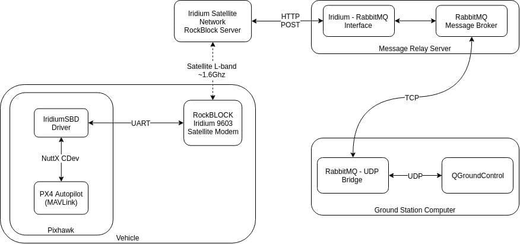
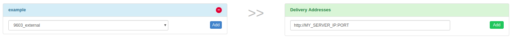
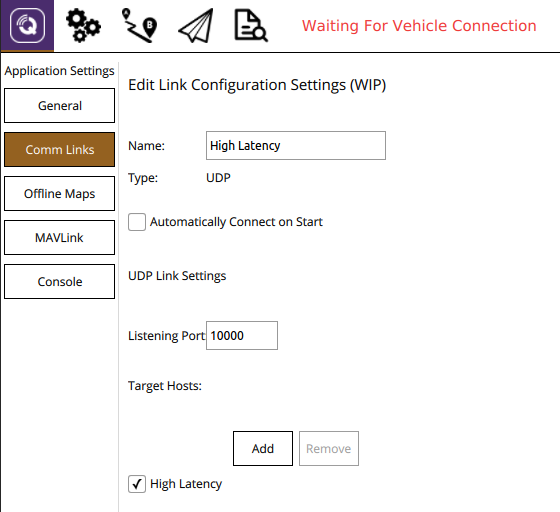
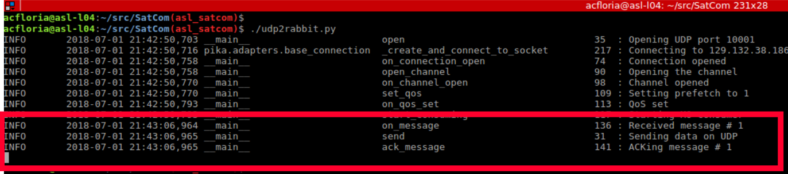
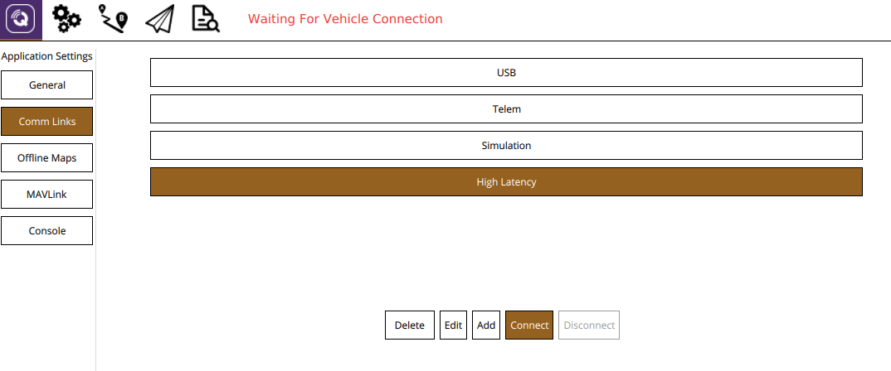
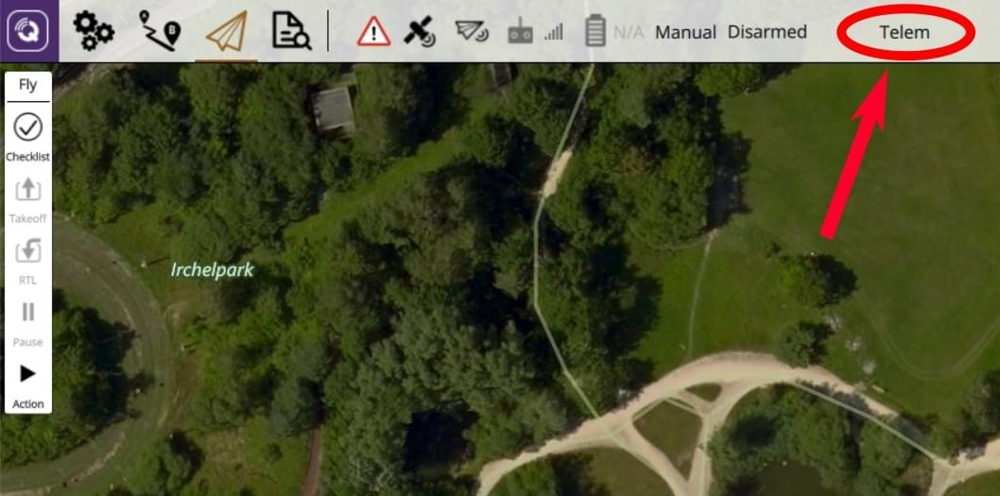
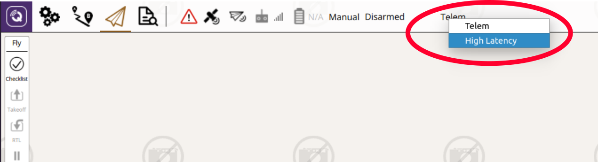

# 이리듐(RockBlock) 위성통신

위성통신 시스템은 기체와 지상국간의 광역 통신을 제공합니다.

이리듐 SBD 위성 통신 시스템의 서비스 공급자 RockBlock을 이용한 시스템 설정 방법을 설명합니다. 신호 품질이 우수한 경우에도 10~15초 정도의 시간 지연이 있을 수 있습니다.

## 개요

위성 통신에는 다음의 요소들이 필요합니다.
* A [RockBlock 9603 Iridium Satellite Modem](https://www.iridium.com/products/rock-seven-rockblock-9603/) module connected to a Pixhawk flashed with the PX4 Autopilot.
* Ubuntu Linux를 실행하는 메시지 릴레이 서버
* *QGroundControl*을 실행하는 지상국 컴퓨터

전체 시스템 아키텍처는 다음과 같습니다.



:::note
설정은 Ubuntu 14.04 및 16.04에서 실행되는 *QGoundControl*의 현재 릴리스로 테스트되었습니다.
- 다른 지상국 및 운영체제를 사용할 수 있지만, 아직 테스트되지 않았습니다.
- The [RockBlock MK2](https://www.groundcontrol.com/us/product/rockblock-9602-satellite-modem/) module can also be used. RockBlock 9603 모듈은 크기가 작고 가볍우면서도 동일한 기능을 제공하기 때문에 권장됩니다.
:::

## 비용

영국 링크 실행 비용은 회선 대여 및 메시지 당 비용으로 구성됩니다.
* 각 모듈을 활성화해야 하며, 가격은 월 10파운드입니다
* 시스템을 통해 전송되는 각 메시지는 50바이트당 하나의 *크레딧*입니다. 번들 크기에 따라 RockBlock에서 신용당 0.04파운드 0.11파운드에 신용대출을 구입할 수 있습니다.

일반적으로 모듈에 대한 자세한 설명은 [RockBlock 설명서](https://docs.rockblock.rock7.com/docs) 및 *RockBlock*을 참고하십시오.


## 기체 설정

### 배선

RockBlock 모듈을 Pixhawk의 직렬 포트에 연결합니다. 모듈의 전원 요구 사항으로 인하여 5V에서 최대 0.5A가 필요하므로 고출력 직렬 포트를 통해서만 전원을 공급할 수 있습니다. 사용 가능한 별도의 전원을 사용시에는 Pixhawk와 동일한 접지이어야 합니다. [커넥터](https://docs.rockblock.rock7.com/docs/connectors)와 [전원 요구 사항](https://docs.rockblock.rock7.com/docs/power-supply)의 세부 정보는 RockBlock 설명서에서 확인할 수 있습니다.

### 모듈

모듈은 내부 안테나 또는 SMA 커넥터에 연결된 외부 안테나를 사용할 수 있습니다. [두 안테나의 여러 상태를 전환](https://docs.rockblock.rock7.com/docs/switching-rockblock-9603-antenna-mode)하려면 작은 RF 연결 케이블의 위치를 변경하여야 합니다. 외부 안테나를 사용하는 경우 모듈 손상을 방지하기 위해 안테나의 전원을 켜기 전에 항상 안테나가 모듈에 연결되어 있는 지 확인하십시오.

모듈의 기본 보드 속도는 19200입니다. However, the PX4 *iridiumsbd* driver requires a baud rate of 115200 so it needs to be changed using the [AT commands](https://www.groundcontrol.com/en/wp-content/uploads/2022/02/IRDM_ISU_ATCommandReferenceMAN0009_Rev2.0_ATCOMM_Oct2012.pdf).

1. 19200/8-N-1 설정을 사용하여 모듈에 연결하고 다음 명령을 사용하여 통신이 작동하는지 점검하십시오. 응답은 다음과 같아야 합니다.
1. baudrate 속도를 변경합니다.
   ```
   AT+IPR=9
   ```
1. 이제 115200/8-N-1 설정을 사용하여 모델에 다시 연결하고 다음을 사용하여 설정을 저장합니다.
   ```
   AT&W0

   ```

이제 이 모듈을 PX4에서 사용할 수 있습니다.

### 소프트웨어

[ISBD_CONFIG](../advanced_config/parameter_reference.md#ISBD_CONFIG)를 사용하여 RockBlock 모듈이 실행될 [직렬 포트를 구성](../peripherals/serial_configuration.md)합니다. 포트에 대한 전송 속도는 드라이버에 의해 구성되므로 설정할 필요가 없습니다.

:::note
*QGroundControl*에서 설정 매개변수를 사용할 수 없는 경우에는 [펌웨어에 드라이버를 추가](../peripherals/serial_configuration.md#parameter_not_in_firmware)하여야 합니다.
```
drivers/telemetry/iridiumsbd
```
:::

## RockBlock 설정

RockBlock의 첫 번째 모듈을 구입시의 첫 번째 단계는 사용자 계정을 생성하는 것입니다.

[계정](https://rockblock.rock7.com/Operations)에 로그인하여 `My RockBLOCKs`에서 RockBlock 모듈을 등록합니다. 모듈에 대한 라인 렌탈을 활성화하고 계정에서 예상 비행 시간에 충분한 크레딧을 사용할 수 있는 지 확인합니다. 기본 설정을 사용할 경우 분당 1개의 메시지가 차량에서 지상국으로 전송됩니다.

메시지 릴레이 서버에 대한 배달 그룹을 설정하고 모듈을 해당 배달 그룹에 추가합니다.



## 릴레이 서버 설정

릴레이 서버는 Ubuntu 16.04 또는 14.04 버전에서 실행하여야 합니다.
1. 메시지 릴레이로 작동하는 서버에는 고정 IP 주소와  열린 TCP 포트 2개가 있어야 합니다.

   *  *RabbitMQ* 메시지 브로커에 대한 `5672`(*Rabbitmq* 설정에서 변경할 수 있음)
   * HTTP POST 인터페이스의 경우 `45679`(**relay.cfg** 파일에서 변경할 수 있음)

1. 필요한 Python 모듈을 설치합니다.
   ```bash
   sudo pip install pika tornado future
   ```
1. `rabbitmq` 메시지 브로커를 설치합니다.
   ```
   sudo apt install rabbitmq-server
   ```
1. 브로커 자격 증명을 구성합니다(암호를 PWD로 변경).
   ```bash
   bash
    sudo rabbitmqctl add_user iridiumsbd PWD
    sudo rabbitmqctl set_permissions iridiumsbd ".<em x-id="3">" ".</em>" ".*"
   ```
1. [SatComInfrarastructure](https://github.com/acfloria/SatComInfrastructure.git) 저장소를 복제합니다.
   ```
   git clone https://github.com/acfloria/SatComInfrastructure.git
   ```
1. *SatComInfrarastructure*로 이동하여 브로커 대기열을 설정합니다.
   ```
   ./setup_rabbit.py localhost iridiumsbd PWD
   ```
1. 설정을 확인합니다.
   ```
   sudo rabbitmqctl list_queues
   ```

   이렇게 하면 4개의 대기열 목록이 표시됩니다: `MO`, `MO_LOG`, `MT`, `MT`

1. 설정을 반영하도록 `relay.cfg` 설정 파일을 편집합니다.
1. 분리 모드에서 릴레이 스크립트를 실행합니다.
   ```
   screen -dm bash -c 'cd SatcomInfrastructure/; ./relay.py
   ```

기타 지침은 다음과 같습니다.
* 화면에서 분리:
  ```
  ctrl+a d
  ```
* 스크립트 실행 중지:
  ```
  ctrl+a :quit
  ```
* 화면에 다시 부착:
  ```
  screen -dr
  ```

## 지상국 컴퓨터

지상국을 설정 방법:

1. 필요한 Python 모듈을 설치합니다.
   ```
   sudo pip install pika tornado future
   ```
1. SatComInfrarastructure 저장소 복제:
   ```
   git clone https://github.com/acfloria/SatComInfrastructure.git
   ```
1. 설정을 반영하도록 **udp2rabbit.cfg** 설정 파일을 편집합니다.
1. [Install *QGroundControl*](https://docs.qgroundcontrol.com/master/en/getting_started/download_and_install.html) (daily build).
1. 다음 매개 변수를 사용하여 QGC에서 UDP 연결을 추가합니다.

   * 접속 포트: 10000
   * 대상 호스트: 127.0.0.1:10001
   * 높은 지연 시간: 확인됨

   

### 검증

1. Open a terminal on the ground station computer and change to the location of the *SatComInfrastructure* repository. 그런 다음 **udp2rabbit.py** 스크립트를 실행합니다. `./udp2rabbit.py`
   ```
   ./udp2rabbit.py
   ```

1. [ RockBlock 계정](https://rockblock.rock7.com/Operations)에서 테스트 메시지를 `테스트 전송 그룹` 탭에 생성된 전송 그룹으로 보냅니다.

`udp2rabbit.py` 스크립트가 몇 초 내에 실행되고 있는 터미널에서 메시지에 대한 확인할 수 있는 경우 RockBlock 전달 그룹, 릴레이 서버 및 udp2rabbit 스크립트가 올바르게 설정된 것입니다.




## 시스템 실행

1. *QGroundControl*을 실행합니다. 먼저 높은 지연 시간 링크를 수동으로 연결한 다음, 일반 텔레메트리 링크를 연결합니다.

   
1. 접지 스테이션 컴퓨터의 터미널에서 *SatComInfrarastructure* 저장소 위치로 변경합니다. 그런 다음 **udp2rabbit.py** 스크립트를 실행합니다. `./udp2rabbit.py`
   ```
   ./udp2rabbit.py
   ```
1. 기체의 전원을 켭니다.
1. QGC에서 첫 번째 `HIGH_LATENCY2` 메시지가 수신될 때까지 기다립니다. 이 검사는 *MAVLink Inspector* 위젯을 사용하거나 *LinkIndicator *를 사용하여 도구 모음에서 확인할 수 있습니다. 활성 기체에서 두 개 이상의 링크가 연결되어 있는 경우, 표시된 링크의 이름을 클릭하면 모든 링크가 표시됩니다.

   

   링크 표시기는 항상 우선 순위 링크의 이름을 표시합니다.
1. 이제 위성 통신 시스템을 사용할 준비가 되었습니다. 우선 순위 링크(명령 전송 링크)는 다음 방법으로 결정됩니다.
   * 사용자가 링크를 명령하지 않으면, 지연 시간이 큰 링크보다 일반적인 텔레메트리 링크가 선호됩니다.
   * 기체가 시동을 켜고 텔레메트리 링크가 끊어지면(특정 시간 동안 MAVLink 메시지가 수신되지 않을 경우), 오토파일럿과 QGC는 일반 텔레메트리에서 긴 대기 시간 링크로 되돌아갑니다. 텔레메트리 링크가 복구되는 즉시 QGC와 자동 조종기가 다시 이 링크로 전환됩니다.
   * 사용자는 도구 모음의 `LinkIndicator`에서 우선 순위 링크를 선택할 수 있습니다. 이 링크가 활성화되어 있거나 사용자가 다른 우선 순위 링크를 선택하면 이 링크는 우선 순위 링크로 유지됩니다.

     

## 문제 해결

* 비행기에서 위성 통신 메시지를 수신하지만 명령을 전송할 수 없습니다(차량이 반응하지 않음).
  * 릴레이 서버의 설정을 확인하고 해당 설정이 올바른지 확인합니다(특히 IMEI).
* 비행기의 위성 통신 메시지는 지상국에 도착하지 않습니다.
  * 시스템 콘솔이 <>iridiumsbd</em> 드라이버가 시작된 경우 및 모듈이 위성 신호를 수신 여부를 확인합니다. `iridiumsbd status`
    ```
    iridiumsbd status
    ```
  * 위의 확인 단계를 사용하여 릴레이 서버, 전송 그룹 및`udp2rabbit.py` 스크립트가 올바르게 설정되었는지 확인합니다.
  * 링크가 연결되어 있고 설정이 정확한 지  확인하십시오.

* IridiumSBD 드라이버가 시작되지 않음:
  * 기체를 재부팅합니다. 도움이된다면 드라이버를 시작하기 전에 `extras.txt`에서 절전 시간을 늘리십시오. 그래도 Pixhawk와 모듈이 동일한 접지 레벨을 유지하는지 확인할 수 있습니다. 모듈의 보레이트가 115200으로 설정되어 있는 지 확인하십시오.

* 지상에서 첫 번째 메시지가 수신되지만, 기체가 비행하는 즉시 메시지를 전송할 수 없거나 대기 시간이 훨씬 더 길어집니다(분 단위).
  * 비행 후 신호 품질을 확인합니다. 비행 중에 감소하는 경우 내부 안테나 보다 외부 안테나를 사용하는 것이 좋습니다. 이미 외부 안테나를 전자 장치 또는 신호를 방해 할 수있는 모든 것에서 최대한 멀리 이동하십시오. 또한 안테나가 손상되지 않았는 지 확인합니다.
