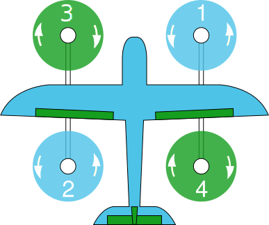

# 에어프레임 참조

> **Note** **This list is [auto-generated](https://github.com/PX4/PX4-Autopilot/blob/master/Tools/px4airframes/markdownout.py) from the source code**.
> 
> 일부 비행 컨트롤러에는 **AUX** 채널이 없을 수 있습니다. 해당 채널이 있다면, 보통 **AUX OUT**으로 라벨이 있습니다.

이 페이지는 모터 설정 및 번호 지정을 포함하여 지원되는 모든 기체 및 유형을 기술합니다. **녹색** 모터는 시계 방향으로 회전화며, **청색** 모터는 반시계 방향으로 회전합니다.

## 비행선

### 비행선

   
  
  <table style="float: right; width: 70%; font-size:1.5rem;">
    <colgroup><col></colgroup> <tr>
      <th>
        공통 출력
      </th>
    </tr>
<tr>
 <td style="vertical-align: top;"><ul><li><b>AUX1</b>: Mount pitch</li><li><b>AUX2</b>: Mount roll</li><li><b>AUX3</b>: Mount yaw</li><li><b>AUX4</b>: Mount retract</li></ul></td>
</tr>
  </table>

<table style="width: 100%; table-layout:fixed; font-size:1.5rem;">
  <colgroup><col style="width: 30%"><col style="width: 70%"></colgroup> <tr>
    <th>
      명칭
    </th>
    
    <th>
    </th>
  </tr>
<tbody>
<tr id="airship_airship_cloudship">
 <td style="vertical-align: top;">구름선</td>
 <td style="vertical-align: top;">
유지보수: John Doe &lt;john@example.com&gt;

<code>SYS_AUTOSTART</code> = 2507
</td>

</tr>
</tbody></table>

## 오토자이로 

### 오토자이로

   
  
  <table style="float: right; width: 70%; font-size:1.5rem;">
    <colgroup><col></colgroup> <tr>
      <th>
        공통 출력
      </th>
    </tr>
<tr>
 <td style="vertical-align: top;"><ul><li><b>AUX1</b> : 프리로테이터용 RC AUX1 채널 피드 스루 (선택 사항)</li><li><b>AUX2</b> : 릴리스 장치용 RC AUX2 채널 피드 스루 (선택 사항)</li></ul></td>
</tr>
  </table>

<table style="width: 100%; table-layout:fixed; font-size:1.5rem;">
  <colgroup><col style="width: 30%"><col style="width: 70%"></colgroup> <tr>
    <th>
      명칭
    </th>
    
    <th>
    </th>
  </tr>
<tr id="autogyro_autogyro_thunderfly_auto-g2">
 <td style="vertical-align: top;"><a href="https://github.com/ThunderFly-aerospace/Auto-G2/">ThunderFly Auto-G2</a></td>
 <td style="vertical-align: top;">
유지보수: ThunderFly s.r.o., Roman Dvorak &lt;dvorakroman@thunderfly.cz&gt;

<code>SYS_AUTOSTART</code> = 4013

<b>출력 지정:</b><ul><li><b>MAIN1</b>: 좌측 로터 헤드</li><li><b>MAIN2</b>: 우측 로터 헤드</li><li><b>MAIN3</b>: 승강타</li><li><b>MAIN4</b>: 방향타</li><li><b>MAIN5</b>: 보조 방향타 (선택 사항)</li><li><b>MAIN6</b>: 추진기</li><li><b>MAIN7</b>: 바퀴</li></ul>
</td>

</tr>
<tr id="autogyro_autogyro_thunderfly_tf-g2">
 <td style="vertical-align: top;"><a href="https://github.com/ThunderFly-aerospace/TF-G2/">ThunderFly TF-G2</a></td>
 <td style="vertical-align: top;">
유지보수: ThunderFly s.r.o., Roman Dvorak &lt;dvorakroman@thunderfly.cz&gt;

<code>SYS_AUTOSTART</code> = 17003

<b>출력 지정:</b><ul><li><b>MAIN1</b>: 좌측 로터 헤드</li><li><b>MAIN2</b>: 우측 로터 헤드</li><li><b>MAIN4</b>: 방향타</li><li><b>MAIN5</b>: 추진기</li></ul>
</td>

</tr>
</table>

## 풍선

### 풍선

<table style="width: 100%; table-layout:fixed; font-size:1.5rem;">
  <colgroup><col style="width: 30%"><col style="width: 70%"></colgroup> <tr>
    <th>
      명칭
    </th>
    
    <th>
    </th>
  </tr>
<tbody>
<tr id="balloon_balloon_thunderfly_balloon_tf-b1">
 <td style="vertical-align: top;"><a href="https://github.com/ThunderFly-aerospace/TF-B1/">ThunderFly balloon TF-B1</a></td>
 <td style="vertical-align: top;">
유지보수: ThunderFly s.r.o.

<code>SYS_AUTOSTART</code> = 18001
</td>

</tr>
</tbody></table>

## 콥터

### 동축 헬리콥터

   
  
  <table style="float: right; width: 70%; font-size:1.5rem;">
    <colgroup><col></colgroup> <tr>
      <th>
        공통 출력
      </th>
    </tr>
<tr>
 <td style="vertical-align: top;"><ul><li><b>MAIN1</b>: 좌측 경사판 서보모터, 피치 축</li><li><b>MAIN2</b>: 우측 경사판 서보모터, 롤 축</li><li><b>MAIN3</b>: 상부 로터 (CCW)</li><li><b>MAIN4</b>: 하부 로터 (CW)</li></ul></td>
</tr>
  </table>

<table style="width: 100%; table-layout:fixed; font-size:1.5rem;">
  <colgroup><col style="width: 30%"><col style="width: 70%"></colgroup> <tr>
    <th>
      명칭
    </th>
    
    <th>
    </th>
  </tr>
<tbody>
<tr id="copter_coaxial_helicopter_esky_(big)_lama_v4">
 <td style="vertical-align: top;">Esky (Big) Lama v4</td>
 <td style="vertical-align: top;">
유지보수: Emmanuel Roussel

<code>SYS_AUTOSTART</code> = 15001
</td>

</tr>
</tbody></table>

### Dodecarotor cox

   
  
  <table style="float: right; width: 70%; font-size:1.5rem;">
    <colgroup><col></colgroup> <tr>
      <th>
        공통 출력
      </th>
    </tr>
<tr>
 <td style="vertical-align: top;"><ul><li><b>MAIN1</b>: 모터 1</li><li><b>MAIN2</b>: 모터 2</li><li><b>MAIN3</b>: 모터 3</li><li><b>MAIN4</b>: 모터 4</li><li><b>MAIN5</b>: 모터 5</li><li><b>MAIN6</b>: 모터 6</li><li><b>AUX1</b>: 모터 7</li><li><b>AUX2</b>: 모터 8</li><li><b>AUX3</b>: 모터 9</li><li><b>AUX4</b>: 모터 10</li><li><b>AUX5</b>: 모터 11</li><li><b>AUX6</b>: 모터 12</li></ul></td>
</tr>
  </table>

<table style="width: 100%; table-layout:fixed; font-size:1.5rem;">
  <colgroup><col style="width: 30%"><col style="width: 70%"></colgroup> <tr>
    <th>
      명칭
    </th>
    
    <th>
    </th>
  </tr>
<tbody>
<tr id="copter_dodecarotor_cox_generic_dodecarotor_cox_geometry">
 <td style="vertical-align: top;">일반 도데카로터 콕스 기하 구조</td>
 <td style="vertical-align: top;">
유지보수: William Peale &lt;develop707@gmail.com&gt;

<code>SYS_AUTOSTART</code> = 24001
</td>

</tr>
</tbody></table>

### 헬리콥터

   
  
  <table style="float: right; width: 70%; font-size:1.5rem;">
    <colgroup><col></colgroup> <tr>
      <th>
        공통 출력
      </th>
    </tr>
<tr>
 <td style="vertical-align: top;"><ul><li><b>MAIN1</b>: main motor</li><li><b>MAIN2</b>: front swashplate servo</li><li><b>MAIN3</b>: right swashplate servo</li><li><b>MAIN4</b>: left swashplate servo</li><li><b>MAIN5</b>: tail-rotor servo</li></ul></td>
</tr>
  </table>

<table style="width: 100%; table-layout:fixed; font-size:1.5rem;">
  <colgroup><col style="width: 30%"><col style="width: 70%"></colgroup> <tr>
    <th>
      명칭
    </th>
    
    <th>
    </th>
  </tr>
<tbody>
<tr id="copter_helicopter_blade_130x">
 <td style="vertical-align: top;">Blade 130X</td>
 <td style="vertical-align: top;">
유지보수: Bart Slinger &lt;bartslinger@gmail.com&gt;

<code>SYS_AUTOSTART</code> = 16001
</td>

</tr>
</tbody></table>

### 헥사로터 +

   
  
  <table style="float: right; width: 70%; font-size:1.5rem;">
    <colgroup><col></colgroup> <tr>
      <th>
        공통 출력
      </th>
    </tr>
<tr>
 <td style="vertical-align: top;"><ul><li><b>MAIN1</b>: motor1</li><li><b>MAIN2</b>: motor2</li><li><b>MAIN3</b>: motor3</li><li><b>MAIN4</b>: motor4</li><li><b>MAIN5</b>: motor5</li><li><b>MAIN6</b>: motor6</li><li><b>AUX1</b>: feed-through of RC AUX1 channel</li><li><b>AUX2</b>: feed-through of RC AUX2 channel</li><li><b>AUX3</b>: feed-through of RC AUX3 channel</li></ul></td>
</tr>
  </table>

<table style="width: 100%; table-layout:fixed; font-size:1.5rem;">
  <colgroup><col style="width: 30%"><col style="width: 70%"></colgroup> <tr>
    <th>
      명칭
    </th>
    
    <th>
    </th>
  </tr>
<tbody>
<tr id="copter_hexarotor_+_generic_hexarotor_+_geometry">
 <td style="vertical-align: top;">Generic Hexarotor + geometry</td>
 <td style="vertical-align: top;">
유지보수: Lorenz Meier &lt;lorenz@px4.io&gt;

<code>SYS_AUTOSTART</code> = 7001
</td>

</tr>
</tbody></table>

### 동축 헥사로터

   
  
  <table style="float: right; width: 70%; font-size:1.5rem;">
    <colgroup><col></colgroup> <tr>
      <th>
        공통 출력
      </th>
    </tr>
    
    <tr>
      <td style="vertical-align: top;">
        <ul>
          <li>
            <b>MAIN1</b>: 전면 우측 상단, CW, 각도:60, 방향:CW
          </li>
          <li>
            <b>MAIN2</b>: 전면 우측 하단, CCW, 각도:60, 방향:CCW
          </li>
          <li>
            <b>MAIN3</b>: 후면 상단, CW, 각도:180, 방향:CW
          </li>
          <li>
            <b>MAIN4</b>: 후면 하단, CCW, 각도:180, 방향:CCW
          </li>
          <li>
            <b>MAIN5</b>: 전면 좌측 상단, CW, 각도:-60, 방향:CW
          </li>
          <li>
            <b>MAIN6</b>: 전면 좌측 하단, CCW, 각도:-60, 방향:CCW
          </li>
          <li>
            <b>AUX1</b>: RC AUX1 채널의 입력
          </li>
          <li>
            <b>AUX2</b>: RC AUX2 채널의 입력
          </li>
          <li>
            <b>AUX3</b>: RC AUX3 채널의 입력
          </li>
        </ul>
      </td>
    </tr>
  </table>

<table style="width: 100%; table-layout:fixed; font-size:1.5rem;">
  <colgroup><col style="width: 30%"><col style="width: 70%"></colgroup> <tr>
    <th>
      명칭
    </th>
    
    <th>
    </th>
  </tr>
<tbody>
<tr id="copter_hexarotor_coaxial_generic_hexarotor_coaxial_geometry">
 <td style="vertical-align: top;">일반 동축  헥사로터 </td>
 <td style="vertical-align: top;">
유지보수: Lorenz Meier &lt;lorenz@px4.io&gt;

<code>SYS_AUTOSTART</code> = 11001
</td>

</tr>
</tbody></table>

### X형 헥사로터

   
  
  <table style="float: right; width: 70%; font-size:1.5rem;">
    <colgroup><col></colgroup> <tr>
      <th>
        공통 출력
      </th>
    </tr>
<tr>
 <td style="vertical-align: top;"><ul><li><b>MAIN1</b>: 모터 1</li><li><b>MAIN2</b>: 모터 2</li><li><b>MAIN3</b>: 모터 3</li><li><b>MAIN4</b>: 모터 4</li><li><b>MAIN5</b>: 모터 5</li><li><b>MAIN6</b>: 모터 6</li></ul></td>
</tr>
  </table>

<table style="width: 100%; table-layout:fixed; font-size:1.5rem;">
  <colgroup><col style="width: 30%"><col style="width: 70%"></colgroup> <tr>
    <th>
      명칭
    </th>
    
    <th>
    </th>
  </tr>
  
  <tr id="copter_hexarotor_x_generic_hexarotor_x_geometry">
    <td style="vertical-align: top;">
      일반 X형 헥사로터
    </td>
    
    <td style="vertical-align: top;">
      

        유지보수: Lorenz Meier &lt;lorenz@px4.io&gt;
      

      
      

        <code>SYS_AUTOSTART</code> = 6001
      

      
      

        <b>지정 출력:</b>
        
        <ul>
          <li>
            <b>AUX1</b>: RC AUX1 채널 입력
          </li>
          <li>
            <b>AUX2</b>: RC AUX2 채널 입력
          </li>
          <li>
            <b>AUX3</b>: RC AUX3 채널 입력
          </li>
        </ul>
      

    </td>
  </tr>
  
  <tr id="copter_hexarotor_x_uvify_draco-r">
    <td style="vertical-align: top;">
      UVify Draco-R
    </td>
    
    <td style="vertical-align: top;">
      

        유지보수: Hyon Lim &lt;lim@uvify.com&gt;
      

      
      

        <code>SYS_AUTOSTART</code> = 6002
      

      
      

        <b>지정 출력:</b>
        
        <ul>
          <li>
            <b>AUX1</b>: RC AUX1 채널의 입력
          </li>
          <li>
            <b>AUX2</b>: RC AUX2 채널의 입력
          </li>
        </ul>
      

    </td>
  </tr>
<tr id="copter_hexarotor_x_hex_x_with_control_allocation">
 <td style="vertical-align: top;">Hex X with control allocation</td>
 <td style="vertical-align: top;">
유지보수: Silvan Fuhrer

<code>SYS_AUTOSTART</code> = 6003
</td>

</tr>
</table>

### 옥토 콕스 와이드

   
  
  <table style="float: right; width: 70%; font-size:1.5rem;">
    <colgroup><col></colgroup> <tr>
      <th>
        공통 출력
      </th>
    </tr>
<tr>
 <td style="vertical-align: top;"><ul><li><b>MAIN1</b>: 모터 1</li><li><b>MAIN2</b>: 모터 2</li><li><b>MAIN3</b>: 모터 3</li><li><b>MAIN4</b>: 모터 4</li><li><b>MAIN5</b>: 모터 5</li><li><b>MAIN6</b>: 모터 6</li><li><b>MAIN7</b>: 모터 7</li><li><b>MAIN8</b>: 모터 8</li></ul></td>
</tr>
  </table>

<table style="width: 100%; table-layout:fixed; font-size:1.5rem;">
  <colgroup><col style="width: 30%"><col style="width: 70%"></colgroup> <tr>
    <th>
      명칭
    </th>
    
    <th>
    </th>
  </tr>
<tbody>
<tr id="copter_octo_coax_wide_steadidrone_mavrik">
 <td style="vertical-align: top;">Steadidrone MAVRIK</td>
 <td style="vertical-align: top;">
유지보수: Simon Wilks &lt;simon@uaventure.com&gt;

<code>SYS_AUTOSTART</code> = 12002
</td>

</tr>
</tbody></table>

### 옥토로터 +

   
  
  <table style="float: right; width: 70%; font-size:1.5rem;">
    <colgroup><col></colgroup> <tr>
      <th>
        공통 출력
      </th>
    </tr>
    
    <tr>
      <td style="vertical-align: top;">
        <ul>
          <li>
            <b>MAIN1</b> : 모터 1
          </li>
          <li>
            <b>MAIN2</b> : 모터 2
          </li>
          <li>
            <b>MAIN3</b> : 모터 3
          </li>
          <li>
            <b>MAIN4</b> : 모터 4
          </li>
          <li>
            <b>MAIN5</b> : 모터 5
          </li>
          <li>
            <b>MAIN6</b> : 모터 6
          </li>
          <li>
            <b>MAIN7</b> : 모터 7
          </li>
          <li>
            <b>MAIN8</b> : 모터 8
          </li>
          <li>
            <b>AUX1</b> : RC AUX1 채널의 입력
          </li>
          <li>
            <b>AUX2</b> : RC AUX2 채널의 입력
          </li>
          <li>
            <b>AUX3</b> : RC AUX3 채널의 입력
          </li>
        </ul>
      </td>
    </tr>
  </table>

<table style="width: 100%; table-layout:fixed; font-size:1.5rem;">
  <colgroup><col style="width: 30%"><col style="width: 70%"></colgroup> <tr>
    <th>
      명칭
    </th>
    
    <th>
    </th>
  </tr>
<tbody>
<tr id="copter_octorotor_+_generic_octocopter_+_geometry">
 <td style="vertical-align: top;">일반 옥토콥터 + </td>
 <td style="vertical-align: top;">
유지보수: Lorenz Meier &lt;lorenz@px4.io&gt;

<code>SYS_AUTOSTART</code> = 9001
</td>

</tr>
</tbody></table>

### 옥토로터 동축

   
  
  <table style="float: right; width: 70%; font-size:1.5rem;">
    <colgroup><col></colgroup> <tr>
      <th>
        공통 출력
      </th>
    </tr>
<tr>
 <td style="vertical-align: top;"><ul><li><b>MAIN1</b>: 모터 1</li><li><b>MAIN2</b>: 모터 2</li><li><b>MAIN3</b>: 모터 3</li><li><b>MAIN4</b>: 모터 4</li><li><b>MAIN5</b>: 모터 5</li><li><b>MAIN6</b>: 모터 6</li><li><b>MAIN7</b>: 모터 7</li><li><b>MAIN8</b>: 모터 8</li></ul></td>
</tr>
  </table>

<table style="width: 100%; table-layout:fixed; font-size:1.5rem;">
  <colgroup><col style="width: 30%"><col style="width: 70%"></colgroup> <tr>
    <th>
      명칭
    </th>
    
    <th>
    </th>
  </tr>
<tbody>
<tr id="copter_octorotor_coaxial_generic_10">
 <td style="vertical-align: top;">일반 10" 옥토 동축 </td>
 <td style="vertical-align: top;">
유지보수: Lorenz Meier &lt;lorenz@px4.io&gt;

<code>SYS_AUTOSTART</code> = 12001
</td>

</tr>
</tbody></table>

### 옥토로터 X형 

   
  
  <table style="float: right; width: 70%; font-size:1.5rem;">
    <colgroup><col></colgroup> <tr>
      <th>
        공통 출력
      </th>
    </tr>
    
    <tr>
      <td style="vertical-align: top;">
        <ul>
          <li>
            <b>MAIN1</b>: 모터 1
          </li>
          <li>
            <b>MAIN2</b>: 모터 2
          </li>
          <li>
            <b>MAIN3</b>: 모터 3
          </li>
          <li>
            <b>MAIN4</b>: 모터 4
          </li>
          <li>
            <b>MAIN5</b>: 모터 5
          </li>
          <li>
            <b>MAIN6</b>: 모터 6
          </li>
          <li>
            <b>MAIN7</b>: 모터 7
          </li>
          <li>
            <b>MAIN8</b>: 모터 8
          </li>
          <li>
            <b>AUX1</b>: RC AUX1 채널의 입력
          </li>
          <li>
            <b>AUX2</b>: RC AUX2 채널의 입력
          </li>
          <li>
            <b>AUX3</b>: RC AUX3 채널의 입력
          </li>
        </ul>
      </td>
    </tr>
  </table>

<table style="width: 100%; table-layout:fixed; font-size:1.5rem;">
  <colgroup><col style="width: 30%"><col style="width: 70%"></colgroup> <tr>
    <th>
      명칭
    </th>
    
    <th>
    </th>
  </tr>
<tbody>
<tr id="copter_octorotor_x_generic_octocopter_x_geometry">
 <td style="vertical-align: top;">일반 옥타콥터 X </td>
 <td style="vertical-align: top;">
유지보수: Lorenz Meier &lt;lorenz@px4.io&gt;

<code>SYS_AUTOSTART</code> = 8001
</td>

</tr>
</tbody></table>

### 쿼드로터 + 형

   
  
  <table style="float: right; width: 70%; font-size:1.5rem;">
    <colgroup><col></colgroup> <tr>
      <th>
        공통 출력
      </th>
    </tr>
    
    <tr>
      <td style="vertical-align: top;">
        <ul>
          <li>
            <b>MAIN1</b>: 모터 1
          </li>
          <li>
            <b>MAIN2</b>: 모터 2
          </li>
          <li>
            <b>MAIN3</b>: 모터 3
          </li>
          <li>
            <b>MAIN4</b>: 모터 4
          </li>
          <li>
            <b>MAIN5</b>: RC AUX1 채널의 입력
          </li>
          <li>
            <b>MAIN6</b>: RC AUX2 채널의 입력
          </li>
          <li>
            <b>AUX1</b>: RC AUX1 채널의 입력
          </li>
          <li>
            <b>AUX2</b>: RC AUX2 채널의 입력
          </li>
          <li>
            <b>AUX3</b>: RC AUX3 채널의 입력
          </li>
          <li>
            <b>AUX4</b>: RC FLAPS 채널의 입력
          </li>
        </ul>
      </td>
    </tr>
  </table>

<table style="width: 100%; table-layout:fixed; font-size:1.5rem;">
  <colgroup><col style="width: 30%"><col style="width: 70%"></colgroup> <tr>
    <th>
      명칭
    </th>
    
    <th>
    </th>
  </tr>
<tbody>
<tr id="copter_quadrotor_+_generic_10">
 <td style="vertical-align: top;">일반 10" 쿼드 +  </td>
 <td style="vertical-align: top;">
유지보수: Lorenz Meier &lt;lorenz@px4.io&gt;

<code>SYS_AUTOSTART</code> = 5001
</td>

</tr>
</tbody></table>

### 쿼드로터 H

<table style="width: 100%; table-layout:fixed; font-size:1.5rem;">
  <colgroup><col style="width: 30%"><col style="width: 70%"></colgroup> <tr>
    <th>
      명칭
    </th>
    
    <th>
    </th>
  </tr>
<tr id="copter_quadrotor_h_reaper_500_quad">
 <td style="vertical-align: top;">리퍼 500 쿼드</td>
 <td style="vertical-align: top;">
유지관리: Blankered

<code>SYS_AUTOSTART</code> = 4040

<b>지정 출력:</b><ul><li><b>MAIN1</b>: 모터 1</li><li><b>MAIN2</b>: 모터 2</li><li><b>MAIN3</b>: 모터 3</li><li><b>MAIN4</b>: 모터 4</li><li><b>MAIN5</b>: RC AUX1 채널의 입력</li><li><b>MAIN6</b>: RC AUX2 채널의 입력</li></ul>
</td>

</tr>
<tr id="copter_quadrotor_h_betafpv_beta75x_2s_brushless_whoop">
 <td style="vertical-align: top;">BetaFPV Beta75X 2S Brushless Whoop</td>
 <td style="vertical-align: top;">
유지보수: Beat Kueng &lt;beat-kueng@gmx.net&gt;

<code>SYS_AUTOSTART</code> = 4041

<b>지정 출력:</b><ul><li><b>MAIN1</b>: 모터 1</li><li><b>MAIN2</b>: 모터 2</li><li><b>MAIN3</b>: 모터 3</li><li><b>MAIN4</b>: 모터 4</li></ul>
</td>

</tr>
</table>

### 쿼드로터 와이드

   
  
  <table style="float: right; width: 70%; font-size:1.5rem;">
    <colgroup><col></colgroup> <tr>
      <th>
        공통 출력
      </th>
    </tr>
    
    <tr>
      <td style="vertical-align: top;">
        <ul>
          <li>
            <b>AUX1</b> : RC AUX1 채널의 입력
          </li>
          <li>
            <b>AUX2</b> : RC AUX2 채널의 입력
          </li>
          <li>
            <b>AUX3</b> : RC AUX3 채널의 입력
          </li>
          <li>
            <b>AUX4</b> : RC FLAPS 채널의 입력
          </li>
        </ul>
      </td>
    </tr>
  </table>

<table style="width: 100%; table-layout:fixed; font-size:1.5rem;">
  <colgroup><col style="width: 30%"><col style="width: 70%"></colgroup> <tr>
    <th>
      명칭
    </th>
    
    <th>
    </th>
  </tr>
<tr id="copter_quadrotor_wide_team_blacksheep_discovery">
 <td style="vertical-align: top;">Team Blacksheep Discovery</td>
 <td style="vertical-align: top;">
유지보수: Lorenz Meier &lt;lorenz@px4.io&gt;

<code>SYS_AUTOSTART</code> = 10015

<b>지정 출력:</b><ul><li><b>MAIN1</b>: 모터 1</li><li><b>MAIN2</b>: 모터 2</li><li><b>MAIN3</b>: 모터 3</li><li><b>MAIN4</b>: 모터 4</li><li><b>MAIN5</b>: RC AUX1 채널의 입력</li><li><b>MAIN6</b>: RC AUX2 채널의 입력</li></ul>
</td>

</tr>
<tr id="copter_quadrotor_wide_3dr_iris_quadrotor">
 <td style="vertical-align: top;">3DR Iris Quadrotor</td>
 <td style="vertical-align: top;">
유지보수: Lorenz Meier &lt;lorenz@px4.io&gt;

<code>SYS_AUTOSTART</code> = 10016

<b>지정 출력:</b><ul><li><b>MAIN1</b>: 모터 1</li><li><b>MAIN2</b>: 모터 2</li><li><b>MAIN3</b>: 모터 3</li><li><b>MAIN4</b>: 모터 4</li></ul>
</td>

</tr>
<tr id="copter_quadrotor_wide_steadidrone_qu4d">
 <td style="vertical-align: top;">스테디드론 QU4D</td>
 <td style="vertical-align: top;">
유지보수: Lorenz Meier &lt;lorenz@px4.io&gt;

<code>SYS_AUTOSTART</code> = 10017

<b>출력 지정:</b><ul><li><b>MAIN1</b>: 모터 1</li><li><b>MAIN2</b>: 모터 2</li><li><b>MAIN3</b>: 모터 3</li><li><b>MAIN4</b>: 모터 4</li><li><b>MAIN5</b>: RC AUX1 채널의 입력</li><li><b>MAIN6</b>: RC AUX2 채널의 입력</li></ul>
</td>

</tr>
<tr id="copter_quadrotor_wide_team_blacksheep_discovery_endurance">
 <td style="vertical-align: top;">Team Blacksheep Discovery Endurance</td>
 <td style="vertical-align: top;">
유지보수: Simon Wilks &lt;simon@uaventure.com&gt;

<code>SYS_AUTOSTART</code> = 10018

<b>출력 지정:</b><ul><li><b>MAIN1</b>: 모터 1</li><li><b>MAIN2</b>: 모터 2</li><li><b>MAIN3</b>: 모터 3</li><li><b>MAIN4</b>: 모터 4</li><li><b>MAIN5</b>: RC AUX1 채널의 입력</li><li><b>MAIN6</b>: RC AUX2 채널의 입력</li></ul>
</td>

</tr>
</table>

### 비대칭 쿼드로터

   
  
  <table style="float: right; width: 70%; font-size:1.5rem;">
    <colgroup><col></colgroup> <tr>
      <th>
        공통 출력
      </th>
    </tr>
<tr>
 <td style="vertical-align: top;"><ul><li><b>MAIN1</b>: 모터 1(전면 우측: CCW)</li><li><b>MAIN2</b>: 모터 2(후면 좌측: CCW)</li><li><b>MAIN3</b>: 모터 3(전면 좌측: CW)</li><li><b>MAIN4</b>: 모터 4(후면 우측: CW)</li><li><b>MAIN5</b>: RC AUX1 채널의 입력</li><li><b>MAIN6</b>: RC AUX2 채널의 입력</li></ul></td>
</tr>
  </table>

<table style="width: 100%; table-layout:fixed; font-size:1.5rem;">
  <colgroup><col style="width: 30%"><col style="width: 70%"></colgroup> <tr>
    <th>
      명칭
    </th>
    
    <th>
    </th>
  </tr>
<tbody>
<tr id="copter_quadrotor_asymmetric_spedix_s250aq">
 <td style="vertical-align: top;"><a href="https://docs.px4.io/master/en/frames_multicopter/spedix_s250_pixracer.html">Spedix S250AQ</a></td>
 <td style="vertical-align: top;">
유지보수: Lorenz Meier &lt;lorenz@px4.io&gt;

<code>SYS_AUTOSTART</code> = 4051
</td>

</tr>
</tbody></table>

### 쿼드로터 x

   
  
  <table style="float: right; width: 70%; font-size:1.5rem;">
    <colgroup><col></colgroup> <tr>
      <th>
        공통 출력
      </th>
    </tr>
<tr>
 <td style="vertical-align: top;"><ul><li><b>AUX1</b>: RC AUX1 채널의 입력</li><li><b>AUX2</b>: RC AUX2 채널의 입력</li><li><b>AUX3</b>: RC AUX3 채널의 입력</li><li><b>AUX4</b>: RC FLAPS 채널의 입력</li></ul></td>
</tr>
  </table>

<table style="width: 100%; table-layout:fixed; font-size:1.5rem;">
  <colgroup><col style="width: 30%"><col style="width: 70%"></colgroup> <tr>
    <th>
      명칭
    </th>
    
    <th>
    </th>
  </tr>
<tr id="copter_quadrotor_x_generic_quadcopter">
 <td style="vertical-align: top;">일반 쿼드콥터</td>
 <td style="vertical-align: top;">
유지보수: Lorenz Meier &lt;lorenz@px4.io&gt;

<code>SYS_AUTOSTART</code> = 4001

<b>출력 지정:</b><ul><li><b>MAIN1</b>: 모터 1</li><li><b>MAIN2</b>: 모터 2</li><li><b>MAIN3</b>: 모터 3</li><li><b>MAIN4</b>: 모터 4</li><li><b>MAIN5</b>: RC AUX1 채널의 입력</li><li><b>MAIN6</b>: RC AUX2 채널의 입력</li></ul>
</td>

</tr>
  
  <tr id="copter_quadrotor_x_lumenier_qav-r_(raceblade)_5">
    <td style="vertical-align: top;">
      Lumenier QAV-R (raceblade) 5" arms
    </td>
    
    <td style="vertical-align: top;">
      

        유지보수 : James Goppert &lt;james.goppert@gmail.com&gt;
      

      
      

        <code>SYS_AUTOSTART</code> = 4003
      

    </td>
  </tr>
<tr id="copter_quadrotor_x_lumenier_qav250">
 <td style="vertical-align: top;">Lumenier QAV250</td>
 <td style="vertical-align: top;">
유지보수: Lorenz Meier &lt;lorenz@px4.io&gt;

<code>SYS_AUTOSTART</code> = 4009
</td>

</tr>
<tr id="copter_quadrotor_x_dji_f330_w/_dji_escs">
 <td style="vertical-align: top;">DJI F330 w/ DJI 전동 변속기</td>
 <td style="vertical-align: top;">
유지보수: Lorenz Meier &lt;lorenz@px4.io&gt;

<code>SYS_AUTOSTART</code> = 4010
</td>

</tr>
<tr id="copter_quadrotor_x_dji_f450_w/_dji_escs">
 <td style="vertical-align: top;">DJI F450 w/ DJI 전동 변속기</td>
 <td style="vertical-align: top;">
유지보수: Lorenz Meier &lt;lorenz@px4.io&gt;

<code>SYS_AUTOSTART</code> = 4011
</td>

</tr>
<tr id="copter_quadrotor_x_s500_generic">
 <td style="vertical-align: top;">S500 Generic</td>
 <td style="vertical-align: top;">
유지보수: Lorenz Meier &lt;lorenz@px4.io&gt;

<code>SYS_AUTOSTART</code> = 4014
</td>

</tr>
<tr id="copter_quadrotor_x_holybro_s500">
 <td style="vertical-align: top;">Holybro S500</td>
 <td style="vertical-align: top;">
유지보수: Lorenz Meier &lt;lorenz@px4.io&gt;

<code>SYS_AUTOSTART</code> = 4015
</td>

</tr>
<tr id="copter_quadrotor_x_px4_vision_devkit_platform">
 <td style="vertical-align: top;">PX4 Vision DevKit Platform</td>
 <td style="vertical-align: top;">
유지보수: John Doe &lt;john@example.com&gt;

<code>SYS_AUTOSTART</code> = 4016

<b>출력 지정:</b><ul><li><b>MAIN1</b>: 모터 1</li><li><b>MAIN2</b>: 모터 2</li><li><b>MAIN3</b>: 모터 3</li><li><b>MAIN4</b>: 모터 4</li></ul>
</td>

</tr>
<tr id="copter_quadrotor_x_nxp_hovergames">
 <td style="vertical-align: top;">NXP HoverGames</td>
 <td style="vertical-align: top;">
유지보수: Iain Galloway &lt;iain.galloway@nxp.com&gt;

<code>SYS_AUTOSTART</code> = 4017

<b>출력 지정:</b><ul><li><b>MAIN1</b>: 모터 1</li><li><b>MAIN2</b>: 모터 2</li><li><b>MAIN3</b>: 모터 3</li><li><b>MAIN4</b>: 모터 4</li></ul>
</td>

</tr>
<tr id="copter_quadrotor_x_s500_with_control_allocation">
 <td style="vertical-align: top;">S500 with control allocation</td>
 <td style="vertical-align: top;">
유지보수: Silvan Fuhrer

<code>SYS_AUTOSTART</code> = 4018
</td>

</tr>
<tr id="copter_quadrotor_x_3dr_solo">
 <td style="vertical-align: top;">3DR Solo</td>
 <td style="vertical-align: top;">
Maintainer: Andreas Antener &lt;andreas@uaventure.com&gt;

<code>SYS_AUTOSTART</code> = 4030
</td>

</tr>
<tr id="copter_quadrotor_x_3dr_diy_quad">
 <td style="vertical-align: top;">3DR DIY Quad</td>
 <td style="vertical-align: top;">
Maintainer: Lorenz Meier &lt;lorenz@px4.io&gt;

<code>SYS_AUTOSTART</code> = 4031
</td>

</tr>
<tr id="copter_quadrotor_x_generic_250_racer">
 <td style="vertical-align: top;">Generic 250 Racer</td>
 <td style="vertical-align: top;">
Maintainer: Lorenz Meier &lt;lorenz@px4.io&gt;

<code>SYS_AUTOSTART</code> = 4050
</td>

</tr>
<tr id="copter_quadrotor_x_holybro_qav250">
 <td style="vertical-align: top;"><a href="https://docs.px4.io/master/en/frames_multicopter/holybro_qav250_pixhawk4_mini.html">HolyBro QAV250</a></td>
 <td style="vertical-align: top;">
Maintainer: Beat Kueng &lt;beat-kueng@gmx.net&gt;

<code>SYS_AUTOSTART</code> = 4052
</td>

</tr>
<tr id="copter_quadrotor_x_holybro_kopis_2">
 <td style="vertical-align: top;">Holybro Kopis 2</td>
 <td style="vertical-align: top;">
Maintainer: Beat Kueng &lt;beat@px4.io&gt;

<code>SYS_AUTOSTART</code> = 4053
</td>

</tr>
<tr id="copter_quadrotor_x_dji_matrice_100">
 <td style="vertical-align: top;">DJI Matrice 100</td>
 <td style="vertical-align: top;">
Maintainer: James Goppert &lt;james.goppert@gmail.com&gt;

<code>SYS_AUTOSTART</code> = 4060
</td>

</tr>
<tr id="copter_quadrotor_x_uvify_ifo">
 <td style="vertical-align: top;">UVify IFO</td>
 <td style="vertical-align: top;">
Maintainer: Hyon Lim &lt;lim@uvify.com&gt;

<code>SYS_AUTOSTART</code> = 4071

<b>Specific Outputs:</b><ul><li><b>MAIN1</b>: motor 1</li><li><b>MAIN2</b>: motor 2</li><li><b>MAIN3</b>: motor 3</li><li><b>MAIN4</b>: motor 4</li></ul>
</td>

</tr>
<tr id="copter_quadrotor_x_uvify_draco">
 <td style="vertical-align: top;">UVify Draco</td>
 <td style="vertical-align: top;">
Maintainer: Hyon Lim &lt;lim@uvify.com&gt;

<code>SYS_AUTOSTART</code> = 4072

<b>Specific Outputs:</b><ul><li><b>MAIN1</b>: motor 1</li><li><b>MAIN2</b>: motor 2</li><li><b>MAIN3</b>: motor 3</li><li><b>MAIN4</b>: motor 4</li></ul>
</td>

</tr>
<tr id="copter_quadrotor_x_uvify_ifo">
 <td style="vertical-align: top;">UVify IFO</td>
 <td style="vertical-align: top;">
Maintainer: Hyon Lim &lt;lim@uvify.com&gt;

<code>SYS_AUTOSTART</code> = 4073

<b>Specific Outputs:</b><ul><li><b>MAIN1</b>: motor 1</li><li><b>MAIN2</b>: motor 2</li><li><b>MAIN3</b>: motor 3</li><li><b>MAIN4</b>: motor 4</li></ul>
</td>

</tr>
<tr id="copter_quadrotor_x_zmr250_racer">
 <td style="vertical-align: top;">ZMR250 Racer</td>
 <td style="vertical-align: top;">
Maintainer: Anton Matosov &lt;anton.matosov@gmail.com&gt;

<code>SYS_AUTOSTART</code> = 4080
</td>

</tr>
<tr id="copter_quadrotor_x_nanomind_110_quad">
 <td style="vertical-align: top;">NanoMind 110 Quad</td>
 <td style="vertical-align: top;">
Maintainer: Henry Zhang &lt;zhanghui629@gmail.com&gt;

<code>SYS_AUTOSTART</code> = 4090
</td>

</tr>
<tr id="copter_quadrotor_x_teal_one">
 <td style="vertical-align: top;">Teal One</td>
 <td style="vertical-align: top;">
Maintainer: Matt McFadden &lt;matt.mcfadden@tealdrones.com&gt;

<code>SYS_AUTOSTART</code> = 4250

<b>Specific Outputs:</b><ul><li><b>MAIN1</b>: motor 1</li><li><b>MAIN2</b>: motor 2</li><li><b>MAIN3</b>: motor 3</li><li><b>MAIN4</b>: motor 4</li></ul>
</td>

</tr>
<tr id="copter_quadrotor_x_coex_clover_4">
 <td style="vertical-align: top;">COEX Clover 4</td>
 <td style="vertical-align: top;">
Maintainer: Oleg Kalachev &lt;okalachev@gmail.com&gt;

<code>SYS_AUTOSTART</code> = 4500
</td>

</tr>
<tr id="copter_quadrotor_x_crazyflie_2">
 <td style="vertical-align: top;">Crazyflie 2</td>
 <td style="vertical-align: top;">
Maintainer: Dennis Shtatov &lt;densht@gmail.com&gt;

<code>SYS_AUTOSTART</code> = 4900
</td>

</tr>
<tr id="copter_quadrotor_x_crazyflie_2.1">
 <td style="vertical-align: top;">Crazyflie 2.1</td>
 <td style="vertical-align: top;">
Maintainer: Dennis Shtatov &lt;densht@gmail.com&gt;

<code>SYS_AUTOSTART</code> = 4901
</td>

</tr>
</table>

### 시뮬레이션 (콥터)

<table style="width: 100%; table-layout:fixed; font-size:1.5rem;">
  <colgroup><col style="width: 30%"><col style="width: 70%"></colgroup> <tr>
    <th>
      명칭
    </th>
    
    <th>
    </th>
  </tr>
<tr id="copter_simulation_(copter)_hil_quadcopter_x">
 <td style="vertical-align: top;">힐 쿼드콥터 X</td>
 <td style="vertical-align: top;">
유지보수: Lorenz Meier &lt;lorenz@px4.io&gt;

<code>SYS_AUTOSTART</code> = 1001
</td>

</tr>
<tr id="copter_simulation_(copter)_sih_quadcopter_x">
 <td style="vertical-align: top;">SIH Quadcopter X</td>
 <td style="vertical-align: top;">
유지보수: Romain Chiappinelli &lt;romain.chiap@gmail.com&gt;

<code>SYS_AUTOSTART</code> = 1100
</td>

</tr>
</table>

### 틸트-쿼드

   
  
  <table style="float: right; width: 70%; font-size:1.5rem;">
    <colgroup><col></colgroup> <tr>
      <th>
        공통 출력
      </th>
    </tr>
<tr>
 <td style="vertical-align: top;"><ul><li><b>MAIN1</b>: 모터 1</li><li><b>MAIN2</b>: 모터 2</li><li><b>MAIN3</b>: 모터 3</li><li><b>MAIN4</b>: 모터 4</li><li><b>AUX1</b>: 로터 2 암용 외부 서보 모터</li><li><b>AUX2</b>: 로터 4 암용 외부 서보 모터</li><li><b>AUX3</b>: 로터 2 암용 내부 서보 모터</li><li><b>AUX4</b>: 로터 4 암용 내부 서보 모터</li></ul></td>
</tr>
  </table>

<table style="width: 100%; table-layout:fixed; font-size:1.5rem;">
  <colgroup><col style="width: 30%"><col style="width: 70%"></colgroup> <tr>
    <th>
      명칭
    </th>
    
    <th>
    </th>
  </tr>
<tbody>
<tr id="copter_tilt-quad_tilt-quadrotor">
 <td style="vertical-align: top;"><a href="http://www.alivaero.com/the-project.html">틸트-쿼드로터</a></td>
 <td style="vertical-align: top;">
유지보수: Ricardo Marques &lt;marques.ricardo17@gmail.com&gt;

<code>SYS_AUTOSTART</code> = 4100
</td>

</tr>
</tbody></table>

### 트리콥터 Y+

   
  
  <table style="float: right; width: 70%; font-size:1.5rem;">
    <colgroup><col></colgroup> <tr>
      <th>
        공통 출력
      </th>
    </tr>
<tr>
 <td style="vertical-align: top;"><ul><li><b>MAIN1</b>: 모터 1</li><li><b>MAIN2</b>: 모터 2</li><li><b>MAIN3</b>: 모터 3</li><li><b>MAIN4</b>: 방위각 서보</li></ul></td>
</tr>
  </table>

<table style="width: 100%; table-layout:fixed; font-size:1.5rem;">
  <colgroup><col style="width: 30%"><col style="width: 70%"></colgroup> <tr>
    <th>
      명칭
    </th>
    
    <th>
    </th>
  </tr>
<tbody>
<tr id="copter_tricopter_y+_generic_tricopter_y+_geometry">
 <td style="vertical-align: top;">일반 트리클로터 Y+</td>
 <td style="vertical-align: top;">
유지보수: Trent Lukaczyk &lt;aerialhedgehog@gmail.com&gt;

<code>SYS_AUTOSTART</code> = 14001
</td>

</tr>
</tbody></table>

### 트리콥터 Y-

   
  
  <table style="float: right; width: 70%; font-size:1.5rem;">
    <colgroup><col></colgroup> <tr>
      <th>
        공통 출력
      </th>
    </tr>
<tr>
 <td style="vertical-align: top;"><ul><li><b>MAIN1</b>: 모터 1</li><li><b>MAIN2</b>: 모터 2</li><li><b>MAIN3</b>: 모터 3</li><li><b>MAIN4</b>: 방위각 서보</li></ul></td>
</tr>
  </table>

<table style="width: 100%; table-layout:fixed; font-size:1.5rem;">
  <colgroup><col style="width: 30%"><col style="width: 70%"></colgroup> <tr>
    <th>
      명칭
    </th>
    
    <th>
    </th>
  </tr>
<tbody>
<tr id="copter_tricopter_y-_generic_tricopter_y-_geometry">
 <td style="vertical-align: top;">일반 트리클로터 Y- </td>
 <td style="vertical-align: top;">
유지보수: Trent Lukaczyk &lt;aerialhedgehog@gmail.com&gt;

<code>SYS_AUTOSTART</code> = 14002
</td>

</tr>
</tbody></table>

## 비행기

### 플라잉 윙

   
  
  <table style="float: right; width: 70%; font-size:1.5rem;">
    <colgroup><col></colgroup> <tr>
      <th>
        공통 출력
      </th>
    </tr>
    
    <tr>
      <td style="vertical-align: top;">
        <ul>
          <li>
            <b>AUX1</b>: RC AUX1 채널의 입력
          </li>
          <li>
            <b>AUX2</b>: RC AUX2 채널의 입력
          </li>
          <li>
            <b>AUX3</b>: RC AUX3 채널의 입력
          </li>
        </ul>
      </td>
    </tr>
  </table>

<table style="width: 100%; table-layout:fixed; font-size:1.5rem;">
  <colgroup><col style="width: 30%"><col style="width: 70%"></colgroup> <tr>
    <th>
      명칭
    </th>
    
    <th>
    </th>
  </tr>
<tr id="plane_flying_wing_generic_flying_wing">
 <td style="vertical-align: top;">일반 비행 날개</td>
 <td style="vertical-align: top;">
<code>SYS_AUTOSTART</code> = 3000

<b>출력 지정:</b><ul><li><b>MAIN1</b>: 좌측 보조익</li><li><b>MAIN2</b>: 우측 보조익</li><li><b>MAIN4</b>: 추진기</li></ul>
</td>

</tr>
  
  <tr id="plane_flying_wing_io_camflyer">
    <td style="vertical-align: top;">
      IO Camflyer
    </td>
    
    <td style="vertical-align: top;">
      

        유지보수: Simon Wilks &lt;simon@uaventure.com&gt;
      

      
      

        <code>SYS_AUTOSTART</code> = 3030
      

      
      

        <b>출력 지정:</b>
        
        <ul>
          <li>
            <b>MAIN1</b>: 좌측 보조익
          </li>
          <li>
            <b>MAIN2</b>: 우측 보조익
          </li>
          <li>
            <b>MAIN4</b>: 추진기
          </li>
        </ul>
      

    </td>
  </tr>
<tr id="plane_flying_wing_phantom_fpv_flying_wing">
 <td style="vertical-align: top;"><a href="https://docs.px4.io/master/en/frames_plane/wing_wing_z84.html">팬텀 FPV 플라잉 윙</a></td>
 <td style="vertical-align: top;">
유지보수: Simon Wilks &lt;simon@uaventure.com&gt;

<code>SYS_AUTOSTART</code> = 3031

<b>출력 지정:</b><ul><li><b>MAIN1</b>: 좌측 보조익</li><li><b>MAIN2</b>: 우측 보조익</li><li><b>MAIN4</b>: 추진기</li></ul>
</td>

</tr>
<tr id="plane_flying_wing_skywalker_x5_flying_wing">
 <td style="vertical-align: top;">스카이워커 X5 플라잉 윙</td>
 <td style="vertical-align: top;">
유지보수: Julian Oes &lt;julian@px4.io&gt;

<code>SYS_AUTOSTART</code> = 3032

<b>출력 지정:</b><ul><li><b>MAIN1</b>: 좌측 보조익</li><li><b>MAIN2</b>: 우측 보조익</li><li><b>MAIN4</b>: 추진기</li></ul>
</td>

</tr>
<tr id="plane_flying_wing_wing_wing_(aka_z-84)_flying_wing">
 <td style="vertical-align: top;"><a href="https://docs.px4.io/master/en/frames_plane/wing_wing_z84.html">윙윙(또는 Z-84) 플라잉 윙</a></td>
 <td style="vertical-align: top;">
유지보수: Lorenz Meier &lt;lorenz@px4.io&gt;

<code>SYS_AUTOSTART</code> = 3033

<b>출력 지정:</b><ul><li><b>MAIN1</b>: 좌측 보조익</li><li><b>MAIN2</b>: 우측 보조익</li><li><b>MAIN4</b>: 추진기</li></ul>
</td>

</tr>
<tr id="plane_flying_wing_fx-79_buffalo_flying_wing">
 <td style="vertical-align: top;">FX-79 버팔로 플라잉 윙</td>
 <td style="vertical-align: top;">
유지보수: Simon Wilks &lt;simon@uaventure.com&gt;

<code>SYS_AUTOSTART</code> = 3034

<b>출력 지정:</b><ul><li><b>MAIN1</b>: 우측 보조익</li><li><b>MAIN2</b>: 좌측 보조익</li><li><b>MAIN4</b>: 추진기</li></ul>
</td>

</tr>
<tr id="plane_flying_wing_viper">
 <td style="vertical-align: top;">Viper</td>
 <td style="vertical-align: top;">
유지보수: Simon Wilks &lt;simon@uaventure.com&gt;

<code>SYS_AUTOSTART</code> = 3035

<b>출력 지정:</b><ul><li><b>MAIN1</b>: 좌측 보조익</li><li><b>MAIN2</b>: 우측 보조익</li><li><b>MAIN4</b>: 추진기</li></ul>
</td>

</tr>
<tr id="plane_flying_wing_sparkle_tech_pigeon">
 <td style="vertical-align: top;"><a href="http://www.sparkletech.hk/">스파클 테크피온</a></td>
 <td style="vertical-align: top;">
유지보수: Simon Wilks &lt;simon@uaventure.com&gt;

<code>SYS_AUTOSTART</code> = 3036

<b>출력 지정:</b><ul><li><b>MAIN1</b>: 좌측 보조익</li><li><b>MAIN2</b>: 우측 보조익</li><li><b>MAIN4</b>: 추진기</li></ul>
</td>

</tr>
<tr id="plane_flying_wing_modified_parrot_disco">
 <td style="vertical-align: top;">Modified Parrot Disco</td>
 <td style="vertical-align: top;">
유지보수: Jan Liphardt &lt;JTLiphardt@gmail.com&gt;

<code>SYS_AUTOSTART</code> = 3037

<b>출력 지정:</b><ul><li><b>MAIN1</b>: 좌측 보조익</li><li><b>MAIN2</b>: 우측 보조익</li><li><b>MAIN4</b>: 추진기</li></ul>
</td>

</tr>
<tr id="plane_flying_wing_tbs_caipirinha">
 <td style="vertical-align: top;">TBS 카이피리냐</td>
 <td style="vertical-align: top;">
유지보수: Lorenz Meier &lt;lorenz@px4.io&gt;

<code>SYS_AUTOSTART</code> = 3100

<b>출력 지정:</b><ul><li><b>MAIN1</b>: 좌측 보조익</li><li><b>MAIN2</b>: 우측 보조익</li><li><b>MAIN4</b>: 추진기</li></ul>
</td>

</tr>
</table>

### Plane A-Tail

   
  
  <table style="float: right; width: 70%; font-size:1.5rem;">
    <colgroup><col></colgroup> <tr>
      <th>
        공통 출력
      </th>
    </tr>
<tr>
 <td style="vertical-align: top;"><ul><li><b>MAIN1</b>: 우측 보조익</li><li><b>MAIN2</b>: 좌측 보조익</li><li><b>MAIN3</b>: v형 미익 우측</li><li><b>MAIN4</b>: v형 미익 좌측</li><li><b>MAIN5</b>: 추진기</li><li><b>MAIN6</b>: 휠</li><li><b>MAIN7</b>: 우측 플랩</li><li><b>MAIN8</b>: 좌측 플랩</li><li><b>AUX1</b>: RC AUX1 채널의 입력</li><li><b>AUX2</b>: RC AUX2 채널의 입력</li><li><b>AUX3</b>: RC AUX3 채널의 입력</li></ul></td>
</tr>
  </table>

<table style="width: 100%; table-layout:fixed; font-size:1.5rem;">
  <colgroup><col style="width: 30%"><col style="width: 70%"></colgroup> <tr>
    <th>
      명칭
    </th>
    
    <th>
    </th>
  </tr>
<tbody>
<tr id="plane_plane_a-tail_applied_aeronautics_albatross">
 <td style="vertical-align: top;">Applied Aeronautics Albatross</td>
 <td style="vertical-align: top;">
유지보수: Andreas Antener &lt;andreas@uaventure.com&gt;

<code>SYS_AUTOSTART</code> = 2106
</td>

</tr>
</tbody></table>

### Plane V-Tail

   
  
  <table style="float: right; width: 70%; font-size:1.5rem;">
    <colgroup><col></colgroup> <tr>
      <th>
        공통 출력
      </th>
    </tr>
    
    <tr>
      <td style="vertical-align: top;">
        <ul>
          <li>
            <b>MAIN1</b>: 우측 보조익
          </li>
          <li>
            <b>MAIN2</b>: 좌측 보조익
          </li>
          <li>
            <b>MAIN3</b>: v형 미익 우측
          </li>
          <li>
            <b>MAIN4</b>: v형 미익 좌측
          </li>
          <li>
            <b>MAIN5</b>: 추진기
          </li>
          <li>
            <b>MAIN6</b>: 휠
          </li>
          <li>
            <b>MAIN7</b>: 우측 플랩
          </li>
          <li>
            <b>MAIN8</b>: 좌측 플랩
          </li>
          <li>
            <b>AUX1</b>: RC AUX1 채널의 입력
          </li>
          <li>
            <b>AUX2</b>: RC AUX2 채널의 입력
          </li>
          <li>
            <b>AUX3</b>: RC AUX3 채널의 입력
          </li>
        </ul>
      </td>
    </tr>
  </table>

<table style="width: 100%; table-layout:fixed; font-size:1.5rem;">
  <colgroup><col style="width: 30%"><col style="width: 70%"></colgroup> <tr>
    <th>
      명칭
    </th>
    
    <th>
    </th>
  </tr>
<tbody>
<tr id="plane_plane_v-tail_x-uav_mini_talon">
 <td style="vertical-align: top;">X-UAV Mini Talon</td>
 <td style="vertical-align: top;">
유지보수: Friedrich Beckmann &lt;friedrich.beckmann@hs-augsburg.de&gt;

<code>SYS_AUTOSTART</code> = 2200
</td>

</tr>
</tbody></table>

### 모의시험 환경 (항공기)

   
  
  <table style="float: right; width: 70%; font-size:1.5rem;">
    <colgroup><col></colgroup> <tr>
      <th>
        공통 출력
      </th>
    </tr>
<tr>
 <td style="vertical-align: top;"><ul><li><b>MAIN1</b>: 보조익</li><li><b>MAIN2</b>: 승강타</li><li><b>MAIN3</b>: 방향타</li><li><b>MAIN4</b>: 추진기</li><li><b>MAIN5</b>: 플랩</li><li><b>MAIN6</b>: 기어</li></ul></td>
</tr>
  </table>

<table style="width: 100%; table-layout:fixed; font-size:1.5rem;">
  <colgroup><col style="width: 30%"><col style="width: 70%"></colgroup> <tr>
    <th>
      명칭
    </th>
    
    <th>
    </th>
  </tr>
<tbody>
<tr id="plane_simulation_(plane)_hilstar_(xplane)">
 <td style="vertical-align: top;">HILStar (XPlane)</td>
 <td style="vertical-align: top;">
유지보수: Lorenz Meier &lt;lorenz@px4.io&gt;

<code>SYS_AUTOSTART</code> = 1000
</td>

</tr>
</tbody></table>

### 표준 항공기

   
  
  <table style="float: right; width: 70%; font-size:1.5rem;">
    <colgroup><col></colgroup> <tr>
      <th>
        공통 출력
      </th>
    </tr>
    
    <tr>
      <td style="vertical-align: top;">
        <ul>
          <li>
            <b>AUX1</b>: RC AUX1 채널의 입력
          </li>
          <li>
            <b>AUX2</b>: RC AUX2 채널의 입력
          </li>
          <li>
            <b>AUX3</b>: RC AUX3 채널의 입력
          </li>
        </ul>
      </td>
    </tr>
  </table>

<table style="width: 100%; table-layout:fixed; font-size:1.5rem;">
  <colgroup><col style="width: 30%"><col style="width: 70%"></colgroup> <tr>
    <th>
      명칭
    </th>
    
    <th>
    </th>
  </tr>
<tr id="plane_standard_plane_standard_plane">
 <td style="vertical-align: top;">표준 항공기</td>
 <td style="vertical-align: top;">
유지보수: Lorenz Meier &lt;lorenz@px4.io&gt;

<code>SYS_AUTOSTART</code> = 2100

<b>출력 지정:</b><ul><li><b>MAIN1</b>: 보조익</li><li><b>MAIN2</b>: 승강타</li><li><b>MAIN3</b>: 추진기</li><li><b>MAIN4</b>: 방향타</li><li><b>MAIN5</b>: 플랩</li><li><b>MAIN6</b>: 기어</li></ul>
</td>

</tr>
<tr id="plane_standard_plane_bormatec_maja">
 <td style="vertical-align: top;">Bormatec Maja</td>
 <td style="vertical-align: top;">
유지보수: Andreas Antener &lt;andreas@uaventure.com&gt;

<code>SYS_AUTOSTART</code> = 2105

<b>출력 지정:</b><ul><li><b>MAIN1</b>: 보조익</li><li><b>MAIN2</b>: 보조익</li><li><b>MAIN3</b>: 승강타</li><li><b>MAIN4</b>: 방향타</li><li><b>MAIN5</b>: 추진기</li><li><b>MAIN6</b>: 바퀴</li><li><b>MAIN7</b>: 플랩</li></ul>
</td>

</tr>
</table>

## 로버

### 로버

<table style="width: 100%; table-layout:fixed; font-size:1.5rem;">
  <colgroup><col style="width: 30%"><col style="width: 70%"></colgroup> <tr>
    <th>
      명칭
    </th>
    
    <th>
    </th>
  </tr>
<tr id="rover_rover_generic_ground_vehicle">
 <td style="vertical-align: top;">일반 지상 차량</td>
 <td style="vertical-align: top;">
<code>SYS_AUTOSTART</code> = 50000

<b>출력 지정:</b><ul><li><b>MAIN2</b>: 조향장치</li><li><b>MAIN4</b>: 추진기</li></ul>
</td>

</tr>
<tr id="rover_rover_aion_robotics_r1_ugv">
 <td style="vertical-align: top;"><a href="https://www.aionrobotics.com/r1">Aion Robotics R1 UGV</a></td>
 <td style="vertical-align: top;">
유지관리: Timothy Scott

<code>SYS_AUTOSTART</code> = 50003

<b>출력 지정:</b><ul><li><b>MAIN0</b>: 좌측 바퀴 속도</li><li><b>MAIN1</b>: 우측 바퀴 속도</li></ul>
</td>

</tr>
<tr id="rover_rover_nxp_cup_car:_df_robot_gpx">
 <td style="vertical-align: top;">NXP Cup car: DF Robot GPX</td>
 <td style="vertical-align: top;">
유지관리: Katrin Moritz

<code>SYS_AUTOSTART</code> = 50004

<b>출력 지정:</b><ul><li><b>MAIN2</b>: 스티어링 서보</li><li><b>MAIN3</b>: 좌측 바퀴 속도</li><li><b>MAIN4</b>: 우측 바퀴 속도</li></ul>
</td>

</tr>
</table>

## 수중 로봇

### 수중 로봇

<table style="width: 100%; table-layout:fixed; font-size:1.5rem;">
  <colgroup><col style="width: 30%"><col style="width: 70%"></colgroup> <tr>
    <th>
      명칭
    </th>
    
    <th>
    </th>
  </tr>
<tr id="underwater_robot_underwater_robot_generic_underwater_robot">
 <td style="vertical-align: top;">일반 수중 로봇</td>
 <td style="vertical-align: top;">
<code>SYS_AUTOSTART</code> = 60000
</td>

</tr>
<tr id="underwater_robot_underwater_robot_hippocampus_uuv_(unmanned_underwater_vehicle)">
 <td style="vertical-align: top;">HippoCampus UUV (무인 수중선)</td>
 <td style="vertical-align: top;">
유지보수: Daniel Duecker &lt;daniel.duecker@tuhh.de&gt;

<code>SYS_AUTOSTART</code> = 60001
</td>

</tr>
</table>

### Vectored 6 DOF UUV

   
  
  <table style="float: right; width: 70%; font-size:1.5rem;">
    <colgroup><col></colgroup> <tr>
      <th>
        공통 출력
      </th>
    </tr>
<tr>
 <td style="vertical-align: top;"><ul><li><b>MAIN1</b>: 모터 1 반시계, bow starboard horizontal, 프로펠러 반시계</li><li><b>MAIN2</b>: 모터 2 반시계, bow port horizontal, 프로펠러 반시계</li><li><b>MAIN3</b>: 모터 3 반시계, stern starboard horizontal, 프로펠러 시계</li><li><b>MAIN4</b>: 모터 4 반시계, stern port horizontal, 프로펠러 시계</li><li><b>MAIN5</b>: 모터 5 반시계, bow starboard vertical, 프로펠러 반시계</li><li><b>MAIN6</b>: 모터 6 반시계, bow port vertical, 프로펠러 시계</li><li><b>MAIN7</b>: 모터 7 반시계, stern starboard vertical, 프로펠러 시계</li><li><b>MAIN8</b>: 모터 8 반시계, stern port vertical, 프로펠러 반시계</li></ul></td>
</tr>
  </table>

<table style="width: 100%; table-layout:fixed; font-size:1.5rem;">
  <colgroup><col style="width: 30%"><col style="width: 70%"></colgroup> <tr>
    <th>
      명칭
    </th>
    
    <th>
    </th>
  </tr>
<tbody>
<tr id="underwater_robot_vectored_6_dof_uuv_bluerov2_(heavy_configuration)">
 <td style="vertical-align: top;">BlueROV2 (Heavy Configuration)</td>
 <td style="vertical-align: top;">
유지보수: Thies Lennart Alff &lt;thies.lennart.alff@tuhh.de&gt;

<code>SYS_AUTOSTART</code> = 60002
</td>

</tr>
</tbody></table>

## 수직이착륙기

### 표준 수직 이착륙기

<table style="width: 100%; table-layout:fixed; font-size:1.5rem;">
  <colgroup><col style="width: 30%"><col style="width: 70%"></colgroup> <tr>
    <th>
      이름
    </th>
    
    <th>
    </th>
  </tr>
<tr id="vtol_standard_vtol_hil_standard_vtol_quadplane">
 <td style="vertical-align: top;">HIL 표준 VTOL QuadPlane</td>
 <td style="vertical-align: top;">
유지보수: Roman Bapst &lt;roman@auterion.com&gt;

<code>SYS_AUTOSTART</code> = 1002
</td>

</tr>
<tr id="vtol_standard_vtol_generic_quadplane_vtol">
 <td style="vertical-align: top;">일반 4중 평면 VTOL</td>
 <td style="vertical-align: top;">
<code>SYS_AUTOSTART</code> = 13000

<b>출력 지정:</b><ul><li><b>MAIN1</b>: 모터 1</li><li><b>MAIN2</b>: 모터 2</li><li><b>MAIN3</b>: 모터 3</li><li><b>MAIN4</b>: 모터 4</li><li><b>AUX1</b>: 보조익 1</li><li><b>AUX2</b>: 보조익 2</li><li><b>AUX3</b>: 승강타</li><li><b>AUX4</b>: 방향타</li><li><b>AUX5</b>: 추진기</li></ul>
</td>

</tr>
<tr id="vtol_standard_vtol_fun_cub_quad_vtol">
 <td style="vertical-align: top;">Fun Cub Quad VTOL</td>
 <td style="vertical-align: top;">
유지보수: Simon Wilks &lt;simon@uaventure.com&gt;

<code>SYS_AUTOSTART</code> = 13005

<b>출력 지정:</b><ul><li><b>MAIN1</b>: 모터 1</li><li><b>MAIN2</b>: 모터 2</li><li><b>MAIN3</b>: 모터 3</li><li><b>MAIN4</b>: 모터 4</li><li><b>AUX1</b>: 보조익 1</li><li><b>AUX2</b>: 보조익 2</li><li><b>AUX3</b>: 승강타</li><li><b>AUX4</b>: 방향타</li><li><b>AUX5</b>: 추진기</li></ul>
</td>

</tr>
<tr id="vtol_standard_vtol_generic_quad_delta_vtol">
 <td style="vertical-align: top;">일반 쿼드 델타 VTOL</td>
 <td style="vertical-align: top;">
유지보수: Simon Wilks &lt;simon@uaventure.com&gt;

<code>SYS_AUTOSTART</code> = 13006

<b>출력 지정:</b><ul><li><b>MAIN1</b>: 모터 1</li><li><b>MAIN2</b>: 모터 2</li><li><b>MAIN3</b>: 모터 3</li><li><b>MAIN4</b>: 모터 4</li><li><b>AUX1</b>: 우측 승강 보조익</li><li><b>AUX2</b>: 좌측 승강 보조익</li><li><b>AUX3</b>: 모터</li></ul>
</td>

</tr>
<tr id="vtol_standard_vtol_generic_aavvt_v-tail_plane_airframe_with_quad_vtol.">
 <td style="vertical-align: top;">Generic AAVVT v-tail plane airframe with Quad VTOL.</td>
 <td style="vertical-align: top;">
유지보수: Sander Smeets &lt;sander@droneslab.com&gt;

<code>SYS_AUTOSTART</code> = 13007
</td>

</tr>
<tr id="vtol_standard_vtol_quadranger">
 <td style="vertical-align: top;">QuadRanger</td>
 <td style="vertical-align: top;">
유지보수: Sander Smeets &lt;sander@droneslab.com&gt;

<code>SYS_AUTOSTART</code> = 13008
</td>

</tr>
<tr id="vtol_standard_vtol_sparkle_tech_ranger_vtol">
 <td style="vertical-align: top;">Sparkle Tech Ranger VTOL</td>
 <td style="vertical-align: top;">
유지보수: Andreas Antener &lt;andreas@uaventure.com&gt;

<code>SYS_AUTOSTART</code> = 13009
</td>

</tr>
<tr id="vtol_standard_vtol_vertical_technologies_deltaquad">
 <td style="vertical-align: top;">Vertical Technologies DeltaQuad</td>
 <td style="vertical-align: top;">
유지보수: Sander Smeets &lt;sander@droneslab.com&gt;

<code>SYS_AUTOSTART</code> = 13013

<b>출력 지정:</b><ul><li><b>MAIN1</b>: 모터 1</li><li><b>MAIN2</b>: 모터 2</li><li><b>MAIN3</b>: 모터 3</li><li><b>MAIN4</b>: 모터 4</li><li><b>MAIN5</b>: 우측 승강 보조익</li><li><b>MAIN6</b>: 좌측 승강 보조익</li><li><b>MAIN7</b>: 추진 모터</li><li><b>MAIN8</b>: 역추진 채널</li></ul>
</td>

</tr>
<tr id="vtol_standard_vtol_babyshark_vtol">
 <td style="vertical-align: top;">아기상어 수직 이착륙기</td>
 <td style="vertical-align: top;">
유지보수: Silvan Fuhrer &lt;silvan@auterion.com&gt;

<code>SYS_AUTOSTART</code> = 13014

<b>출력 지정:</b><ul><li><b>MAIN1</b>: 보조익</li><li><b>MAIN2</b>: A형 주익 좌측</li><li><b>MAIN3</b>: 추진 모터</li><li><b>MAIN4</b>: A형 주익 우측</li><li><b>MAIN5</b>: 모터 1</li><li><b>MAIN6</b>: 모터 2</li><li><b>MAIN7</b>: 모터 3</li><li><b>MAIN8</b>: 모터 4</li></ul>
</td>

</tr>
</table>

### VTOL 듀오 테일시터

   
  
  <table style="float: right; width: 70%; font-size:1.5rem;">
    <colgroup><col></colgroup> <tr>
      <th>
        공통 출력
      </th>
    </tr>
<tr>
 <td style="vertical-align: top;"><ul><li><b>MAIN1</b>: 우측 모터</li><li><b>MAIN2</b>: 좌측 모터</li><li><b>MAIN5</b>: 우측 승강 보조익</li><li><b>MAIN6</b>: 좌측 승강 보조익</li></ul></td>
</tr>
  </table>

<table style="width: 100%; table-layout:fixed; font-size:1.5rem;">
  <colgroup><col style="width: 30%"><col style="width: 70%"></colgroup> <tr>
    <th>
      명칭
    </th>
    
    <th>
    </th>
  </tr>
<tr id="vtol_vtol_duo_tailsitter_caipiroshka_duo_tailsitter">
 <td style="vertical-align: top;">Caipiroshka Duo Tailsitter</td>
 <td style="vertical-align: top;">
유지보수: Roman Bapst &lt;roman@px4.io&gt;

<code>SYS_AUTOSTART</code> = 13001
</td>

</tr>
<tr id="vtol_vtol_duo_tailsitter_generic_tailsitter">
 <td style="vertical-align: top;">일반 테일시터</td>
 <td style="vertical-align: top;">
유지보수: Roman Bapst &lt;roman@px4.io&gt;

<code>SYS_AUTOSTART</code> = 13200
</td>

</tr>
</table>

### VTOL Octoplane

   
  
  <table style="float: right; width: 70%; font-size:1.5rem;">
    <colgroup><col></colgroup> <tr>
      <th>
        공통 출력
      </th>
    </tr>
<tr>
 <td style="vertical-align: top;"><ul><li><b>MAIN1</b>: 모터 1</li><li><b>MAIN2</b>: 모터 2</li><li><b>MAIN3</b>: 모터 3</li><li><b>MAIN4</b>: 모터 4</li><li><b>MAIN5</b>: 모터 5</li><li><b>MAIN6</b>: 모터 6</li><li><b>MAIN7</b>: 모터 7</li><li><b>MAIN8</b>: 모터 8</li><li><b>AUX1</b>: 보조익 1</li><li><b>AUX2</b>: 보조익 2</li><li><b>AUX3</b>: 승강타</li><li><b>AUX4</b>: 방향타</li><li><b>AUX5</b>: 추진기</li></ul></td>
</tr>
  </table>

<table style="width: 100%; table-layout:fixed; font-size:1.5rem;">
  <colgroup><col style="width: 30%"><col style="width: 70%"></colgroup> <tr>
    <th>
      명칭
    </th>
    
    <th>
    </th>
  </tr>
<tbody>
<tr id="vtol_vtol_octoplane_generic_octoplane_vtol">
 <td style="vertical-align: top;">Generic Octoplane VTOL</td>
 <td style="vertical-align: top;">
유지보수: John Doe &lt;john@example.com&gt;

<code>SYS_AUTOSTART</code> = 13050
</td>

</tr>
</tbody></table>

### VTOL Quad Tailsitter

   
  
  <table style="float: right; width: 70%; font-size:1.5rem;">
    <colgroup><col></colgroup> <tr>
      <th>
        공통 출력
      </th>
    </tr>
<tr>
 <td style="vertical-align: top;"><ul><li><b>MAIN1</b>: 모터 1</li><li><b>MAIN2</b>: 모터 2</li><li><b>MAIN3</b>: 모터 4</li><li><b>MAIN4</b>: 모터 5</li><li><b>MAIN5</b>: 좌측 보조익</li><li><b>MAIN6</b>: 우측 보조익</li><li><b>MAIN7</b>: 귀날개 표면</li><li><b>MAIN8</b>: 방향타</li></ul></td>
</tr>
  </table>

<table style="width: 100%; table-layout:fixed; font-size:1.5rem;">
  <colgroup><col style="width: 30%"><col style="width: 70%"></colgroup> <tr>
    <th>
      명칭
    </th>
    
    <th>
    </th>
  </tr>
<tr id="vtol_vtol_quad_tailsitter_quadrotor_x_tailsitter">
 <td style="vertical-align: top;">쿼드로터 X 테일시터</td>
 <td style="vertical-align: top;">
유지보수: Roman Bapst &lt;roman@px4.io&gt;

<code>SYS_AUTOSTART</code> = 13003
</td>

</tr>
<tr id="vtol_vtol_quad_tailsitter_quadrotor_+_tailsitter">
 <td style="vertical-align: top;">쿼드로터 + 테일시터</td>
 <td style="vertical-align: top;">
유지보수: Roman Bapst &lt;roman@px4.io&gt;

<code>SYS_AUTOSTART</code> = 13004
</td>

</tr>
</table>

### 수직 이착륙 틸트로터

<table style="width: 100%; table-layout:fixed; font-size:1.5rem;">
  <colgroup><col style="width: 30%"><col style="width: 70%"></colgroup> <tr>
    <th>
      명칭
    </th>
    
    <th>
    </th>
  </tr>
<tr id="vtol_vtol_tiltrotor_birdseyeview_aerobotics_firefly6">
 <td style="vertical-align: top;">BirdsEyeView Aerobotics FireFly6</td>
 <td style="vertical-align: top;">
유지보수: Roman Bapst &lt;roman@uaventure.com&gt;

<code>SYS_AUTOSTART</code> = 13002

<b>출력 지정:</b><ul><li><b>MAIN1</b>: 전면 우측 모터 하단</li><li><b>MAIN2</b>: 전면 우측 모터 상단</li><li><b>MAIN3</b>: 후면 모터 하단</li><li><b>MAIN4</b>: 후면 모터 상단</li><li><b>MAIN5</b>: 전면 좌측 모터 하단</li><li><b>MAIN6</b>: 전면 좌측 모터 상단</li><li><b>AUX1</b>: Tilt servo</li><li><b>AUX2</b>: Elevon 1</li><li><b>AUX3</b>: Elevon 2</li><li><b>AUX4</b>: Gear</li></ul>
</td>

</tr>
<tr id="vtol_vtol_tiltrotor_cruiseader_claire">
 <td style="vertical-align: top;">CruiseAder Claire</td>
 <td style="vertical-align: top;">
유지보수: Samay Siga &lt;samay_s@icloud.com&gt;

<code>SYS_AUTOSTART</code> = 13010
</td>

</tr>
<tr id="vtol_vtol_tiltrotor_e-flite_convergence">
 <td style="vertical-align: top;">E-플라이트 컨버전스</td>
 <td style="vertical-align: top;">
유지보수: Andreas Antener &lt;andreas@uaventure.com&gt;

<code>SYS_AUTOSTART</code> = 13012

<b>출력 지정:</b><ul><li><b>MAIN1</b>: 우측 모터</li><li><b>MAIN2</b>: 좌측 모터</li><li><b>MAIN3</b>: 후면 모터</li><li><b>MAIN4</b>: (비어 있음)</li><li><b>MAIN5</b></0>: 우측 틸트 서보</li><li><b>MAIN6</b></0>: 좌측 틸트 서보</li><li><b>MAIN7</b>: 우측 보조익</li><li><b>MAIN8</b>: 좌측 보조익</li></ul>
</td>

</tr>
<tr id="vtol_vtol_tiltrotor_generic_quadplane_vtol_tiltrotor">
 <td style="vertical-align: top;">일반 쿼드플레인 수직이착륙기</td>
 <td style="vertical-align: top;">
<code>SYS_AUTOSTART</code> = 13030

<b>출력 지정:</b><ul><li><b>MAIN1</b>: 모터 1</li><li><b>MAIN2</b>: 모터 2</li><li><b>MAIN3</b>: 모터 3</li><li><b>MAIN4</b>: 모터 4</li><li><b>AUX1</b>: 전면 좌측 틸트 모터</li><li><b>AUX2</b>: 전면 우측 틸트 모터</li><li><b>AUX3</b>: 후면 좌측 틸트 모터</li><li><b>AUX4</b>: 후면 우측 틸트 모터</li><li><b>AUX5</b>: 좌측 보조익</li><li><b>AUX6</b>: 우측 보조익</li><li><b>AUX7</b>: 승강타</li><li><b>AUX8</b>: 방향타</li></ul>
</td>

</tr>
</table>