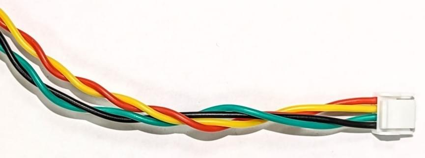

# 배선 개요

케이블은 플라이웨이, "화장실 볼링" 및 일반적으로 열악한 비행을 비롯한 문제를 일으킬 수 있는 [전자기 간섭(EMI)](https://en.wikipedia.org/wiki/Electromagnetic_interference)의 일반적인 원인입니다. 이러한 문제는 UAV에서 적절한 케이블을 사용하여 피할 수 있습니다.

드론 케이블링을 설계할 때 다음 기본 개념을 염두에 두어야 합니다.
* High-Power 케이블과 신호 케이블은 최대한 분리합니다.
* 케이블 길이는 유선 구성 요소를 쉽게 처리할 수 있도록 최대한 짧게 합니다. 와이어 장력은 충돌 착륙 시에도 가능한 기체 변형을 견딜 수 있어야 합니다. 와이어가 가장 먼저 끊어지면 안 됩니다.
* 초과 길이를 줄이기 위한 케이블 루프는 피해야 합니다. 더 짧은 길이를 사용하십시오!
* 디지털 신호의 경우 전송 속도를 줄여 방사 에너지를 줄이고, 데이터 전송의 견고성을 높일 수 있습니다. 이는 높은 데이터 전송률이 필요하지 않으면, 더 긴 케이블을 사용할 수 있음을 의미합니다.

## 신호 배선

신호 전송 프로토콜들은 특성이 각기 다르므로 목적에 따라 사용되는 케이블의 사양이 달라집니다.

이 항목에서는 드론 하드웨어 공급업체들의 [색상 코딩](#cable-colour-coding)과 함께 신호 프로토콜별로 케이블 연결에 대한 구체적인 지침을 제공합니다.

### I²C 케이블

[I2C 버스](https://en.wikipedia.org/wiki/I%C2%B2C)는 센서 연결에 널리 사용됩니다. 여러 공급업체의 케이블 색상이 다음 표에 지정되어 있습니다.

| 신호  | Pixhawk 색상                                          | ThunderFly 색상                                         | CUAV 색상 (I2C/CAN)                                     |
| --- | --------------------------------------------------- | ----------------------------------------------------- | ----------------------------------------------------- |
| +5V |  빨강     |  빨강       |  빨강       |
| SCL |  검정 |  노랑 |  흰색   |
| SDA |  검정 |  녹색   |  노랑 |
| GND |  검정 |  검정   |  검정   |

[Dronecode 표준](https://github.com/pixhawk/Pixhawk-Standards/blob/master/DS-009%20Pixhawk%20Connector%20Standard.pdf)은 자동 조종 장치의 SDA 및 SCL 신호에 1.5k 옴 풀업 저항을 가정합니다.

#### 케이블 꼬기

I2C 버스 신호 혼선 및 전자기 호환성은 케이블 와이어를 적절하게 비틀면 크게 향상될 수 있습니다. [트위스트 페어](https://en.wikipedia.org/wiki/Twisted_pair)는 센서 배선에 특히 중요합니다.

- 30cm 케이블 길이당 각 쌍 SCL/+5V 및 SDA/GND에 대해 10회 회전합니다.
- 케이블 길이 30cm당 두 쌍을 함께 4회 감습니다.

적절한 트위스트 페어 케이블을 사용할 때 I²C 버스는 일반적으로 서브미터 규모 기체에 적합합니다. 대형 항공기의 경우 CAN 또는 기타 차동 신호 기반 인터페이스를 사용하는 것이 일반적으로 더 안정적입니다.

:::note
이 권수/케이블 길이 권장 사항은 [ThunderFly TFSLOT 속도 센서](../../en/sensor/airspeed_tfslot.md) 및 [TFRPM01 회전 카운터](../../en/sensor/thunderfly_tachometer.md)를 포함한 I2C 센서에 성공적으로 사용되었습니다.
:::

#### 풀업 저항

풀업 저항은 I2C 버스의 모든 끝 부분에 필요합니다. 이것은 [신호 종료](https://en.wikipedia.org/wiki/Electrical_termination)와 버스 유휴 신호 생성기의 역할을 모두 합니다.

풀업 저항의 정확한 값을 확인하기 위해 오실로스코프 측정이 필요한 경우가 있습니다. I2C 버스의 신호는 명확하고 예리한 직사각형과 같은 가장자리와 몇 볼트의 진폭을 가져야 합니다. 신호의 진폭이 낮은 경우 풀업 저항 값이 너무 낮으므로 줄여야 합니다. 반올림된 신호의 경우 풀업 저항 값이 너무 높습니다.

### UAVCAN 케이블

| 신호    | Pixhawk                                             | ThunderFly                                            | Zubax                                                 | CUAV (I2C/CAN)                                        |
| ----- | --------------------------------------------------- | ----------------------------------------------------- | ----------------------------------------------------- | ----------------------------------------------------- |
| +5V   |  빨강     |  빨강       |  빨강       |  빨강       |
| CAN_H |  검정 |  흰색   |  흰색   |  흰색   |
| CAN_L |  검정 |  노랑 |  노랑 |  노랑 |
| GND   |  검정 |  검정   |  검정   |  검정   |

#### 케이블 꼬기

I2C 케이블과 같은 이유로 CAN 케이블도 꼬는 것이 좋습니다. CAN의 경우 권장되는 비틀림은 다음과 같습니다.

- 30cm 케이블 길이당 각 쌍 GND/+5V 및 CAN_L/CAN_H에 대해 10회 회전합니다.

- 케이블 길이 30cm당 두 쌍을 함께 4회 감습니다.

### SPI

[SPI](https://en.wikipedia.org/wiki/Serial_Peripheral_Interface)는 더 빠른 센서와 장치를 연결하는 데 사용되는 동기식 직렬 통신 인터페이스입니다. 이 프로토콜은 일반적으로 [광류](../../en/sensor/optical_flow.md) 센서 또는 특수 텔레메트리 모뎀을 연결에 사용됩니다.

| 신호   | Pixhawk 색상                                          | ThunderFly 색상                                         |
| ---- | --------------------------------------------------- | ----------------------------------------------------- |
| +5V  |  빨강     |  빨강       |
| SCK  |  검정 |  노랑 |
| MISO |  검정 |  청색     |
| MOSI |  검정 |  녹색   |
| CS!  |  검정 |  흰색   |
| CS2  |  검정 |  청색     |
| GND  |  검정 |  검정   |

### UART

UART는 주변 장치를 자동 조종 장치에 연결하는 데 사용됩니다. By default, UART does not support networking and therefore it directly connects two devices together. It is often used to connect an autopilot and a [radio modem](../telemetry/README.md).

CTS and RTS are signals that are used to indicate that data is being transmitted on TX/RX pins. This hand-shake mechanism increases reliability of data transfer. CTS and RTS may remain loose when it is not used by the device.

The connecting cable is not crossed. Therefore, it is necessary to connect only the autopilot and peripherals with this straight cable. The device must cross the wiring internally by swapping RX/TX and RTS/CTS pins.

| Signal | Pixhawk Color                                          | ThunderFly color                                          |
| ------ | ------------------------------------------------------ | --------------------------------------------------------- |
| +5V    |  Red       |  Red          |
| TX     |  Black |  White    |
| RX     |  Black |  Green    |
| CTS    |  Black |  Blue       |
| RTS    |  Black |  Yellow |
| GND    |  Black |  Black    |

UART signals are common sources of low frequency EMI, therefore the length of the cable should be minimized as much as possible. Cable twisting is not needed for UART cables.

### GPS(UART) & SAFETY

[GPS receivers and magnetometers](en/gps_compass/README.md) are generally very sensitive to EMI. Therefore thse should be mounted far away from RF sources (high-power cabling, ESCs, radio modems and its antenna). This may be insufficient if the cabling is badly designed.

| Signal          | Pixhawk Color                                          | ThunderFly color                                          |
| --------------- | ------------------------------------------------------ | --------------------------------------------------------- |
| +5V             |  Red       |  Red          |
| TX              |  Black |  White    |
| RX              |  Black |  Green    |
| SCL             |  Black |  Yellow |
| SDA             |  Black |  Green    |
| SAFETY_SW       |  Black |  White    |
| SAFETY_SW_LED |  Black |  Blue       |
| +3v3            |  Black |  Red          |
| BUZZER          |  Black |  Blue       |
| GND             |  Black |  Black    |

### GPS

| Signal | Pixhawk Color                                          | ThunderFly color                                          |
| ------ | ------------------------------------------------------ | --------------------------------------------------------- |
| +5V    |  Red       |  Red          |
| TX     |  Black |  White    |
| RX     |  Black |  Green    |
| SCL    |  Black |  Yellow |
| SDA    |  Black |  Green    |
| GND    |  Black |  Black    |

The GPS cable connects to both the UART and I2C bus. As twisting of UART is not applicable the length of the cable should be minimized as much as possible.

### Analog signal (power module)

| Signal  | Pixhawk Color                                          | ThunderFly color                                          | CUAV color                                                |
| ------- | ------------------------------------------------------ | --------------------------------------------------------- | --------------------------------------------------------- |
| VCC     |  Red       |  Red          |  Red          |
| VCC     |  Black |  Red          |  Red          |
| CURRENT |  Black |  White    |  White    |
| VOLTAGE |  Black |  Yellow |  Yellow |
| GND     |  Black |  Black    |  Black    |
| GND     |  Black |  Black    |  Black    |

This connector is example of mix of relatively high-power and low voltage signaling. Unfortunately, twisting is applicable for high-power GND and VCC wires only. That does not help much for noisy reading of analog signals by autopilot.

### SAFETY

| Signal          | Pixhawk Color                                          | ThunderFly color                                       |
| --------------- | ------------------------------------------------------ | ------------------------------------------------------ |
| SAFE_VCC        |  Red       |  Red       |
| SAFETY_SW_LED |  Black |  Blue    |
| SAFETY_SW       |  Black |  White |
| BUZZER          |  Black |  Blue    |
| +5V             |  Black |  Red       |
| GND             |  Black |  Black |

## High-power wiring

For high power wiring the most important design criteria is having an appropriate wire thickness, in order to allow sufficient current to flow. The general cross section requirement is area of 1 mm² per 8A of wire current.

While rarely practical, it is beneficial to have positive and negative wires twisted together.

EMI from high power cabling has a significant effect on magnetometers. For this reason a large seapration between high-power cables and navigation magnetometers is always required.

### Cable colour coding

Most manufacturers use red for the high voltage line and black for ground. Other colouring is at the manufacturer discretion. The [Pixhawk connector standard](https://github.com/pixhawk/Pixhawk-Standards/blob/master/DS-009%20Pixhawk%20Connector%20Standard.pdf) requires only that the Voltage Common Collector (VCC) pin/cable be red.

Color coding signal wires can help identify particular cables, making it easier to assemble your drone.

A colour coding scheme designed for easy cable identification might follow the following rules:
- The red and black colors are reserved for power.
- The same signal type should have the same colour.
- Color of the signal does not repeat in the connector for wires adjacent to each other.
- Wiring harnesses of the same pin count have to have a unique color sequence. This determines the cable type. (This is especially useful on photographs used in a manual).

An example of a cable colouring designed to these rules is:

| Color                                              | Name   | Preferred usage                             |
| -------------------------------------------------- | ------ | ------------------------------------------- |
|        | Red    | Power voltage                               |
|    | Green  | General purpose signal                      |
|    | White  | General purpose signal                      |
|  | Yellow | General purpose signal                      |
|      | Blue   | Power return, Open-collector control signal |
|    | Black  | GND, Power return ground                    |

<!-- references for the image source.
This approach just allows more compact markdown --> :::note The above rules were provided by Thunderfly and are used in their cable design.

The cable colour-coding for Thunderfly and some other vendors are given in the sections below. The pin labels correspond to the pinout on the autopilot side. All cables are straight (1:1). If they require crossover (e.g. UART), this should be solved by internal connection of the devices. :::
