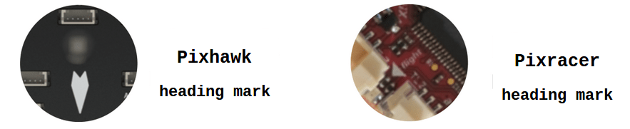
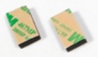

# 비행 컨트롤러(FC) 설치

## 방향

비행 컨트롤러에는 아래의 그림과 같이 전방을 나타내는 화살표가 있습니다. 컨트롤러는 기체의 위쪽을 향하도록, 화살표가 전방을 향하도록 설치되어야 합니다. 고정익, 다중로터, 수직이착륙기, 지상 운송체에 상관없이 모든 비행체에 동일하게 적용됩니다.

:::note
컨트롤러가 물리적인 제약으로 인하여 추천하는 기본적인 위치에 장착할 수 없으면, 자율비행 S/W에서 실제 장착된 방향을 설정하여 합니다. [비행 제어기 방향](../config/flight_controller_orientation.md)
:::

## 진동 방지

비행 컨트롤러에 장착된 가속 센서나 자이로 회전 센서는 진동에 매우 민감합니다. 일부의 보드는 진동 방지 창치가 내장되어 있을 수 있으나, *스폰지 등* 을 사용하여 제어기의 진동을 방지할 수 있습니다.

 진동 방지 스폰지

컨트롤러 문서에서 추천하는 방법으로 장착하는 것이 제일 좋습니다.

:::tip
[비행 리뷰 로그 분석 > 진동](../log/flight_review.md#vibration) 은 적절한 진동 범위를 분석하는 방법에 대하여 설명합니다. [진동 방지](../assembly/vibration_isolation.md) 문제가 되는 진동을 해결하는 방법을 제시합니다.
:::