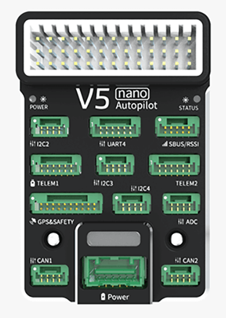
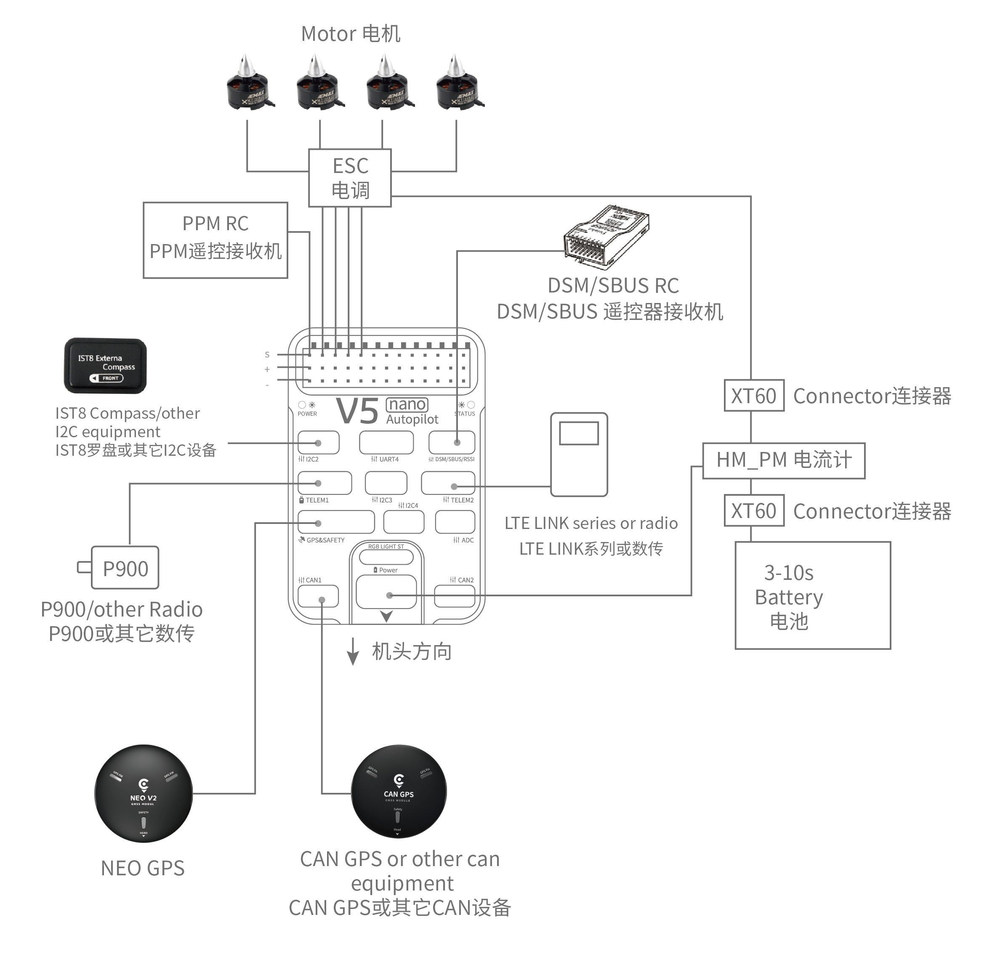
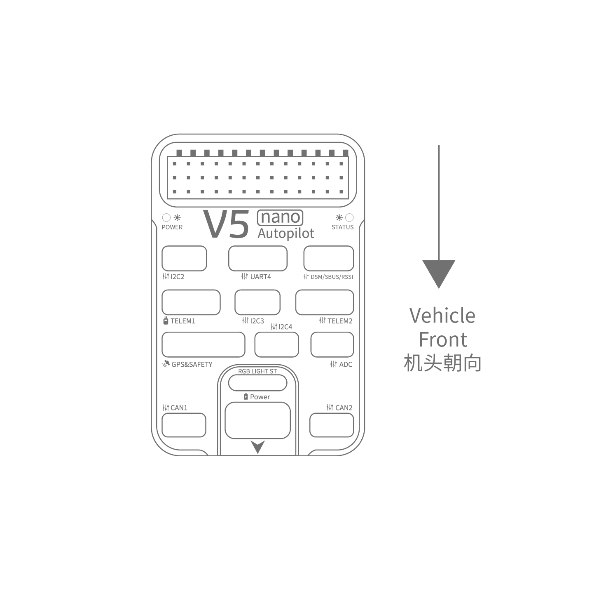
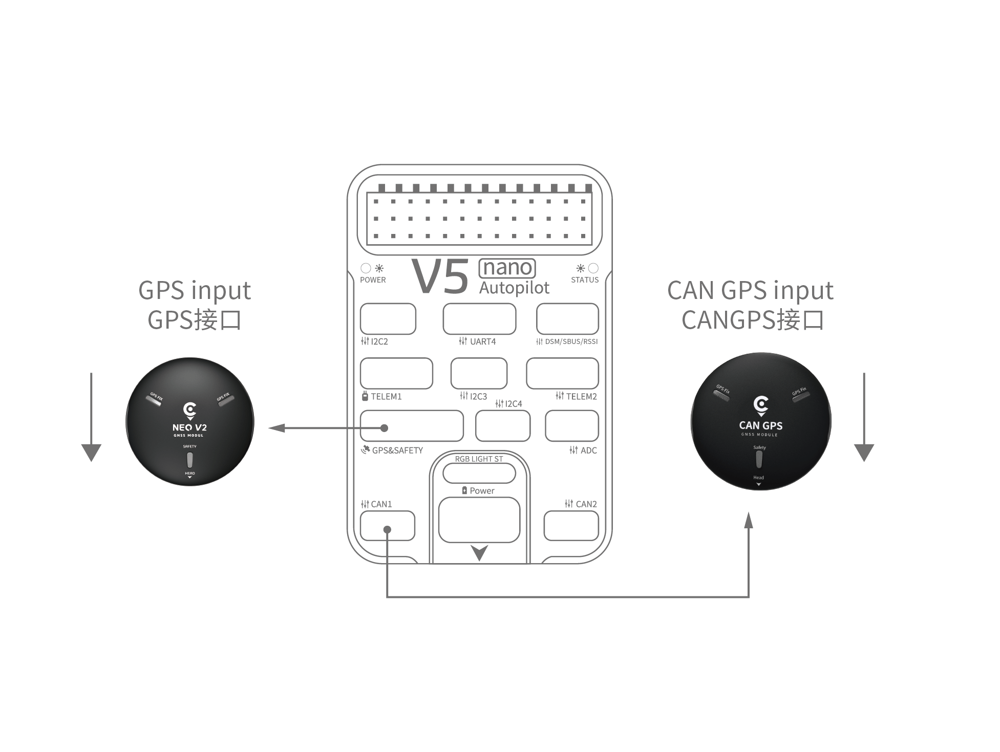
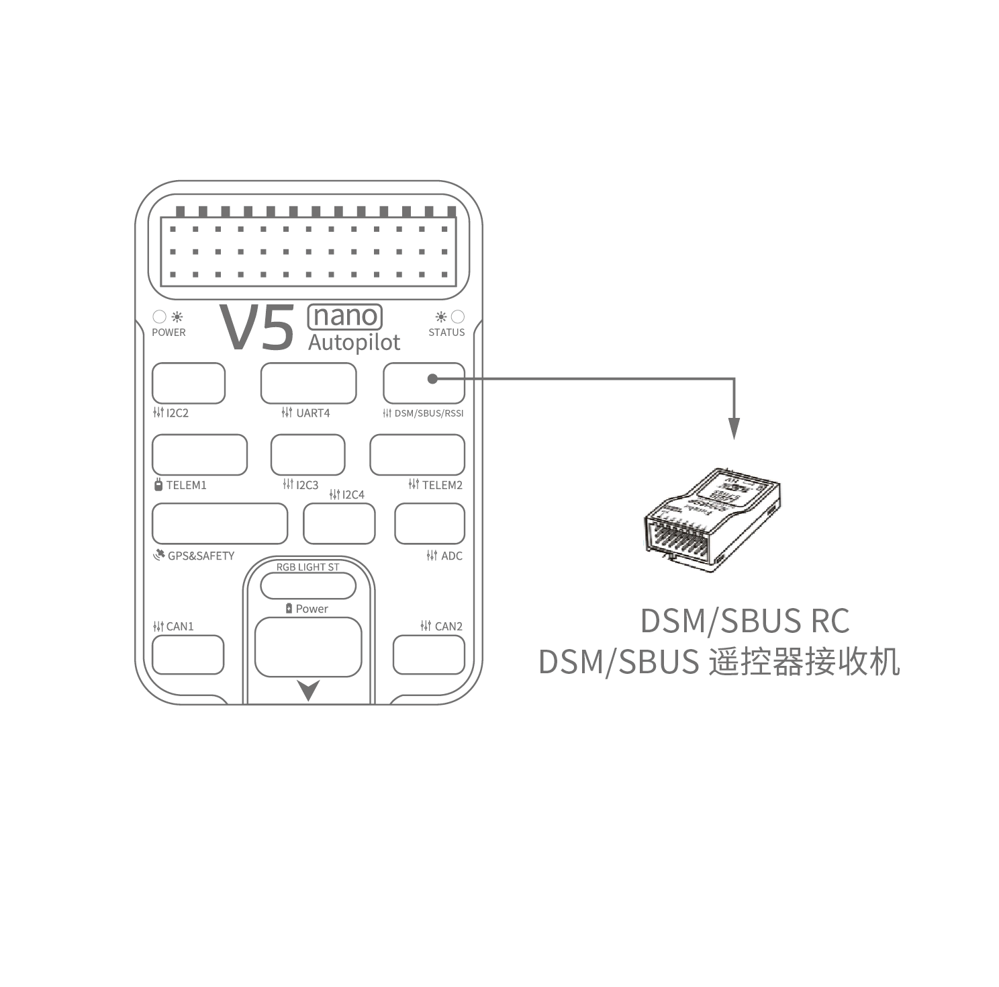
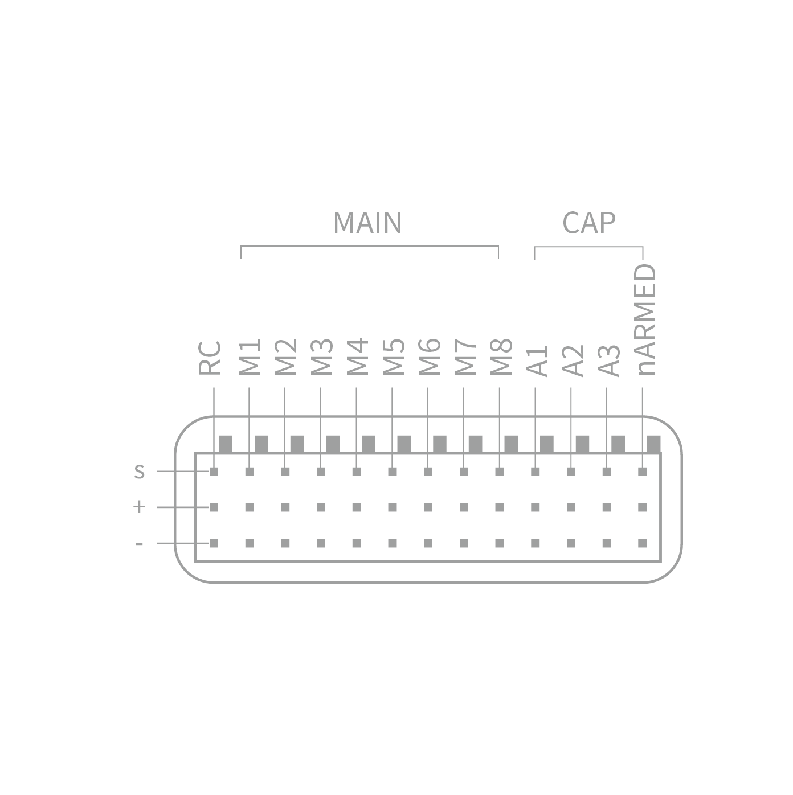
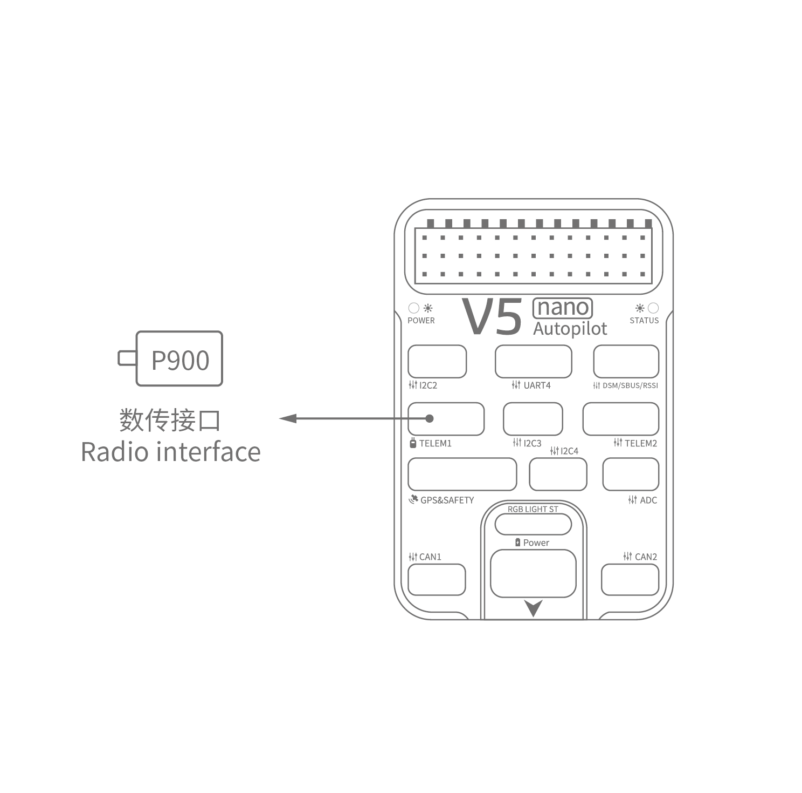
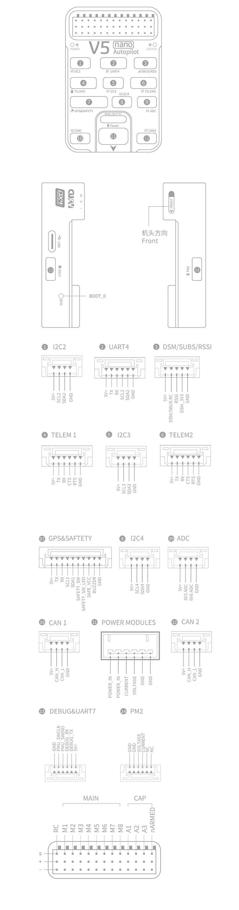

# CUAV V5 nano 배선 빠른 시작

:::warning PX4에서는 이 자동 항법 장치를 제조하지 않습니다. 하드웨어 지원이나 호환 문제는 [제조사](https://store.cuav.net/)에 문의하십시오.
:::

이 설명서는 [ CUAV V5 nano](../flight_controller/cuav_v5_nano.md) 비행 콘트롤러의 전원 공급 방법과 주요 주변 장치 연결 방법을 설명합니다.

## 배선 개요

아래의 이미지는 주요 센서와 주변 장치(모터 및 서보 출력 제외)들의 연결 방법을 설명합니다. 다음 섹션에서 각 장치에 대하여 자세히 설명합니다.

| 인터페이스           | 기능                                                                                                                  |
|:--------------- |:------------------------------------------------------------------------------------------------------------------- |
| 전원              | 전원 모듈을 연결하십시오. 전력 및 ANALOG 전압 및 전류 측정을 제공합니다.                                                                       |
| PM2             | [PX4와 함께 사용하지 마십시오.](../flight_controller/cuav_v5_nano.md#compatibility_pm2)                                        |
| TF CARD         | 로그 저장용 SD 카드 (카드와 함께 제공)                                                                                            |
| M1~M8           | PWM 출력 모터와 서보를 콘트롤 합니다.                                                                                             |
| A1~A3           | 캡처 핀 (PX4에서 *현재* 지원되지 않음).                                                                                          |
| nARMED          | FMU 시동 상태를 나타냅니다. 액티브 로우 (시동시 낮음)입니다.                                                                               |
| DSU7            | FMU 디버그에 사용되며 디버그 정보를 획득합니다.                                                                                        |
| I2C2/I2C3/I2C4  | 외부 나침반과 같은 I2C 장치를 연결합니다.                                                                                           |
| CAN1/CAN2       | CAN GPS와 같은 UAVCAN 장치를 연결합니다.                                                                                       |
| TYPE-C\(USB\) | 펌웨어 업로드 등의 작업시에 비행 콘트롤러와 컴퓨터를 연결합니다.                                                                                |
| GPS & SAFETY    | GPS, 안전 스위치 및 부저가 포함된 Neo GPS에 연결합니다.                                                                               |
| TELEM1/TELEM2   | 텔레메트리에 연결합니다.                                                                                                       |
| DSM/SBUS/RSSI   | DSM, SBUS, RSSI 신호 입력 인터페이스, DSM 인터페이스는 DSM 위성 수신기에 연결 가능, SBUS 인터페이스는 SBUS 원격 제어 수신기에 연결 가능, 신호 강도 반환 모듈용 RSSI 포함. |

:::note
자세한 인터페이스는 [V5 nano 매뉴얼](http://manual.cuav.net/V5-nano.pdf)을 참고하십시오.
:::

:::note
콘트롤러를 권장 기본 방향으로 장착 할 수 없는 경우(예 : 공간 제약으로 인해) 실 장착 방향을 자동항법장치 프로그램에서 설정하여야합니다. [비행 콘트롤러 방향](../advanced_features/rtk-gps.md)
:::

## GPS + 나침반 + 안전 스위치 + LED

권장 GPS 모듈은 GPS, 나침반, 안전 스위치, 부저 및 LED가 포함된 *Neo v2 GPS*입니다.

:::note
다른 GPS 모듈은 작동하지 않을 수 있습니다 ([호환성 문제](../flight_controller/cuav_v5_nano.md#compatibility_gps) 참조).
:::

The GPS/Compass module should be [mounted on the frame](../assembly/mount_gps_compass.md) as far away from other electronics as possible, with the direction marker towards the front of the vehicle (Neo GPS arrow is in the same direction as the flight control arrow). 케이블을 사용하여 비행 제어 GPS에 연결합니다.

:::note
CAN GPS를 사용하는 경우 케이블을 사용하여 비행 제어 CAN 인터페이스에 연결하십시오.
:::

## 안전 스위치

V5+에 제공되는 전용 안전 스위치는 권장 *Neo v2 GPS* (안전 스위치 내장)를 사용하지 않는 경우에만 사용합니다.

GPS 없이 비행시에는 차량 시동 스위치를 `GPS1` 포트에 직접 연결하여야합니다 (이전 6 핀 GPS를 사용하는 경우에는,  라인 변경에 관련된 하단 인터페이스 매뉴얼을 참고하십시오).

## 부저

권장 *Neo v2 GPS*를 사용하지 않으면, 부저가 작동하지 않을 수 있습니다.

## 무선 조종

차량을 수동 제어에는 무선 조종기가 필요합니다. PX4의 자율 비행은 무선조종기가 필수 사항은 아닙니다. 기체와 조종자가 통신하기 위하여 송신기와 수신기를 바인딩하여야 합니다. 송신기와 수신기의 매뉴얼을 참고하십시오.

아래 그림은 원격 수신기에 액세스하는 방법을 보여줍니다 (키트에서 S.BUS 케이블을 찾으십시오)

## Spektrum Satellite 수신기

V5 nano에는 전용 DSM 케이블이 있습니다. Spektrum 위성 수신기는 비행 컨트롤러 DSM/SBUS/RSSI 인터페이스에 연결하여야합니다.

## 전원

V5 nano키트에는 2~14S LiPo 배터리를 지원하는 *HV\ _PM* 모듈이 포함되어 있습니다. *HW\_PM* 모듈의 6 핀 커넥터를 비행 제어 `Power1` 인터페이스에 연결합니다.

:::warning
제공된 전원 모듈은 퓨즈가 없습니다. 주변 장치를 연결하는 동안 전원을 **반드시** 꺼야 합니다.
:::

:::note
전원 모듈은 PWM 출력에 연결된 주변 장치에 전원 자체를 공급하지 않습니다.
서보/액추에이터를 연결하는 경우에는 BEC를 사용하여 별도로 전원을 공급하여야 합니다. 
:::

## 텔레메트리(선택 사항)

지상국에서는 텔레메트리를 사용하여 기체를 통신, 모니터링, 제어 합니다. 기체를 특정 위치로 움직이도록 지시하거나, 새로운 임무를 업로드할 수 있습니다.

통신 채널은 텔레메트리를 통하여 이루어집니다. 차량 기반 라디오는 **TELEM1** 또는 **TELEM2** 포트에 연결합니다. 이 포트에 연결되어있는 경우에는 추가 설정이 필요하지 않습니다. 다른 라디오는 지상국 컴퓨터 또는 모바일 장치에 USB를 통하여 연결합니다.

## SD 카드(선택 사항)

An [SD card](../getting_started/px4_basic_concepts.md#sd-cards-removable-memory) is inserted in the factory (you do not need to do anything).

## 모터

모터/서보는 [기체 규격](../airframes/airframe_reference.md)에 지정된 순서대로 MAIN 및 AUX 포트에 연결됩니다.

## 핀배열

## 추가 정보

- [DJI FlameWheel450 CUAV v5 nano 기체 조립 방법](../frames_multicopter/dji_f450_cuav_5nano.md)
- [CUAV V5 nano](../flight_controller/cuav_v5_nano.md)
- [CUAV V nano 수동](http://manual.cuav.net/V5-nano.pdf) (CUAV)
- [FMUv5 기준 설계 핀배열](https://docs.google.com/spreadsheets/d/1-n0__BYDedQrc_2NHqBenG1DNepAgnHpSGglke-QQwY/edit#gid=912976165) (CUAV)
- [CUAV Github](https://github.com/cuav) (CUAV)
