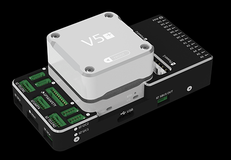
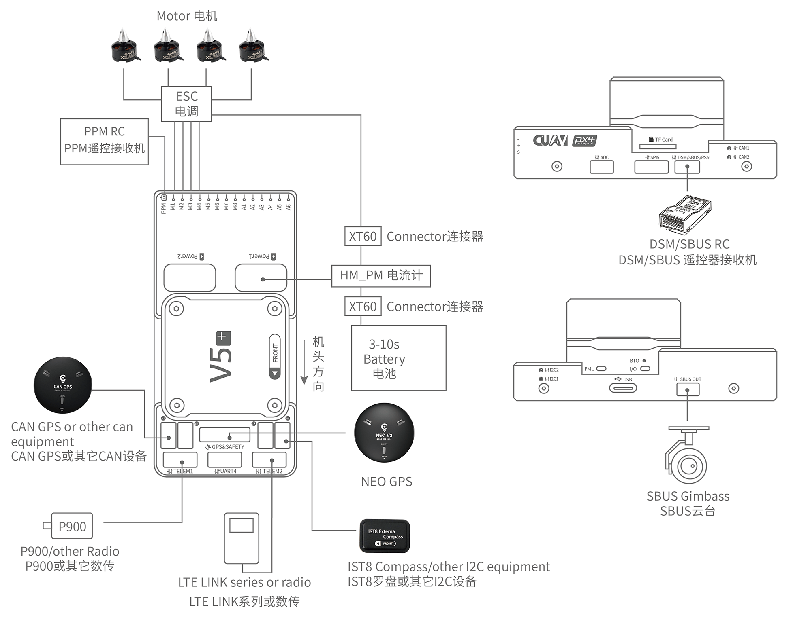
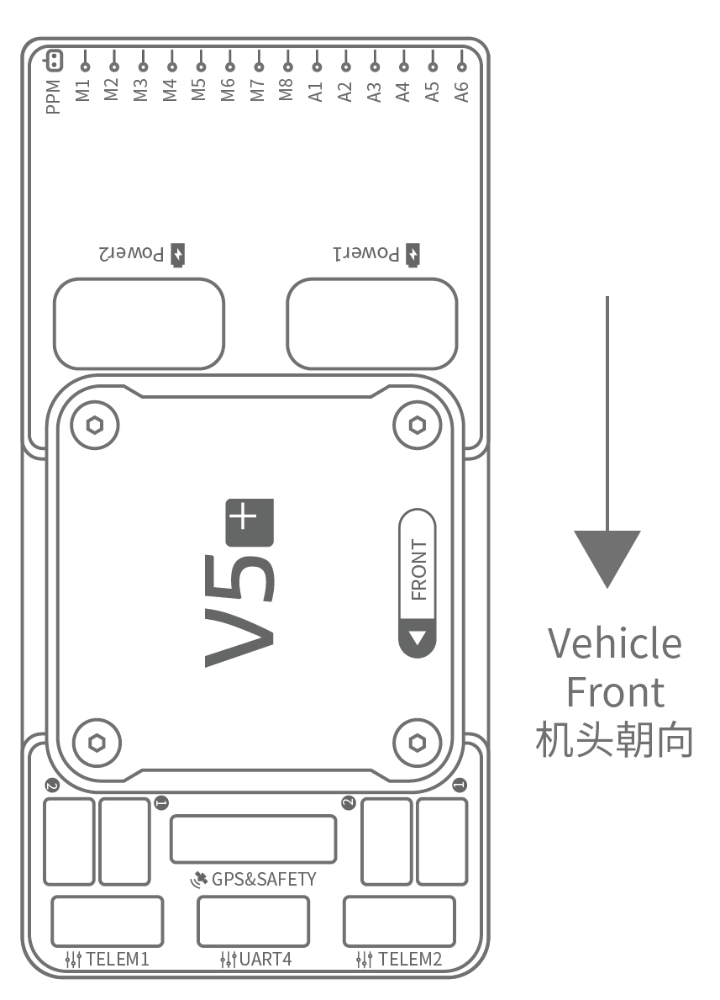
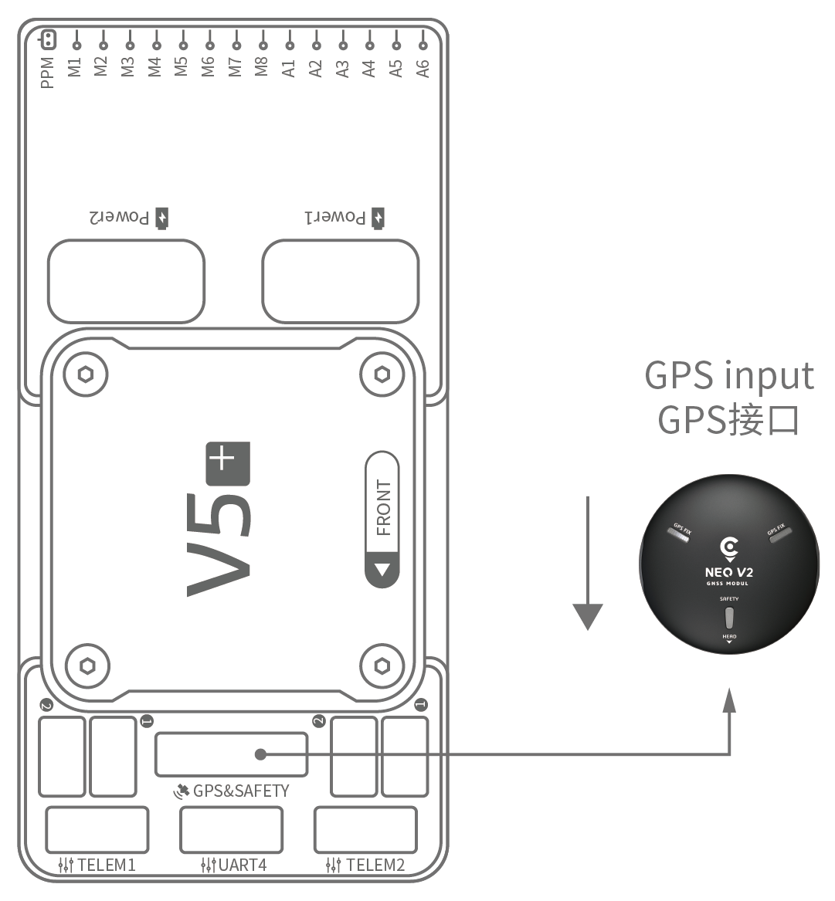
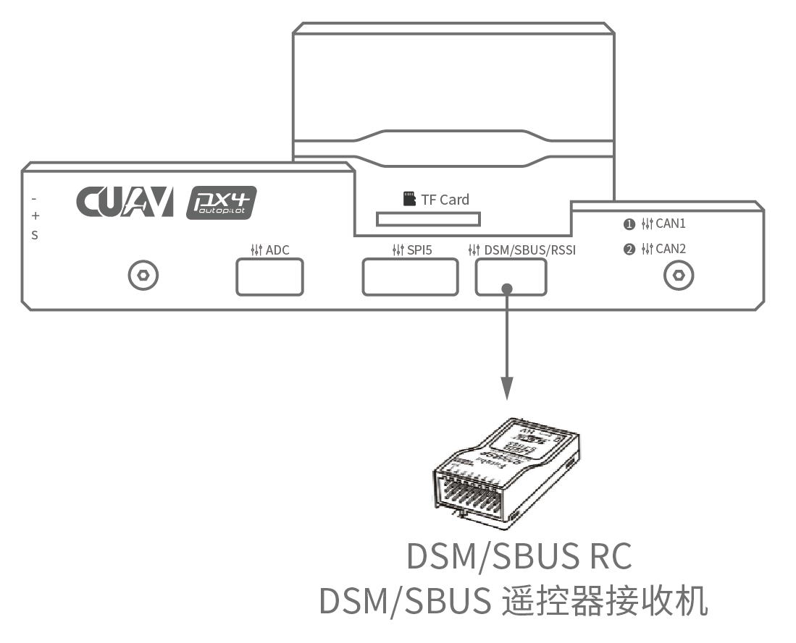
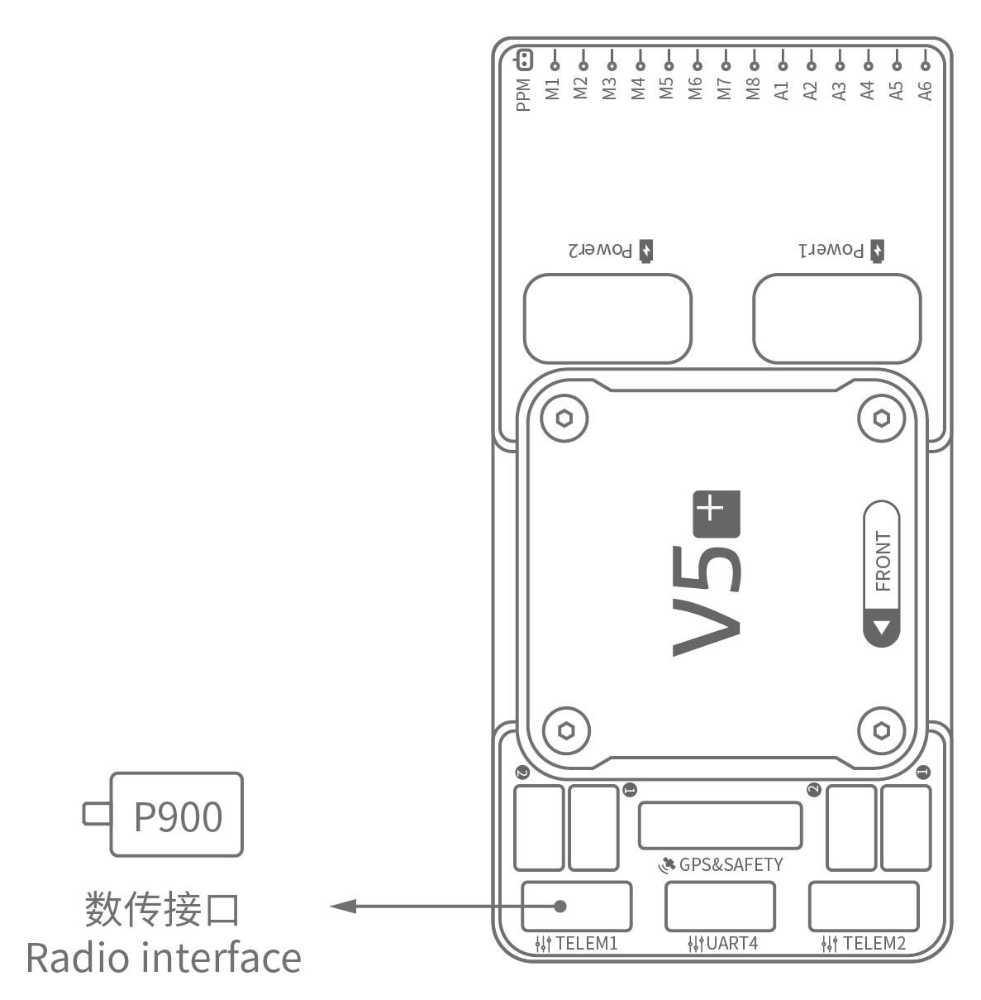
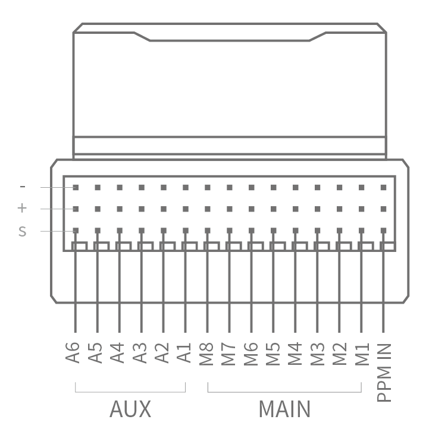

# CUAV V5+ 배선 개요

:::warning PX4에서는 이런 종류의 자동 항법 장치를 제조하지는 않습니다. 하드웨어 지원 또는 호환 문제는 [제조사](https://store.cuav.net/)와 상담하십시오.
:::

이 설명서는 [ CUAV V5+ ](../flight_controller/cuav_v5_plus.md) 비행 컨트롤러에 전원을 공급하고 가장 중요한 주변 장치를 연결하는 방법을 설명합니다.

## 배선 개요

아래의 이미지는 가장 중요한 센서 및 주변 장치 (모터 및 서보 출력 제외)를 연결하는 방법을 나타냅니다. 다음 섹션에서 각각의 장치에 대해 자세히 설명합니다.

| 주요 인터페이스        | 기능                                                                                                                  |
|:--------------- |:------------------------------------------------------------------------------------------------------------------- |
| Power1          | 전원 연결 * 아날로그 * 전압 및 전류 감지 기능이있는 전원 입력. 이 커넥터에 Digital PM을 사용하지 마십시오!                                                |
| Power2          | i2c 스마트 배터리를 연결합니다.                                                                                                 |
| TF CARD         | 로그 저장용 SD 카드 (카드는 공장에서 미리 삽입됨).                                                                                     |
| M1~M8           | PWM 출력 모터와 서보 콘트롤합니다.                                                                                               |
| A1~A6           | PWM 출력 모터와 서보 콘트롤합니다.                                                                                               |
| DSU7            | FMU 디버그에 사용되며 디버그 정보를 읽습니다.                                                                                         |
| I2C1/I2C2       | 외부 나침반과 같은 I2C 장치를 연결합니다.                                                                                           |
| CAN1/CAN2       | CAN GPS와 같은 UAVCAN 장치를 연결합니다.                                                                                       |
| TYPE-C\(USB\) | 펌웨어로드와 같은 비행 컨트롤러와 컴퓨터간의 통신을 위해 컴퓨터에 연결합니다.                                                                         |
| SBUS OUT        | SBUS 장치(예 : 카메라 짐벌)를 연결합니다.                                                                                         |
| GPS & SAFETY    | GPS, 안전 스위치, 부저 인터페이스가 포함된 Neo GPS에 연결합니다.                                                                          |
| TELEM1/TELEM2   | 원격 측정 시스템에 연결합니다.                                                                                                   |
| DSM/SBUS/RSSI   | DSM, SBUS, RSSI 신호 입력 인터페이스, DSM 인터페이스는 DSM 위성 수신기에 연결 가능, SBUS 인터페이스는 SBUS 원격 제어 수신기에 연결 가능, 신호 강도 반환 모듈용 RSSI 포함. |

:::note
자세한 인터페이스 정보는 [V5 + 매뉴얼](http://manual.cuav.net/V5-Plus.pdf)을 참조하십시오.
:::

:::note
컨트롤러를 권장/기본 방향으로 장착 할 수없는 경우 (예 : 공간 제약으로 인해) 실제로 사용한 방향으로 자동 조종 소프트웨어를 구성해야합니다 : [ Flight Controller Orientation ](../advanced_features/rtk-gps.md).
:::

## GPS + 나침반 + 안전 스위치 + LED

권장되는 GPS 모듈은 GPS, 나침반, 안전 스위치, 부저, LED 상태 표시등이 포함된 * Neo v2 GPS *입니다.

:::note
다른 GPS 모듈은 작동하지 않을 수 있습니다 ([이 호환성 문제 ](../flight_controller/cuav_v5_nano.md#compatibility_gps) 참조).
:::

GPS/나침반 모듈은 차량 앞쪽을 향하는 방향 표시를 사용하여 가능한 한 다른 전자 장치에서 멀리 떨어진 프레임에 장착해야합니다 (* Neo v2 GPS * 화살표는 비행과 같은 방향에 있음. 컨트롤 화살표). 케이블을 사용하여 비행 제어 GPS 인터페이스에 연결합니다.

:::note
[NEO V2 PRO GNSS (CAN GPS)](http://doc.cuav.net/gps/neo-v2-pro/en/#enable)를 사용하는 경우 케이블을 사용하여 비행 제어 CAN 인터페이스에 연결하십시오.
:::

## 안전 스위치

V5+에 제공되는 전용 안전 스위치는 권장되는 *Neo V2 GPS* (내장 안전 스위치가 있음)를 사용하지 않는 경우에만 필요합니다.

GPS없이 비행하는 경우 차량을 무장하고 비행 할 수 있도록 스위치를 `GPS1` 포트에 직접 연결해야합니다 (이전 6 핀 GPS를 사용하는 경우 정의를 읽으십시오. 라인을 변경하는 하단 인터페이스의).

## 부저

권장 GPS를 사용하지 않는 경우에는 부저가 작동하지 않을 수 있습니다.

## 무선 조종

차량을 수동으로 제어하려면 원격 제어(RC) 무선 시스템이 필요합니다 (PX4는 자율 비행 모드용 무선조종기가 필수 사항은 아닙니다.). 기체와 조종자가 서로 통신하기 위해 호환되는 송신기/수신기를 선택하고, 송신기와 수신기를 바인드해야 합니다 (송신기와 수신기에 포함된 지시사항을 읽으십시오).

아래 그림은 원격 수신기에 액세스하는 방법을 보여줍니다 (키트에서 SBUS 케이블을 찾으십시오).

## Spektrum Satellite 수신기

V5+에는 전용 DSM 케이블이 있습니다. Spektrum 위성 수신기를 사용하는 경우 비행 컨트롤러 DSM/SBUS/RSSI 인터페이스에 연결해야합니다.

## 전원

V5+ 키트에는 2~14S LiPo 배터리를 지원하는 *HV\ _PM* 모듈이 포함되어 있습니다. *HW\_PM* 모듈의 6 핀 커넥터를 비행 제어 `Power1` 인터페이스에 연결합니다.

:::warning
제공된 전원 모듈은 퓨즈가 없습니다. 주변 장치를 연결하는 동안 전원을 **반드시** 꺼야 합니다.
:::

:::note
전원 모듈은 PWM 출력에 연결된 주변 장치의 전원이 아닙니다. 서보/액추에이터를 연결하는 경우에는 BEC를 사용하여 별도로 전원을 공급해야합니다.
:::

## 텔레메트리 시스템 (선택 사항)

텔레메트리 시스템은 지상국과 비행 중인 기체와 통신, 모니터링, 제어할 수 있도록 합니다 (예: 기체를 특정 위치로 움직이도록 지시하거나, 새로운 미션을 업로드할 수 있습니다).

통신 채널은 Telemetry Radios를 통해 이루어집니다. 차량 기반 라디오는 `TELEM1` 또는 `TELEM2` 포트에 연결해야합니다 (이 포트에 연결되어있는 경우 추가 구성이 필요하지 않음). 다른 라디오는 지상국 컴퓨터 또는 모바일 장치 (일반적으로 USB를 통해)에 연결됩니다.

## SD 카드 (선택 사항)

[SD 카드](../getting_started/px4_basic_concepts.md#sd_cards)가 제조 공장에서 삽입되어 있습니다 (아무 것도 할 필요가 없습니다).

## 모터

모터/서보는 [ Airframes Reference ](../airframes/airframe_reference.md)에서 차량에 지정된 순서대로 MAIN 및 AUX 포트에 연결됩니다.

## 핀아웃

[여기](http://manual.cuav.net/V5-Plus.pdf)에서 **V5 +** 핀아웃을 다운로드하세요.

## 추가 정보

- [DJI FlameWheel450에서 CUAV v5 +를 사용하는 기체 빌드 로그](../frames_multicopter/dji_f450_cuav_5plus.md)
- [CUAV V5 + 수동](http://manual.cuav.net/V5-Plus.pdf) (CUAV)
- [CUAV V5 + 문서](http://doc.cuav.net/flight-controller/v5-autopilot/en/v5+.html) (CUAV)
- [FMUv5 참조 설계 핀아웃](https://docs.google.com/spreadsheets/d/1-n0__BYDedQrc_2NHqBenG1DNepAgnHpSGglke-QQwY/edit#gid=912976165) (CUAV)
- [CUAV Github](https://github.com/cuav) (CUAV)
- [베이스 보드 설계 참조](https://github.com/cuav/hardware/tree/master/V5_Autopilot/V5%2B/V5%2BBASE) (CUAV)