# 큐브 배선 개요

:::warning PX4에서는 이 자동 항법 장치를 제조하지 않습니다. 하드웨어 지원이나 호환 문제는 [제조사](https://cubepilot.org/#/home)에 문의하십시오.

[Cube Black](../flight_controller/pixhawk-2.md)은 [PX4](../flight_controller/autopilot_pixhawk_standard.md)에서 지원하지만, [Cube Yellow](../flight_controller/cubepilot_cube_yellow.md) 및 [Cube Orange ](../flight_controller/cubepilot_cube_orange.md)에 대한 지원은  [테스트](../flight_controller/autopilot_experimental.md) 단계입니다.
:::

*Cube*&reg; 비행 콘트롤러의 전원 공급 방법과 주요 주변 장치 연결방법에 대하여 설명합니다.

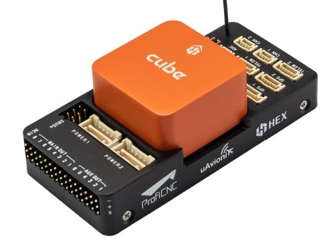 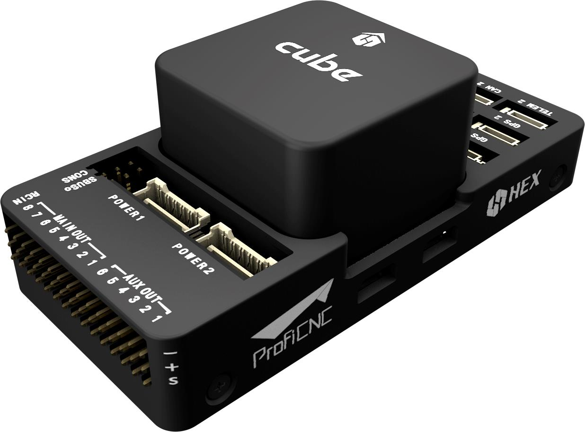 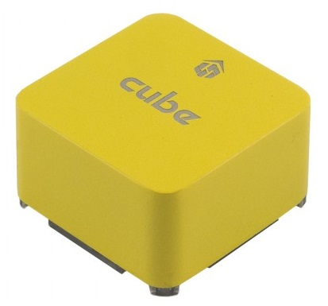

:::tip
이 설명서는 [큐브 블랙](../flight_controller/pixhawk-2.md), [큐브 옐로우](../flight_controller/cubepilot_cube_yellow.md) 및 [큐브 오렌지](../flight_controller/cubepilot_cube_orange.md)를 포함한 모든 큐브 변형에 대하여 적용됩니다. 추가 업데이트 정보는 [Cube 사용 설명서](https://docs.cubepilot.org/user-guides/autopilot/the-cube-user-manual) (Cube 문서)를 참고하십시오.
:::

## 액세서리

큐브는 [구매 시](../flight_controller/pixhawk-2.md#stores)필요한 부속품의 전체 또는 대부분이 함께 제공됩니다.

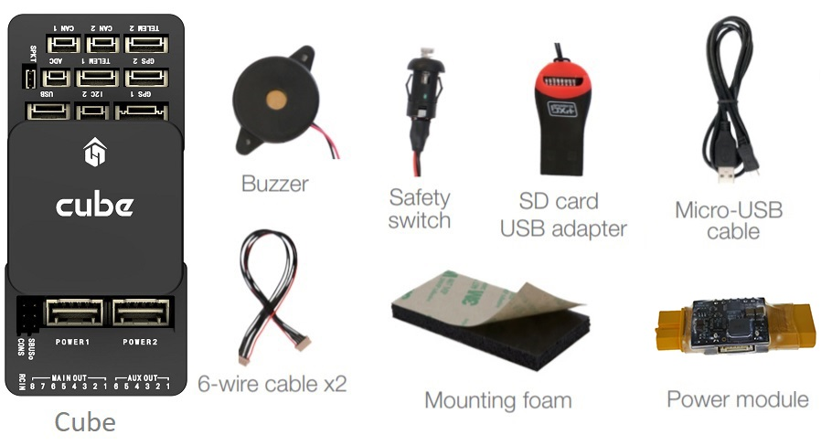

예외적으로 GPS 별도 구매가 필요한 키트가 있을 수 있습니다 ([아래를 참고하십시오](#gps)).

## 배선 개요

아래 그림은 주요 센서와 주변기기 연결 방법을 설명합니다. 다음 섹션에서 각 장치에 대해 자세히 설명합니다.

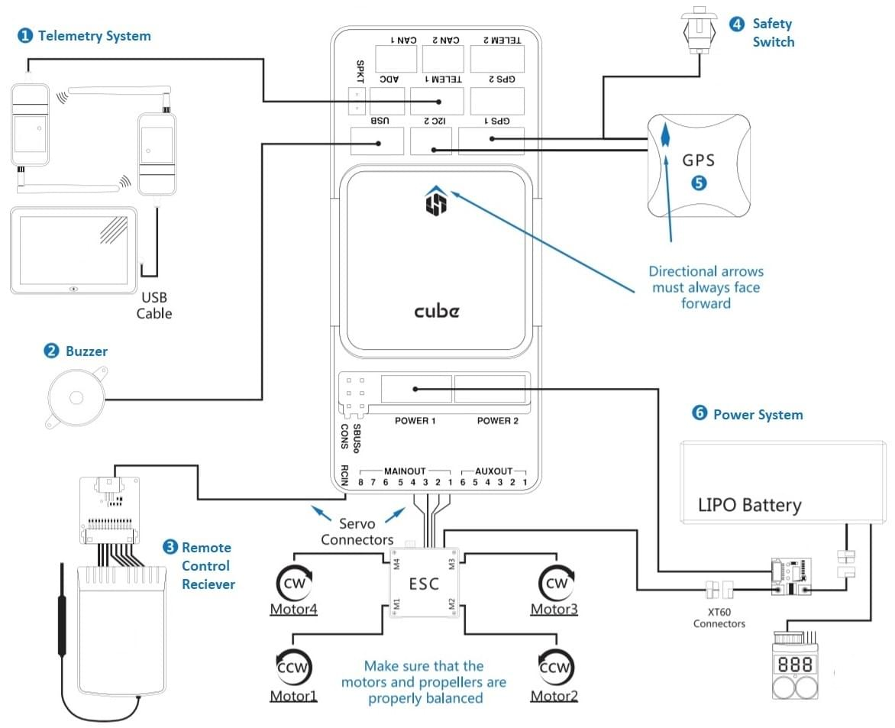

1. [텔레메트리 시스템](#telemetry) — 실시간으로 기체를 제어/모니터링하고, 미션을 계획/실행합니다. 일반적으로 텔레메트리 라디오, 태블릿/PC와 지상국 프로그램이 해당합니다.
2. [버저](#buzzer) — 기체의 동작을 나타내는 오디오 신호를 제공합니다.
3. [원격 제어 수신기](#rc_control) — 조종사가 기체를 수동으로 조작하는 휴대용 송신기에 연결합니다 (그림은 PWM->PPM 변환기를 장착한 PWM 수신기입니다).
4. (전용) [안전 스위치](#safety-switch) — 버튼을 눌러 모터를 잠금거나 해제합니다. 내장 안전 스위치가 포함된 권장 [GPS](#gps)를 사용하지 않는 경우에만 필요합니다.
5. [GPS, 나침반, LED, 안전 스위치](#gps) — 권장 GPS 모듈은 GPS, 나침반, LED, 그리고 안전 스위치로 구성됩니다.
6. [전원 시스템](#power) — Cube 및 모터 ESC에 전원을 공급합니다. LiPo 배터리,전원 모듈, 그리고 추가 배터리 경고 시스템 (배터리 전원이 설정된 전압보다 낮을 때 경고음)으로 구성됩니다.

:::note
`GPS2`로 표시된 포트는 PX4에서 `TEL4 `에 매핑됩니다 (즉, `GPS2`로 표시된 포트에 연결하는 경우,  ` TEL4 `에 연결된 [직렬 포트 구성 매개 변수](../peripherals/serial_configuration.md)를 설정하여야합니다).
:::

:::tip
사용 가능한 포트에 대한 자세한 내용은 [Cube>Ports](../flight_controller/pixhawk-2.md#ports)을 참고하십시오.
:::

## 콘트롤러 장착 및 장착 방향

Cube를 가능한 (이상적으로는) 윗면이 위로 향하도록 하여 기체의 무게 중심에 가까운 위치에, 그리고 화살표를 기체의 앞면을 가르키도록 장착하십시오 (큐브 윗면에 그려진 *화살표 마크*를 참고하십시오).

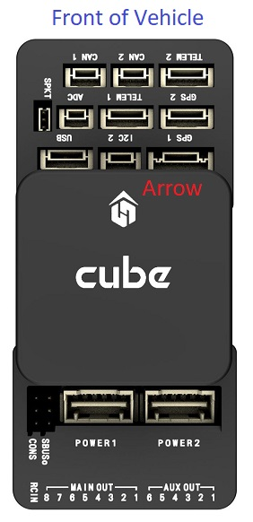

:::note
콘트롤러를 권장 기본 방향으로 장착 할 수 없는 경우(예 : 공간 제약으로 인해) 실제 장착 방향을 자동항법장치 프로그램에서 설정하여야합니다. [비행 콘트롤러 방향](../config/flight_controller_orientation.md)
:::

Cube를 (키트에 포함된) 진동 감쇠 폼 패드 또는 장착 나사를 사용해 장착할 수 있습니다. Cube 액세서리에 포함된 장착 1.8mm 두께의 프레임보드 전용으로 설계되었습니다. 커스텀 나사는 나사산 길이가 6mm~7.55mm인 M2.5 나사여야 합니다.

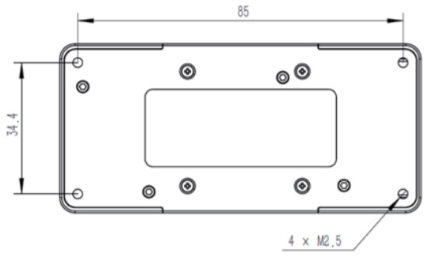

## GPS + 나침반 + 안전 스위치 + LED

권장되는 GPS 모듈은 *Here* 및 [Here+](../gps_compass/rtk_gps_hex_hereplus.md)이며, 둘 다 GPS 모듈, 나침반, 안전 스위치 및 [LED](../getting_started/led_meanings.md)를 통합합니다. 모듈 간의 차이점은 *Here+*가 [RTK](../advanced_features/rtk-gps.md)를 통하여 센티미터 수준의 위치 지정을 지원하는 점입니다. RTK 지원을 제외하면, 두 모듈의 연결 방법은 같습니다.

:::warning
[Here+](../gps_compass/rtk_gps_hex_hereplus.md)는 나침반과 [LED](../getting_started/led_meanings.md)를 통합한 [Here3](https://www.cubepilot.org/#/here/here3) [UAVCAN](../uavcan/README.md) RTK-GNSS로 대체되었습니다 (그러나, 안전 스위치는 없습니다). 연결 방법에 대한 문서는 [UAVCAN](../uavcan/README.md)을 참고하십시오.
:::

GPS/나침반은 차량 전방 표식를 사용하여 가능하면 전자 장치들에서 멀리 떨어진 프레임에 장착하는 것이 좋습니다. 나침반은 다른 전자 장치와 떨어지면 간섭이 줄어듦니다. 제공된 8핀 케이블을 사용하여 `GPS1` 포트에 연결합니다..

아래의 다이어그램은 모듈 연결의 개요를 나타냅니다.

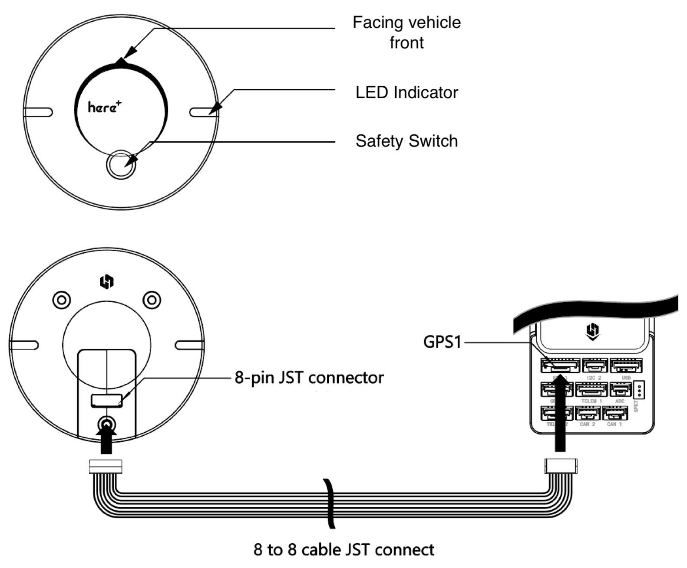

:::note GPS
모듈의 통합 안전 스위치는 *기본적으로* 활성화되어 있습니다. 활성화되면 PX4는 차량 시동을 걸 수 없습니다. 비활성화하려면 안전 스위치를 1초간 길게 누르십시오. 안전 스위치를 다시 눌러 안전 장치를 활성화하고 기체 시동을 끌 수 있습니다. 조종기나 지상국 프로그램에서 기체 시동을 끌 수 없는 상황에서 유용합니다.
:::

:::tip
구형 6핀 GPS 모듈을 사용하려면, GPS와 [안전 스위치](#safety-switch)를 모두 연결하는 데 사용할 수 있는 케이블이 키트에 함께 제공됩니다.
:::

## 안전 스위치

Cube와 함께 구성된 *전용* 안전 스위치는 (내장 안전 스위치를 포함한) 권장 [GPS](#gps)를 사용하지 않을 경우에만 사용합니다.

GPS 없이 비행하는 경우, 기체에 시동을 걸고 비행하기 위해 안전 스위치는 반드시 `GPS1` 포트(또는 구형 6핀 케이블 사용시 제공된 케이블을 통해)에 장착되어어야 합니다.

## 버저

부저는 차량 상태(시동 문제 디버깅에 도움이 되고 차량의 안전한 작동에 영향을 미칠 수 있는 상태를 알리는 신호음 포함)에 대한 가청 알림을 제공하는 [음 및 조정](../getting_started/tunes.md)을 재생합니다.

버저는 아래와 같이 USB포트에 연결합니다. 추가 설정은 필요하지 않습니다.

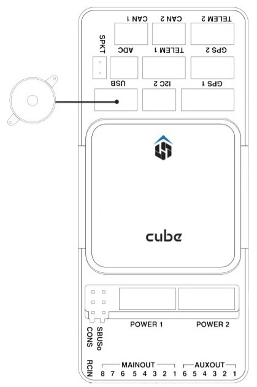

## 라디오 콘트롤

무선 조종기는 기체 *수동*제어시에 사용합니다 (PX4에는 자율 비행 모드에서는 무선 조종기가 필수는 아닙니다).

[호환되는 송신기/수신기를 선택](../getting_started/rc_transmitter_receiver.md)후 *바인딩*을 하여야 통신이 가능합니다. 송신기/수신기의 매뉴얼을 참고하십시오.

아래의 지침은 다양한 유형의 수신기를 연결하는 방법을 설명합니다.

### PPM-SUM / Futaba S.Bus 수신기

제공된 3선식 서보 케이블을 사용하여 접지(-), 전원(+) 및 신호(S) 선을 RC 핀에 연결합니다.

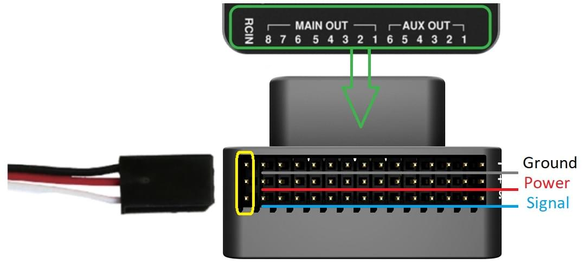

### Spektrum 위성 수신기

Spektrum DSM, DSM2 및 DSM-X Satellite RC 수신기는 **SPKT/DSM** 포트에 연결합니다.

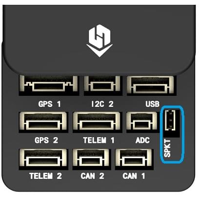

### PWM 수신기

Cube는 *각 채널에 개별 배선*이 있는 PPM 또는 PWM 수신기에 직접 연결할 수 없습니다. 그러므로, PWM 수신기는 hex.aero 또는 proficnc.com에서 판매하는 PPM 인코더 모듈을 *사용하여* **RCIN** 포트에 연결하여야 합니다.

## 전원

Cube는 일반적으로 **POWER1** 포트에 연결된 전원 모듈(키트와 함께 제공됨)을 통하여 리튬 이온 폴리머(LiPo) 배터리에서 전원을 공급합니다. 전원 모듈은 보드에 안정적인 공급 및 전압/전류 표시하며, 멀티콥터에서 모터를 구동하는 ESC에 전원을 *별도*로 공급할 수 있습니다.

멀티콥터의 일반적인 전원 설정은 다음과 같습니다.

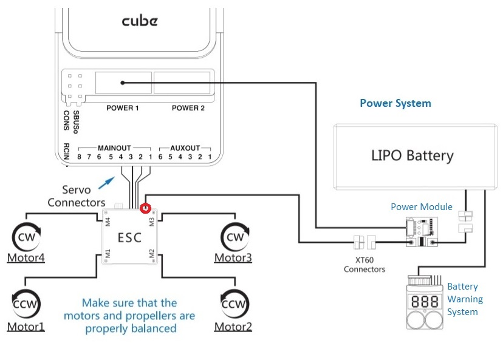

:::Note ** MAIN / AUX **의 핀 전원 (+) 레일은 비행 콘트롤러에 대한 전원 모듈 공급으로 전원이 공급되지 않습니다. 방향타, 엘레본 등의 서보를 구동하려면 별도로 전원을 공급하여야 합니다.

이것은 BEC가 장착된 ESC, 독립형 5V BEC 또는 2S LiPo 배터리에 전원 레일을 연결하여 수행할 수 있습니다. 사용하는 서보의 전압을 확인하십시오!
:::

## 텔레메트리 시스템 (선택 사항)

지상국에서는 텔레메트리를 사용하여 기체를 통신, 모니터링, 제어 합니다. 기체를 특정 위치로 움직이도록 지시하거나, 새로운 임무를 업로드할 수 있습니다.

통신 채널은 [무선 텔레메트리](../telemetry/README.md)를 사용합니다. 차량 기반 라디오는 **TELEM1** 포트에 연결하여야 합니다(이 포트에 연결된 경우 추가 설정이 필요하지 않음). 다른 텔레메트리는 일반적으로 지상국 컴퓨터나 모바일 장치에 USB를 통하여 연결합니다.

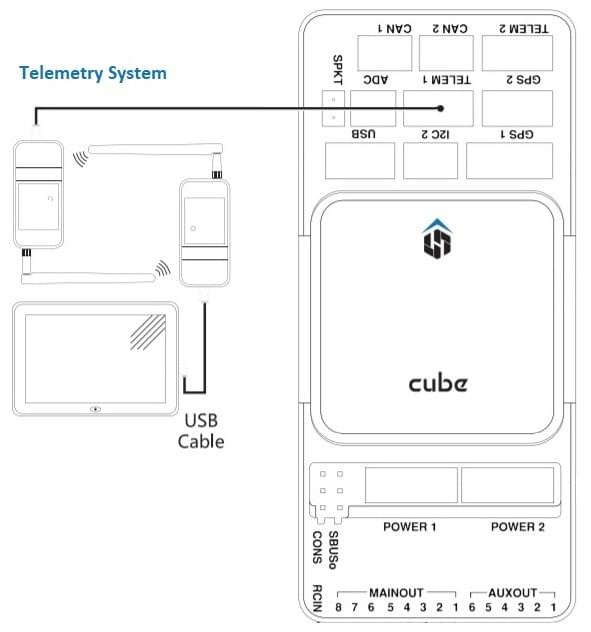

## SD 카드 (선택 사항)

SD 카드는 [비행 세부 정보를 기록 및 분석](../getting_started/flight_reporting.md)하고, 임무를 수행하고, UAVCAN 버스 하드웨어를 사용하는 데 필요하므로 사용하는 것이 좋습니다. Micro-SD 카드를 그림과 같이 Cube에 삽입합니다(아직 없는 경우).

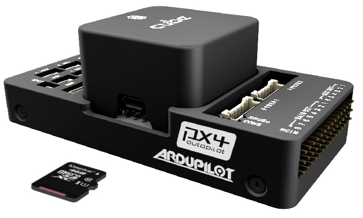

:::tip
For more information see [Basic Concepts > SD Cards (Removable Memory)](../getting_started/px4_basic_concepts.md#sd-cards-removable-memory).
:::

## 모터

모터/서보는 [기체 정의서](../airframes/airframe_reference.md)에서 차량에 지정된 순서대로 **MAIN**와 **AUX** 포트에 연결합니다.

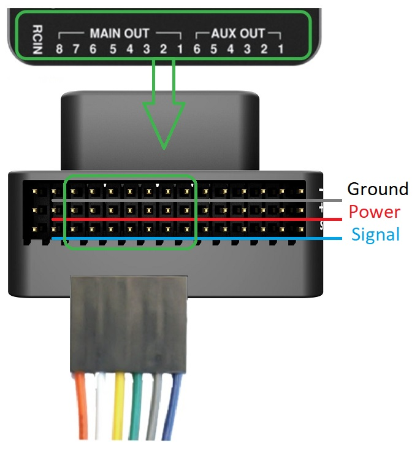

:::note
이 참고사항은 모든 지원되는 기체 프레임의 출력 포트의 모터/서보 연결 리스트입니다 (만약 프레임이 참고사항에 기재되어 있지 않다면, 올바른 유형의 "일반" 프레임을 사용하십시오). 
:::

:::caution
매핑이 프레임별로 일정하지지 않습니다 (예 : 모든 평면 프레임에 대해 동일한 출력의 스로틀에 의존할 수 없음). 해당 기체의 프레임의  정확한 모터 연결 여부를 확인하십시오.
:::

## 기타 주변 장치

자주 사용하지 않는 부품들의 배선과 조립 방법은 개별 [주변 장치](../peripherals/README.md)를 참고하십시오.

:::note
주변 장치를 `GPS2`로 표시된 포트에 연결하는 경우 하드웨어의 PX4 [직렬 포트 구성 매개 변수](../peripherals/serial_configuration.md)를 `TEL4` (GPS2 아님)에 할당합니다.
:::

## 설정

[QGroundContro](http://qgroundcontrol.com/)를 사용하여 설정합니다.

*QGroundControl*을 다운로드, 설치 및 실행한 후 그림과 같이 보드를 컴퓨터에 연결합니다.

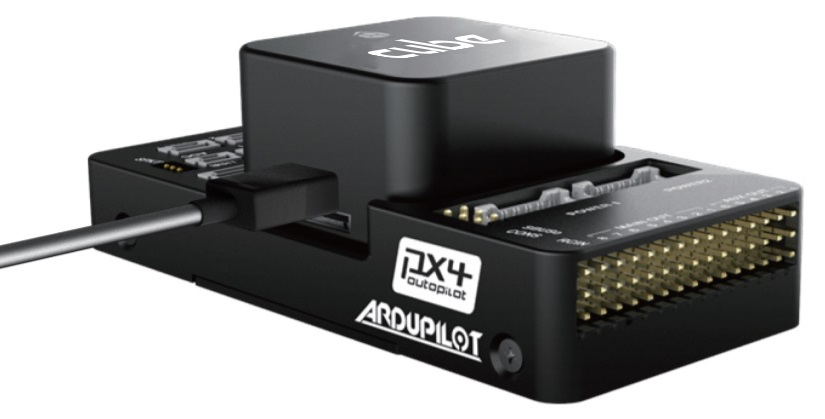

더 자세한 설정 정보는 [자동비행장치 설정](../config/README.md)을 참고하십시오.

QuadPlane에 대한 자세한 설정 방법은 [QuadPlane VTOL 설정](../config_vtol/vtol_quad_configuration.md)을 참고하십시오.

<!-- what about config of other vtol types and plane. Do the instructions in these ones above apply for tailsitters etc? --> 

### 부트로더 업데이트

PX4 펌웨어를 플래시한 후 [Program PX4IO(../getting_started/tunes.md#program-px4io) 경고음이 발생하면, 부트로더를 업데이트해야 할 수 있습니다.

안전 스위치를 사용하여 강제로 부트로더를 업데이트할 수 있습니다. 이 기능을 사용하려면 Cube의 전원을 차단하려면, 안전 스위치를 누른 상태에서 USB를 통해 Cube에 전원을 공급하십시오.

## 추가 정보

- [Cube Black](../flight_controller/pixhawk-2.md)
- [Cube Yellow](../flight_controller/cubepilot_cube_yellow.md)
- [Cube Orange](../flight_controller/cubepilot_cube_orange.md)
- Cube 문서 (제조사) :
  - [큐브 모듈 개요](https://docs.cubepilot.org/user-guides/autopilot/the-cube-module-overview)
  - [큐브 사용 설명서](https://docs.cubepilot.org/user-guides/autopilot/the-cube-user-manual)
  - [미니 캐리어 보드](https://docs.cubepilot.org/user-guides/carrier-boards/mini-carrier-board)
