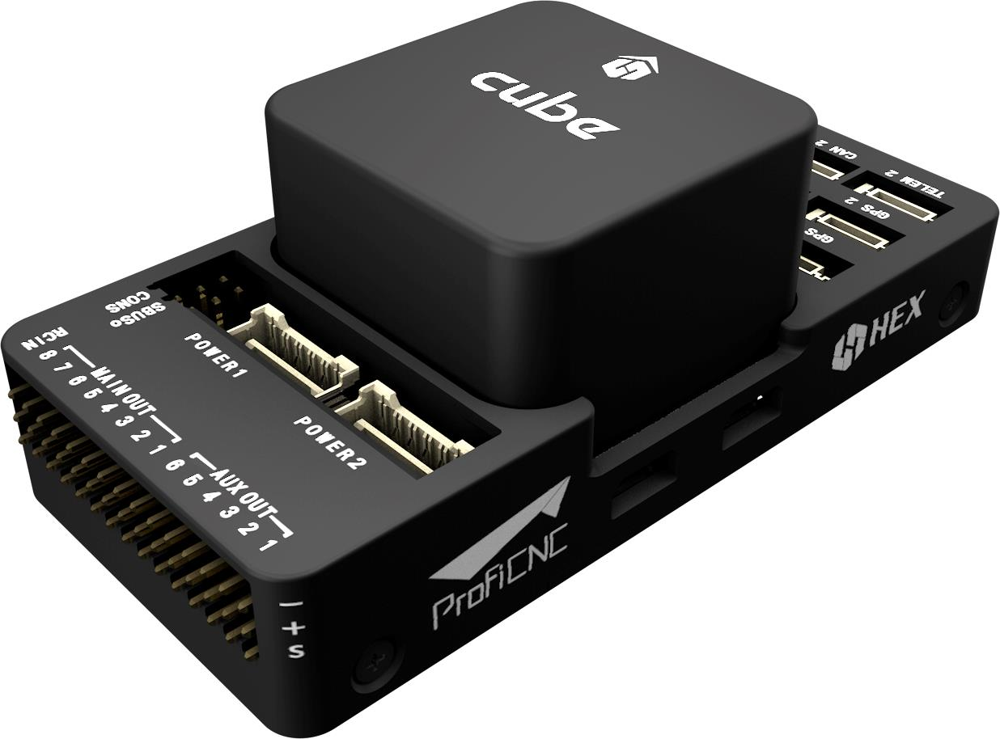

# 큐브 배선 퀵 스타트

이 퀵 스타트 가이드는 [ 큐브 ](../flight_controller/pixhawk-2.md)&reg; 비행 컨트롤러에 전원을 공급하고 가장 중요한 주변 장치를 연결하는 방법을 설명합니다.

## 액세서리

큐브는 [구매 시](../flight_controller/pixhawk-2.md#stores)필요한 부속품의 대부분 (또는 전체)이 함께 제공됩니다.

예외적으로 GPS를 따로 구매해야 하는 GPS를 포함하지 않는 키트가 있습니다 ([아래를 참고하십시오](#gps)).

## 배선 개요

아래 그림은 중요한 센서와 주변기기를 연결하는 방법에 대해 설명합니다. 다음 섹션에서 각각의 장치에 대해 자세히 설명합니다.

1. [텔레메트리 시스템](#telemetry) — 실시간으로 기체를 제어/모니터링하고, 미션을 계획/실행할 수 있도록 합니다. 일반적으로, 텔레메트리 라디오, 태블릿/PC와 지상국 소프트웨어(예: QgroundControl)가 포함됩니다.
2. [버저](#buzzer) — 기체의 동작을 나타내는 오디오 신호를 제공합니다.
3. [원격 제어 수신기 시스템](#rc_control) — 조종사가 기체를 수동으로 조작하는 데 사용할 수 있는 휴대용 송신기에 연결합니다 (그림은 PWM->PPM 변환기를 장착한 PWM 수신기입니다).
4. (전용) [안전 스위치](#safety_switch) — 버튼을 눌러 모터를 잠금/잠금해제합니다. 내장 안전 스위치가 포함된 권장 [GPS](#gps)를 사용하지 않는 경우에만 필요합니다.
5. [GPS, 나침반, LED, 안전 스위치](#gps) — 권장 GPS 모듈은 GPS, 나침반, LED, 그리고 안전 스위치로 구성됩니다. 
6. [전원 시스템](#power) — Cube 및 모터 ESC에 전원을 공급합니다. LiPo 배터리,전원 모듈, 그리고 추가 배터리 경고 시스템 (배터리 전원이 설정된 전압보다 낮을 때 경고음)으로 구성됩니다. 

> **Tip** 사용 가능한 포트에 대한 자세한 내용은 여기에서 확인할 수 있습니다. [Cube > Ports ](../flight_controller/pixhawk-2.md#ports).

## 컨트롤러 장착 및 정렬

Cube를 가능한 (이상적으로는) 윗면이 위로 향하도록 하여 기체의 무게 중심에 가깝게, 그리고 화살표를 기체의 앞면을 가르키도록 장착하십시오 (큐브 윗면에 그려진 *화살표 마크*를 참고하십시오).

> **참고** 만약 컨트롤러를 권장된/기본 방향으로 장착할 수 없다면 (예: 물리적 제약), 비행 제어 소프트웨어 상 비행 제어기의 방향을 실제 [비행 제어기의 방향](../config/flight_controller_orientation.md)대로 설정해야 합니다.

Cube를 (키트에 포함된) 진동 감쇠 폼 패드 또는 장착 나사를 사용해 장착할 수 있습니다. Cube 액세서리에 포함된 장착 1.8mm 두께의 프레임보드 전용으로 설계되었습니다. 커스텀 나사는 나사산 길이가 6mm~7.55mm인 M2.5 나사여야 합니다.

## GPS + 나침반 + 안전 스위치 + LED {#gps}

권장되는 GPS모듈은 *Here*과 [Here+](../gps_compass/rtk_gps_hex_hereplus.md)입니다. 두 기기 모두 GPS 모듈, 나침반, 안전 스위치 그리고 [LEDs](../getting_started/led_meanings.md)를 통합한 모듈입니다.

> **참고** 두 모듈은 *Here+*는 [RTK](../advanced_features/rtk-gps.md)를 통한 센티미터 단위의 위치 제어를 제공하는 점이 다릅니다. RTK 지원을 제외하면, 두 모듈은 같은 방식으로 사용/연결됩니다.

모듈은 방향 마커가 기체 앞쪽으로 향하도록 가능한 프레임에서 멀리 장착해야 합니다 (다른 전자 장치와 나침반을 분리하면 간섭이 줄어듭니다). 제공된 8핀 케이블을 사용하여 `GPS1` 포트에 연결해야 합니다..

아래의 다이어그램은 모듈과 모듈 연결의 개요를 보여줍니다.

> **참고 ** GPS 모듈의 내장 안전 스위치는 *기본적으로* "활성화"됩니다.(활성화된 경우, PX4는 기체 시동을 허용하지 않습니다). 비활성화하려면 안전 스위치를 1초간 길게 누르십시오. 안전 스위치를 다시 눌러 안전 장치를 활성화하고 기체 시동을 끌 수 있습니다 (어떤 이유로든 조종기나 지상국 프로그램이 기체 시동을 끌 수 없을 때 유용합니다).

> **팁** 구형 6핀 GPS 모듈을 사용하려면, GPS와 [안전 스위치](#safety_switch)를 모두 연결하는 데 사용할 수 있는 케이블이 키트에 함께 제공됩니다.

## 안전 스위치 {#safety_switch}

Cube와 함께 구성된 *전용* 안전 스위치는 (내장 안전 스위치를 포함한) 권장 [GPS](#gps)를 사용하지 않을 경우에만 필요합니다.

GPS 없이 비행하는 경우, 기체에 시동을 걸고 비행하기 위해 안전 스위치는 반드시 `GPS1` 포트(또는 구형 6핀 케이블 사용시 제공된 케이블을 통해)에 장착되어어야 합니다.

## 버저

버저는 UAV 상태를 나타내는 오디오 신호를 보냅니다. 버저는 아래와 같이 USB포트에 연결됩니다. (추가적인 설정이 필요하지 않습니다)

## 라디오 컨트롤 {#rc_control}

[리모트 컨트롤(RC) 라디오 시스템](../getting_started/rc_transmitter_receiver.md)은 기체를 *수동으로* 제어할 때 필요합니다 (PX4에는 자율 비행 모드를 위한 라디오 시스템이 필요하지 않음).

기체와 조종자가 서로 통신하기 위해 [호환되는 송신기/수신기를 선택하고](../getting_started/rc_transmitter_receiver.md), 송신기와 수신기를 *바인드*해야 합니다 (송신기와 수신기에 포함된 지시사항을 읽으십시오).

아래 지침은 다른 종류의 수신기를 연결하는 방법을 설명합니다.

### PPM-SUM / Futaba S.BUS 수신기

제공된 3-와이어 서보 케이블로 접지(-), 전원(+) 및 신호(S) 와이어를 RC 핀에 연결합니다.

### Spektrum Satellite 수신기

Spktrum DSM, DSM2 및 DSM-X Satellite RC 수신기는 **SPKT/DSM** 포트에 연결합니다.

### PWM 수신기

Cube는 *각각의 채널이 개별적으로 배선된* PPM 또는 PWM 수신기에 바로 연결할 수 없습니다. PWM 수신기는 hex.aero 또는 proficnc.com에서 구매할 수 있는 *PPM 인코더 모듈*을 통해 **RCIN**포트에 연결해야 합니다.

## 전원 공급 {#power}

Cube는 일반적으로 **POWER1** 포트에 연결된 전원 모듈(키트와 함께 제공)을 통해 리튬 이온 폴리머(LiPo) 배터리에서 전원을 공급받습니다. 전원 모듈은 보드에 안정적인 전원 공급 및 전압/전류 표시를 제공하며 멀티콥터 기체의 모터를 구동하는 데 사용되는 ESC에 개별적으로 전원을 공급할 수 있습니다.

멀티콥터 차량의 일반적인 전원 설정은 다음과 같습니다.

<!-- HOw is the power rail powered for servos - power rail? Plane/Vtol would be cool to show here too -->

## 텔레메트리 시스템 (선택 사항) {#telemetry}

텔레메트리 시스템은 지상국과 비행 중인 기체와 통신, 모니터링, 제어할 수 있도록 합니다 (예: 기체를 특정 위치로 움직이도록 지시하거나, 새로운 미션을 업로드할 수 있습니다).

통신 채널은 [텔레메트리 라디오](../telemetry/README.md)를 경유합니다. 기체의 텔레메트리를 **TELEM1** 포트에 연결해야 합니다 (이 포트에 연결된 경우 추가 구성이 필요하지 않음). 다른 텔레메트리는 일반적으로 지상국 컴퓨터나 모바일 장치에 (USB를 통해) 연결됩니다.

## SD 카드 (선택 사항)

SD 카드는 일반적으로 [세부 비행 기록 및 분석](../getting_started/flight_reporting.md)에 사용됩니다. Micro-SD 카드를 그림과 같이 큐브에 삽입합니다.

> **팁** SanDisk Extreme U3 32GB가 [매우 권장됩니다](https://dev.px4.io/en/log/logging.html#sd-cards) (개발자 가이드).

## 모터

모터/서보는 **MAIN**과 **AUX**포트에 [기체 프레임 참고사항](../airframes/airframe_reference.md)에 기체별로 정의된 특정 순서로 연결해야 합니다.

> **참고** 이 참고사항은 모든 지원되는 기체/기기 프레임의 출력 포트의 모터/서보 연결 리스트입니다 (만약 프레임이 참고사항에 기재되어 있지 않다면, 올바른 유형의 "일반" 프레임을 사용하십시오).

> **주의** 출력 포트 연결은 모든 프레임에 대해 일관되지 않습니다 (예: 비행기 프레임에서 모터 스로틀이 동일한 출력이 아닐 수 있음). 가지고 있는 기체의 프레임에 대해 올바르게 모터를 연결했는지 다시 한 번 확인하십시오.

## 그 외 주변 장치

선택적인 주변 장치의 배선 및 구성은 개별 [주변 장치](../peripherals/README.md)에 대한 항목에서 다룹니다.

## 설정

설정은 [QgroundControl](http://qgroundcontrol.com/)을 사용해 이뤄집니다.

*QGroundControl*를 다운로드/설치/실행한 후, 아래와 같이 비행 제어기를 컴퓨터에 연결합니다.

기본/일반 구성 정보는 다음에서 다룹니다.

QuadPlane 특정 구성 여기 덮여 있다: [QuadPlane VTOL 구성](../config_vtol/vtol_quad_configuration.md)

<!-- what about config of other vtol types and plane. Do the instructions in these ones above apply for tailsitters etc? -->

## Further information

- [큐브](../flight_controller/pixhawk-2.md) <!-- - [pixhawk2 user manual copy]()  // fold out insert shipped with doc /assets/flight_controller/cube/cube_mount_front/pixhawk2 user manual copy.pdf -->
    
    <!-- - [Cube Quickstart]() (HEX) -->