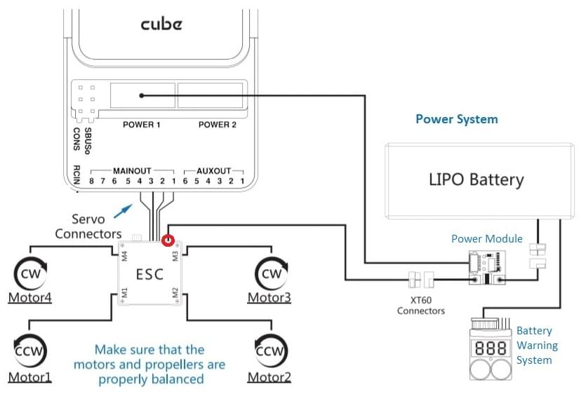

# 큐브 배선 개요

:::warning PX4에서는 이런 종류의 자동 항법 장치를 제조하지는 않습니다. 하드웨어 지원 또는 호환 문제는 [제조사](https://cubepilot.org/#/home)와 상담하십시오.

[Cube Black](../flight_controller/pixhawk-2.md)은 [PX4](../flight_controller/autopilot_pixhawk_standard.md)에서 완전히 지원되지만, [Cube Yellow](../flight_controller/cubepilot_cube_yellow.md) 및 [Cube Orange ](../flight_controller/cubepilot_cube_orange.md)에 대한 지원은 [테스트](../flight_controller/autopilot_experimental.md) 단계입니다.
:::

이 퀵 스타트 설명서는 *Cube*&reg; 비행 컨트롤러에 전원을 공급하고 가장 중요한 주변 장치를 연결하는 방법을 설명합니다.

  

:::tip
지침은 [큐브 블랙](../flight_controller/pixhawk-2.md), [큐브 옐로우](../flight_controller/cubepilot_cube_yellow.md) 및 [큐브 오렌지](../flight_controller/cubepilot_cube_orange.md)를 포함한 모든 큐브 변형에 적용됩니다. 추가 업데이트 정보는 [Cube 사용 설명서](https://docs.cubepilot.org/user-guides/autopilot/the-cube-user-manual) (Cube 문서)에서 확인할 수 있습니다.
:::

## 액세서리

큐브는 [구매 시](../flight_controller/pixhawk-2.md#stores)필요한 부속품의 대부분 (또는 전체)이 함께 제공됩니다.

예외적으로 GPS를 따로 구매해야 하는 GPS를 포함하지 않는 키트가 있습니다 ([아래를 참고하십시오](#gps)).

## 배선 개요

아래 그림은 중요한 센서와 주변기기를 연결하는 방법에 대해 설명합니다. 다음 섹션에서 각 장치에 대해 자세히 설명합니다.

1. [텔레메트리 시스템](#telemetry) — 실시간으로 기체를 제어/모니터링하고, 미션을 계획/실행할 수 있도록 합니다. 일반적으로 텔레메트리 라디오, 태블릿/PC와 지상 통제 장치 프로그램이 해당합니다.
2. [버저](#buzzer) — 기체의 동작을 나타내는 오디오 신호를 제공합니다.
3. [원격 제어 수신기 시스템](#rc_control) — 조종사가 기체를 수동으로 조작하는 데 사용할 수 있는 휴대용 송신기에 연결합니다 (그림은 PWM->PPM 변환기를 장착한 PWM 수신기입니다).
4. (전용) [안전 스위치](#safety_switch) — 버튼을 눌러 모터를 잠금/잠금해제합니다. 내장 안전 스위치가 포함된 권장 [GPS](#gps)를 사용하지 않는 경우에만 필요합니다.
5. [GPS, 나침반, LED, 안전 스위치](#gps) — 권장 GPS 모듈은 GPS, 나침반, LED, 그리고 안전 스위치로 구성됩니다. 
6. [전원 시스템](#power) — Cube 및 모터 ESC에 전원을 공급합니다. LiPo 배터리,전원 모듈, 그리고 추가 배터리 경고 시스템 (배터리 전원이 설정된 전압보다 낮을 때 경고음)으로 구성됩니다. 

:::note
`GPS2`로 표시된 포트는 PX4에서 `TEL4 `에 매핑됩니다 (즉, `GPS2`로 표시된 포트에 연결하는 경우, ` TEL4 `에 연결된 [직렬 포트 구성 매개 변수](../peripherals/serial_configuration.md)를 설정하여야합니다).
:::

:::tip
사용 가능한 포트에 대한 자세한 내용은 [Cube>Ports](../flight_controller/pixhawk-2.md#ports)에서 찾을 수 있습니다.
:::

## 콘트롤러 장착 및 장착 방향

Cube를 가능한 (이상적으로는) 윗면이 위로 향하도록 하여 기체의 무게 중심에 가깝게, 그리고 화살표를 기체의 앞면을 가르키도록 장착하십시오 (큐브 윗면에 그려진 *화살표 마크*를 참고하십시오).

:::note
컨트롤러를 권장/기본 방향으로 장착하기 어려운 경우에는 (예 : 공간 제약으로 인해) 실제 장착한 방향을 소프트웨어에 설정하여야 합니다 ( [기체 콘트롤러 방향 ](../config/flight_controller_orientation.md) 참고).
:::

Cube를 (키트에 포함된) 진동 감쇠 폼 패드 또는 장착 나사를 사용해 장착할 수 있습니다. Cube 액세서리에 포함된 장착 1.8mm 두께의 프레임보드 전용으로 설계되었습니다. 커스텀 나사는 나사산 길이가 6mm~7.55mm인 M2.5 나사여야 합니다.

## GPS + 나침반 + 안전 스위치 + LED

The recommended GPS modules are the *Here* and [Here+](../gps_compass/rtk_gps_hex_hereplus.md), both of which incorporate a GPS module, Compass, Safety Switch and [LEDs](../getting_started/led_meanings.md). The difference between the modules is that *Here+* supports centimeter level positioning via [RTK](../advanced_features/rtk-gps.md). Otherwise they are used/connected in the same way.

:::warning
The [Here+](../gps_compass/rtk_gps_hex_hereplus.md) has been superseded by the [Here3](https://www.cubepilot.org/#/here/here3) a [UAVCAN](../uavcan/README.md) RTK-GNSS that incorporate a compass and [LEDs](../getting_started/led_meanings.md) (but no safety switch). See [UAVCAN](../uavcan/README.md) for documentation on how it should be connected.
:::

모듈은 방향 마커가 기체 앞쪽으로 향하도록 가능한 프레임에서 멀리 장착해야 합니다 (다른 전자 장치와 나침반을 분리하면 간섭이 줄어듭니다). 제공된 8핀 케이블을 사용하여 `GPS1` 포트에 연결해야 합니다..

아래의 다이어그램은 모듈과 모듈 연결의 개요를 보여줍니다.

:::note GPS
모듈에 내장된 안전 스위치는 *기본적으로* 활성화되어 있습니다 (활성화되면 PX4는 차량 시동을 걸 수 없습니다). 비활성화하려면 안전 스위치를 1초간 길게 누르십시오. 안전 스위치를 다시 눌러 안전 장치를 활성화하고 기체 시동을 끌 수 있습니다 (어떤 이유로든 조종기나 지상국 프로그램이 기체 시동을 끌 수 없을 때 유용합니다).
:::

:::tip
구형 6핀 GPS 모듈을 사용하려면, GPS와 [안전 스위치](#safety_switch)를 모두 연결하는 데 사용할 수 있는 케이블이 키트에 함께 제공됩니다.
:::

## 안전 스위치

Cube와 함께 구성된 *전용* 안전 스위치는 (내장 안전 스위치를 포함한) 권장 [GPS](#gps)를 사용하지 않을 경우에만 필요합니다.

GPS 없이 비행하는 경우, 기체에 시동을 걸고 비행하기 위해 안전 스위치는 반드시 `GPS1` 포트(또는 구형 6핀 케이블 사용시 제공된 케이블을 통해)에 장착되어어야 합니다.

## 버저

The buzzer plays [tones and tunes](../getting_started/tunes.md) that provide audible notification of vehicle status (including tones that are helpful for debugging startup issues, and that notify of conditions that might affect safe operation of the vehicle).

The buzzer should be connected to the USB port as shown (no further configuration is required).

## 무선 조종

A [remote control (RC) radio system](../getting_started/rc_transmitter_receiver.md) is required if you want to *manually* control your vehicle (PX4 does not require a radio system for autonomous flight modes).

You will need to [select a compatible transmitter/receiver](../getting_started/rc_transmitter_receiver.md) and then *bind* them so that they communicate (read the instructions that come with your specific transmitter/receiver).

The instructions below show how to connect the different types of receivers.

### PPM-SUM / Futaba S.Bus 수신기

Connect the ground(-),power(+),and signal(S) wires to the RC pins using the provided 3-wire servo cable.

### Spektrum 위성 수신기

Spektrum DSM, DSM2, and DSM-X Satellite RC receivers connect to the **SPKT/DSM** port.

### PWM 수신기

The Cube cannot directly connect to PPM or PWM receivers that have an *individual wire for each channel*. PWM receivers must therefore connect to the **RCIN** port *via* a PPM encoder module, which may be purchased from hex.aero or proficnc.com.

## 전원

Cube is typically powered from a Lithium Ion Polymer (LiPo) Battery via a Power Module (supplied with the kit) that is connected to the **POWER1** port. The power module provides reliable supply and voltage/current indication to the board, and may *separately* supply power to ESCs that are used to drive motors on a multicopter vehicle.

A typical power setup for a Multicopter vehicle is shown below.

:::Note The power (+) rail of **MAIN/AUX** is *not powered* by the power module supply to the flight controller. In order to drive servos for rudders, elevons, etc., it will need to be separately powered.

This can be done by connecting the power rail to a BEC equipped ESC, a standalone 5V BEC, or a 2S LiPo battery. Ensure the voltage of servo you are going to use is appropriate!
:::

## 텔레메트리 시스템 (선택 사항)

A telemetry system allows you to communicate with, monitor, and control a vehicle in flight from a ground station (for example, you can direct the UAV to a particular position, or upload a new mission).

The communication channel is via [Telemetry Radios](../telemetry/README.md). The vehicle-based radio should be connected to the **TELEM1** port (if connected to this port, no further configuration is required). The other radio is connected to your ground station computer or mobile device (usually via USB).

## SD 카드 (선택 사항)

SD cards are highly recommended as they are needed to [log and analyse flight details](../getting_started/flight_reporting.md), to run missions, and to use UAVCAN-bus hardware. Insert the Micro-SD card into Cube as shown (if not already present).

:::tip
For more information see [Basic Concepts > SD Cards (Removable Memory)](../getting_started/px4_basic_concepts.md#sd_cards).
:::

## 모터

Motors/servos are connected to the **MAIN** and **AUX** ports in the order specified for your vehicle in the [Airframe Reference](../airframes/airframe_reference.md).

:::note
This reference lists the output port to motor/servo mapping for all supported air and ground frames (if your frame is not listed in the reference then use a "generic" airframe of the correct type).
:::

:::caution
The mapping is not consistent across frames (e.g. you can't rely on the throttle being on the same output for all plane frames). Make sure to use the correct mapping for your vehicle.
:::

## 기타 주변 장치

The wiring and configuration of optional/less common components is covered within the topics for individual [peripherals](../peripherals/README.md).

:::note
If connecting peripherals to the port labeled `GPS2`, assign the PX4 [serial port configuration parameter](../peripherals/serial_configuration.md) for the hardware to `TEL4` (not GPS2).
:::

## 설정

Configuration is performed using [QGroundContro](http://qgroundcontrol.com/).

After downloading, installing and running *QGroundControl*, connect the board to your computer as shown.

Basic/common configuration information is covered in: [Autopilot Configuration](../config/README.md).

QuadPlane specific configuration is covered here: [QuadPlane VTOL Configuration](../config_vtol/vtol_quad_configuration.md)

<!-- what about config of other vtol types and plane. Do the instructions in these ones above apply for tailsitters etc? -->

### Bootloader Updates

If you get the [Program PX4IO(../getting_started/tunes.md#program-px4io) warning tone after flashing PX4 firmware, you may need to update the bootloader.

The safety switch can be used to force bootloader updates. To use this feature de-power the Cube, hold down the safety switch, then power the Cube over USB.

## 추가적인 정보

- [Cube Black](../flight_controller/pixhawk-2.md) 
- [Cube Yellow](../flight_controller/cubepilot_cube_yellow.md)
- [Cube Orange](../flight_controller/cubepilot_cube_orange.md)
- Cube 문서 (제조사) : 
  - [큐브 모듈 개요](https://docs.cubepilot.org/user-guides/autopilot/the-cube-module-overview)
  - [큐브 사용 설명서](https://docs.cubepilot.org/user-guides/autopilot/the-cube-user-manual)
  - [미니 캐리어 보드](https://docs.cubepilot.org/user-guides/carrier-boards/mini-carrier-board)