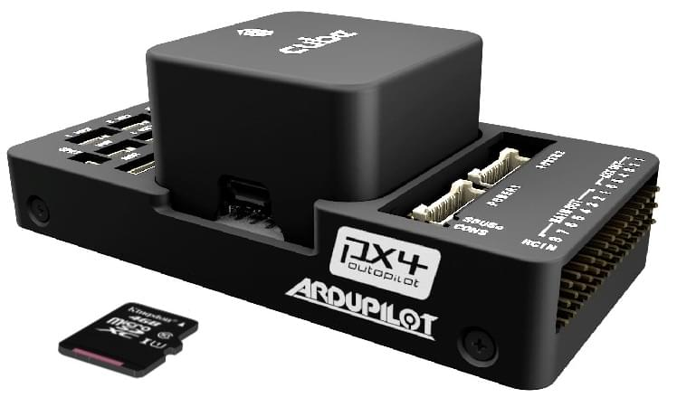
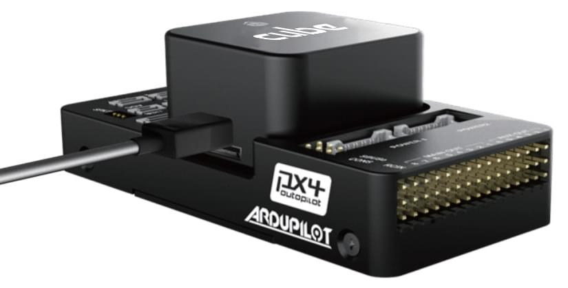

# 큐브 배선 퀵 스타트

This quick start guide shows how to power the *Cube*&reg; flight controllers and connect their most important peripherals.

  

> **Tip** The instructions apply to all Cube variants, including [Cube Black](../flight_controller/pixhawk-2.md), [Cube Yellow](../flight_controller/cubepilot_cube_yellow.md) and [Cube Orange](../flight_controller/cubepilot_cube_orange.md). Further/updated information may be available in the [Cube User Manual](https://docs.cubepilot.org/user-guides/autopilot/the-cube-user-manual) (Cube Docs).

## 액세서리

큐브는 [구매 시](../flight_controller/pixhawk-2.md#stores)필요한 부속품의 대부분 (또는 전체)이 함께 제공됩니다.

예외적으로 GPS를 따로 구매해야 하는 GPS를 포함하지 않는 키트가 있습니다 ([아래를 참고하십시오](#gps)).

## 배선 개요

아래 그림은 중요한 센서와 주변기기를 연결하는 방법에 대해 설명합니다. 다음 섹션에서 각각의 장치에 대해 자세히 설명합니다.

1. [텔레메트리 시스템](#telemetry) — 실시간으로 기체를 제어/모니터링하고, 미션을 계획/실행할 수 있도록 합니다. 일반적으로, 텔레메트리 라디오, 태블릿/PC와 지상국 소프트웨어(예: QgroundControl)가 포함됩니다.
2. [버저](#buzzer) — 기체의 동작을 나타내는 오디오 신호를 제공합니다.
3. [원격 제어 수신기 시스템](#rc_control) — 조종사가 기체를 수동으로 조작하는 데 사용할 수 있는 휴대용 송신기에 연결합니다 (그림은 PWM->PPM 변환기를 장착한 PWM 수신기입니다).
4. (전용) [안전 스위치](#safety_switch) — 버튼을 눌러 모터를 잠금/잠금해제합니다. 내장 안전 스위치가 포함된 권장 [GPS](#gps)를 사용하지 않는 경우에만 필요합니다.
5. [GPS, 나침반, LED, 안전 스위치](#gps) — 권장 GPS 모듈은 GPS, 나침반, LED, 그리고 안전 스위치로 구성됩니다. 
6. [전원 시스템](#power) — Cube 및 모터 ESC에 전원을 공급합니다. LiPo 배터리,전원 모듈, 그리고 추가 배터리 경고 시스템 (배터리 전원이 설정된 전압보다 낮을 때 경고음)으로 구성됩니다. 

> **Note** The port labeled `GPS2` maps to `TEL4` in PX4 (i.e. if connecting to the port labeled `GPS2`, assign the [serial port configuration parameter](../peripherals/serial_configuration.md) for the connected hardware to `TEL4`).

> **Tip** More information about available ports can be found here: [Cube > Ports](../flight_controller/pixhawk-2.md#ports).

## 컨트롤러 장착 및 정렬

Mount the Cube as close as possible to your vehicle’s center of gravity, ideally oriented top-side up and with the arrow pointing towards the front of the vehicle (note the *subtle* arrow marker on top of the cube)

> **Note** If the controller cannot be mounted in the recommended/default orientation (e.g. due to space constraints) you will need to configure the autopilot software with the orientation that you actually used: [Flight Controller Orientation](../config/flight_controller_orientation.md).

The Cube can be mounted using either vibration-damping foam pads (included in the kit) or mounting screws. The mounting screws in the Cube accessories are designed for a 1.8mm thick frameboard. Customized screws are supposed to be M2.5 with thread length inside Cube in range 6mm~7.55mm.

## GPS + Compass + Safety Switch + LED

The recommended GPS modules are the *Here* and [Here+](../gps_compass/rtk_gps_hex_hereplus.md), both of which incorporate a GPS module, Compass, Safety Switch and [LEDs](../getting_started/led_meanings.md).

> **Note** The difference between the modules is that *Here+* supports centimeter level positioning via [RTK](../advanced_features/rtk-gps.md). Otherwise they are used/connected in the same way.

The module should be mounted on the frame as far away from other electronics as possible, with the direction marker towards the front of the vehicle (separating the compass from other electronics will reduce interference). It must be connected to the `GPS1` port using the supplied 8-pin cable.

The diagram below shows a schematic view of the module and its connections.

> **Note** The GPS module's integrated safety switch is enabled *by default* (when enabled, PX4 will not let you arm the vehicle). To disable the safety press and hold the safety switch for 1 second. You can press the safety switch again to enable safety and disarm the vehicle (this can be useful if, for whatever reason, you are unable to disarm the vehicle from your remote control or ground station).

> **Tip** If you want to use an old-style 6-pin GPS module, the kit comes with a cable that you can use to connect both the GPS and [Safety Switch](#safety_switch).

## Safety Switch

The *dedicated* safety switch that comes with the Cube is only required if you are not using the recommended [GPS](#gps) (which has an inbuilt safety switch).

If you are flying without the GPS you must attach the switch directly to the `GPS1` port in order to be able to arm the vehicle and fly (or via a supplied cable if using an old-style 6-pin GPS).

## 버저

The buzzer provides audio signals to that indicate UAV status. This should be connected to the USB port as shown (no further configuration is required).

## Radio Control

A [remote control (RC) radio system](../getting_started/rc_transmitter_receiver.md) is required if you want to *manually* control your vehicle (PX4 does not require a radio system for autonomous flight modes).

You will need to [select a compatible transmitter/receiver](../getting_started/rc_transmitter_receiver.md) and then *bind* them so that they communicate (read the instructions that come with your specific transmitter/receiver).

The instructions below show how to connect the different types of receivers.

### PPM-SUM / Futaba S.BUS 수신기

Connect the ground(-),power(+),and signal(S) wires to the RC pins using the provided 3-wire servo cable.

### Spektrum Satellite 수신기

Spektrum DSM, DSM2, and DSM-X Satellite RC receivers connect to the **SPKT/DSM** port.

### PWM 수신기

The Cube cannot directly connect to PPM or PWM receivers that have an *individual wire for each channel*. PWM receivers must therefore connect to the **RCIN** port *via* a PPM encoder module, which may be purchased from hex.aero or proficnc.com.

## Power

Cube is typically powered from a Lithium Ion Polymer (LiPo) Battery via a Power Module (supplied with the kit) that is connected to the **POWER1** port. The power module provides reliable supply and voltage/current indication to the board and may separately supply power to ESCs that are used to drive motors on a multicopter vehicle.

A typical power setup for a Multicopter vehicle is shown below.

<!-- HOw is the power rail powered for servos - power rail? Plane/Vtol would be cool to show here too -->

## Telemetry System (Optional)

A telemetry system allows you to communicate with, monitor, and control a vehicle in flight from a ground station (for example, you can direct the UAV to a particular position, or upload a new mission).

The communication channel is via [Telemetry Radios](../telemetry/README.md). The vehicle-based radio should be connected to the **TELEM1** port (if connected to this port, no further configuration is required). The other radio is connected to your ground station computer or mobile device (usually via USB).

## SD 카드 (선택 사항)

SD cards are highly recommended as they are needed to [log and analyse flight details](../getting_started/flight_reporting.md), to run missions, and to use UAVCAN-bus hardware. Insert the Micro-SD card into Cube as shown (if not already present).

> **Tip** For more information see [Basic Concepts > SD Cards (Removable Memory)](../getting_started/px4_basic_concepts.md#sd_cards).

## 모터

Motors/servos are connected to the **MAIN** and **AUX** ports in the order specified for your vehicle in the [Airframe Reference](../airframes/airframe_reference.md).

> **Note** This reference lists the output port to motor/servo mapping for all supported air and ground frames (if your frame is not listed in the reference then use a "generic" airframe of the correct type).

> **Caution** The mapping is not consistent across frames (e.g. you can't rely on the throttle being on the same output for all plane frames). Make sure to use the correct mapping for your vehicle.

## 그 외 주변 장치

The wiring and configuration of optional/less common components is covered within the topics for individual [peripherals](../peripherals/README.md).

> **Note** If connecting peripherals to the port labeled `GPS2`, assign the PX4 [serial port configuration parameter](../peripherals/serial_configuration.md) for the hardware to `TEL4` (not GPS2).

## 설정

Configuration is performed using [QGroundContro](http://qgroundcontrol.com/).

After downloading, installing and running *QGroundControl*, connect the board to your computer as shown.

Basic/common configuration information is covered in: [Autopilot Configuration](../config/README.md).

QuadPlane specific configuration is covered here: [QuadPlane VTOL Configuration](../config_vtol/vtol_quad_configuration.md)

<!-- what about config of other vtol types and plane. Do the instructions in these ones above apply for tailsitters etc? -->

## 추가적인 정보

- [Cube Black](../flight_controller/pixhawk-2.md) 
- [Cube Yellow](../flight_controller/cubepilot_cube_yellow.md)
- [Cube Orange](../flight_controller/cubepilot_cube_orange.md)
- Cube Docs (Manufacturer): 
  - [Cube Module Overview](https://docs.cubepilot.org/user-guides/autopilot/the-cube-module-overview)
  - [Cube User Manual](https://docs.cubepilot.org/user-guides/autopilot/the-cube-user-manual)
  - [Mini Carrier Board](https://docs.cubepilot.org/user-guides/carrier-boards/mini-carrier-board)