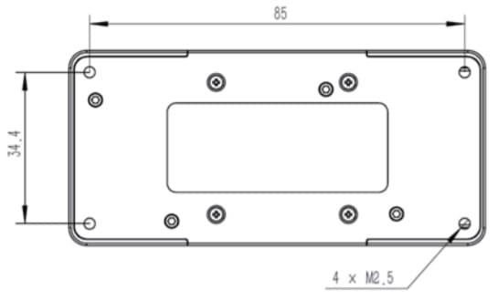

# 쉬운 큐브 배선 튜토리얼

이 빠른 시작 안내서에서는 [ 큐브 ](../flight_controller/pixhawk-2.md)&reg;  비행 컨트롤러에 전원을 공급하고 가장 중요한 주변 장치를 연결하는 방법을 설명합니다.

## 악세사리

큐브는 [구매 시 ](../flight_controller/pixhawk-2.md#stores)필요한 부속품의 대부분 (또는 전체)이 함께 제공됩니다.

예외는 일부 키트는 별도로 구입 해야 할 것 이다 GPS를 포함 되지 않습니다 ([아래 참조](#gps)).

## 배선 개요

아래 이미지는 가장 중요 한 센서 및 주변 기기를 연결 하는 방법을 보여 줍니다. 우리는 다음 섹션에서 자세히 각을 통해 갈 거 야.

1. [원격 시스템](#telemetry)-계획/실행 임무, 그리고 제어 하 고 실시간으로 차량 모니터링 수 있습니다. 일반적으로 원격측정 라디오, 태블릿/PC 및 지상국 소프트웨어가 포함됩니다.
2. [Buzzer ](#buzzer) - UAV가 무엇을 하는지 나타내는 오디오 신호 제공
3. [원격 제어 수신기 시스템 ](#rc_control) - 운전자가 차량을 수동으로 조종하는 데 사용할 수 있는 휴대용 송신기에 연결합니다(PWM-PPM 변환기가 장착된 PWM 수신기 참조).
4. (표시됨) [ 안전 스위치 ](#safety_switch) — 누르면 잠금 누르지 않으면 잠금 해제됩니다. 안전 스위치가 내장된 권장 [ GPS ](#gps)을 사용하지 않는 경우에만 필요합니다.
5. [GPS, 컴패스, LED, 안전 스위치 ](#gps) — 권장 GPS 모듈에 GPS, 컴패스, LED 및 안전 스위치가 포함되어 있습니다. 
6. [ 전원 시스템 ](#power) — Cube 및 모터 ESC에 전원을 공급합니다. LiPo 배터리, 전원 모듈 및 옵션 배터리 경고 시스템(배터리 전원이 사전 정의된 레벨보다 낮을 경우 경고음) 

> **Tip ** 사용 가능한 포트에 대한 자세한 내용은 여기에서 확인할 수 있습니다. [Cube > Ports ](../flight_controller/pixhawk-2.md#ports).

## Mount and Orient Controller

마운트 및 방향 컨트롤러

> 참고 제어기를 권장 / 기본 방향 (예 : 물리적 제약으로 인해)으로 장착 할 수없는 경우 자동 조종 소프트웨어를 실제로 사용한 방향 (비행 컨트롤러 방향)으로 구성해야합니다.

큐브는 탑재 (키트에 포함) 중 진동-댐핑 거품 패드를 사용 하 여 또는 나사 장착 될 수 있습니다. 튜브 부속품의 장착 나사는 1.8mm 두께의 프레임보드용으로 설계되었습니다. 사용자 지정 된 나사 해야하는 M2.5 범위 6mm 큐브 내부 스레드 길이 ~ 7.55 m m.

## GPS + 나침반 + 안전 스위치, LED {#gps}

The recommended GPS modules are the *Here* and [Here+](../gps_compass/rtk_gps_hex_hereplus.md), both of which incorporate a GPS module, Compass, Safety Switch and [LEDs](../getting_started/led_meanings.md).

> **참고** 모듈 사이의 차이점은 *여기 +* 지원 센티미터 수준 [RTK](../advanced_features/rtk-gps.md) 통해 위치. 그렇지 않으면 그들은 같은 방식으로 사용/연결 되어 있습니다.

모듈은 방향 마커가 차량 앞쪽으로 향하도록 하여 가능한 한 멀리 프레임에 장착해야 합니다(다른 전자 장치와 나침반을 분리하면 간섭이 줄어듭니다). 제공된 8핀 케이블을 사용하여 ` GPS1 ` 포트에 연결해야 합니다..

아래 다이어그램 모듈과 연결의 개요 보기를 보여줍니다.

> **참고 ** GPS 모듈의 통합 안전 스위치는 기본적으로 * *을(를) 활성화합니다(활성화된 경우 PX4는 차량에 무장을 허용하지 않습니다). 안전을 비활성화하려면 안전 스위치를 1초간 길게 누르십시오. 안전 스위치를 다시 눌러 안전을 활성화하고 차량을 해제할 수 있습니다(어떤 이유로든 리모컨이나 접지 스테이션에서 차량을 해제할 수 없는 경우 유용함).

> **Tip ** 구형 6핀 GPS 모듈을 사용하려면 GPS와 [ 안전 스위치 ](#safety_switch)를 모두 연결하는 데 사용할 수 있는 케이블이 키트에 함께 제공됩니다.

## 안전 스위치 {#safety_switch}

권장 GPS(내장 안전 스위치가 있는 경우)를 사용하지 않는 경우에만 큐브와 함께 제공되는 전용 안전 스위치가 필요합니다.

GPS 없이 비행하는 경우 차량을 장갑으로 고정하고 이동하기 위해(또는 기존의 6핀을 사용하는 경우) 스위치를 "0" GPS1 </code> 포트에 직접 연결해야 합니다.

## 버저

버저는 UAV 상태를 표시 하는 오디오 신호를 제공 합니다. 그림과 같이 USB 포트에 연결해야 합니다(추가 구성은 필요하지 않음).

## Radio Control {#rc_control}

[ 리모트 컨트롤(RC) 라디오 시스템](../getting_started/rc_transmitter_receiver.md)은 차량을 수동으로 제어하려는 경우 필요합니다(PX4에는 자율 비행 모드를 위한 무선 시스템이 필요하지 않음).

You will need to [select a compatible transmitter/receiver](../getting_started/rc_transmitter_receiver.md) and then *bind* them so that they communicate (read the instructions that come with your specific transmitter/receiver).

아래 지침은 다양한 유형의 수신기를 연결하는 방법을 보여 줍니다.

### PPM-SUM / Futaba S.버스 수신기

제공된 3와이어 서보 케이블을 사용하여 접지(-), 전원(+) 및 신호(S) 와이어를 RC 핀에 연결합니다.

### 스펙트럼 위성 수신기

Spktrum DSM, DSM2 및 DSM-X Satellite RC 수신기는 SPKT/DSM 포트에 연결됩니다. 

### PWM 수신기

큐브는 각 채널 </em>에 대해 *개의 개별 와이어가 있는 PPM 또는 PWM 수신기에 직접 연결할 수 없습니다. 따라서 PWM 수신기는 hex.aero 또는 proficnc.com.에서 구매할 수 있는 PPM 인코더 모듈을 통해 RCIN 포트에 연결해야 합니다.
 

## Power {#power}

큐브는 일반적으로 **POWER1 ** 포트에 연결된 전원 모듈(키트와 함께 제공)을 통해 리튬 이온 폴리머(LiPo) 배터리로부터 전원을 공급받습니다. 전원 모듈은 보드에 안정적인 전원 공급 및 전압/전류 표시를 제공하며 멀티코터 차량의 모터를 구동하는 데 사용되는 ESC에 개별적으로 전원을 공급할 수 있습니다.

멀티콥터 차량의 일반적인 전원 설정은 다음과 같습니다.

<!-- HOw is the power rail powered for servos - power rail? Plane/Vtol would be cool to show here too -->

## 원격 측정 시스템(옵션) {#telemetry}

원격 측정 시스템을 사용하면 지상국에서 이동 중인 차량과 통신, 모니터링 및 제어할 수 있습니다(예: UAV를 특정 위치로 유도하거나 새 임무를 업로드할 수 있음).

통신 채널은 [Telecry Radios](../telemetry/README.md)을 통해 제공됩니다. 차량 기반 라디오를 ** TELEM1 ** 포트에 연결해야 합니다(이 포트에 연결된 경우 추가 구성이 필요하지 않음). 다른 라디오는 일반적으로 USB를 통해 지상국 컴퓨터 또는 모바일 장치에 연결됩니다.

## SD 카드(선택 사항)

SD 카드는 가장 일반적으로  로그에 사용되며 비행 세부 정보를 분석합니다. Micro-SD 카드를 그림과 같이 큐브에 삽입합니다(아직 없는 경우).
 

> **Tip ** SanDisk Extreme U3 32GB는  높게 권장됩니다(개발자 가이드).
 </blockquote> 
> 
> ## Motors
> 
> 모터/servos [기체 참조](../airframes/airframe_reference.md)에 귀하의 차량에 대 한 지정 된 순서 대로 **메인** 및 **AUX** 포트에 연결 됩니다.
> 
> 
> 
> > ** 노트 ** 이 참조는 지원되는 모든 공기 및 접지 프레임에 대한 모터/servo 매핑의 출력 포트를 나열합니다(기준에 프레임이 나열되지 않은 경우 올바른 유형의 "일반" 공기 프레임을 사용합니다).
> 
> 

> 
> > **주의** 프레임 간에 매핑이 일관되지 않습니다(예: 모든 평면 프레임에 대해 스로틀이 동일한 출력에 의존할 수 없음). 차량에 대 한 올바른 매핑을 사용할 수 있는지 확인 합니다.
> 
> ## Other Peripherals
> 
> 옵션/낮은 공통 구성요소의 배선 및 구성은 개별 [ 주변기기 ](../peripherals/README.md)의 항목에서 다룹니다.
> 
> ## Configuration
> 
> 구성은 [QGroundContro](http://qgroundcontrol.com/)을 사용 하 여 수행 됩니다.
> 
> 다운로드, 설치 하 고 *QGroundControl*를 실행, 후와 같이 컴퓨터에 보드를 연결 합니다.
> 
> 
> 
> 기본/일반 구성 정보는 다음에서 다룹니다.
> 
> QuadPlane 특정 구성 여기 덮여 있다: [QuadPlane VTOL 구성](../config_vtol/vtol_quad_configuration.md)
> 
> <!-- what about config of other vtol types and plane. Do the instructions in these ones above apply for tailsitters etc? -->
> 
> ## Further information
> 
> - [큐브](../flight_controller/pixhawk-2.md) <!-- - [pixhawk2 user manual copy]()  // fold out insert shipped with doc /assets/flight_controller/cube/cube_mount_front/pixhawk2 user manual copy.pdf -->
>     
>     <!-- - [Cube Quickstart]() (HEX) -->