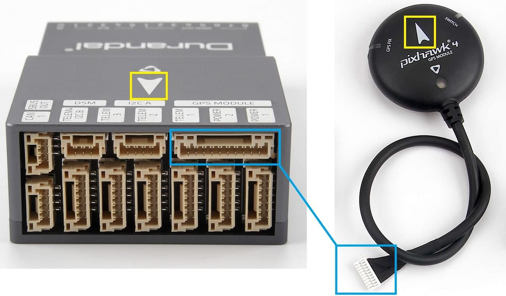

# Durandal 배선 개요

:::warning PX4에서는 이런 종류의 자동 항법 장치를 제조하지는 않습니다. 하드웨어 지원 또는 호환 문제는 [제조사](https://shop.holybro.com/)와 상담하십시오.
:::

이 설명서는 [Drundal](../flight_controller/durandal.md)&reg; 비행 컨트롤러에 전원 공급 방법과 가장 중요한 주변 장치 연결법을 설명합니다.

## 포장 개봉

Durandal은 전원 모듈 (* PM02 V3 *, * PM07 * 및 * Pixhawk 4 GPS / Compass *)을 포함한 다양한 액세서리 조합과 함께 번들로 판매됩니다. (유블럭스 NEO-M8N).

*PM02 V3* 전원 모듈이있는 상자의 내용물은 아래에 나와 있습니다 (상자에는 핀 배치 가이드 및 전원 모듈 지침도 포함되어 있음).

## 배선 개요

아래의 이미지는 중요한 센서 및 주변 장치 (모터 및 서보 출력 제외)를 연결법을 나타냅니다. 다음 섹션에서 각각의 장치에 대해 자세히 설명합니다.

:::tip
사용 가능한 포트에 대한 자세한 내용은 [ Durandal> 핀아웃 ](../flight_controller/durandal.md#pinouts)에서 찾을 수 있습니다.
:::

## 콘트롤러 장착 및 장착 방향

*Duranda *은 차량의 무게 중심에 최대한 가깝게 배치 된 프레임에 장착해야하며 화살표가 차량의 앞쪽과 위쪽을 향하도록 하여야 합니다.

컨트롤러를 공간의 제약등으로 인하여 권장하는 방향으로 장착 할 수없는 경우에는 실제 장착한 방향을 소프트웨어에서 설정하여야 합니다. : [비행 콘트롤러 방향 ](../config/flight_controller_orientation.md).

:::tip
보드에는 내부 진동 차단 기능이 있습니다. 컨트롤러를 장착시 진동 차단 스티로폼을 사용하지 마십시오 (일반적으로 양면 테이프로 충분 함).
:::

## GPS + 나침반 + 부저 + 안전 스위치 + LED

Durandal은 나침반, 안전 스위치, 부저 및 LED가 통합된 *Pixhawk 4 GPS 모듈*에 최적화되도록 설계되었습니다. 10 핀 케이블을 사용하여 [GPS 포트](../flight_controller/durandal.md#gps)에 직접 연결합니다.

GPS/나침반은 차량 전명 방향 표시를 사용하여 가능한 한 다른 전자 장치에서 멀리 떨어진 프레임에 장착해야합니다 (나침반을 다른 전자 장치와 분리하면 간섭이 줄어듦).

:::note GPS
모듈의 통합 안전 스위치는 *기본적으로* 활성화되어 있습니다 (활성화되면 PX4는 차량 시동을 걸 수 없습니다). 비활성화하려면 안전 스위치를 1초간 길게 누르십시오. 안전 스위치를 다시 눌러 안전 장치를 활성화하고 기체 시동을 끌 수 있습니다 (어떤 이유로든 조종기나 지상국 프로그램이 기체 시동을 끌 수 없을 때 유용합니다).
:::

## 전원

전원 모듈 또는 배전 보드를 사용하여 모터/서보에 전원을 공급하고 전력 소비를 측정 할 수 있습니다. 권장되는 전원 모듈은 다음과 같습니다.

### PM02 v3 전원 모듈

[ 전원 모듈 (PM02 v3) ](https://shop.holybro.com/power-modulepm02-v3_p1185.html)은 * Durandal *과 함께 번들로 제공 될 수 있습니다. 비행 컨트롤러에 전력을 공급하고 배터리 전압/전류를 비행 컨트롤러에 보냅니다.

그림과 같이 * 전원 모듈 *의 출력을 연결합니다.

- PM 전압/전류 포트 : 제공된 6선 GH 케이블을 사용하여 [ POWER1 ](../flight_controller/durandal.md#power) 포트 (또는 ` POWER2 `)에 연결합니다.
- PM 입력 (XT60 수 커넥터) : LiPo 배터리 (2 ~ 12S)에 연결합니다.
- PM 전원 출력 (XT60 암 커넥터) : 모든 모터 ESC에 배선합니다.

:::tip
이 전원 모듈에는 배전 배선이 포함되어 있지 않으므로 일반적으로 모든 ESC를 전원 모듈 출력에 병렬로 연결합니다 (ESC는 제공된 전압 레벨에 적합해야 함).
:::

:::tip
** MAIN / AUX **의 8 핀 전원 (+) 레일은 비행 컨트롤러에 대한 전원 모듈 공급으로 전원이 공급되지 않습니다. 방향타, 엘레본 등의 서보를 구동하기 위해 별도로 전원을 공급해야하는 경우, 파워 레일을 BEC 장착 ESC 또는 독립형 5V BEC 또는 2S LiPo 배터리에 연결해야합니다. 사용하는 서보의 전압이 적절한 지 확인하십시오.
:::

전원 모듈에는 다음과 같은 특성/제한이 있습니다.
- 최대 입력 전압 : 60V
- 최대 전류 감지 : 120A 전압
- SV ADC 스위칭 레귤레이터 출력에 대해 구성된 전류 측정은 최대 5.2V 및 3A를 출력합니다.
- 무게 : 20g
- 패키지 내용물 :
  - PM02 보드
  - 6 핀 MLX 케이블 (1)
  - 6 핀 GH 케이블 (1)

:::note
[ PM02v3 전원 모듈 설명서 ](http://www.holybro.com/manual/Holybro_PM02_v3_PowerModule_Manual.pdf) (Holybro)도 참조하십시오.
:::

### Pixhawk 4 전원 모듈 (PM07)

[Pixhawk 4 전원 모듈 (PM07) ](https://shop.holybro.com/pixhawk-4-power-module-pm07_p1095.html)은 * Durandal *과 함께 번들로 제공되기도 합니다. 전원 모듈 및 배전 보드 역할을 모두 수행하여 조정 된 전원을 비행 컨트롤러와 ESC에 제공하고 배터리 전압/전류를 비행 컨트롤러에 보냅니다.

이것은 [ Pixhawk 4 빠른 시작> 전원 ](../assembly/quick_start_pixhawk4.md#power) 문서에 설명된 것과 같은 방식으로 연결됩니다.

전원 모듈에는 다음과 같은 특성과 제약 사항이 있습니다.
- PCB 전류 : 총 120A 출력 (최대)
- UBEC 5V 출력 전류 : 3A
- UBEC 입력 전압 : 7 ~ 51v (2 ~ 12s LiPo)
- 크기 : 68 * 50 * 8 mm
- 장착 구멍 : 45 * 45mm
- 중량: 36g
- 패키지 내용물 :
  - PM07 보드 (1)
  - 80mm XT60 커넥터 와이어 (1)

:::note
[ PM07 빠른 시작 안내서 ](http://www.holybro.com/manual/PM07-Quick-Start-Guide.pdf) (Holybro)도 참조하십시오.
:::

### 배터리 설정

배터리 전원 설정은 [ 전원 설정 ](../config/battery.md)에서 구성해야 합니다. 두 전원 모듈에 대해 * 셀 수 *를 구성해야 합니다.

다른 전원 모듈(예 : Pixracer의 모듈)을 사용하지 않으면 * 전압 분배기 *를 업데이트 할 필요가 없습니다.

## 무선 조종

리모트 컨트롤(RC) 라디오 시스템은 기체를 *수동*으로 제어할 때 필요합니다 (PX4에는 자율 비행 모드를 위한 라디오 시스템이 필요하지 않습니다).

기체와 조종자가 서로 통신하기 위해 [호환되는 송신기/수신기를 선택하고](../getting_started/rc_transmitter_receiver.md), 송신기와 수신기를 *바인드*해야 합니다 (송신기와 수신기에 포함된 지시사항을 읽으십시오).

아래 지침은 다양한 유형의 수신기를 * Durandal *에 연결하는 방법을 보여줍니다.

- Spektrum/DSM 수신기는 [ DSM RC ](../flight_controller/durandal.md#dsm-rc-port) 입력에 연결됩니다.

  

- PPM과 S.Bus 방식의 수신기는 [ SBUS_IN / PPM_IN ](../flight_controller/durandal.md#rc-in) 입력 포트 (MAIN/AUX 입력 옆에 RC IN으로 표시됨)에 연결됩니다.

  

- *각각의 채널이 독립적으로 배선된* PPM/PWM 수신기는 반드시 **PPM RC**포트에 *PPM 인코더를 통해* [아래와 같이](http://www.getfpv.com/radios/radio-accessories/holybro-ppm-encoder-module.html)연결해야 합니다 (PPM-Sum 수신기는 모든 채널에 하나의 전선만 사용합니다).

무선 시스템 선택, 수신기 호환성 및 송신기 / 수신기 쌍 바인딩에 대한 자세한 내용은 다음을 참조하십시오. [ 원격 제어 송신기 & amp; 수신자 ](../getting_started/rc_transmitter_receiver.md).

## 무선 텔레메트리(선택 사항)

무선 텔레메트리는 지상국 프로그램에서 비행중인 차량의 통신/제어에 사용할 수 있습니다 (예 : UAV를 특정 위치로 지시하거나 새 임무를 업로드 할 수 있음).

차량 기반 무선 장치는 6 핀 커넥터 중 하나를 사용하여 아래와 같이 [TELEM1](../flight_controller/durandal.md#telem1_2_3) 포트에 연결해야합니다 (이 포트에 연결된 경우 추가 구성이 필요하지 않음). 다른 텔레메트리는 일반적으로 지상국 컴퓨터나 모바일 장치에 (USB를 통해) 연결됩니다.

## SD 카드 (선택 사항)

SD 카드는 [ 비행 세부 정보를 기록 및 분석 ](../getting_started/flight_reporting.md)하고, 임무를 수행하고, UAVCAN 버스 하드웨어를 사용하는 데 필요하므로 가능하면 사용하는 것이 좋습니다. 아래 표시된 곳에 SD 카드를 * Durandal *에 삽입합니다.

:::tip
자세한 내용은 [ 기본 개념> SD 카드 (이동식 메모리) ](../getting_started/px4_basic_concepts.md#sd_cards)를 참조하십시오.
:::

## 모터

모터 / 서보 제어 신호는 ** I / O PWM OUT ** (** MAIN OUT **) 및 ** FMU PWM OUT ** (** AUX **)에 연결됩니다. ) 포트는 [ Airframe Reference ](../airframes/airframe_reference.md)에서 차량에 지정된 순서로 지정됩니다.

모터는 별도로 [ 전원을 공급 ](#power)핟여야 합니다.

:::note
프레임이 기체 참조 목록에 없으면, 올바른 유형의 "일반"기체를 사용하십시오.
:::

:::tip
* Durandal *에는 5 개의 AUX 포트가 있으므로 AUX6, AUX7, AUX8을 모터 또는 기타 중요한 비행 제어 장치에 매핑하는 기체에는 사용할 수 없습니다.
:::

## 기타 주변 장치

선택적인 주변 장치의 배선 및 구성은 개별 [주변 장치](../peripherals/README.md)에 대한 항목에서 다룹니다.

## 핀아웃

[Durandal > 핀아웃](../flight_controller/durandal.md#pinouts)

## PX4 설정

먼저 * QGroundControl *을 사용하여 컨트롤러에 [ PX4 "마스터"펌웨어 ](../config/firmware.md#custom)를 설치하여야 합니다.

:::note
Durandal 지원은 PX4 v1.10 이후의 * 안정 * PX4 릴리스에서 지원됩니다.
:::

더 자세한 일반 구성 정보는 [ Autopilot 구성 ](../config/README.md)에서 다룹니다.

QuadPlane에 대한 자세한 설정은 [QuadPlane VTOL 설정](../config_vtol/vtol_quad_configuration.md)에서 다룹니다.

## 추가 정보

- [Durandal 개요](../flight_controller/durandal.md)
- [ Durandal 기술 데이터 시트 ](http://www.holybro.com/manual/Durandal_technical_data_sheet.pdf) (Holybro)
- [ Durandal 핀아웃 ](http://www.holybro.com/manual/Durandal-Pinouts.pdf) (Holybro)
- [ Durandal_MB_H743sch.pdf ](https://github.com/PX4/px4_user_guide/raw/master/assets/flight_controller/durandal/Durandal_MB_H743sch.pdf) (Durandal 회로도)
- [ STM32H743IIK_pinout.pdf ](https://github.com/PX4/PX4-user_guide/raw/master/assets/flight_controller/durandal/STM32H743IIK_pinout.pdf) (Durandal Pinmap)
