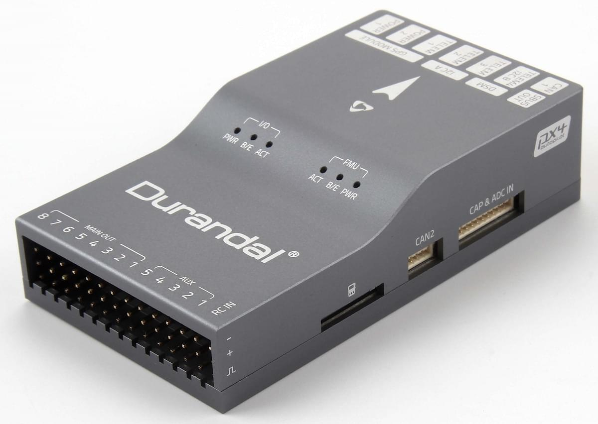
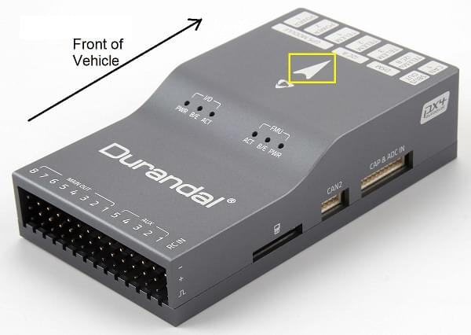

# Durandal 배선 빠른 시작

:::warning PX4에서는 이런 종류의 자동 항법 장치를 제조하지는 않습니다. 하드웨어 지원 또는 호환 문제는 [제조사](https://shop.holybro.com/)와 상담하십시오.
:::

이 퀵 스타트 설명서는 [Drundal](../flight_controller/durandal.md)&reg; 비행 컨트롤러에 전원 공급 방법과 가장 중요한 주변 장치 연결법을 설명합니다.

## 포장 개봉

Durandal은 전원 모듈 (* PM02 V3 *, * PM07 * 및 * Pixhawk 4 GPS / Compass *)을 포함한 다양한 액세서리 조합과 함께 번들로 판매됩니다. (유블럭스 NEO-M8N).

*PM02 V3* 전원 모듈이있는 상자의 내용물은 아래에 나와 있습니다 (상자에는 핀 배치 가이드 및 전원 모듈 지침도 포함되어 있음).

## 배선 개요

아래의 이미지는 중요한 센서 및 주변 장치 (모터 및 서보 출력 제외)를 연결법을 나타냅니다. 다음 섹션에서 각각의 장치에 대해 자세히 설명합니다.

:::tip
사용 가능한 포트에 대한 자세한 내용은 [ Durandal> 핀아웃 ](../flight_controller/durandal.md#pinouts)에서 찾을 수 있습니다.
:::

## 콘트롤러 장착 및 장착 방향

*Duranda *은 차량의 무게 중심에 최대한 가깝게 배치 된 프레임에 장착해야하며 화살표가 차량의 앞쪽과 위쪽을 향하도록 하여야 합니다.

컨트롤러를 공간의 제약등으로 인하여 권장하는 방향으로 장착 할 수없는 경우에는 실제 장착한 방향을 소프트웨어에서 설정하여야 합니다. : [비행 콘트롤러 방향 ](../config/flight_controller_orientation.md).

:::tip
보드에는 내부 진동 차단 기능이 있습니다. 컨트롤러를 장착시 진동 차단 스티로폼을 사용하지 마십시오 (일반적으로 양면 테이프로 충분 함).
:::

## GPS + 나침반 + 부저 + 안전 스위치 + LED

Durandal is designed to work well with the *Pixhawk 4 GPS module*, which has an integrated compass, safety switch, buzzer and LED. It connects directly to the [GPS port](../flight_controller/durandal.md#gps) using the 10 pin cable.

The GPS/Compass should be mounted on the frame as far away from other electronics as possible, with the direction marker towards the front of the vehicle (separating the compass from other electronics will reduce interference).

:::note
The GPS module's integrated safety switch is enabled *by default* (when enabled, PX4 will not let you arm the vehicle). To disable the safety press and hold the safety switch for 1 second. You can press the safety switch again to enable safety and disarm the vehicle (this can be useful if, for whatever reason, you are unable to disarm the vehicle from your remote control or ground station).
:::

## Power

You can use a power module or power distribution board to power motors/servos and measure power consumption. The recommended power modules are shown below.

### PM02 v3 Power Module

The [Power Module (PM02 v3)](https://shop.holybro.com/power-modulepm02-v3_p1185.html) can be bundled with *Durandal*. It provides regulated power to flight controller and sends battery voltage/current to the flight controller.

Connect the output of the *Power Module* as shown.

- PM voltage/current port: connect to [POWER1](../flight_controller/durandal.md#power) port (or `POWER2`) using the 6-wire GH cable supplied.
- PM input (XT60 male connector): connect to the LiPo battery (2~12S).
- PM power output (XT60 female connector): wire out to any motor ESCs.

:::tip
As this power module does not include power distribution wiring, you would normally just connect all the ESCs in parallel to the power module output (the ESC must be appropriate for the supplied voltage level).
:::

:::tip
The 8 pin power (+) rail of **MAIN/AUX** is not powered by the power module supply to the flight controller. If it will need to be separately powered in order to drive servos for rudders, elevons etc., the power rail needs to be connected to a BEC equipped ESC or a standalone 5V BEC or a 2S LiPo battery. Ensure the voltage of servo you are going to use is appropriate.
:::

The power module has the following characteristics/limits:
- Max input voltage: 60V
- Max current sensing: 120A Voltage
- Current measurement configured for SV ADC Switching regulator outputs 5.2V and 3A max
- Weight: 20g
- Package includes:
  - PM02 board
  - 6pin MLX cable (1)
  - 6pin GH cable (1)

:::note
See also [PM02v3 Power Module Manual](http://www.holybro.com/manual/Holybro_PM02_v3_PowerModule_Manual.pdf) (Holybro).
:::

### Pixhawk 4 Power Module (PM07)

The [Pixhawk 4 Power Module (PM07)](https://shop.holybro.com/pixhawk-4-power-module-pm07_p1095.html) can be bundled/used with *Durandal*. It acts as both a power module and power distribution board, providing regulated power to flight controller and the ESCs, and sending battery voltage/current to the flight controller.

This is wired up in the same way as described in the [Pixhawk 4 Quick Start > Power](../assembly/quick_start_pixhawk4.md#power) documentation.

It has the following characteristics/limits:
- PCB Current: total 120A outputs (MAX)
- UBEC 5V output current: 3A
- UBEC input voltage : 7~51v (2~12s LiPo)
- Dimensions: 68*50*8 mm
- Mounting Holes: 45*45mm
- Weight: 36g
- Package includes:
  - PM07 board (1)
  - 80mm XT60 connector wire (1)

:::note
See also [PM07 Quick Start Guide](http://www.holybro.com/manual/PM07-Quick-Start-Guide.pdf) (Holybro).
:::

### Battery Configuration

The battery/power setup must be configured in [Power Settings](../config/battery.md). For either Power Module you will need to configure the *Number of Cells*.

You will not need to update the *voltage divider* unless you are using some other power module (e.g. the one from the Pixracer).

## Radio Control

A remote control (RC) radio system is required if you want to *manually* control your vehicle (PX4 does not require a radio system for autonomous flight modes).

You will need to [select a compatible transmitter/receiver](../getting_started/rc_transmitter_receiver.md) and then *bind* them so that they communicate (read the instructions that come with your specific transmitter/receiver).

The instructions below show how to connect the different types of receivers to *Durandal*:

- Spektrum/DSM receivers connect to the [DSM RC](../flight_controller/durandal.md#dsm-rc-port) input.

  

- PPM and S.Bus receivers connect to the [SBUS_IN/PPM_IN](../flight_controller/durandal.md#rc-in) input port (marked as RC IN, next to the MAIN/AUX inputs).

  

- PPM and PWM receivers that have an *individual wire for each channel* must connect to the **PPM RC** port *via a PPM encoder* [like this one](http://www.getfpv.com/radios/radio-accessories/holybro-ppm-encoder-module.html) (PPM-Sum receivers use a single signal wire for all channels).

For more information about selecting a radio system, receiver compatibility, and binding your transmitter/receiver pair, see: [Remote Control Transmitters & Receivers](../getting_started/rc_transmitter_receiver.md).

## Telemetry Radios (Optional)

Telemetry radios may be used to communicate and control a vehicle in flight from a ground station (for example, you can direct the UAV to a particular position, or upload a new mission).

The vehicle-based radio should be connected to the [TELEM1](../flight_controller/durandal.md#telem1_2_3) port as shown below using one of the 6-pos connectors (if connected to this port, no further configuration is required). The other radio is connected to your ground station computer or mobile device (usually by USB).

## SD Card (Optional)

SD cards are highly recommended as they are needed to [log and analyse flight details](../getting_started/flight_reporting.md), to run missions, and to use UAVCAN-bus hardware. Insert an SD card into the *Durandal* where indicated below.

:::tip
For more information see [Basic Concepts > SD Cards (Removable Memory)](../getting_started/px4_basic_concepts.md#sd_cards).
:::

## Motors

Motors/servos control signals are connected to the **I/O PWM OUT** (**MAIN OUT**) and **FMU PWM OUT** (**AUX**) ports in the order specified for your vehicle in the [Airframe Reference](../airframes/airframe_reference.md).

The motors must be separately [powered](#power).

:::note
If your frame is not listed in the airframe reference then use a "generic" airframe of the correct type.
:::

:::tip
*Durandal* has 5 AUX ports, so cannot be used with airframes that map AUX6, AUX7, AUX8 to motors or other critical flight controls.
:::

## Other Peripherals

The wiring and configuration of optional/less common components is covered within the topics for individual [peripherals](../peripherals/README.md).

## Pinouts

[Durandal > Pinouts](../flight_controller/durandal.md#pinouts)

## PX4 Configuration

First you will need to install [PX4 "Master" Firmware](../config/firmware.md#custom) onto the controller using *QGroundControl*.

:::note
Durandal support will be in the *stable* PX4 release that follows PX4 v1.10.
:::

Further general configuration information is covered in: [Autopilot Configuration](../config/README.md).

QuadPlane specific configuration is covered here: [QuadPlane VTOL Configuration](../config_vtol/vtol_quad_configuration.md)

## Further information

- [Durandal Overview](../flight_controller/durandal.md)
- [Durandal Technical Data Sheet](http://www.holybro.com/manual/Durandal_technical_data_sheet.pdf) (Holybro)
- [Durandal Pinouts](http://www.holybro.com/manual/Durandal-Pinouts.pdf) (Holybro)
- [Durandal_MB_H743sch.pdf](https://github.com/PX4/px4_user_guide/raw/master/assets/flight_controller/durandal/Durandal_MB_H743sch.pdf) (Durandal Schematics)
- [STM32H743IIK_pinout.pdf](https://github.com/PX4/PX4-user_guide/raw/master/assets/flight_controller/durandal/STM32H743IIK_pinout.pdf) (Durandal Pinmap)
