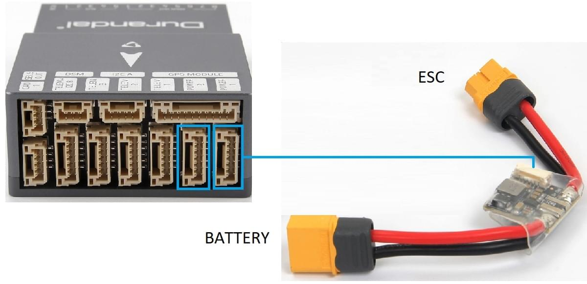

# Durandal 배선 개요

:::warning PX4에서는 이 자동 항법 장치를 제조하지 않습니다. 하드웨어 지원이나 호환 문제는 [제조사](https://shop.holybro.com/)에 문의하십시오.
:::

[Drundal](../flight_controller/durandal.md)&reg; 비행 콘트롤러의 전원공급 방법과 주요 주변장치 연결 방법을 설명합니다.

## 포장 개봉

Durandal은 전원 모듈(*PM02 V3*, *PM07* 및 *Pixhawk 4 GPS / Compass*)이 포함된 다양한 액세서리들과 함께 번들로 판매됩니다.(유블럭스 NEO-M8N).

*PM02 V3* 전원 모듈이 상자의 내용물은 아래와 같습니다. 상자에는 핀 배치 가이드와 전원 모듈 매뉴얼이 포함되어 있습니다.

## 배선 개요

아래의 이미지는 주요 센서와 주변 장치(모터 및 서보 출력 제외)의 연결 방법을 설명합니다. 다음 섹션에서 각 장치들에 대하여 자세히 설명합니다.

:::tip
사용 가능한 포트에 대한 자세한 내용은 [Durandal &gt; 핀배열](../flight_controller/durandal.md#pinouts)을 참고하십시오.
:::

## 콘트롤러 장착 및 장착 방향

*Duranda*은 차량의 무게 중심에 최대한 가깝게 위치에 장착하여야하며, 화살표가 차량의 전방과 상향으로 향하도록 하여야 합니다.

콘트롤러를 공간의 제약 등으로 권장 방향으로 장착할 수없는 경우에는 실제 장착한 방향을 프로그램에서 설정하여야 합니다. [비행 콘트롤러 방향](../config/flight_controller_orientation.md).

:::tip
이 보드에는 내부진동 차단 기능을 제공합니다.
콘트롤러 진동 차단 스티로폼을 사용하여 장착하시 마십시오. 일반인 양면 테이프로 장착하여도 충분합니다.
:::

## GPS + 나침반 + 부저 + 안전 스위치 + LED

Durandal은 나침반, 안전 스위치, 부저 및 LED가 통합된 *Pixhawk 4 GPS 모듈*에 최적화되어 있습니다. 10 핀 케이블을 사용하여 [GPS 포트](../flight_controller/durandal.md#gps)에 연결합니다.

GPS/나침반은 차량 전방 표식을 사용하여 가능한 전자 장치들에서 멀리 떨어진 프레임에 장착하는 것이 좋습니다. 나침반은 다른 전자 장치와 멀어 질수록 간섭이 현격하게 감소합니다.

:::note GPS
모듈의 통합 안전 스위치는 *기본적으로* 활성화됩니다. 활성화되면 PX4는 차량 시동이 가능합니다. 안전 스위치를 1초간 길게 누르면 비활성화됩니다. 안전 스위치를 다시 눌러 활성화하여 기체 시동이 가능합니다. 조종기나 지상국 프로그램에서 기체 시동을 끌 수 없는 경우에 유용합니다.
:::

## 전원

전원 모듈 또는 배전 보드를 사용하여 모터와 서보에 전원을 공급하고 소비 전력을 측정할 수 있습니다. 권장되는 전원 모듈은 아래와 같습니다.

### PM02 v3 전원 모듈

[전원 모듈 (PM02 v3)](https://shop.holybro.com/power-modulepm02-v3_p1185.html)은 *Durandal*과 함께 번들로 제공될 수 있습니다. 비행 콘트롤러에 배터리의 전력을 공급합니다.

그림과 같이 *전원 모듈*의 출력을 연결합니다.

- PM 전압/전류 포트 : 제공된 6선 GH 케이블을 사용하여 [POWER1](../flight_controller/durandal.md#power) 포트나 `POWER2` 포트에 연결합니다.
- PM 입력 (XT60 수 커넥터) : LiPo 배터리(2 ~ 12S)에 연결합니다.
- PM 전원 출력 (XT60 암 커넥터) : 모든 모터 ESC에 케이블을 연결합니다.

:::tip
이 전원 모듈에는 배전 배선이 포함되어 있지 않으므로, 모든 ESC를 전원 모듈 출력에 병렬로 연결합니다(제공된 전압 레벨에 적합한 ESC를 사용).
:::

:::tip
**MAIN/AUX**의 8 핀 전원 (+) 레일은 비행 콘트롤러에 대한 전원 모듈 공급으로 전원이 공급되지 않습니다. 방향타, 엘레본 등의 서보를 구동하기 위해 별도로 전원을 공급해야하는 경우에는 파워 레일을 BEC 장착 ESC 또는 독립형 5V BEC나 2S LiPo 배터리에 연결합니다. 사용하는 서보의 전압이 적절한 지 확인하십시오.
:::

전원 모듈에는 다음과 같은 특성과 제약 사항이 있습니다.
- 최대 입력 전압 : 60V
- 최대 전류 감지 : 120A 전압
- SV ADC 스위칭 레귤레이터 출력에 대해 설정된 전원은 최대 5.2V 및 3A를 출력합니다.
- 무게 : 20g
- 패키지 내용물 :
  - PM02 보드
  - 6 핀 MLX 케이블 (1 개)
  - 6 핀 GH 케이블 (1 개)

:::note
[PM02v3 전원 모듈 설명서](http://www.holybro.com/manual/Holybro_PM02_v3_PowerModule_Manual.pdf) (Holybro)도 참고하십시오.
:::

### Pixhawk 4 전원 모듈 (PM07)

[Pixhawk 4 전원 모듈 (PM07)](https://shop.holybro.com/pixhawk-4-power-module-pm07_p1095.html)은 *Durandal*과 함께 번들로 제공될 수 있습니다. 전원 모듈 및 배전 보드 역할을 수행하여 배터리의 조정된 전력을 비행 콘트롤러와 ESC에 제공합니다.

이것은 [ Pixhawk 4 빠른 시작 &gt; 전원](../assembly/quick_start_pixhawk4.md#power)에 설명된 것과 동일 방식으로 연결합니다.

전원 모듈에는 다음과 같은 특성과 제약 사항이 있습니다.
- PCB 전류 : 총 120A 출력 (최대)
- UBEC 5V 출력 전류 : 3A
- UBEC 입력 전압 : 7 ~ 51v (2 ~ 12s LiPo)
- 크기 : 68 *50* 8 mm
- 장착 구멍 : 45 * 45mm
- 중량: 36g
- 패키지 내용물 :
  - PM07 보드 (1 개)
  - 80mm XT60 커넥터 와이어 (1 개)

:::note
[PM07 빠른 시작 안내서](http://www.holybro.com/manual/PM07-Quick-Start-Guide.pdf) (Holybro)도 참고하십시오.
:::

### 배터리 설정

배터리 전원 설정은 [전원설정](../config/battery.md)에서 설정합니다. 전원 모듈의 *셀의 갯수*를 설정하여야 합니다.

다른 전원 모듈(예 : Pixracer의 모듈)을 사용하지 않으면 *전압 분배기*를 업데이트 할 필요는 없습니다.

## 무선 조종

리모트 컨트롤(RC) 라디오 시스템은 기체를 *수동* 제어시에 사용합니다. PX4의 자율 비행 모드에는 라디오 시스템이 필수적이지 않습니다.

[호환되는 송신기/수신기를 선택](../getting_started/rc_transmitter_receiver.md)후 *바인딩*을 하여야 통신이 가능합니다. 송신기/수신기의 매뉴얼을 참고하십시오.

아래 지침은 다양한 유형의 수신기를 *Durandal*에 연결하는 방법을 설명합니다.

- Spektrum/DSM 수신기는 [DSM RC](../flight_controller/durandal.md#dsm-rc-port) 입력에 연결합니다.

  

- PPM과 S.Bus 방식 수신기는 [SBUS_IN / PPM_IN](../flight_controller/durandal.md#rc-in) 입력 포트 (MAIN/AUX 입력 옆에 RC IN으로 표시됨)에 연결합니다.

  

- *각각의 채널이 독립적으로 배선된* PPM/PWM 수신기는 반드시 **PPM RC**포트에 *PPM 인코더를 통해* [아래와 같이](http://www.getfpv.com/radios/radio-accessories/holybro-ppm-encoder-module.html)연결하여야 합니다. PPM-Sum 수신기는 모든 채널에 하나의 전선만 사용합니다.

무선 시스템 선택, 수신기 호환성 및 송신기/수신기 바인딩에 대한 자세한 내용은 [원격 제어 송신기 & 수신기](../getting_started/rc_transmitter_receiver.md)를 참고하십시오.

## 무선 텔레메트리(선택 사항)

무선 텔레메트리는 지상국 프로그램에서 비행 차량의 통신/제어에 사용합니다(예 : UAV를 특정 위치로 지시하거나 새 임무를 업로드 할 수 있음).

차량 기반 무선 장치는 6핀 커넥터 중 하나를 사용하여 아래와 같이 [TELEM1](../flight_controller/durandal.md#telem1_2_3) 포트에 연결합니다 (이 포트에 연결된 경우 추가 설정이 필요하지 않음). 다른 라디오는 지상국 컴퓨터 또는 모바일 장치에 USB를 통하여 연결합니다.

## SD 카드 (선택 사항)

SD 카드는 [비행 세부 정보를 기록 및 분석](../getting_started/flight_reporting.md)하고, 임무를 수행하고, UAVCAN 버스 하드웨어를 사용하는 데 필요하므로 사용하는 것이 좋습니다. 아래 표시된 곳에 SD 카드를 *Durandal*에 삽입합니다.

:::tip
For more information see [Basic Concepts > SD Cards (Removable Memory)](../getting_started/px4_basic_concepts.md#sd-cards-removable-memory).
:::

## 모터

모터 서보 제어 신호는 **I / O PWM OUT** (**MAIN OUT**) 및 **FMU PWM OUT** (**AUX**)에 연결됩니다. ) 포트는 [기체 정의서](../airframes/airframe_reference.md)에서 차량에 지정된 순서로 지정됩니다.

모터는 별도 [전원을 공급](#power)하여야 합니다.

:::note
프레임이 기체 참조 정의서에 없으면, 적절한 유형의 "일반"기체를 사용하십시오.
:::

:::tip
*Durandal*에는 5 개의 AUX 포트가 있으므로 AUX6, AUX7, AUX8을 모터 또는 기타 중요한 비행 제어 장치에 매핑하는 기체에는 사용할 수 없습니다.
:::

## 기타 주변 장치

주변 장치 배선 및 설정에 관한 선택 사항은 개별 [주변 장치](../peripherals/README.md)를 참고하십시오.

## 핀 배열

[Durandal &gt; 핀아웃](../flight_controller/durandal.md#pinouts)

## PX4 설정

먼저 *QGroundControl*을 사용하여 콘트롤러에 [ PX4 "마스터"펌웨어 ](../config/firmware.md#custom)를 설치하여야 합니다.

:::note
Durandal 지원은 PX4 v1.10 이후의 *안정* PX4 릴리스에서 지원됩니다.
:::

더 자세한 일반 설정 정보는 [자동항법장치 설정](../config/README.md)을 참고하십시오.

QuadPlane에 대한 자세한 설정은 [QuadPlane VTOL 설정](../config_vtol/vtol_quad_configuration.md)을 참고하십시오.

## 추가 정보

- [Durandal 개요](../flight_controller/durandal.md)
- [Durandal 기술 데이터 시트](http://www.holybro.com/manual/Durandal_technical_data_sheet.pdf) (Holybro)
- [Durandal 핀 배열](http://www.holybro.com/manual/Durandal-Pinouts.pdf) (Holybro)
- [Durandal_MB_H743sch.pdf](https://github.com/PX4/px4_user_guide/raw/master/assets/flight_controller/durandal/Durandal_MB_H743sch.pdf) (Durandal 회로도)
- [STM32H743IIK_pinout.pdf](https://github.com/PX4/PX4-user_guide/raw/master/assets/flight_controller/durandal/STM32H743IIK_pinout.pdf) (Durandal Pinmap)
