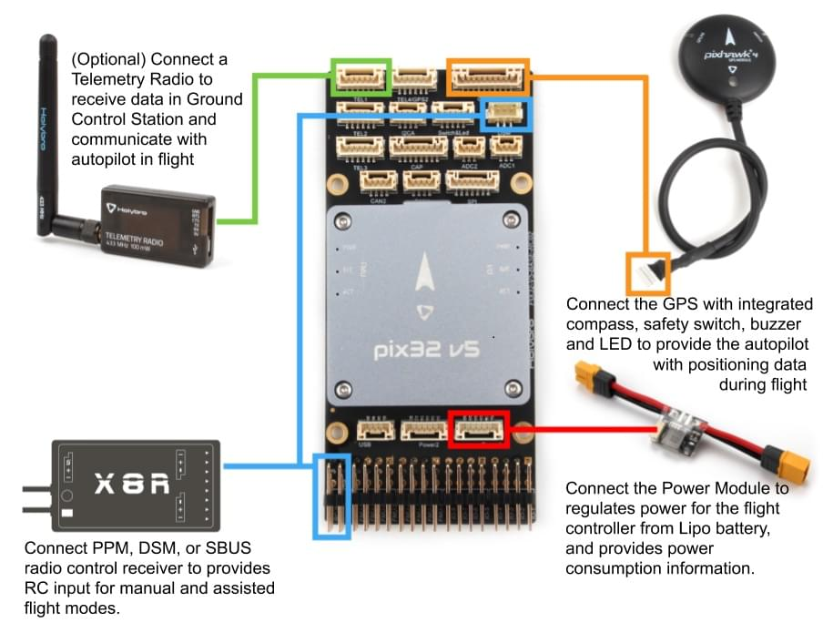

# 픽스32 v5 배선 방법

:::warning PX4에서는 이 자동항법장치를 제조하지 않습니다. 하드웨어 지원이나 호환 문제는 [제조사](https://shop.holybro.com/)에 문의하십시오.
:::

이 설명서는 [Holybro Pix32v5](../flight_controller/holybro_pix32_v5.md)&reg; 비행 콘트롤러 전원공급 방법과 주요 주변장치 연결 방법을 설명합니다.

## 포장 개봉

Pix32 v5는 *pix32 v5 베이스 보드*, 전원 모듈 *PM02 V3*과 [Pixhawk 4 GPS/Compass](https://shop.holybro.com/pixhawk-4-gps-module_p1094.html)(UBLOX NEO-M8N)를 포함한 다양한 액세서리와 함께 번들로 판매됩니다.

*PM02 V3* 전원 모듈과 *Pixhawk 4 GPS/Compass*의 상자 내용물은 다음과 같습니다. 상자에는 핀 배치 가이드 및 전원 모듈 지침과 베이스 보드(아래 회로도에는 표시되지 않음)가 포함되어 있습니다.

## 배선 개요

아래의 이미지는 주요 센서와 주변 장치(모터 및 서보 출력 제외)의 연결 방법을 설명합니다. 다음 섹션에서 각 장치에 대하여 자세히 설명합니다.

:::tip
사용 가능한 포트에 대한 자세한 내용은 [여기](http://www.holybro.com/manual/Holybro_PIX32-V5_PINOUTS_V1.1.pdf)를 참고하십시오.
:::

## 콘트롤러 장착 및 장착 방향

*Pix32 v5*은 차량의 무게 중심에 최대한 가까운 위치에 장착하여야하며, 화살표가 차량의 전방과 상향을 향하도록 합니다.

:::note
콘트롤러를 권장 방향으로 장착할 수 없는 경우 (예 : 공간 제약으로 인해) 실제 [장착 방향](../config/flight_controller_orientation.md)을 자동조종 소프트웨어를 설정하여야합니다.
:::

:::tip
보드에는 내부 진동 차단 기능이 있습니다.
콘트롤러 진동 차단 스티로폼을 사용하여 장착하시 마십시오. 일반적인 양면 테이프로 장착하여도 충분합니다.
:::

## GPS + 나침반 + 부저 + 안전 스위치 + LED

Pix32 v5은 나침반, 안전 스위치, 부저 및 LED가 통합된 [Pixhawk 4 GPS 모듈](https://shop.holybro.com/pixhawk-4-gps-module_p1094.html)에 최적화되어 있습니다. 10핀 케이블을 사용하여 **GPS 포트**에 연결합니다.

GPS/나침반은 차량 전방 표식를 사용하여 가능하면 전자 장치들에서 멀리 떨어진 프레임에 장착하는 것이 좋습니다. 나침반은 다른 전자 장치와 떨어지면 간섭이 줄어듦니다.

:::note GPS
모듈의 통합 안전 스위치는 *기본적으로* 활성화되어 있습니다. 활성화되면 PX4는 차량 시동을 걸 수 없습니다. 비활성화하려면 안전 스위치를 1초간 길게 누르십시오. 안전 스위치를 다시 눌러 안전 장치를 활성화하고 기체 시동을 끌 수 있습니다. 조종기나 지상국 프로그램에서 기체 시동을 끌 수 없는 상황에서 유용합니다.
:::

## 전원

전원 모듈 또는 배전 보드를 사용하여 모터와 서보에 전원을 공급하고 소비 전력을 측정할 수 있습니다. 권장되는 전원 모듈은 아래와 같습니다.

### PM02 v3 전원 모듈

[전원 모듈 (PM02 v3)](https://shop.holybro.com/power-modulepm02-v3_p1185.html)은 *pix32 v5*와 함께 번들로 제공될 수 있습니다. It provides regulated power to flight controller and sends battery voltage/current to the flight controller.

그림과 같이 *전원 모듈*을 연결합니다.

- PM 전압/전류 포트 : 제공된 6선 GH 케이블을 사용하여 POWER1 포트 (또는  `POWER2`)에 연결합니다.
- PM 입력 (XT60 수 커넥터) : LiPo 배터리 (2 ~ 12S)에 연결합니다.
- PM 전원 출력 (XT60 암 커넥터) : 모든 모터 ESC에 배선합니다.

:::tip
이 전원 모듈에는 배전 배선이 포함되어 있지 않으므로, 모든 ESC를 전원 모듈 출력에 병렬로 연결하여야 합니다. ESC는 적합한 전압이 공급되어야 합니다.
:::

:::tip
**MAIN/AUX**의 8 핀 전원 (+) 레일은 비행 콘트롤러의 전원 모듈에서 전원이 공급되지 않습니다. 방향타, 엘레본 등의 서보를 구동하기 위해 별도로 전원을 공급해야하는 경우에는 파워 레일을 BEC 장착 ESC 또는 독립형 5V BEC나 2S LiPo 배터리에 연결합니다. 사용하는 서보의 전압을 확인하십시오.
:::

전원 모듈에는 다음과 같은 특성과 제약 사항이 있습니다.
- 최대 입력 전압 : 60V
- 최대 전류 감지 : 120A 전압
- SV ADC 스위칭 레귤레이터 출력에 대해 구성된 전류 측정은 최대 5.2V 및 3A를 출력합니다.
- 무게 : 20g
- 패키지 내용물 :
  - PM02 보드
  - 6 핀 MLX 케이블 (1)
  - 6 핀 GH 케이블 (1)

:::note
[PM02v3 전원 모듈 설명서](http://www.holybro.com/manual/Holybro_PM02_v3_PowerModule_Manual.pdf) (Holybro)를 참고하십시오.
:::

### 배터리 설정

배터리 설정은 [전원 설정](../config/battery.md)에서 설정합니다. 전원 모듈의 *셀의 갯수*를 설정하여야 합니다.

다른 전원 모듈(예 : Pixracer의 모듈)을 사용하지 않으면 *전압 분배기*를 업데이트 할 필요는 없습니다.

## 무선 조종

리모트 컨트롤(RC) 라디오 시스템은 기체를 *수동* 제어시에 사용합니다. PX4의 자율 비행 모드에는 라디오 시스템은 필수 항목은 아닙니다.

[호환되는 송신기/수신기를 선택](../getting_started/rc_transmitter_receiver.md)후 *바인딩*을 하여야 통신이 가능합니다. 송신기/수신기의 매뉴얼을 참고하십시오.

아래의 지침은 여러가지 유형의 수신기를 *Pix32 v5*를 연결하는 방법을 설명합니다.

- Spektrum/DSM 수신기는 **DSM RC** 입력에 연결합니다.

  

- PPM 방식 과 S 버스 방식의 수신기는 **SBUS_IN/PPM_IN** 입력 포트 (RC IN으로 표시됨)에 연결합니다.

  

- *각각의 채널이 독립적으로 배선된* PPM/PWM 수신기는 반드시 **PPM RC**포트에 *PPM 인코더를 통해* [아래와 같이](http://www.getfpv.com/radios/radio-accessories/holybro-ppm-encoder-module.html)연결하여야 합니다. PPM-Sum 수신기는 모든 채널에 하나의 전선만 사용합니다.

무선 시스템 선택, 수신기 호환성 및 송신기/수신기 바인딩에 대한 자세한 내용은 [원격 제어 송신기 & 수신기](../getting_started/rc_transmitter_receiver.md)를 참고하십시오.

## 무선 텔레메트리(선택 사항)

무선 텔레메트리는 지상국 프로그램에서 비행 차량의 통신/제어에 사용합니다(예 : UAV를 특정 위치로 지시하거나 새 임무를 업로드 할 수 있음).

기체의 텔레메트리를 **TELEM1** 포트에 연결하여야 합니다 (이 포트에 연결된 경우 추가 설정이 필요하지 않음). 다른 텔레메트리는 일반적으로 지상국 컴퓨터나 모바일 장치에 USB를 통하여 연결됩니다.

## SD 카드 (선택 사항)

SD 카드는 일반적으로 [세부 비행 기록 및 분석](../getting_started/flight_reporting.md)에 사용됩니다. 마이크로 SD 카드는 pix32 v5에 미리 설치되어 있어야하며, 별도의 마이크로 SD 카드가있는 경우 아래 그림과 같이 *pix32 v5*에 카드를 삽입하십시오.

:::tip
SanDisk Extreme U3 32GB를 사용하는 것을 [적극 권장](../dev_log/logging.md#sd-cards)합니다.
:::

## 모터

모터/서보 제어 신호는 **I/O PWM OUT** (**MAIN OUT**) 및 **FMU PWM OUT** (**AUX**)에 연결합니다. 포트는 [기체 정의서](../airframes/airframe_reference.md)에서 지정된 순서대로 연결합니다.

  

모터는 별도 [전원을 공급](#power)하여야 합니다.

:::note
프레임이 기체 참조 정의서에 없으면, 적절한 유형의 "일반"기체를 사용하십시오.
:::

## 기타 주변 장치

주변 장치 배선 및 설정에 관한 선택 사항은 개별 [주변 장치](../peripherals/README.md)를 참고하십시오.

## 핀배열

[Pix32 v5 핀배열](http://www.holybro.com/manual/Holybro_PIX32-V5_PINOUTS_V1.1.pdf) (Holybro)

## 설정

더 자세한 일반적인 설정 방법은 [자동항법장치 설정](../config/README.md)을 참고하십시오.

QuadPlane에 대한 자세한 설정 방법은 [QuadPlane VTOL 설정](../config_vtol/vtol_quad_configuration.md)을 참고하십시오.

<!-- Nice to have detailed wiring infographic and instructions for different vehicle types. --> 

## 추가 정보

- [Pix32 v5 개요](../flight_controller/holybro_pix32_v5.md) (개요 페이지)
- [Pix32 v5  기술 데이터 시트](http://www.holybro.com/manual/Holybro_PIX32-V5_technical_data_sheet_v1.1.pdf)
- [Pix32 v5 핀배열](http://www.holybro.com/manual/Holybro_PIX32-V5_PINOUTS_V1.1.pdf)
- [Pix32 v5 기본 회로도](http://www.holybro.com/manual/Holybro_PIX32-V5-BASE-Schematic_diagram.pdf)
- [Pix32 v5 기본 구성 요소 레이아웃](http://www.holybro.com/manual/Holybro_PIX32-V5-BASE-ComponentsLayout.pdf)
- [FMUv5 레퍼런스 디자인 핀배열](https://docs.google.com/spreadsheets/d/1-n0__BYDedQrc_2NHqBenG1DNepAgnHpSGglke-QQwY/edit#gid=912976165).
