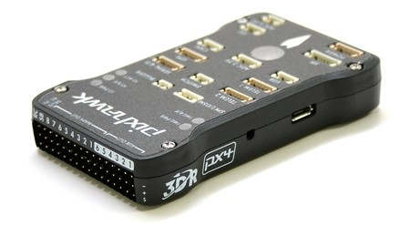
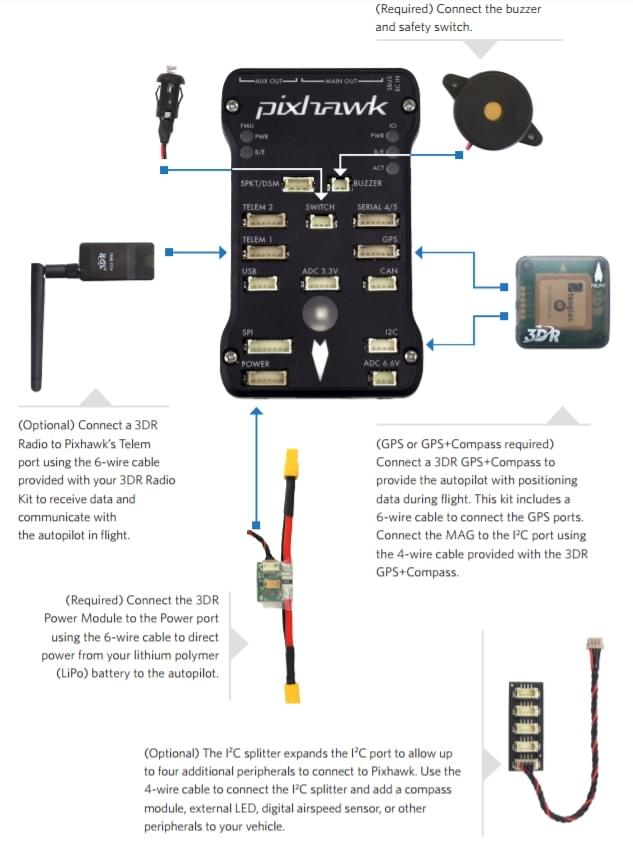
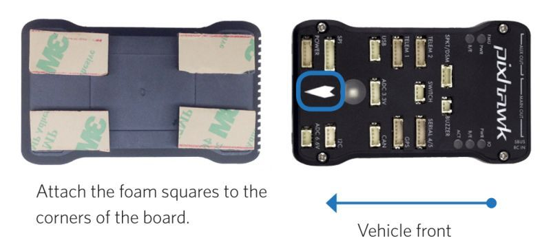
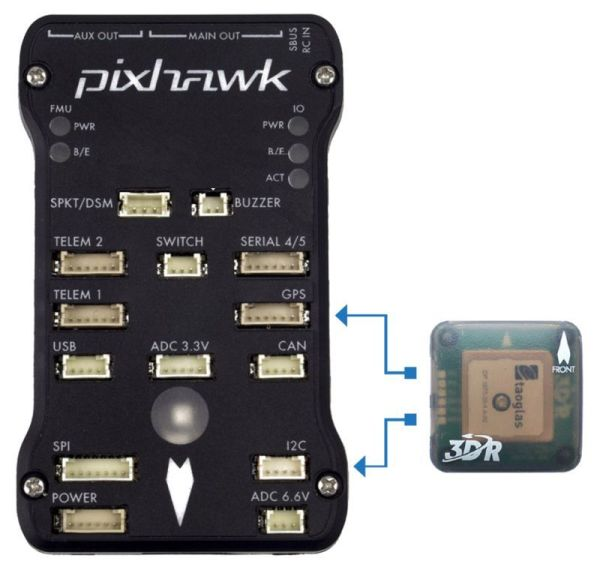
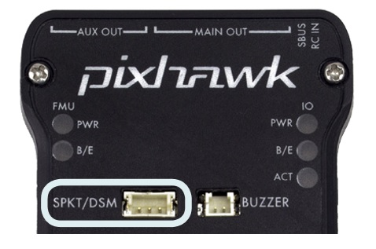
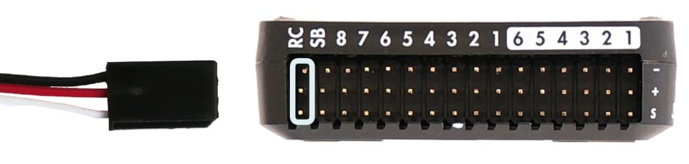
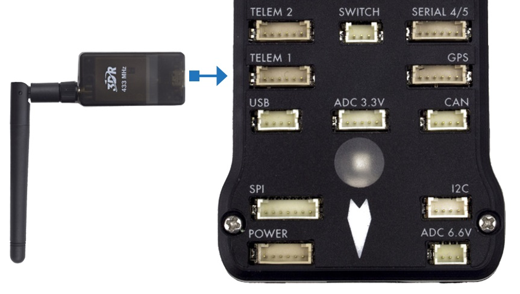
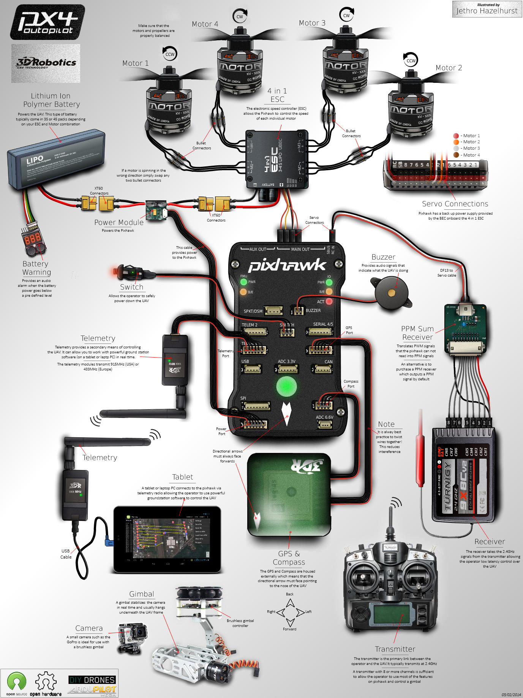

# Pixhawk 배선 개요

:::warning PX4에서는 이런 종류의 자동 항법 장치를 제조하지는 않습니다. 하드웨어 지원 또는 호환 문제는 [제조사](https://store.mrobotics.io/)와 상담하십시오.
:::

이 설명서는 *3DR Pixhawk * 비행 컨트롤러의 전원 공급 방법과 주변 장치 연결 방법을 설명합니다.

:::note
[3DR Pixhawk](../flight_controller/pixhawk.md)는 더 이상 3DR에서 사용할 수 없습니다. [Pixhawk FMUv2 아키텍처](../flight_controller/pixhawk_series.md)를 기반으로하는 비행 컨트롤러는 다른 회사에서 구입할 수 있습니다 (동일한 연결, 출력, 기능 등을 공유 하고 유사한 방식으로 연결됨).
:::

## 배선 개요

아래 이미지는 표준 Pixhawk 연결을 보여줍니다 (모터 및 서보 출력 제외). 다음 섹션에서 각 장치에 대해 자세히 설명합니다.

:::note
자세한 배선 정보는 [아래에 표시](#detailed-wiring-infographic-copter) 됩니다.
:::

## 콘트롤러 장착 및 장착 방향

*Pixhawk *는 진동 방지 폼 패드(키트에 포함)를 프레임에 장착해야 합니다. 차량의 무게 중심에 최대한 가깝게 배치 된 프레임에 장착해야하며 화살표가 차량의 앞쪽과 위쪽을 향하도록 하여야 합니다.

:::note
컨트롤러를 권장/기본 방향으로 장착하기 어려운 경우에는 (예 : 공간 제약으로 인해) 실제 장착한 방향을 소프트웨어에 설정하여야 합니다 ( [기체 콘트롤러 방향 ](../config/flight_controller_orientation.md) 참고).
:::

## 부저와 안전 스위치

포함된 부저와 안전 스위치를 아래 그림과 같이 연결하십시오 (필수).

## GPS와 나침반

키트에 제공된 6선 케이블을 사용하여 GPS (필수)를 GPS 포트에 연결합니다. 다른 방법으로는, 4선 케이블을 사용하여 I2C 포트에 나침반을 연결합니다 (Pixhawk에는 필요한 경우 사용할 수있는 내부 나침반이 있음).

:::note
아래 다이어그램은 결합된 GPS와 나침반을 나타냅니다. GPS/나침반은 차량 전명 방향 표시를 사용하여 가능한 한 다른 전자 장치에서 멀리 떨어진 프레임에 장착해야합니다 (나침반을 다른 전자 장치와 분리하면 간섭이 줄어듦).
:::

## 전원

그림과 같이 6선 케이블을 사용하여 *전원 모듈*(PM)의 출력을 **POWER** 포트에 연결합니다. PM 입력은 LiPo 배터리에 연결되고 메인 출력은 차량 ESC/모터에 전원을 공급합니다 (배전판을 통해 가능).

전원 모듈은 비행 컨트롤러에 배터리 전원을 공급하고 모듈을 통해 공급되는 아날로그 전류 및 전압에 대한 정보를 전송합니다 (비행 컨트롤러 및 모터에 대한 전원 포함).

:::warning
전원 모듈은 비행 컨트롤러 자체에 전원을 공급하지만 컨트롤러의 출력 포트 (레일)에 연결된 서보 및 기타 하드웨어에 전원을 공급할 수 없습니다. 콥터의 경우 모터가 별도로 전원이 공급되기 때문에 이것은 중요하지 않습니다.
:::

비행기 및 VTOL의 경우 방향타, 엘레 본 등의 서보를 구동하려면 출력 레일에 별도로 전원을 공급하여야 합니다. 종종 메인 푸셔/풀러 모터는 Pixhawk 출력 레일에 연결할 수있는 통합 [BEC](https://en.wikipedia.org/wiki/Battery_eliminator_circuit)가있는 ESC를 사용합니다. 그렇지 않으면, 여분의 Pixhawk 포트에 연결하기 위해 5V BEC를 설정해야합니다 (전원이 없으면 서보가 작동하지 않음).

<!-- It would be good to have real example of this powering -->

## 무선 조종

무선 조종기는 기체 *수동*제어시에 사용합니다 (PX4에는 자율 비행 모드에서는 무선 조종기가 필수는 아닙니다).

기체와 조종자가 서로 통신하기 위해 호환되는 송신기/수신기를 선택하고, 송신기와 수신기를 바인드해야 합니다 (송신기와 수신기에 포함된 지시사항을 읽으십시오).

아래 지침은 다양한 유형의 수신기의 Pixhawk 연결법을 설명합니다.

- Spektrum 및 DSM 수신기는 **SPKT/DSM** 포트에 연결하여야 합니다. 

- PPM-SUM 및 S.BUS 수신기는 그림과 같이 **RC** 접지, 전원 및 신호 핀에 연결됩니다. 

- *각각의 채널이 독립적으로 배선된*PPM/PWM 수신기는 반드시** PPM RC**포트에 *PPM 인코더를 통해* [아래와 같이](http://www.getfpv.com/radios/radio-accessories/holybro-ppm-encoder-module.html)연결하여야 합니다 (PPM-Sum 수신기는 모든 채널에 하나의 전선만 사용합니다).

무선 시스템 선택, 수신기 호환성 및 송신기/수신기 쌍 바인딩에 대한 자세한 내용은 다음을 참조하십시오. [ 원격 제어 송신기 & amp; 수신자 ](../getting_started/rc_transmitter_receiver.md).

## 무선 텔레메트리(선택 사항)

무선 텔레메트리는 지상국 프로그램에서 비행중인 차량의 통신/제어에 사용할 수 있습니다 (예 : UAV를 특정 위치로 지시하거나 새 임무를 업로드 할 수 있음). 아래 그림과 같이 하나의 무전기를 차량에 연결해야합니다. 다른 텔레메트리는 일반적으로 지상국 컴퓨터나 모바일 장치에 (USB를 통해) 연결됩니다.

<!-- what configuration is required once you've set up a radio) -->

## 모터

지원되는 모든 기체의 MAIN/AUX 출력 포트와 모터/서보 간의 매핑은 [기체 정의서](../airframes/airframe_reference.md)에 기술되어 있습니다.

:::caution
매핑이 프레임간에 일관되지 않습니다 (예 : 모든 평면 프레임에 대해 동일한 출력에있는 스로틀에 의존 할 수 없음). 가지고 있는 기체의 프레임에 대해 올바르게 모터를 연결했는지 다시 한 번 확인하십시오.
:::

:::tip
프레임이 기체 참조 목록에 없으면, 올바른 유형의 "일반"기체를 사용하십시오.
:::

:::note
출력 레일은 위의 [전원](#power) 섹션에 언급한 바와 같이 별도의 전원이 공급되어야합니다.
:::

<!-- INSERT image of the motor AUX/MAIN ports? -->

## 기타 주변 장치

선택적인 주변 장치의 배선 및 구성은 개별 [주변 장치](../peripherals/README.md)에 대한 항목에서 기술합니다.

## 설정

더 자세한 일반 구성 정보는 [Autopilot 설정](../config/README.md)편에서 다룹니다.

QuadPlane에 대한 자세한 설정은 [QuadPlane VTOL 설정](../config_vtol/vtol_quad_configuration.md)에서 다룹니다.

<!-- what about config of other vtol types and plane. Do the instructions in these ones above apply for tailsitters etc? -->

## 자세한 배선 정보 (헬기)

## 추가 정보

- [Pixhawk 시리즈](../flight_controller/pixhawk_series.md)
- [3DR Pixhawk](../flight_controller/pixhawk.md)