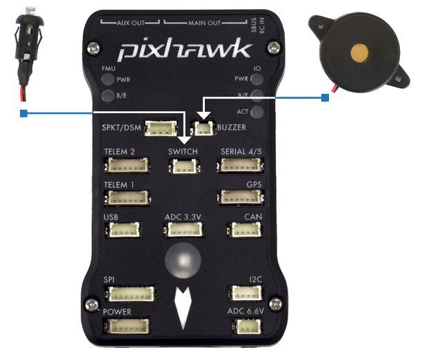

# Pixhawk 배선 개요

:::warning PX4에서는 이런 종류의 자동 항법 장치를 제조하지는 않습니다. 하드웨어 지원 또는 호환 문제는 [제조사](https://store.mrobotics.io/)와 상담하십시오.
:::

이 설명서는 *3DR Pixhawk * 비행 컨트롤러의 전원 공급 방법과 주변 장치 연결 방법을 설명합니다.

:::note
[3DR Pixhawk](../flight_controller/pixhawk.md)는 더 이상 3DR에서 사용할 수 없습니다. [Pixhawk FMUv2 아키텍처](../flight_controller/pixhawk_series.md)를 기반으로하는 비행 컨트롤러는 다른 회사에서 구입할 수 있습니다 (동일한 연결, 출력, 기능 등을 공유 하고 유사한 방식으로 연결됨).
:::

## 배선 개요

아래 이미지는 표준 Pixhawk 연결을 보여줍니다 (모터 및 서보 출력 제외). 다음 섹션에서 각 장치에 대해 자세히 설명합니다.

:::note
자세한 배선 정보는 [아래에 표시](#detailed-wiring-infographic-copter) 됩니다.
:::

## 콘트롤러 장착 및 장착 방향

*Pixhawk *는 진동 방지 폼 패드(키트에 포함)를 프레임에 장착해야 합니다. 차량의 무게 중심에 최대한 가깝게 배치 된 프레임에 장착해야하며 화살표가 차량의 앞쪽과 위쪽을 향하도록 하여야 합니다.

:::note
컨트롤러를 권장/기본 방향으로 장착하기 어려운 경우에는 (예 : 공간 제약으로 인해) 실제 장착한 방향을 소프트웨어에 설정하여야 합니다 ( [기체 콘트롤러 방향 ](../config/flight_controller_orientation.md) 참고).
:::

## 부저와 안전 스위치

포함된 부저와 안전 스위치를 아래 그림과 같이 연결하십시오 (필수).

## GPS와 나침반

키트에 제공된 6선 케이블을 사용하여 GPS (필수)를 GPS 포트에 연결합니다. 다른 방법으로는, 4선 케이블을 사용하여 I2C 포트에 나침반을 연결합니다 (Pixhawk에는 필요한 경우 사용할 수있는 내부 나침반이 있음).

:::note
아래 다이어그램은 결합된 GPS와 나침반을 나타냅니다. GPS/나침반은 차량 전명 방향 표시를 사용하여 가능한 한 다른 전자 장치에서 멀리 떨어진 프레임에 장착해야합니다 (나침반을 다른 전자 장치와 분리하면 간섭이 줄어듦).
:::

## 전원

그림과 같이 6선 케이블을 사용하여 *전원 모듈*(PM)의 출력을 **POWER** 포트에 연결합니다. PM 입력은 LiPo 배터리에 연결되고 메인 출력은 차량 ESC/모터에 전원을 공급합니다 (배전판을 통해 가능).

전원 모듈은 비행 컨트롤러에 배터리 전원을 공급하고 모듈을 통해 공급되는 아날로그 전류 및 전압에 대한 정보를 전송합니다 (비행 컨트롤러 및 모터에 대한 전원 포함).

:::warning
전원 모듈은 비행 컨트롤러 자체에 전원을 공급하지만 컨트롤러의 출력 포트 (레일)에 연결된 서보 및 기타 하드웨어에 전원을 공급할 수 없습니다. 콥터의 경우 모터가 별도로 전원이 공급되기 때문에 이것은 중요하지 않습니다.
:::

비행기 및 VTOL의 경우 방향타, 엘레 본 등의 서보를 구동하려면 출력 레일에 별도로 전원을 공급하여야 합니다. 종종 메인 푸셔/풀러 모터는 Pixhawk 출력 레일에 연결할 수있는 통합 [BEC](https://en.wikipedia.org/wiki/Battery_eliminator_circuit)가있는 ESC를 사용합니다. 그렇지 않으면, 여분의 Pixhawk 포트에 연결하기 위해 5V BEC를 설정해야합니다 (전원이 없으면 서보가 작동하지 않음).

<!-- It would be good to have real example of this powering -->

## 무선 조종

무선 조종기는 기체 *수동*제어시에 사용합니다 (PX4에는 자율 비행 모드에서는 무선 조종기가 필수는 아닙니다).

기체와 조종자가 서로 통신하기 위해 호환되는 송신기/수신기를 선택하고, 송신기와 수신기를 바인드해야 합니다 (송신기와 수신기에 포함된 지시사항을 읽으십시오).

아래 지침은 다양한 유형의 수신기의 Pixhawk 연결법을 설명합니다.

- Spektrum 및 DSM 수신기는 **SPKT/DSM** 포트에 연결하여야 합니다. 

- PPM-SUM 및 S.BUS 수신기는 그림과 같이 **RC** 접지, 전원 및 신호 핀에 연결됩니다. 

- PPM and PWM receivers that have an *individual wire for each channel* must connect to the **RC** port *via a PPM encoder* [like this one](http://www.getfpv.com/radios/radio-accessories/holybro-ppm-encoder-module.html) (PPM-Sum receivers use a single signal wire for all channels).

For more information about selecting a radio system, receiver compatibility, and binding your transmitter/receiver pair, see: [Remote Control Transmitters & Receivers](../getting_started/rc_transmitter_receiver.md).

## Telemetry Radios (Optional)

Telemetry radios may be used to communicate and control a vehicle in flight from a ground station (for example, you can direct the UAV to a particular position, or upload a new mission). One radio must be connected to your vehicle as shown below. The other is connected to your ground station computer or mobile device (usually by USB).

<!-- what configuration is required once you've set up a radio) -->

## Motors

The mappings between MAIN/AUX output ports and motor/servos for all supported air and ground frames are listed in the [Airframe Reference](../airframes/airframe_reference.md).

:::caution
The mapping is not consistent across frames (e.g. you can't rely on the throttle being on the same output for all plane frames). Make sure to use the correct mapping for your vehicle.
:::

:::tip
If your frame is not listed in the reference then use a "generic" airframe of the correct type.
:::

:::note
The output rail must be separately powered, as discussed in the [Power](#power) section above.
:::

<!-- INSERT image of the motor AUX/MAIN ports? -->

## Other Peripherals

The wiring and configuration of other components is covered within the topics for individual [peripherals](../peripherals/README.md).

## Configuration

General configuration information is covered in: [Autopilot Configuration](../config/README.md).

QuadPlane specific configuration is covered here: [QuadPlane VTOL Configuration](../config_vtol/vtol_quad_configuration.md)

<!-- what about config of other vtol types and plane. Do the instructions in these ones above apply for tailsitters etc? -->

## Detailed Wiring Infographic (Copter)

## Further information

- [Pixhawk Series](../flight_controller/pixhawk_series.md)
- [3DR Pixhawk](../flight_controller/pixhawk.md)