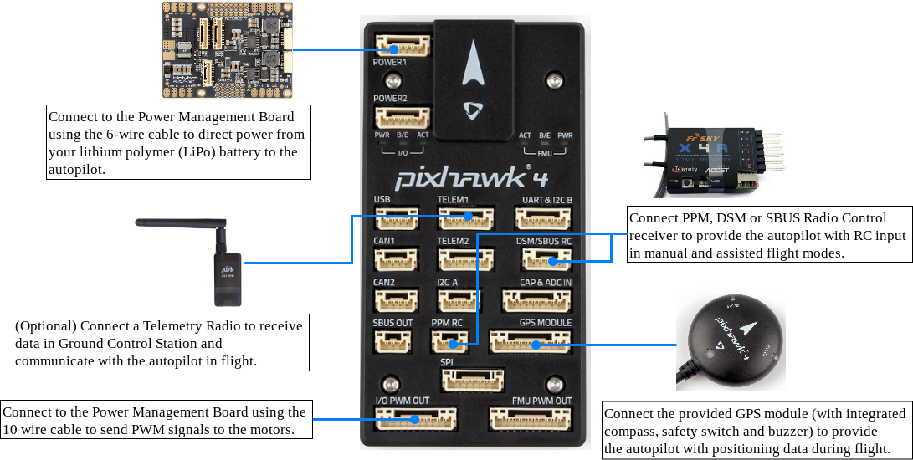
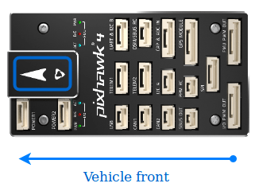
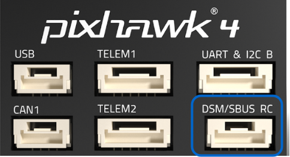
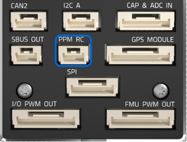
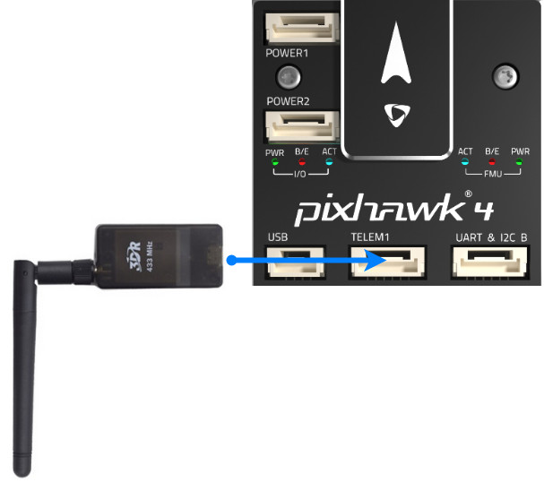
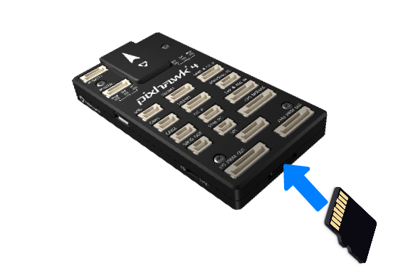

# Pixhawk 4 배선 개요

:::warning PX4에서는 이런 종류의 자동 항법 장치를 제조하지는 않습니다. 하드웨어 지원 또는 호환 문제는 [제조사](https://shop.holybro.com/)와 상담하십시오.
:::

이 설명서는 [Pixhawk 4](../flight_controller/pixhawk4.md)&reg; 비행 컨트롤러의 전원을 공급방법과 주변 장치를 연결하는 방법을 설명합니다.

## 배선 개요

아래의 이미지는 가장 중요한 센서 및 주변 장치 (모터 및 서보 출력 제외)를 연결하는 방법을 나타냅니다. 다음 섹션에서 각 장치에 대해 자세히 설명합니다.

:::tip
사용 가능한 포트에 대한 자세한 내용은 [ Pixhawk 4 > 연결방법 ](../flight_controller/pixhawk4.md#connectors)에서 찾을 수 있습니다.
:::

## 콘트롤러 장착 및 장착 방향

*Pixhawk 4*는 진동 방지 폼 패드(키트에 포함)를 프레임에 장착해야 합니다. 차량의 무게 중심에 최대한 가깝게 배치 된 프레임에 장착해야하며 화살표가 차량의 앞쪽과 위쪽을 향하도록 하여야 합니다.

:::note
컨트롤러를 권장/기본 방향으로 장착하기 어려운 경우에는 (예 : 공간 제약으로 인해) 실제 장착한 방향을 소프트웨어에 설정하여야 합니다 ( [기체 콘트롤러 방향 ](../config/flight_controller_orientation.md) 참고).
:::

## GPS + 나침반 + 부저 + 안전 스위치 + LED

나침반, 안전 스위치, 부저 및 LED 통합 GPS를 **GPS MODULE** 포트에 연결합니다.

GPS/나침반은 차량 전명 방향 표시를 사용하여 가능한 한 다른 전자 장치에서 멀리 떨어진 프레임에 장착해야합니다 (나침반을 다른 전자 장치와 분리하면 간섭이 줄어듦).

:::note GPS
모듈의 통합 안전 스위치는 *기본적으로* 활성화되어 있습니다 (활성화되면 PX4는 차량 시동을 걸 수 없습니다). 비활성화하려면 안전 스위치를 1초간 길게 누르십시오. 안전 스위치를 다시 눌러 안전 장치를 활성화하고 기체 시동을 끌 수 있습니다 (어떤 이유로든 조종기나 지상국 프로그램이 기체 시동을 끌 수 없을 때 유용합니다).
:::

## 전원

키트와 함께 제공되는 * 전원 관리 보드 * (PM 보드)의 6개의 케이블을 사용하여 * Pixhawk 4 *의 ** POWER ** 브릭중 하나에 연결합니다. PM 입력 **2 ~ 12S **는 LiPo 배터리에 연결됩니다. ESC 및 서보에 대한 전원 공급 및 신호 연결을 포함한 전원 관리 보드의 연결은 아래 표에 설명되어 있습니다. PM 보드는 **FMU PWM-OUT**의 + 및 -핀을 통하여 서보에 전원을 공급하지 않습니다.

아래의 이미지는 *Pixhawk 4*와 함께 제공되는 전원 관리 보드입니다.

:::note
고정익 또는 자동차로 사용하는 경우 **FMU PWM-OUT**의 8 핀 전원 (+) 레일에 러더, 엘레 본 등의 서보를 구동하려면 별도로 전원을 공급하여야 합니다. 전원 레일을 BEC가 장착 된 ESC 또는 독립형 5V BEC 또는 2S LiPo 배터리에 연결하여야 합니다. 서보의 전압에주의하십시오.
:::

| 핀 & 커넥터     | 기능                                                                      |
| ----------- | ----------------------------------------------------------------------- |
| I/O PWM-IN  | *Pixhawk 4*에 연결하려면 아래를 참조하십시오.                                          |
| M1          | I/O PWM OUT 1 : 신호선을 모터 1의 ESC에 연결합니다.                                  |
| M2          | I/O PWM OUT 2 : 신호선을 모터 2의 ESC에 연결합니다.                                  |
| M3          | I/O PWM OUT 3 : 신호선을 모터 3의 ESC에 연결합니다.                                  |
| M4          | I/O PWM OUT 4 : 신호선을 모터 4의 ESC에 연결합니다.                                  |
| M5          | I/O PWM OUT 5 : 신호선을 모터 5의 ESC에 연결합니다.                                  |
| M6          | I/O PWM OUT 6 : 신호선을 모터 6의 ESC에 연결합니다.                                  |
| M7          | I/O PWM OUT 7 : 신호선을 모터 7의 ESC에 연결합니다.                                  |
| M8          | I/O PWM OUT 8 : 신호선을 모터 8의 ESC에 연결합니다.                                  |
| FMU PWM-IN  | *Pixhawk 4*에 연결하려면 아래를 참조하십시오.                                          |
| FMU PWM-OUT | FMU PWM-IN이 *Pixhawk 4*에 연결된 경우 신호선을 ESC 또는 신호에 연결하고 +, - 선을 서보에 연결합니다. |
| CAP&ADC-OUT | CAP에 연결 & amp; *Pixhawk 4*의 ADC IN 포트                                   |
| CAP&ADC-OUT | CAP & amp; ADC 입력 : 보드 뒷면에 핀아웃이 인쇄되어 있습니다.                              |
| B+          | ESC에 전원을 공급하기 위해 ESC B +에 연결                                            |
| GND         | ESC 접지에 연결                                                              |
| PWR1        | 5v 출력 3A, *Pixhawk 4* POWER 1에 연결                                       |
| PWR2        | 5v 출력 3A, *Pixhawk 4* POWER 2에 연결                                       |
| 2~12S       | 전원 입력, 12S LiPo 배터리에 연결                                                 |

:::note
기체 유형에 따라 [기체 정의서](../airframes/airframe_reference.md)를 참조하여 *Pixhawk 4*의 **I/O PWM OUT ** 및 ** FMU PWM OUT ** 포트를 PM 보드에 연결하십시오. PX4 펌웨어의 **MAIN ** 출력은 *Pixhawk 4*의 **I/O PWM OUT** 포트에 매핑되는 반면 **AUX 출력**은 *Pixhawk 4*의 ** FMU PWM OUT **에 매핑됩니다. 예를 들어 **MAIN1**은 **I/O PWM OUT**의 IO_CH1 핀에 매핑되고 **AUX1**은 **FMU PWM OUT**의 FMU_CH1 핀에 매핑됩니다. PM 보드의 **FMU PWM-IN**은 내부적으로 서보를 구동하는 데 사용되는 **FMU PWM-OUT**에 연결됩니다 (예 : 에일러론, 엘리베이터, 방향타, 엘레 본, 기어, 플랩, 짐벌, 스티어링). PM 보드의 **I/O PWM-IN**은 모터 구동에 사용되는 **M1-8**에 내부적으로 연결됩니다 (예 : 평면, VTOL 및 로버의 스로틀).
:::

아래의 표는 기체 기준에 따라 *Pixhawk 4*의 PWM OUT 포트를 PM 보드의 PWM-IN 포트에 연결하는 방법을 요약한 것입니다.

| 기체 참고        | *Pixhawk 4* -> PM 보드간 연결   |
| ------------ | -------------------------- |
| **MAIN**: 모터 | I/O PWM OUT --> I/O PWM IN |
| **MAIN**: 서보 | I/O PWM OUT --> FMU PWM IN |
| **AUX**: 모터  | FMU PWM OUT --> I/O PWM IN |
| **AUX**: 서보  | FMU PWM OUT --> FMU PWM IN |

<!--In the future, when Pixhawk 4 kit is available, add wiring images/videos for different airframes.-->

*Pixhawk 4* 전원 포트의 핀아웃은 다음과 같습니다. 전류 신호는 기본적으로 0-120A에 대하여 0-3.3V의 아날로그 전압을 전달하여야 합니다. 전압 신호는 기본적으로 0-60V에 대하여 0-3.3V의 아날로그 전압을 전달하여야 합니다. VCC 라인은 최소 3A 연속을 제공해야하며 기본적으로 5.1V로 설정되어야 합니다. 5V의 더 낮은 전압은 여전히 허용되지만 권장되지 않습니다.

| 핀        | 신호  | 전압    |
| -------- | --- | ----- |
| 1(red)   | VCC | +5V   |
| 2(black) | VCC | +5V   |
| 3(black) | 전류  | +3.3V |
| 4(black) | 전압  | +3.3V |
| 5(black) | 접지  | GND   |
| 6(black) | 접지  | GND   |

:::note
키트와 함께 제공되는 전원 모듈을 사용하면 [전원 설정](https://docs.qgroundcontrol.com/en/SetupView/Power.html)에서 *셀 수*를 구성해야하지만 *전압 분배기를 보정 할 필요가 없습니다. *. 다른 전원 모듈 (예 : Pixracer의 모듈)을 사용하는 경우 *전압 분배기*를 업데이트하여야 합니다.
:::

## 무선 조종

리모트 컨트롤(RC) 라디오 시스템은 기체를 *수동*으로 제어할 때 필요합니다 (PX4에는 자율 비행 모드를 위한 라디오 시스템이 필요하지 않습니다).

기체와 조종자가 서로 통신하기 위해 [호환되는 송신기/수신기를 선택하고](../getting_started/rc_transmitter_receiver.md), 송신기와 수신기를 *바인드*해야 합니다 (송신기와 수신기에 포함된 지시사항을 읽으십시오).

아래 지침은 다양한 유형의 수신기의 * Pixhawk 4* 연결법을 설명합니다.

- Spektrum/DSM 수신기는 **DSM/SBUS RC** 입력에 연결됩니다.
    
    

- PPM 수신기는 **PPM RC** 입력 포트에 연결됩니다.
    
    

- *각각의 채널이 독립적으로 배선된* PPM/PWM 수신기는 반드시 **PPM RC**포트에 *PPM 인코더를 통해* [아래와 같이](http://www.getfpv.com/radios/radio-accessories/holybro-ppm-encoder-module.html)연결해야 합니다 (PPM-Sum 수신기는 모든 채널에 하나의 전선만 사용합니다).

무선 시스템 선택, 수신기 호환성 및 송신기 / 수신기 쌍 바인딩에 대한 자세한 내용은 다음을 참조하십시오. [ 원격 제어 송신기 & amp; 수신자 ](../getting_started/rc_transmitter_receiver.md).

## 무선 텔레메트리(선택 사항)

무선 텔레메트리는 지상국 프로그램에서 비행중인 차량의 통신/제어에 사용할 수 있습니다 (예 : UAV를 특정 위치로 지시하거나 새 임무를 업로드 할 수 있음).

기체의 텔레메트리를 **TELEM1** 포트에 연결해야 합니다 (이 포트에 연결된 경우 추가 구성이 필요하지 않음). 다른 텔레메트리는 일반적으로 지상국 컴퓨터나 모바일 장치에 (USB를 통해) 연결됩니다.

## SD 카드 (선택 사항)

SD 카드는 [ 비행 세부 정보를 기록 및 분석 ](../getting_started/flight_reporting.md)하고, 임무를 수행하고, UAVCAN 버스 하드웨어를 사용하는 데 필요하므로 가능하면 사용하는 것이 좋습니다. 아래 그림과 같이 카드 (Pixhawk 4 키트에 포함됨)를 *Pixhawk 4*에 삽입합니다.

:::tip
자세한 내용은 [ 기본 개념> SD 카드 (이동식 메모리) ](../getting_started/px4_basic_concepts.md#sd_cards)를 참조하십시오.
:::

## 모터

모터/서보 신호는 ** I/O PWM OUT ** (** MAIN OUT **) 및 ** FMU PWM OUT ** (** AUX **)에 연결됩니다. ) 포트는 [ Airframe Reference ](../airframes/airframe_reference.md)에서 차량에 지정된 순서로 지정됩니다.

:::note
이 참고사항은 모든 지원되는 기체/기기 프레임의 출력 포트의 모터/서보 연결 리스트입니다 (만약 프레임이 참고사항에 기재되어 있지 않다면, 올바른 유형의 "일반" 프레임을 사용하십시오).
:::

:::caution
매핑이 프레임간에 일관되지 않습니다 (예 : 모든 평면 프레임에 대해 동일한 출력에있는 스로틀에 의존 할 수 없음). 가지고 있는 기체의 프레임에 대해 올바르게 모터를 연결했는지 다시 한 번 확인하십시오.
:::

## 기타 주변 장치

선택적인 주변 장치의 배선 및 구성은 개별 [주변 장치](../peripherals/README.md)에 대한 항목에서 다룹니다.

## 핀아웃

[Pixhawk 4 핀아웃](http://www.holybro.com/manual/Pixhawk4-Pinouts.pdf) (Holybro)

## 설정

더 자세한 일반 구성 정보는 [Autopilot 구성](../config/README.md)에서 다룹니다.

QuadPlane에 대한 자세한 설정은 [QuadPlane VTOL 설정](../config_vtol/vtol_quad_configuration.md)에서 다룹니다.

<!-- Nice to have detailed wiring infographic and instructions for different vehicle types. -->

## 추가 정보

- [Pixhawk 4](../flight_controller/pixhawk4.md) (개요 페이지)
- [Pixhawk 4 기술 데이터 시트](https://github.com/PX4/px4_user_guide/raw/master/assets/flight_controller/pixhawk4/pixhawk4_technical_data_sheet.pdf)
- [Pixhawk 4 Pinouts](http://www.holybro.com/manual/Pixhawk4-Pinouts.pdf) (Holybro)
- [Pixhawk 4 빠른 시작 가이드 (Holybro)](http://www.holybro.com/manual/Pixhawk4-quickstartguide.pdf)