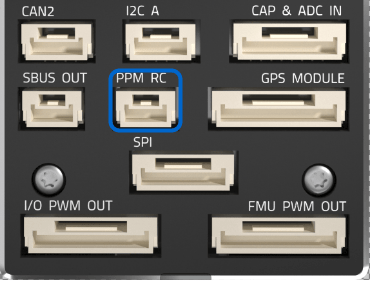

# Pixhawk 4 배선 개요

:::warning PX4에서는 이 자동 항법 장치를 제조하지 않습니다. 하드웨어 지원이나 호환 문제는 [제조사](https://shop.holybro.com/)에 문의하십시오. :::

[Pixhawk 4](../flight_controller/pixhawk4.md)&reg; 비행 콘트롤러 전원 공급방법과 주변 장치 연결방법을 설명합니다.

## 배선 개요

아래의 이미지는 주요 센서와 주변 장치(모터 및 서보 출력 제외)의 연결 방법을 설명합니다. 다음 섹션에서 각 장치에 대하여 자세히 설명합니다.

:::tip
사용 가능한 포트에 대한 자세한 내용은 [Pixhawk 4 &gt; 연결방법](../flight_controller/pixhawk4.md#connectors)을 참고하십시오. :::

## 콘트롤러 장착 및 장착 방향

*Pixhawk 4*는 진동 방지 폼 패드(키트에 포함)를 프레임에 장착하여야 합니다. 차량의 무게 중심에 최대한 가깝운 프레임에 장착하여야 하며, 화살표가 차량의 앞쪽과 위쪽을 향하도록 하여야 합니다.

:::note
콘트롤러를 권장 기본 방향으로 장착 할 수 없는 경우(예 : 공간 제약으로 인해) 실 장착 방향을 자동항법장치 프로그램에서 설정하여야합니다. [비행 콘트롤러 방향](../config/flight_controller_orientation.md) :::

## GPS + 나침반 + 부저 + 안전 스위치 + LED

나침반, 안전 스위치, 부저 및 LED 통합 GPS를 **GPS MODULE** 포트에 연결합니다.

The GPS/Compass should be [mounted on the frame](../assembly/mount_gps_compass.md) as far away from other electronics as possible, with the direction marker towards the front of the vehicle (separating the compass from other electronics will reduce interference).

:::note GPS
모듈의 통합 안전 스위치는 *기본적으로* 활성화되어 있습니다. 활성화되면 PX4는 차량 시동을 걸 수 없습니다. 안전 스위치를 1초간 길게 누르면 비활성화됩니다. 안전 스위치를 다시 눌러 안전 장치를 활성화하고 기체 시동을 끌 수 있습니다. 조종기나 지상국 프로그램에서 기체 시동을 끌 수 없는 상황에서 유용합니다. :::

## 전원

키트에 포함된 *전원관리보드* (PM 보드)의 케이블을 6개를 사용하여 *Pixhawk 4*의 **POWER ** 브릭중 하나에 연결합니다. PM 입력 **2 ~ 12S**는 LiPo 배터리에 연결합니다. ESC와 서보에 대한 전원 공급 및 신호 연결을 위한 전원관리보드의 연결 방법은 아래의 표에서 설명합니다. ESC와 서보에 대한 전원 공급 및 신호 연결을 위한 전원관리보드의 연결 방법은 아래의 표에서 설명합니다.

아래의 이미지는 *Pixhawk 4*와 함께 제공되는 전원관리보드입니다.

:::note
고정익 또는 자동차로 사용하는 경우 **FMU PWM-OUT**의 8 핀 전원 (+) 레일에 러더, 엘레 본 등의 서보를 구동을 위한 별도의 전원을 공급하여야 합니다. 전원 레일을 BEC가 장착된 ESC 또는 독립형 5V BEC 또는 2S LiPo 배터리에 연결하여야 합니다. 서보에 제공되는 전압이 적절한 지 체크하십시오. :::

| 핀 & 커넥터     | 기능                                                                      |
| ----------- | ----------------------------------------------------------------------- |
| I/O PWM-IN  | *Pixhawk 4*에 연결하려면 아래를 참고하십시오.                                          |
| M1          | I/O PWM OUT 1 : 신호선을 모터 1의 ESC에 연결합니다.                                  |
| M2          | I/O PWM OUT 2 : 신호선을 모터 2의 ESC에 연결합니다.                                  |
| M3          | I/O PWM OUT 3 : 신호선을 모터 3의 ESC에 연결합니다.                                  |
| M4          | I/O PWM OUT 4 : 신호선을 모터 4의 ESC에 연결합니다.                                  |
| M5          | I/O PWM OUT 5 : 신호선을 모터 5의 ESC에 연결합니다.                                  |
| M6          | I/O PWM OUT 6 : 신호선을 모터 6의 ESC에 연결합니다.                                  |
| M7          | I/O PWM OUT 7 : 신호선을 모터 7의 ESC에 연결합니다.                                  |
| M8          | I/O PWM OUT 8 : 신호선을 모터 8의 ESC에 연결합니다.                                  |
| FMU PWM-IN  | *Pixhawk 4*에 연결하려면 아래를 참고하십시오.                                          |
| FMU PWM-OUT | FMU PWM-IN이 *Pixhawk 4*에 연결된 경우 신호선을 ESC 또는 신호에 연결하고 +, - 선을 서보에 연결합니다. |
| CAP&ADC-OUT | CAP에 연결 & amp; *Pixhawk 4*의 ADC IN 포트                                   |
| CAP&ADC-OUT | CAP & amp; ADC 입력 : 보드 뒷면에 핀배열이 인쇄되어 있습니다.                              |
| B+          | ESC에 전원을 공급하기 위해 ESC B +에 연결                                            |
| GND         | ESC 접지에 연결                                                              |
| PWR1        | 5v 출력 3A, *Pixhawk 4* POWER 1에 연결                                       |
| PWR2        | 5v 출력 3A, *Pixhawk 4* POWER 2에 연결                                       |
| 2~12S       | 전원 입력, 12S LiPo 배터리에 연결                                                 |

:::note
[기체 정의서](../airframes/airframe_reference.md)를 기체 유형을 참고하여 *Pixhawk 4*의 **I/O PWM OUT** 및 ** FMU PWM OUT** 포트를 전원관리보드에 연결하십시오. PX4 펌웨어의 **MAIN** 출력은 *Pixhawk 4*의 **I/O PWM OUT** 포트에 매핑되는 반면 **AUX 출력**은 *Pixhawk 4*의 **FMU PWM OUT**에 매핑됩니다. 예를 들어 **MAIN1**은 **I/O PWM OUT**의 IO_CH1 핀에 매핑되고, **AUX1**은 **FMU PWM OUT**의 FMU_CH1 핀에 매핑됩니다. PM 보드의 **FMU PWM-IN**은 내부적으로 서보를 구동하는 데 사용되는 **FMU PWM-OUT**에 연결합니다 (예 : 에일러론, 엘리베이터, 방향타, 엘레 본, 기어, 플랩, 짐벌, 스티어링). 전원관리보드의 **I/O PWM-IN**은 모터 구동에 사용되는 **M1-8**에 내부적으로 연결합니다 (예 : 평면, VTOL 및 로버의 스로틀). :::

아래의 표는 기체 기준에 따라 *Pixhawk 4*의 PWM OUT 포트를 PM 보드의 PWM-IN 포트에 연결하는 방법을 요약한 것입니다.

| 기체 정의        | *Pixhawk 4* -> PM 보드간 연결   |
| ------------ | -------------------------- |
| **MAIN**: 모터 | I/O PWM OUT --> I/O PWM IN |
| **MAIN**: 서보 | I/O PWM OUT --> FMU PWM IN |
| **AUX**: 모터  | FMU PWM OUT --> I/O PWM IN |
| **AUX**: 서보  | FMU PWM OUT --> FMU PWM IN |

<!--In the future, when Pixhawk 4 kit is available, add wiring images/videos for different airframes.-->

*Pixhawk 4* 전원 포트의 핀배열은 다음과 같습니다. 전류는 기본적으로 0 ~ 120A에 대하여 0 ~ 3.3V의 아날로그 전압을 제공하여야 합니다. 전압는 기본적으로 0~60V에 대하여 0~3.3V의 아날로그 전압을 제공하여야 합니다. VCC 라인은 최소 3A 연속을 제공하여야하며, 기본적으로 5.1V로 설정되어야 합니다. 5V 보다 낮은 전압은 권장되지 않습니다.

| 핀        | 신호  | 전압    |
| -------- | --- | ----- |
| 1(red)   | VCC | +5V   |
| 2(black) | VCC | +5V   |
| 3(black) | 전류  | +3.3V |
| 4(black) | 전압  | +3.3V |
| 5(black) | GND | GND   |
| 6(black) | GND | GND   |

:::note
키트의 전원모듈을 사용하면 [전원 설정](https://docs.qgroundcontrol.com/en/SetupView/Power.html)에서 *셀 수*를 설정하여하며, *전압 분배기* 보정은 필요 없습니다. 다른 전원모듈(예 : Pixracer의 모듈)을 사용하는 경우에는 *전압 분배기*를 업데이트하여야 합니다. :::

## 무선 조종

라디오 리모트 컨트롤(RC)은 기체를 *수동*으로 조작합니다. PX4 자율 비행 모드에는 RC는 필수 요구 사항은 아닙니다.

[호환되는 송신기/수신기를 선택](../getting_started/rc_transmitter_receiver.md)후 *바인딩*을 하여야 통신이 가능합니다. 송신기/수신기의 매뉴얼을 참고하십시오.

아래 지침은 여러가지 수신기들의 *Pixhawk 4* 연결 방법을 설명합니다.

- Spektrum/DSM 수신기는 **DSM/SBUS RC** 연결합니다.

  

- PPM 수신기는 **PPM RC** 입력 포트에 연결합니다.

  

- *각각의 채널이 독립적으로 배선된* PPM/PWM 수신기는 반드시 **PPM RC**포트에 *PPM 인코더를 통해* [아래와 같이](http://www.getfpv.com/radios/radio-accessories/holybro-ppm-encoder-module.html)연결합니다. PPM-Sum 수신기는 모든 채널에 하나의 전선만 사용합니다.

무선 시스템 선택, 수신기 호환성 및 송신기/수신기 바인딩에 대한 자세한 내용은 [원격 제어 송신기 & 수신기](../getting_started/rc_transmitter_receiver.md)를 참고하십시오.

## 무선 텔레메트리(선택 사항)

무선 텔레메트리는 지상국 프로그램의 비행 차량 통신 제어용입니다(예 : UAV를 특정 위치로 지시하거나 새 임무를 업로드 할 수 있음).

기체의 텔레메트리를 **TELEM1** 포트에 연결합니다. 이 포트에 연결된 경우에는 추가 설정이 필요하지 않습니다. 다른 텔레메트리는 일반적으로 지상국 컴퓨터나 모바일 장치에 USB를 통하여 연결됩니다.

## SD 카드(선택 사항)

SD 카드는 [비행 세부 정보를 기록 및 분석](../getting_started/flight_reporting.md)하고, 임무를 수행하고, UAVCAN 버스 하드웨어를 사용하는 데 필요하므로 사용하는 것이 좋습니다. 아래 그림과 같이 SD 카드(Pixhawk 4 키트에 포함됨)를 *Pixhawk 4*에 삽입합니다.

:::tip
For more information see [Basic Concepts > SD Cards (Removable Memory)](../getting_started/px4_basic_concepts.md#sd-cards-removable-memory). :::

## 모터

모터/서보 신호는 **I/O PWM OUT** (**MAIN OUT**) 및 **FMU PWM OUT** (** AUX **)에 연결됩니다. ) 포트는 [기체 정의서](../airframes/airframe_reference.md)에서 순서가 지정되어 있습니다.

:::note
이 참고사항은 모든 지원되는 기체 프레임의 출력 포트의 모터/서보 연결 리스트입니다 (만약 프레임이 참고사항에 기재되어 있지 않다면, 올바른 유형의 "일반" 프레임을 사용하십시오). 
:::

:::caution
매핑이 프레임간에 일관되지 않습니다 (예 : 모든 평면 프레임에 대해 동일한 출력에있는 스로틀에 의존 할 수 없음). 해당 기체의 프레임의  정확한 모터 연결 여부를 확인하십시오.
:::

## 기타 주변 장치

주변 장치 배선 및 설정에 관한 선택 사항은 개별 [주변 장치](../peripherals/README.md)를 참고하십시오.

## 핀배열

[Pixhawk 4 핀배열](http://www.holybro.com/manual/Pixhawk4-Pinouts.pdf) (Holybro)

## 설정

더 자세한 일반 설정 방법은 [자동항법장치 설정](../config/README.md)을 참고하십시오.

QuadPlane에 대한 자세한 설정 방법은 [QuadPlane VTOL 설정](../config_vtol/vtol_quad_configuration.md)을 참고하십시오.

<!-- Nice to have detailed wiring infographic and instructions for different vehicle types. --> 

## 추가 정보

- [Pixhawk 4](../flight_controller/pixhawk4.md) (개요 페이지)
- [Pixhawk 4 기술 데이터 시트](https://github.com/PX4/PX4-user_guide/raw/main/assets/flight_controller/pixhawk4/pixhawk4_technical_data_sheet.pdf)
- [Pixhawk 4 핀배열](http://www.holybro.com/manual/Pixhawk4-Pinouts.pdf) (Holybro)
- [Pixhawk 4 빠른 시작 가이드 (Holybro)](http://www.holybro.com/manual/Pixhawk4-quickstartguide.pdf)
