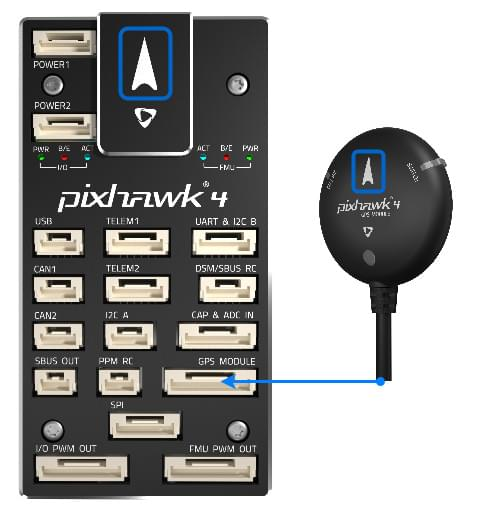

# Pixhawk 4 배선 개요

:::warning PX4에서는 이 자동 항법 장치를 제조하지 않습니다. Contact the [manufacturer](https://holybro.com/) for hardware support or compliance issues.
:::

[Pixhawk 4](../flight_controller/pixhawk4.md)&reg; 비행 콘트롤러 전원 공급방법과 주변 장치 연결방법을 설명합니다.

## 배선 개요

아래의 이미지는 주요 센서와 주변 장치(모터 및 서보 출력 제외)의 연결 방법을 설명합니다. 다음 섹션에서 각 장치에 대하여 자세히 설명합니다.

:::tip
사용 가능한 포트에 대한 자세한 내용은 [Pixhawk 4 &gt; 연결방법](../flight_controller/pixhawk4.md#connectors)을 참고하십시오.
:::

## 콘트롤러 장착 및 장착 방향

_Pixhawk 4_ should be mounted on the frame using vibration-damping foam pads (included in the kit). 차량의 무게 중심에 최대한 가깝운 프레임에 장착하여야 하며, 화살표가 차량의 앞쪽과 위쪽을 향하도록 하여야 합니다.

::: info If the controller cannot be mounted in the recommended/default orientation (e.g. due to space constraints) you will need to configure the autopilot software with the orientation that you actually used: [Flight Controller Orientation](../config/flight_controller_orientation.md).
:::

## GPS + 나침반 + 부저 + 안전 스위치 + LED

나침반, 안전 스위치, 부저 및 LED 통합 GPS를 **GPS MODULE** 포트에 연결합니다.

The GPS/Compass should be [mounted on the frame](../assembly/mount_gps_compass.md) as far away from other electronics as possible, with the direction marker towards the front of the vehicle (separating the compass from other electronics will reduce interference).

::: info The GPS module's integrated safety switch is enabled _by default_ (when enabled, PX4 will not let you arm the vehicle). 안전 스위치를 1초간 길게 누르면 비활성화됩니다. 안전 스위치를 다시 눌러 안전 장치를 활성화하고 기체 시동을 끌 수 있습니다. 조종기나 지상국 프로그램에서 기체 시동을 끌 수 없는 상황에서 유용합니다.
:::

## 전원

Connect the output of the _Power Management Board_ (PM board) that comes with the kit to one of the **POWER** bricks of _Pixhawk 4_ using a 6-wire cable. PM 입력  **2 ~ 12S**는 LiPo 배터리에 연결합니다. ESC와 서보에 대한 전원 공급 및 신호 연결을 위한 전원관리보드의 연결 방법은 아래의 표에서 설명합니다. ESC와 서보에 대한 전원 공급 및 신호 연결을 위한 전원관리보드의 연결 방법은 아래의 표에서 설명합니다.

The image below shows the power management board provided with _Pixhawk 4_.

:::note
고정익 또는 자동차로 사용하는 경우 **FMU PWM-OUT**의 8 핀 전원 (+) 레일에 러더, 엘레 본 등의 서보를 구동을 위한 별도의 전원을 공급하여야 합니다. 전원 레일을 BEC가 장착된 ESC 또는 독립형 5V BEC 또는 2S LiPo 배터리에 연결하여야 합니다. 서보에 제공되는 전압이 적절한 지 체크하십시오.
:::

| 핀 & 커넥터     | 기능                                                                                                          |
| ----------- | ----------------------------------------------------------------------------------------------------------- |
| I/O PWM-IN  | See note below for connection to _Pixhawk 4_                                                                |
| M1          | I/O PWM OUT 1 : 신호선을 모터 1의 ESC에 연결합니다.                                                                      |
| M2          | I/O PWM OUT 2 : 신호선을 모터 2의 ESC에 연결합니다.                                                                      |
| M3          | I/O PWM OUT 3 : 신호선을 모터 3의 ESC에 연결합니다.                                                                      |
| M4          | I/O PWM OUT 4 : 신호선을 모터 4의 ESC에 연결합니다.                                                                      |
| M5          | I/O PWM OUT 5 : 신호선을 모터 5의 ESC에 연결합니다.                                                                      |
| M6          | I/O PWM OUT 6 : 신호선을 모터 6의 ESC에 연결합니다.                                                                      |
| M7          | I/O PWM OUT 7 : 신호선을 모터 7의 ESC에 연결합니다.                                                                      |
| M8          | I/O PWM OUT 8 : 신호선을 모터 8의 ESC에 연결합니다.                                                                      |
| FMU PWM-IN  | See note below for connection to _Pixhawk 4_                                                                |
| FMU PWM-OUT | If FMU PWM-IN is connected to _Pixhawk 4_, connect signal wires to ESC or signal, +, - wires to servos here |
| CAP&ADC-OUT | connect to CAP & ADC IN port of _Pixhawk 4_                                                                 |
| CAP&ADC-OUT | CAP & amp; ADC 입력 : 보드 뒷면에 핀배열이 인쇄되어 있습니다.                                                                  |
| B+          | ESC에 전원을 공급하기 위해 ESC B +에 연결                                                                                |
| GND         | ESC 접지에 연결                                                                                                  |
| PWR1        | 5v output 3A, connect to _Pixhawk 4_ POWER 1                                                                |
| PWR2        | 5v output 3A, connect to _Pixhawk 4_ POWER 2                                                                |
| 2~12S       | 전원 입력, 12S LiPo 배터리에 연결                                                                                     |

::: info Depending on your airframe type, refer to [Airframe Reference](../airframes/airframe_reference.md) to connect **I/O PWM OUT** and **FMU PWM OUT** ports of _Pixhawk 4_ to PM board. **MAIN** outputs in PX4 firmware map to **I/O PWM OUT** port of _Pixhawk 4_ whereas **AUX outputs** map to **FMU PWM OUT** of _Pixhawk 4_. 예를 들어 **MAIN1**은 **I/O PWM OUT**의 IO_CH1 핀에 매핑되고, **AUX1**은 **FMU PWM OUT**의 FMU_CH1 핀에 매핑됩니다. **FMU PWM-IN** of PM board is internally connected to **FMU PWM-OUT**. **I/O PWM-IN** of PM board is internally connected to **M1-8**.
:::

The following table summarizes how to connect _Pixhawk 4_'s PWM OUT ports to PM board's PWM-IN ports, depending on the Airframe Reference.

| 기체 정의        | Connection between _Pixhawk 4_ --> PM board |
| ------------ | ------------------------------------------- |
| **MAIN**: 모터 | I/O PWM OUT --> I/O PWM IN                  |
| **MAIN**: 서보 | I/O PWM OUT --> FMU PWM IN                  |
| **AUX**: 모터  | FMU PWM OUT --> I/O PWM IN                  |
| **AUX**: 서보  | FMU PWM OUT --> FMU PWM IN                  |

<!--In the future, when Pixhawk 4 kit is available, add wiring images/videos for different airframes.-->

The pinout of _Pixhawk 4_’s power ports is shown below. 전류는 기본적으로 0 ~ 120A에 대하여 0 ~ 3.3V의 아날로그 전압을 제공하여야 합니다. 전압는 기본적으로 0~60V에 대하여 0~3.3V의 아날로그 전압을 제공하여야 합니다. VCC 라인은 최소 3A 연속을 제공하여야하며, 기본적으로 5.1V로 설정되어야 합니다. 5V 보다 낮은 전압은 권장되지 않습니다.

| 핀        | 신호  | 전압    |
| -------- | --- | ----- |
| 1(red)   | VCC | +5V   |
| 2(black) | VCC | +5V   |
| 3(black) | 전류  | +3.3V |
| 4(black) | 전압  | +3.3V |
| 5(black) | GND | GND   |
| 6(black) | GND | GND   |

::: info Using the Power Module that comes with the kit you will need to configure the _Number of Cells_ in the [Power Settings](https://docs.qgroundcontrol.com/master/en/qgc-user-guide/setup_view/power.html) but you won't need to calibrate the _voltage divider_. You will have to update the _voltage divider_ if you are using any other power module (e.g. the one from the Pixracer).
:::

## Radio Control

A remote control (RC) radio system is required if you want to _manually_ control your vehicle (PX4 does not require a radio system for autonomous flight modes).

You will need to [select a compatible transmitter/receiver](../getting_started/rc_transmitter_receiver.md) and then _bind_ them so that they communicate (read the instructions that come with your specific transmitter/receiver).

The instructions below show how to connect the different types of receivers to _Pixhawk 4_:

- Spektrum/DSM 수신기는 **DSM/SBUS RC** 연결합니다.

  

- PPM 수신기는 **PPM RC** 입력 포트에 연결합니다.

  

- PPM and PWM receivers that have an _individual wire for each channel_ must connect to the **PPM RC** port _via a PPM encoder_ [like this one](http://www.getfpv.com/radios/radio-accessories/holybro-ppm-encoder-module.html) (PPM-Sum receivers use a single signal wire for all channels).

For more information about selecting a radio system, receiver compatibility, and binding your transmitter/receiver pair, see: [Remote Control Transmitters & Receivers](../getting_started/rc_transmitter_receiver.md).

## Telemetry Radios (Optional)

무선 텔레메트리는 지상국 프로그램의 비행 차량 통신 제어용입니다(예 : UAV를 특정 위치로 지시하거나 새 임무를 업로드 할 수 있음).

기체의 텔레메트리를 **TELEM1** 포트에 연결합니다. 이 포트에 연결된 경우에는 추가 설정이 필요하지 않습니다. 다른 텔레메트리는 일반적으로 지상국 컴퓨터나 모바일 장치에 USB를 통하여 연결됩니다.

## SD 카드(선택 사항)

SD 카드는 [비행 세부 정보를 기록 및 분석](../getting_started/flight_reporting.md)하고, 임무를 수행하고, UAVCAN 버스 하드웨어를 사용하는 데 필요하므로 사용하는 것이 좋습니다. Insert the card (included in Pixhawk 4 kit) into _Pixhawk 4_ as shown below.

:::tip
For more information see [Basic Concepts > SD Cards (Removable Memory)](../getting_started/px4_basic_concepts.md#sd-cards-removable-memory).
:::

## 모터

모터/서보 신호는 **I/O PWM OUT** (**MAIN OUT**) 및 **FMU PWM OUT** (** AUX **)에 연결됩니다. ) 포트는 [기체 정의서](../airframes/airframe_reference.md)에서 순서가 지정되어 있습니다.

:::note
이 참고사항은 모든 지원되는 기체 프레임의 출력 포트의 모터/서보 연결 리스트입니다 (만약 프레임이 참고사항에 기재되어 있지 않다면, 올바른 유형의 "일반" 프레임을 사용하십시오).
:::

:::warning
The mapping is not consistent across frames (e.g. you can't rely on the throttle being on the same output for all plane frames). 해당 기체의 프레임의  정확한 모터 연결 여부를 확인하십시오.
:::

## 기타 주변 장치

주변 장치 배선 및 설정에 관한 선택 사항은 개별 [주변 장치](../peripherals/README.md)를 참고하십시오.

## 핀배열

[Pixhawk 4 Pinouts](https://holybro.com/manual/Pixhawk4-Pinouts.pdf) (Holybro)

## 설정

더 자세한 일반 설정 방법은 [자동항법장치 설정](../config/README.md)을 참고하십시오.

QuadPlane에 대한 자세한 설정 방법은 [QuadPlane VTOL 설정](../config_vtol/vtol_quad_configuration.md)을 참고하십시오.

<!-- Nice to have detailed wiring infographic and instructions for different vehicle types. -->

## 추가 정보

- [Pixhawk 4](../flight_controller/pixhawk4.md) (개요 페이지)
- [Pixhawk 4 기술 데이터 시트](https://github.com/PX4/PX4-user_guide/raw/v1.15/assets/flight_controller/pixhawk4/pixhawk4_technical_data_sheet.pdf)
- [Pixhawk 4 Pinouts](https://holybro.com/manual/Pixhawk4-Pinouts.pdf) (Holybro)
- [Pixhawk 4 빠른 시작 가이드 (Holybro)](https://holybro.com/manual/Pixhawk4-quickstartguide.pdf)
