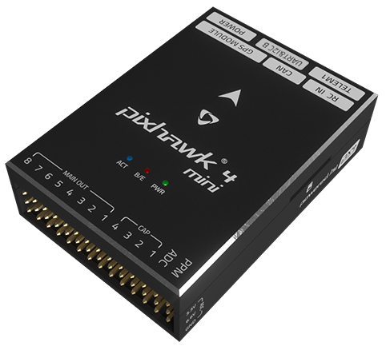

# *Pixhawk 4 Mini* Wiring Quick Start

This quick start guide shows how to power the [*Pixhawk&reg; 4 Mini*](../flight_controller/pixhawk4_mini.md) flight controller and connect its most important peripherals.

## Wiring Chart Overview

The image below shows where to connect the most important sensors and peripherals (except for motors and servos).

> **Tip** More information about available ports can be found here: [*Pixhawk 4 Mini* > Interfaces](../flight_controller/pixhawk4_mini.md#interfaces).

## Mount and Orient Controller

*Pixhawk 4 Mini* should be mounted on your frame using vibration-damping foam pads (included in the kit). It should be positioned as close to your vehicle’s center of gravity as possible, oriented top-side up with the arrow pointing towards the front of the vehicle.

> **Note** If the controller cannot be mounted in the recommended/default orientation (e.g. due to space constraints) you will need to configure the autopilot software with the orientation that you actually used: [Flight Controller Orientation](../config/flight_controller_orientation.md).

## GPS + Compass + Buzzer + Safety Switch + LED

Attach the provided GPS with integrated compass, safety switch, buzzer, and LED to the **GPS MODULE** port. The GPS/Compass should be mounted on the frame as far away from other electronics as possible, with the direction marker towards the front of the vehicle (separating the compass from other electronics will reduce interference).

> **참고 ** GPS 모듈의 통합 안전 스위치는 기본적으로 * *을(를) 활성화합니다(활성화된 경우 PX4는 차량에 무장을 허용하지 않습니다). 안전을 비활성화하려면 안전 스위치를 1초간 길게 누르십시오. 안전 스위치를 다시 눌러 안전을 활성화하고 차량을 해제할 수 있습니다(어떤 이유로든 리모컨이나 접지 스테이션에서 차량을 해제할 수 없는 경우 유용함).

## Power

The Power Management Board (PMB) serves the purpose of a power module as well as a power distribution board. In addition to providing regulated power to *Pixhawk 4 Mini* and the ESCs, it sends information to the autopilot about the battery’s voltage and current draw.

Connect the output of the PMB that comes with the kit to the **POWER** port of the *Pixhawk 4 Mini* using a 6-wire cable. The connections of the PMB, including power supply and signal connections to the ESCs and servos, are explained in the image below.

> **Note** The image above only shows the connection of a single ESC and a single servo. Connect the remaining ESCs and servos similarly.

| Pin(s) or Connector | Function                                                                 |
| ------------------- | ------------------------------------------------------------------------ |
| B+                  | Connect to ESC B+ to power the ESC                                       |
| GND                 | Connect to ESC Ground                                                    |
| PWR                 | JST-GH 6-pin Connector, 5V 3A output  
connect to *Pixhawk 4 Mini* POWER |
| BAT                 | Power Input, connect to 2~12s LiPo Battery                               |

The pinout of the *Pixhawk 4 Mini* **POWER** port is shown below. The CURRENT signal should carry an analog voltage from 0-3.3V for 0-120A as default. The VOLTAGE signal should carry an analog voltage from 0-3.3V for 0-60A as default. The VCC lines have to offer at least 3A continuous and should default to 5.1V. A lower voltage of 5V is still acceptable, but discouraged.

| Pin      | Signal  | Volt  |
| -------- | ------- | ----- |
| 1(red)   | VCC     | +5V   |
| 2(black) | VCC     | +5V   |
| 3(black) | CURRENT | +3.3V |
| 4(black) | VOLTAGE | +3.3V |
| 5(black) | GND     | GND   |
| 6(black) | GND     | GND   |

> **Note** If using a plane or rover, the 8 pin power (+) rail of **MAIN OUT** will need to be separately powered in order to drive servos for rudders, elevons, etc. To do this, the power rail needs to be connected to a BEC equipped ESC, a standalone 5V BEC, or a 2S LiPo battery. Be careful with the voltage of servo you are going to use here.

<!--  -->

<!--In the future, when Pixhawk 4 kit is available, add wiring images/videos for different airframes.-->

> **Note** Using the Power Module that comes with the kit you will need to configure the *Number of Cells* in the [Power Settings](https://docs.qgroundcontrol.com/en/SetupView/Power.html) but you won't need to calibrate the *voltage divider*. You will have to update the *voltage divider* if you are using any other power module (e.g. the one from the Pixracer).

## Radio Control

A remote control (RC) radio system is required if you want to *manually* control your vehicle (PX4 does not require a radio system for autonomous flight modes).

You will need to [select a compatible transmitter/receiver](../getting_started/rc_transmitter_receiver.md) and then *bind* them so that they communicate (read the instructions that come with your specific transmitter/receiver).

The instructions below show how to connect the different types of receivers to *Pixhawk 4 Mini*:

- Spektrum/DSM or S.BUS receivers connect to the **DSM/SBUS RC** input.
    
    

- PPM receivers connect to the **PPM RC** input port.
    
    

- PPM and PWM receivers that have an *individual wire for each channel* must connect to the **PPM RC** port *via a PPM encoder* [like this one](http://www.getfpv.com/radios/radio-accessories/holybro-ppm-encoder-module.html) (PPM-Sum receivers use a single signal wire for all channels).

For more information about selecting a radio system, receiver compatibility, and binding your transmitter/receiver pair, see: [Remote Control Transmitters & Receivers](../getting_started/rc_transmitter_receiver.md).

## Telemetry Radio (Optional)

Telemetry radios may be used to communicate and control a vehicle in flight from a ground station (for example, you can direct the UAV to a particular position, or upload a new mission).

The vehicle-based radio should be connected to the **TELEM1** port as shown below (if connected to this port, no further configuration is required). The other radio is connected to your ground station computer or mobile device (usually by USB).

## microSD Card (Optional)

SD 카드는 가장 일반적으로  로그에 사용되며 비행 세부 정보를 분석합니다. Insert the card (included in the kit) into *Pixhawk 4 Mini* as shown below.
 

> **Tip ** SanDisk Extreme U3 32GB는  높게 권장됩니다(개발자 가이드).
 </blockquote> 
> 
> ## Motors
> 
> Motors/servos are connected to the **MAIN OUT** ports in the order specified for your vehicle in the [Airframe Reference](../airframes/airframe_reference.md). See [*Pixhawk 4 Mini* > Supported Platforms](../flight_controller/pixhawk4_mini.md#supportedplatforms) for more information.
> 
> > ** 노트 ** 이 참조는 지원되는 모든 공기 및 접지 프레임에 대한 모터/servo 매핑의 출력 포트를 나열합니다(기준에 프레임이 나열되지 않은 경우 올바른 유형의 "일반" 공기 프레임을 사용합니다).
> 
> 

> 
> > **주의** 프레임 간에 매핑이 일관되지 않습니다(예: 모든 평면 프레임에 대해 스로틀이 동일한 출력에 의존할 수 없음). 차량에 대 한 올바른 매핑을 사용할 수 있는지 확인 합니다.
> 
> ## Other Peripherals
> 
> 옵션/낮은 공통 구성요소의 배선 및 구성은 개별 [ 주변기기 ](../peripherals/README.md)의 항목에서 다룹니다.
> 
> ## Configuration
> 
> General configuration information is covered in: [Autopilot Configuration](../config/README.md).
> 
> QuadPlane 특정 구성 여기 덮여 있다: [QuadPlane VTOL 구성](../config_vtol/vtol_quad_configuration.md)
> 
> <!-- what about config of other vtol types and plane. Do the instructions in these ones above apply for tailsitters etc? -->
> 
> <!--## Detailed Wiring Infographic (Copter)

 -->
> 
> ## Further information
> 
> - [*Pixhawk 4 Mini*](../flight_controller/pixhawk4_mini.md)