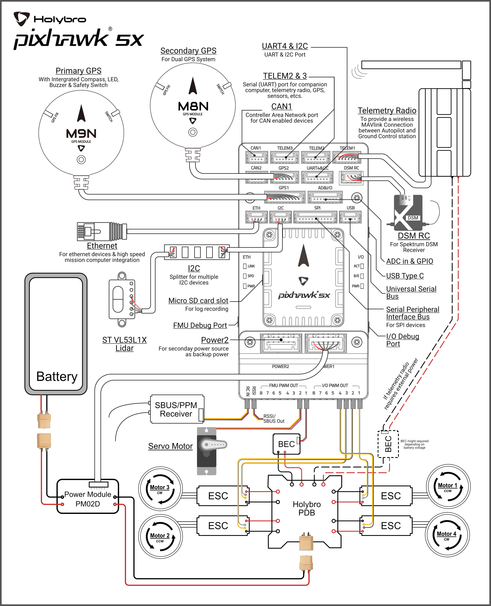

# 홀리브로 픽스호크 5X 배선 개요

:::warning PX4에서는 이 자동항법장치를 제조하지 않습니다. 하드웨어 지원과 호환 문제는 [제조사](https://shop.holybro.com/)에 문의하십시오.
:::

[Pixhawk&reg; 5X](../flight_controller/pixhawk5x.md) 비행 콘트롤러의 전원 공급 방법과 주요 주변 장치 연결 방법에 대하여 설명합니다.

Pixhawk 5 표준 세트

## 배선 개요

아래 그림은 주요 센서와 주변기기 연결 방법을 설명합니다.

:::tip
사용 가능한 포트에 대한 자세한 설명은 [ Pixhawk  5X &gt; 연결 방법 ](../flight_controller/pixhawk5x.md#connections)을 참고하십시오.
:::

## 콘트롤러 장착 및 장착 방향

*Pixhawk 5X*는 키트에 포함된 양면 테이프를 사용하여 프레임에 장착할 수 있습니다. 차량의 무게 중심에 최대한 가깝운 프레임에 장착하여야 하며, 화살표가 차량의 앞쪽과 위쪽을 향하도록 하여야 합니다.

:::note
콘트롤러를 권장 방향으로 장착하기 어려운 경우에는(예 : 공간 제약으로 인해) 실제 장착한 방향을 소프트웨어에서 설정하여야 합니다([기체 콘트롤러 방향](../config/flight_controller_orientation.md) 참고).
:::

## GPS + 나침반 + 부저 + 안전 스위치 + LED

_Pixhawk5X 표준 세트_는 **GPS1** 포트에 연결하여야 하는 M8N 또는 M9N GPS(10핀 커넥터)와 함께 구입할 수 있습니다. 이 GNSS 모듈에는 나침반, 안전 스위치, 부저 및 LED가 통합되어 있습니다.

보조 [M8N 또는 M9N GPS](https://shop.holybro.com/c/gps-systems_0428)(6핀 커넥터)는 별도로 구매하여 **GPS2** 포트에 연결할 수 있습니다.

GPS와 나침반은 차량 전명 방향 표시를 사용하여 가능하면 전자 장치에서 멀리 떨어진 프레임에 장착하여야합니다 (나침반을 다른 전자 장치와 분리하면 간섭이 줄어듦).

:::note GPS
모듈에 내장된 안전 스위치는 *기본적으로* 활성화되어 있습니다 (활성화되면 PX4는 차량 시동을 걸 수 없습니다). 비활성화하려면 안전 스위치를 1초간 길게 누르십시오. 안전 스위치를 다시 눌러 안전 장치를 활성화하고 기체 시동을 끌 수 있습니다. 조종기나 지상국 프로그램에서 기체 시동을 끌 수 없는 상황에서 유용합니다.
:::

## 전원

Connect the output of the *PM02D Power Module* (PM board) that comes with the Standard Set to one of the **POWER** port of *Pixhawk 5X* using the 6-wire cable. The PM02D and Power ports on the Pixhawk 5X uses the 6 circuit [2.00mm Pitch CLIK-Mate Wire-to-Board PCB Receptacle](https://www.molex.com/molex/products/part-detail/pcb_receptacles/5024430670) & [Housing](https://www.molex.com/molex/products/part-detail/crimp_housings/5024390600).

PM02D 전원 모듈은 **2~6S** 배터리를 지원하며, 보드의 입력은 LiPo 배터리에 연결하여야 합니다. 전원 보드는 **FMU PWM OUT** 및 **I/O PWM OUT**의 + 및 - 핀에 전원을 공급하지 않습니다.

비행기나 로버를 사용하는 경우 방향타, 엘레본 등의 서보를 구동하려면 **FMU PWM-OUT**에 별도로 전원을 공급하여야 합니다. 이는 **FMU PWM-OUT**의 8핀 전원(+) 레일을 전압 조정기(예: BEC 장착 ESC 또는 독립형 5V BEC 또는 2S LiPo 배터리)에 연결하여 수행할 수 있습니다.

:::note
파워 레일 사용 중인 서보에 적절한 전압을 공급하여야 합니다.
:::

| 핀 & 커넥터     | 기능                             |
| ----------- | ------------------------------ |
| I/O PWM Out | 여기에 모터 신호와 GND 배선을 연결합니다.      |
| FMU PWM Out | 여기에 서보 신호, 양극 및 GND 전선을 연결합니다. |

:::note PX
펌웨어의 **MAIN** 출력은 *Pixhawk 5X*의 **I/O PWM OUT** 포트에 매핑되는 반면, **AUX 출력**은 *Pixhawk 5X*의 **FMU PWM OUT**에 매핑됩니다. 예를 들어, **MAIN1**은 **I/O PWM OUT**의 IO_CH1 핀에 매핑되고, **AUX1**은 **FMU PWM OUT**의 FMU_CH1 핀에 매핑됩니다.
:::

*Pixhawk 5X* 전원 포트의 핀배열은 다음과 같습니다. 전원 포트는 전압 및 전류 데이터를 위해 PM02D 전원 모듈에서 I2C 디지털 신호를 수신합니다. VCC 라인은 최소 3A 연속을 제공해야하며 기본적으로 5.2V로 설정되어야 합니다. 5V 보다 낮은 전압은 허용되지만, 권장되지는 않습니다.

| 핀     | 신호  | 전압    |
| ----- | --- | ----- |
| 1 (적) | VCC | +5V   |
| 2 (흑) | VCC | +5V   |
| 3 (흑) | SCL | +3.3V |
| 4 (흑) | SDA | +3.3V |
| 5 (흑) | GND | GND   |
| 6 (흑) | GND | GND   |

## 무선 조종

A remote control (RC) radio system is required if you want to *manually* control your vehicle (PX4 does not require a radio system for autonomous flight modes).

You will need to [select a compatible transmitter/receiver](../getting_started/rc_transmitter_receiver.md) and then *bind* them so that they communicate (read the instructions that come with your specific transmitter/receiver).

- Spektrum/DSM 수신기는 **DSM/SBUS RC** 입력에 연결합니다.
- PPM/SBUS 수신기는 **RC IN** 입력 포트에 연결합니다.

무선 조종기는 기체 *수동*제어시에 사용합니다. PX4의 자율 비행 모드에서는 무선 조종기는 필수적이지 않습니다.

[호환되는 송신기/수신기를 선택](../getting_started/rc_transmitter_receiver.md)한 다음 통신을 위해 *바인딩*을 하여야 합니다(특정 송신기/수신기와 함께 제공되는 매뉴얼 참조).

## 무선 텔레메트리(선택 사항)

*각각의 채널이 독립적으로 배선된* PPM/PWM 수신기는 반드시**RC IN**포트에 *PPM 인코더를 통하여* [아래와 같이](http://www.getfpv.com/radios/radio-accessories/holybro-ppm-encoder-module.html)연결하여야 합니다. PPM-Sum 수신기는 모든 채널에 하나의 전선만 사용합니다.

The vehicle-based radio should be connected to the **TELEM1** port as shown below (if connected to this port, no further configuration is required). The other radio is connected to your ground station computer or mobile device (usually by USB).

[무선 텔레메트리](../telemetry/README.md)는 지상국 프로그램에서 비행 차량의 통신/제어에 사용합니다(예 : UAV를 특정 위치로 지시하거나 새 임무를 업로드 할 수 있음).

## SD 카드 (선택 사항)

기체의 텔레메트리를 **TELEM1** 포트에 연결해야 합니다 (이 포트에 연결된 경우 추가 설정이 필요하지 않음). 다른 텔레메트리는 일반적으로 지상국 컴퓨터나 모바일 장치에 (USB를 통해) 연결됩니다.

SD 카드는 [비행 세부 정보를 기록 및 분석](../getting_started/flight_reporting.md)하고, 임무를 수행하고, UAVCAN 버스 하드웨어를 사용하는 데 필요하므로 사용하는 것이 좋습니다. 아래 그림과 같이 SD 카드(Pixhawk  5X 키트에 포함됨)를 *Pixhawk 5X*에 삽입합니다.

## 모터

Motors/servos are connected to the **I/O PWM OUT** (**MAIN**) and **FMU PWM OUT** (**AUX**) ports in the order specified for your vehicle in the [Airframe Reference](../airframes/airframe_reference.md).

:::tip
자세한 내용은 [기본 개념 &gt; SD 카드 (휴대용 메모리)](../getting_started/px4_basic_concepts.md#sd_cards)를 참고하십시오.
:::

:::caution
The mapping is not consistent across frames (e.g. you can't rely on the throttle being on the same output for all plane frames). Make sure to use the correct mapping for your vehicle.
:::

## 기타 주변 장치

The wiring and configuration of optional/less common components is covered within the topics for individual [peripherals](../peripherals/README.md).

## 핀배열

많이 사용하지 않는 옵션 부품들의 배선 및 조립법은 개별 [주변 장치](../peripherals/README.md)에서 설명합니다.

## 설정

General configuration information is covered in: [Autopilot Configuration](../config/README.md).

[여기](../../assets/flight_controller/pixhawk5x/pixhawk5x_pinout.pdf) 또는 [여기](http://www.holybro.com/manual/Holybro_Pixhawk5X_Pinout.pdf)에서 *Pixhawk 5X* 핀배열을 다운로드할 수 있습니다.

<!-- Nice to have detailed wiring infographic and instructions for different vehicle types. -->

## 추가 정보

- [Pixhawk 5X](../flight_controller/pixhawk5x.md) (PX4 개요 페이지)
- [Pixhawk 5X 개요 & 스펙](http://www.holybro.com/manual/Holybro_Pixhawk5X_Spec_Overview.pdf) (홀리브로)
- [Pixhawk  5X 핀아웃](http://www.holybro.com/manual/Holybro_Pixhawk5X_Pinout.pdf) (홀리브로)
- [PM02D 파워 모듈 매뉴얼](http://www.holybro.com/manual/Holybro_PM02D_Power_Module_Manual.pdf) (홀리브로)
- [FMUv5 참조 설계 핀배열](https://docs.google.com/spreadsheets/d/1Su7u8PHp-Y1AlLGVuH_I8ewkEEXt_bHHYBHglRuVH7E/edit#gid=562580340).
- [Pixhawk Autopilot FMUv5X 표준](https://github.com/pixhawk/Pixhawk-Standards/blob/master/DS-011%20Pixhawk%20Autopilot%20v5X%20Standard.pdf).
- [Pixhawk Autopilot FMUv5X 버스 표준](https://github.com/pixhawk/Pixhawk-Standards/blob/master/DS-010%20Pixhawk%20Autopilot%20Bus%20Standard.pdf).
- [Pixhawk 커넥터 표준](https://github.com/pixhawk/Pixhawk-Standards/blob/master/DS-009%20Pixhawk%20Connector%20Standard.pdf).
