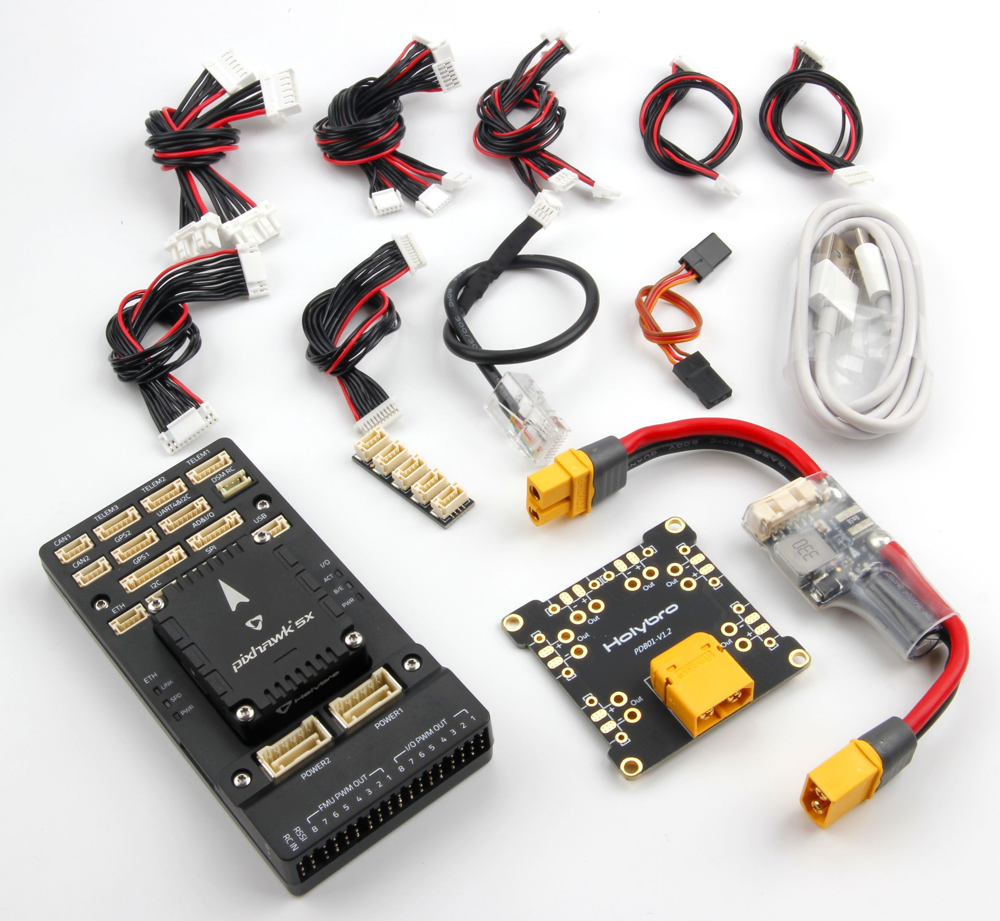

# 홀리브로 픽스호크 5X 배선 개요

:::warning PX4에서는 이 자동항법장치를 제조하지 않습니다. 하드웨어 지원과 호환 문제는 [제조사](https://shop.holybro.com/)에 문의하십시오.
:::
Pixhawk&reg; 5X<1> 비행 콘트롤러의 전원 공급 방법과 중요 주변 장치를 연결 방법에 대하여 설명합니다.
 

Pixhawk 5 표준 세트

## 배선 개요

아래 그림은 주요 센서와 주변기기 연결 방법을 설명합니다.

:::tip
사용 가능한 포트에 대한 자세한 설명은 [ Pixhawk  5X &gt; 연결 방법 ](../flight_controller/pixhawk5x.md#connections)을 참고하십시오.
:::

## 콘트롤러 장착 및 장착 방향

*Pixhawk 5X*는 키트에 포함된 양면 테이프를 사용하여 프레임에 장착할 수 있습니다. 차량의 무게 중심에 최대한 가깝운 프레임에 장착하여야 하며, 화살표가 차량의 앞쪽과 위쪽을 향하도록 하여야 합니다.

:::note
콘트롤러를 권장 방향으로 장착하기 어려운 경우에는(예 : 공간 제약으로 인해) 실제 장착한 방향을 소프트웨어에서 설정하여야 합니다([기체 콘트롤러 방향](../config/flight_controller_orientation.md) 참고).
:::

## GPS + 나침반 + 부저 + 안전 스위치 + LED

_Pixhawk5X 표준 세트_는 **GPS1** 포트에 연결하여야 하는 M8N 또는 M9N GPS(10핀 커넥터)와 함께 구입할 수 있습니다. 이 GNSS 모듈에는 나침반, 안전 스위치, 부저 및 LED가 통합되어 있습니다.

A secondary [M8N or M9N GPS](https://shop.holybro.com/c/gps-systems_0428) (6-pin connector) can be purchased separately and connected to the **GPS2** port.

The GPS/Compass should be mounted on the frame as far away from other electronics as possible, with the direction marker towards the front of the vehicle (separating the compass from other electronics will reduce interference).

:::note
The GPS module's integrated safety switch is enabled *by default* (when enabled, PX4 will not let you arm the vehicle). To disable the safety press and hold the safety switch for 1 second. You can press the safety switch again to enable safety and disarm the vehicle (this can be useful if, for whatever reason, you are unable to disarm the vehicle from your remote control or ground station).
:::

## Power

Connect the output of the *PM02D Power Module* (PM board) that comes with the Standard Set to one of the **POWER** port of *Pixhawk 5X* using the 6-wire cable.

The PM02D Power Module supports **2~6S** battery, the board input should be connected to your LiPo battery. Note that the PM board does not supply power to the + and - pins of **FMU PWM OUT** and **I/O PWM OUT**.

If using a plane or rover, the **FMU PWM-OUT** will need to be separately powered in order to drive servos for rudders, elevons etc. This can be done by connecting the 8 pin power (+) rail of the **FMU PWM-OUT** to a voltage regulator (for example, a BEC equipped ESC or a standalone 5V BEC or a 2S LiPo battery).

:::note
The power rail voltage must be appropriate for the servo being used!
:::

| PIN & Connector | Function                                            |
| --------------- | --------------------------------------------------- |
| I/O PWM Out     | Connect Motor Signal and GND wires here.            |
| FMU PWM Out     | Connect Servo Signal, positive, and GND wires here. |

:::note
**MAIN** outputs in PX4 firmware map to **I/O PWM OUT** port of *Pixhawk 5X* whereas **AUX outputs** map to **FMU PWM OUT** of *Pixhawk 5x*. For example, **MAIN1** maps to IO_CH1 pin of **I/O PWM OUT** and **AUX1** maps to FMU_CH1 pin of **FMU PWM OUT**.
:::

The pinout of *Pixhawk 5X*’s power ports is shown below. The power ports takes in I2C digital signal from the PM02D power module for voltage and current data. The VCC lines have to offer at least 3A continuous and should default to 5.2V. A lower voltage of 5V is still acceptable, but discouraged.

| Pin      | Signal | Volt  |
| -------- | ------ | ----- |
| 1(red)   | VCC    | +5V   |
| 2(black) | VCC    | +5V   |
| 3(black) | SCL    | +3.3V |
| 4(black) | SDA    | +3.3V |
| 5(black) | GND    | GND   |
| 6(black) | GND    | GND   |

:::note
Using the Power Module that comes with the kit, you will need to configure the *Number of Cells* in the [Power Settings](../config/battery.md#basic-battery-settings-default). However you will not need to calibrate the *voltage divider* (set the voltage divider and the current divider ratio). With the default setting parameters, the voltage and current measurement accuracy can be better than 5%.

You will have to update the *voltage divider* if you are using any other power module.
:::

## Radio Control

A remote control (RC) radio system is required if you want to *manually* control your vehicle (PX4 does not require a radio system for autonomous flight modes).

You will need to [select a compatible transmitter/receiver](../getting_started/rc_transmitter_receiver.md) and then *bind* them so that they communicate (read the instructions that come with your specific transmitter/receiver).

- Spektrum/DSM receivers connect to the **DSM/SBUS RC** input.
- PPM or SBUS receivers connect to the **RC IN** input port.

PPM and PWM receivers that have an *individual wire for each channel* must connect to the **RC IN** port *via a PPM encoder* [like this one](http://www.getfpv.com/radios/radio-accessories/holybro-ppm-encoder-module.html) (PPM-Sum receivers use a single signal wire for all channels).

For more information about selecting a radio system, receiver compatibility, and binding your transmitter/receiver pair, see: [Remote Control Transmitters & Receivers](../getting_started/rc_transmitter_receiver.md).

## Telemetry Radios (Optional)

[Telemetry radios](../telemetry/README.md) may be used to communicate and control a vehicle in flight from a ground station (for example, you can direct the UAV to a particular position, or upload a new mission).

The vehicle-based radio should be connected to the **TELEM1** port as shown below (if connected to this port, no further configuration is required). The other radio is connected to your ground station computer or mobile device (usually by USB).

Radios are also available for purchase on [Holybro's website](http://www.holybro.com/product-category/radio/) .

## SD Card (Optional)

SD cards are highly recommended as they are needed to [log and analyse flight details](../getting_started/flight_reporting.md), to run missions, and to use UAVCAN-bus hardware. Insert the card (included in Pixhawk 5X kit) into *Pixhawk 5X* as shown below.

:::tip
For more information see [Basic Concepts > SD Cards (Removable Memory)](../getting_started/px4_basic_concepts.md#sd_cards).
:::

## Motors

Motors/servos are connected to the **I/O PWM OUT** (**MAIN**) and **FMU PWM OUT** (**AUX**) ports in the order specified for your vehicle in the [Airframe Reference](../airframes/airframe_reference.md).

:::note
This reference lists the output port to motor/servo mapping for all supported air and ground frames (if your frame is not listed in the reference then use a "generic" airframe of the correct type).
:::

:::caution
The mapping is not consistent across frames (e.g. you can't rely on the throttle being on the same output for all plane frames). Make sure to use the correct mapping for your vehicle.
:::

## Other Peripherals

The wiring and configuration of optional/less common components is covered within the topics for individual [peripherals](../peripherals/README.md).

## Pinouts

You can also download *Pixhawk 5X* pinouts from [here](../../assets/flight_controller/pixhawk5x/pixhawk5x_pinout.pdf) or [here](http://www.holybro.com/manual/Holybro_Pixhawk5X_Pinout.pdf).

## Configuration

General configuration information is covered in: [Autopilot Configuration](../config/README.md).

QuadPlane specific configuration is covered here: [QuadPlane VTOL Configuration](../config_vtol/vtol_quad_configuration.md)

<!-- Nice to have detailed wiring infographic and instructions for different vehicle types. -->

## Further information

- [Pixhawk 5X](../flight_controller/pixhawk5x.md) (PX4 Doc Overview page)
- [Pixhawk 5X Overview & Specification](http://www.holybro.com/manual/Holybro_Pixhawk5X_Spec_Overview.pdf) (Holybro)
- [Pixhawk 5X Pinouts](http://www.holybro.com/manual/Holybro_Pixhawk5X_Pinout.pdf) (Holybro)
- [PM02D Power Module Manual](http://www.holybro.com/manual/Holybro_PM02D_Power_Module_Manual.pdf) (Holybro)
- [FMUv5X reference design pinout](https://docs.google.com/spreadsheets/d/1Su7u8PHp-Y1AlLGVuH_I8ewkEEXt_bHHYBHglRuVH7E/edit#gid=562580340).
- [Pixhawk Autopilot FMUv5X Standard](https://github.com/pixhawk/Pixhawk-Standards/blob/master/DS-011%20Pixhawk%20Autopilot%20v5X%20Standard.pdf).
- [Pixhawk Autopilot Bus Standard](https://github.com/pixhawk/Pixhawk-Standards/blob/master/DS-010%20Pixhawk%20Autopilot%20Bus%20Standard.pdf).
- [Pixhawk Connector Standard](https://github.com/pixhawk/Pixhawk-Standards/blob/master/DS-009%20Pixhawk%20Connector%20Standard.pdf).
