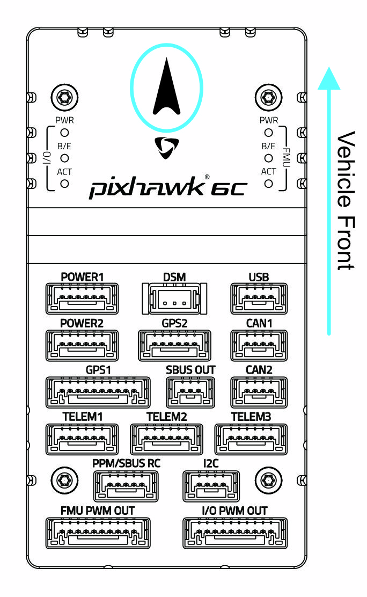

# Holybro Pixhawk 6C Wiring Quick Start

:::warning
PX4에서는 이 자동 항법 장치를 제조하지 않습니다.
소형화를 위하여 가진 IO가 적습니다.
:::

This quick start guide shows how to power the [Pixhawk 6C&reg;](../flight_controller/pixhawk6c.md) flight controller and connect its most important peripherals.

## 키트 내용물

Pixhawk 6C + PM02 + M8N GPS.

## 콘트롤러 장착 및 장착 방향

_Pixhawk 6C_ can be mounted on the frame using double side tape included in the kit. 차량의 무게 중심에 최대한 가깝운 프레임에 장착하여야 하며, 화살표가 차량의 앞쪽과 위쪽을 향하도록 하여야 합니다.

:::note
콘트롤러를 권장 방향으로 장착할 수 없는 경우 (예 : 공간 제약으로 인해) 실제 [장착 방향](../config/flight_controller_orientation.md)을 자동조종 소프트웨어를 설정하여야합니다.
:::

## GPS + 나침반 + 부저 + 안전 스위치 + LED

The _Pixhawk6C_ can be purchased with M8N or M9N GPS (10-pin connector) that should be connected to the **GPS1** port. 이 GNSS 모듈에는 나침반, 안전 스위치, 부저 및 LED가 통합되어 있습니다.

A secondary [M8N or M9N GPS](https://holybro.com/collections/gps) (6-pin connector) can be purchased separately and connected to the **GPS2** port.

The GPS/Compass should be [mounted on the frame](../assembly/mount_gps_compass.md) as far away from other electronics as possible, with the direction marker towards the front of the vehicle (separating the compass from other electronics will reduce interference).

전원 모듈 또는 배전 보드를 사용하여 모터와 서보에 전원을 공급하고 소비 전력을 측정할 수 있습니다. 비활성화하려면 안전 스위치를 1초간 길게 누르십시오. 안전 스위치를 다시 눌러 안전 장치를 활성화하고 기체 시동을 끌 수 있습니다. 조종기나 지상국 프로그램에서 기체 시동을 끌 수 없는 상황에서 유용합니다.
:::

## 전원

Connect the output of the power module of your selection that comes with the Standard Set to one of the **POWER** port of _Pixhawk 6C_ using the 6-wire cable.

비행기나 로버를 사용하는 경우 방향타, 엘레본 등의 서보를 구동하려면 **FMU PWM-OUT**에 별도로 전원을 공급하여야 합니다. 이는 **FMU PWM-OUT**의 8핀 전원(+) 레일을 전압 조정기(예: BEC 장착 ESC 또는 독립형 5V BEC 또는 2S LiPo 배터리)에 연결하여 수행할 수 있습니다.

:::note
파워 레일 사용 중인 서보에 적절한 전압을 공급하여야 합니다.
:::

| 핀 & 커넥터     | 기능                             |
| ----------- | ------------------------------ |
| I/O PWM Out | 여기에 모터 신호와 GND 배선을 연결합니다.      |
| FMU PWM Out | 여기에 서보 신호, 양극 및 GND 전선을 연결합니다. |

::: info **MAIN** outputs in PX4 firmware map to **I/O PWM OUT** port of _Pixhawk 6C_ whereas **AUX outputs** map to **FMU PWM OUT** of _Pixhawk 6C_. 예를 들어 **MAIN1**은 **I/O PWM OUT**의 IO_CH1 핀에 매핑되고, **AUX1**은 **FMU PWM OUT**의 FMU_CH1 핀에 매핑됩니다.
:::

The pinout of _Pixhawk 6C_’s power ports is shown below.

| 핀        | 신호      | 전압    |
| -------- | ------- | ----- |
| 1(red)   | VDD     | +5V   |
| 2(black) | VDD     | +5V   |
| 3(black) | CURRENT | +3.3V |
| 4(black) | VOLTAGE | +3.3V |
| 5(black) | GND     | GND   |
| 6(black) | GND     | GND   |

## 무선 조종

A remote control (RC) radio system is required if you want to _manually_ control your vehicle (PX4 does not require a radio system for autonomous flight modes).

You will need to [select a compatible transmitter/receiver](../getting_started/rc_transmitter_receiver.md) and then _bind_ them so that they communicate (read the instructions that come with your specific transmitter/receiver).

- Spektrum/DSM receivers connect to the **DSM** input.
- PPM or SBUS receivers connect to the **PPM/SBUS** input port.

PPM and PWM receivers that have an _individual wire for each channel_ must connect to the *PPM/SBUS\*\* port *via a PPM encoder\* [like this one](http://www.getfpv.com/radios/radio-accessories/holybro-ppm-encoder-module.html) (PPM-Sum receivers use a single signal wire for all channels).

무선 텔레메트리는 지상국 프로그램에서 비행 차량의 통신/제어에 사용합니다(예 : UAV를 특정 위치로 지시하거나 새 임무를 업로드 할 수 있음).

## 무선 텔레메트리(선택 사항)

[무선 텔레메트리](../telemetry/README.md)는 지상국 프로그램에서 비행 차량의 통신/제어에 사용합니다(예 : UAV를 특정 위치로 지시하거나 새 임무를 업로드 할 수 있음).

기체의 텔레메트리를 **TELEM1** 포트에 연결하여야 합니다 (이 포트에 연결된 경우 추가 설정이 필요하지 않음). 다른 텔레메트리는 일반적으로 지상국 컴퓨터나 모바일 장치에 USB를 통하여 연결됩니다.

Radios are also available for purchase on [Holybro's website](https://holybro.com/collections/telemetry-radios) .

## SD 카드(선택 사항)

SD 카드는 [비행 세부 정보를 기록 및 분석](../getting_started/flight_reporting.md)하고, 임무를 수행하고, UAVCAN 버스 하드웨어를 사용하는 데 필요하므로 사용하는 것이 좋습니다. Insert the card (included in Pixhawk 6C) into _Pixhawk 6C_ as shown below.

:::tip
For more information see [Basic Concepts > SD Cards (Removable Memory)](../getting_started/px4_basic_concepts.md#sd-cards-removable-memory).
:::

## 모터

모터/서보 신호는 **I/O PWM OUT** (**MAIN OUT**) 및 **FMU PWM OUT** (** AUX **)에 연결됩니다. ) 포트는 [기체 정의서](../airframes/airframe_reference.md)에서 순서가 지정되어 있습니다.

:::note
이 참고사항은 모든 지원되는 기체 프레임의 출력 포트의 모터/서보 연결 리스트입니다 (만약 프레임이 참고사항에 기재되어 있지 않다면, 올바른 유형의 "일반" 프레임을 사용하십시오).
:::

:::warning
The mapping is not consistent across frames (e.g. you can't rely on the throttle being on the same output for all plane frames). 해당 기체의 프레임의  정확한 모터 연결 여부를 확인하십시오.
:::

## 기타 주변 장치

자주 사용하지 않는 부품들의 배선과 조립 방법은 개별 [주변 장치](../peripherals/README.md)를 참고하십시오.

## 핀배열

- [Holybro Pixhawk -6C Pinout](https://docs.holybro.com/autopilot/pixhawk-6c/pixhawk-6c-pinout)

## 설정

더 자세한 일반적인 설정 방법은 [자동항법장치 설정](../config/README.md)을 참고하십시오.

QuadPlane에 대한 자세한 설정 방법은 [QuadPlane VTOL 설정](../config_vtol/vtol_quad_configuration.md)을 참고하십시오.

<!-- Nice to have detailed wiring infographic and instructions for different vehicle types. -->

## 추가 정보

- [Holybro Docs](https://docs.holybro.com/) (Holybro)
- [Pixhawk 6C](../flight_controller/pixhawk6c.md) (PX4 Doc Overview page)
- [PM02 Power Module](../power_module/holybro_pm02.md)
- [PM06 Power Module](../power_module/holybro_pm06_pixhawk4mini_power_module.md)
- [PM07 Power Module](../power_module/holybro_pm07_pixhawk4_power_module.md)
- [Pixhawk Autopilot FMUv5X 버스 표준](https://github.com/pixhawk/Pixhawk-Standards/blob/master/DS-010%20Pixhawk%20Autopilot%20Bus%20Standard.pdf).
- [Pixhawk 커넥터 표준](https://github.com/pixhawk/Pixhawk-Standards/blob/master/DS-009%20Pixhawk%20Connector%20Standard.pdf).
