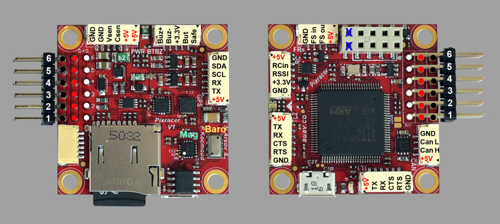
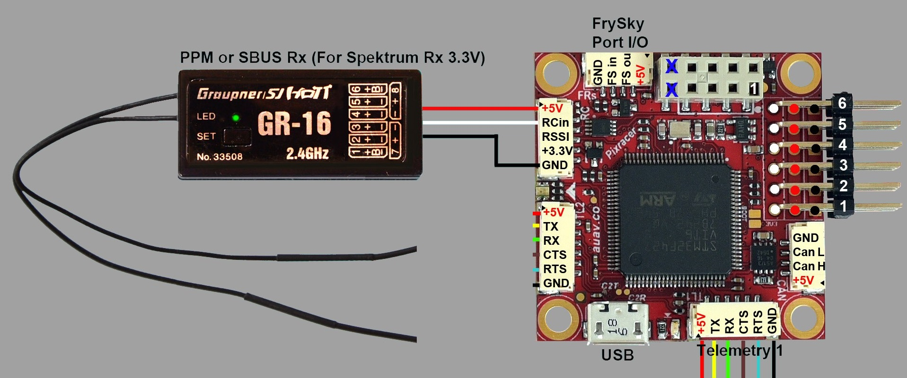
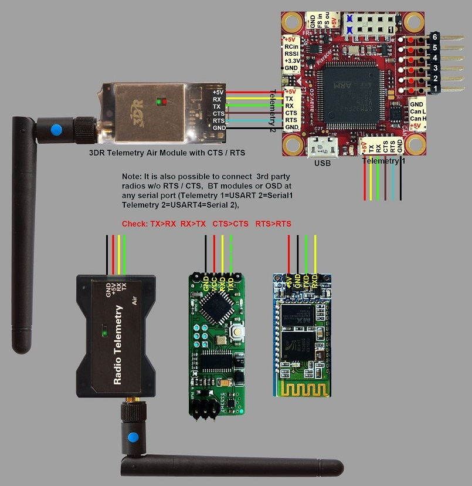

# Pixracer 배선 개요

:::warning PX4에서는 이 자동 항법 장치를 제조하지 않습니다. 하드웨어 지원이나 호환 문제는 [제조사](https://store.mrobotics.io/)에 문의하십시오. :::

:::warning
작성 중인 문서입니다
:::

[Pixracer](../flight_controller/pixracer.md) 비행 콘트롤러 전원 공급방법과 주변 장치 연결방법을 설명합니다.

## 무선 가이드/조립 방법

### 기본 설정

### Radio/Remote Control

라디오 리모트 컨트롤(RC)은 기체를 *수동*으로 조작합니다. PX4 자율 비행 모드에는 RC는 필수 요구 사항은 아닙니다.

[호환되는 송신기/수신기를 선택](../getting_started/rc_transmitter_receiver.md)후 *바인딩*을 하여야 통신이 가능합니다. 송신기/수신기의 매뉴얼을 참고하십시오.

아래의 지침은 다양한 유형의 수신기를 연결하는 방법을 설명합니다:

- FrSky 수신기는 표시된 포트를 통해 연결되며 제공된 I/O 커넥터를 사용할 수 있습니다.

  

  

- PPM-SUM과 S.버스 수신기는 **RCIN** 포트에 연결합니다.

  

- *각각의 채널이 독립적으로 배선된* PPM/PWM 수신기는 반드시**RC IN**포트에 *PPM 인코더를 통하여* [아래와 같이](http://www.getfpv.com/radios/radio-accessories/holybro-ppm-encoder-module.html)연결하여야 합니다. PPM-Sum 수신기는 모든 채널에 하나의 전선만 사용합니다.

### 전원 모듈 (ACSP4)

### 외부 텔레메트리

Pixracer에는 WiFi가 내장되어 있지만 `TELEM1` 또는 `TELEM2` 포트에 연결된 외부 Wi-Fi 또는 텔레메트리를 통한 원격 측정도 지원합니다. 무선 다이어그램은 아래의 그림과 같습니다.

:::note
`TELEM2` 포트는 [MAV_2_CONFIG](../advanced_config/parameter_reference.md#MAV_2_CONFIG) 매개변수를 사용하여 두 번째 MAVLink로 구성하여야 합니다. :::note `TELEM2` 포트는 [MAV_2_CONFIG](../advanced_config/parameter_reference.md#MAV_2_CONFIG) 매개변수를 사용하여 두 번째 MAVLink로 구성하여야 합니다. :::

