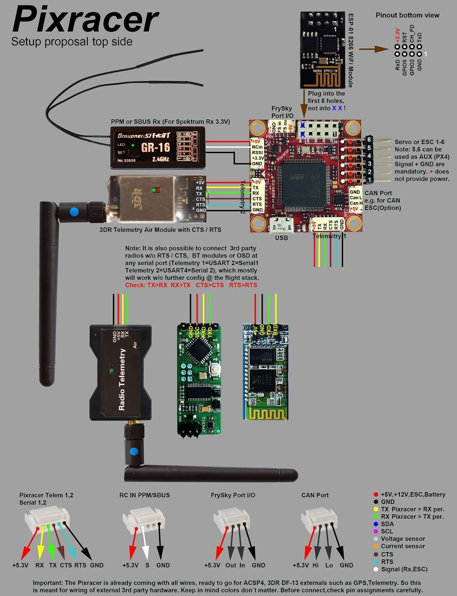

# Pixracer 배선 개요

:::warning PX4에서는 이런 종류의 자동 항법 장치를 제조하지는 않습니다. 하드웨어 지원 또는 호환 문제는 [제조사](https://store.mrobotics.io/)와 상담하십시오.
:::

:::warning
작성 중인 문서입니다
:::

이 설명서는 [Pixracer](../flight_controller/pixracer.md) 비행 컨트롤러에 전원을 공급하고 중요한 주변 장치를 연결하는 방법을 설명합니다.

## 배선 설명서

### 기본 설정

### 무선/원격 컨트롤

무선 조종기는 기체 *수동*제어시에 사용합니다 (PX4에는 자율 비행 모드에서는 무선 조종기가 필수는 아닙니다).

기체와 조종자가 서로 통신하기 위해 [호환되는 송신기/수신기를 선택하고](../getting_started/rc_transmitter_receiver.md), 송신기와 수신기를 *바인드*해야 합니다 (송신기와 수신기에 포함된 지시사항을 읽으십시오).

아래의 지침은 다양한 유형의 수신기를 연결하는 방법을 보여 줍니다.

- FrSky 수신기는 표시된 포트를 통해 연결되며 제공된 I/O 커넥터를 사용할 수 있습니다.
    
    
    
    

- PPM-SUM과 S.버스 수신기는 **RCIN** 포트에 연결합니다.
    
    

- *각각의 채널이 독립적으로 배선된* PPM/PWM 수신기는 반드시 **RCIN**포트에 *PPM 인코더를 통해* [아래와 같이](http://www.getfpv.com/radios/radio-accessories/holybro-ppm-encoder-module.html)연결해야 합니다 (PPM-Sum 수신기는 모든 채널에 하나의 전선만 사용합니다).

### 전원 모듈 (ACSP4)

