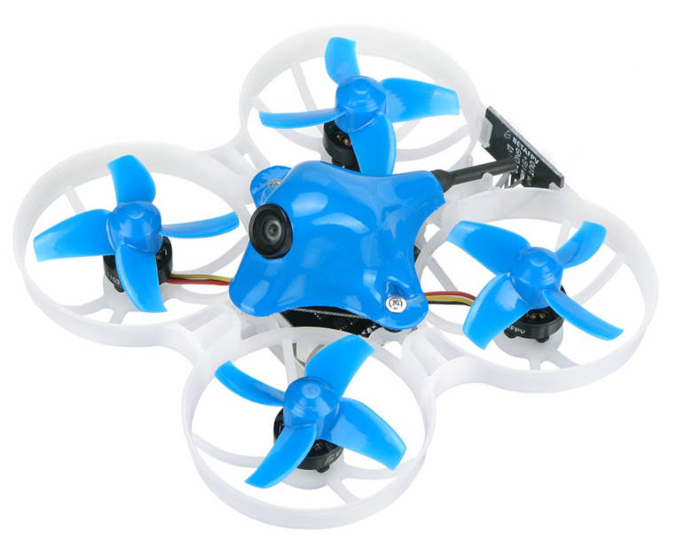

# BetaFPV Beta75X 2S 브러시리스 후프

<Badge type="error" text="Discontinued" />

:::warning
This frame has been [discontinued](../flight_controller/autopilot_experimental.md) and is no longer commercially available.
:::

The [BetaFPV Beta75X](https://betafpv.com/products/beta75x-2s-whoop-quadcopter) is a very small quadrotor that can be flown indoors or outdoors, FPV or line-of-sight.

## 구매처

추가로 다음과 같은 것들이 필요합니다.

- [GetFPV](https://www.getfpv.com/beta75x-2s-brushless-whoop-micro-quadcopter-xt30-frsky.html)
- [아마존](https://www.amazon.com/BETAFPV-Beta75X-Brushless-Quadcopter-Smartaudio/dp/B07H86XSPW)

*Beta75X*에는 Betaflight가 사전 설치되어 있습니다.

- RC 송신기. *Beta75X*는 수신기와 함께 배송될 수 있습니다. PX4는 이들과 호환되지만 송신기와 일치하는 버전을 선택하는 것이 좋습니다.
- LiPo 배터리 충전기(배터리 1개와 함께 배송되지만 여분이 필요할 수 있습니다).
- FPV를 비행하고 싶다면 FPV 고글을 사용하십시오. There are many compatible options, including these ones from [Fatshark](https://www.fatshark.com/product-page/dominator-v3).

  :::note
FPV 지원은 PX4와 비행 컨트롤러와는 관련이 없습니다.
:::

## PX4 부트로더 플래싱하기

The _Beta75X_ comes preinstalled with Betaflight.

Before loading PX4 firmware you must first install the PX4 bootloader. Instructions for installing the bootloader can be found in the [Omnibus F4](../flight_controller/omnibus_f4_sd.md#bootloader) topic (this is the flight controller board on the _Beta75X_).

:::tip
You can always [reinstall Betaflight](../advanced_config/bootloader_update_from_betaflight.md#reinstall-betaflight) later if you want!
:::

## 설치 및 설정

Once the bootloader is installed, you should be able to connect the vehicle to _QGroundControl_ via a USB cable.

:::note
At time of writing _Omnibus F4_ is supported on the QGroundControl _Daily Build_, and prebuilt firmware is provided for the master branch only (stable releases are not yet available).
:::

[유투브](https://youtu.be/_-O0kv0Qsh4)

- [PX4 펌웨어 로드](../config/firmware.md).
- [Airframe](../config/airframe.md)을 *BetaFPV Beta75X 2S Brushless Whoop*로 설정합니다.
- 센서 보정과 무선 설정을 포함하여 [기본 설정](../config/README.md)을 진행합니다.

## 비디오

@[youtube](https://youtu.be/_-O0kv0Qsh4)
