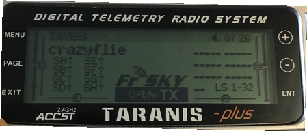

# Crazyflie 2.0

:::warning PX4에서는 이 자동항법장치를 제조하지 않습니다. 하드웨어 지원과 호환 문제는 [제조사](https://www.bitcraze.io/)에 문의하십시오.
:::

:::warning
이 비행 컨트롤러에 대한 PX4 지원은 [테스트중](../flight_controller/autopilot_experimental.md)입니다.
:::

Crazyflie 마이크로 쿼드 라인은 Bitcraze AB에서 제작하였습니다.. Crazyflie 2.0의 개요는 [여기](https://www.bitcraze.io/crazyflie-2/)를 참고하십시오.


## 요약

:::note
주요 하드웨어 문서는 여기를 참고하십시오. https://wiki.bitcraze.io/projects:crazyflie2:index
:::

* 메인 시스템온칩 : STM32F405RG 
  * CPU : 단정밀도 FPU의 168MHz ARM Cortex M4
  * RAM : 192KB SRAM
* nRF51822 무선 및 전력 관리 MCU
* MPU9250 가속 / 자이로 / 자력계
* LPS25H 기압계

## 구매처

* [Crazyflie 2.0](https://store.bitcraze.io/collections/kits/products/crazyflie-2-0).
* [Crazyradio PA 2.4GHz USB 동글](https://store.bitcraze.io/collections/kits/products/crazyradio-pa) : *QGroundControl*과 Crazyflie 2.0 간의 무선 통신에 사용됩니다.
* [브레이크 아웃 데크](https://store.bitcraze.io/collections/decks/products/breakout-deck) : 주변 장치를 연결용 브레이크아웃 확장 보드입니다.
* [흐름 데크](https://store.bitcraze.io/collections/decks/products/flow-deck) :지면의 움직임을 측정하는 광류 센서와 지면까지의 거리를 측정하는 거리 센서가 포함되어 있습니다. 정확한 고도와 위치 제어에 유용합니다.
* [Z- 레인저 데크](https://store.bitcraze.io/collections/decks/products/z-ranger-deck)는지면까지의 거리를 측정하기 위해 Flow 데크와 동일한 거리 센서입니다. 정확한 고도와 위치 제어에 유용합니다.
* [SD 카드 데크](https://store.bitcraze.io/collections/decks/products/sd-card-deck) : 마이크로 SD 카드는 고속의 온보드 로깅에 사용됩니다.
* [Logitech Joystick](https://www.logitechg.com/en-ch/product/f310-gamepad).

## PX4 플래싱

PX4 개발 환경 설정후 Crazyflie 2.0에 PX4를 설치합니다.

1. PX4 부트 로더 소스 코드를 다운로드합니다. ```git clone https://github.com/PX4/Bootloader.git```
2. 소스 코드 최상위 디렉토리로 이동하여 다음 명령어를 실행하여 컴파일합니다. ```make crazyflie_bl```
3. Crazyflie 2.0을 DFU 모드로 전환합니다.
  
  * 처음에는 전원이 꺼져 있는지 확인하십시오.
  * 재설정 버튼을 누릅니다(아래 그림 참조).
  * 컴퓨터의 USB 포트에 연결합니다.
  * 1초 후 파란색 LED가 깜박이기 시작하고, 5초 후 더 빠르게 깜박이기 시작합니다.
  * 버튼을 뗍니다.

4. *dfu-util* 설치: 
  
      sudo apt-get update
       sudo apt-get install dfu-util

5. *dfu-util*을 사용하여 부트 로더를 플래시하고 완료되면 Crazyflie 2.0을 분리합니다. ```sudo dfu-util -d 0483:df11 -a 0 -s 0x08000000 -D ./build/crazyflie_bl/crazyflie_bl.bin``` Crazyflie 2.0의 전원을 키면, 노란색 LED가 깜박입니다.

6. PX4 자동조종장치 소스 코드를 다운로드합니다. ```git clone https://github.com/PX4/PX4-Autopilot.git```

7. 소스 코드의 최상위 디렉토리로 이동하여 다음 명령어를 실행하여 컴파일합니다. ```make bitcraze_crazyflie_default upload```
8. 장치를 연결하라는 메시지가 표시되면 Crazyflie 2.0을 연결합니다. 노란색 LED가 깜박이기 시작하면 부트 로더 모드입니다. 그런 다음 빨간색 LED가 켜지면, 깜박이는 프로세스가 시작되었음을 나타냅니다.
9. 완료될 때까지 기다리십시오.
10. 완료되면, [QGroundControl](https://docs.qgroundcontrol.com/en/SetupView/Sensors.html)을 사용하여 센서를 보정합니다.

:::note QGroundControl이 기체와 연결되지 않으면 crazyflie의 [nuttx-config](https://github.com/PX4/PX4-Autopilot/blob/master/boards/bitcraze/crazyflie/nuttx-config/nsh/defconfig)에서 `# CONFIG_DEV_LOWCONSOLE이 설정되지 않음`이 `CONFIG_DEV_LOWCONSOLE = y`로 대체되었는 지 확인하십시오. 이 작업은 *menuconfig*를 사용하여 수행하여야 합니다.

    make bitcraze_crazyflie_default menuconfig
    

또는 *qconfig* (GUI의 *직렬 드라이버 지원*에서 *저수준 콘솔 지원* 확인) :

    make bitcraze_crazyflie_default qconfig
    

:::

## 무선 설정 지침

온보드 nRF 모듈을 사용하여 Bluetooth나 2.4GHz Nordic ESB 프로토콜로 보드에 연결할 수 있습니다.

* [Crazyradio PA](https://www.bitcraze.io/crazyradio-pa/)를 권장합니다.
* Crazyflie 2.0을 블루투스 통신 비행 스마트폰 앱이 지원됩니다.

공식 Bitcraze** Crazyflie 앱** 사용 :

* 블루투스로 연결합니다.
* 설정에서 모드를 1 또는 2로 변경합니다.
* QGroundControl로 보정합니다.

**MAVLink** 연결 :

* 호환되는 GCS와 함께 Crazyradio PA를 제어합니다.
* *crazyflie-lib-python* 소스 코드를 다운로드합니다. ```git clone https://github.com/bitcraze/crazyflie-lib-python.git```

:::note
[cfbridge.py](https://github.com/bitcraze/crazyflie-lib-python/blob/master/examples/cfbridge.py)를 사용하여 Crazyflie 2.0(PX4로 깜박임)과 QGroundControl간의 무선 MAVlink 통신 링크를 설정합니다. *Cfbridge*를 사용하여 QGroundControl에서 crazyradio PA와 통신할 수 있습니다. [C 기반 cfbridge](https://github.com/dennisss/cfbridge)는 현재 데이터 손실 문제가 있으므로 **cfbridge.py**를 사용하는 것이 좋습니다.
:::

* USB 라디오를 사용을 위한 udev 권한을 설정 여부를 확인하십시오. [여기](https://github.com/bitcraze/crazyflie-lib-python#setting-udev-permissions)에 나열된 단계를 따라 컴퓨터를 **재 부팅**하십시오.
* USB를 통해 Crazyradio PA를 연결합니다.
* 아래의 방법으로 [로컬 Python 가상 환경](https://virtualenv.pypa.io/en/latest/)을 빌드합니다. ```pip install tox --user```
* crazyflie-lib-python 폴더로 이동하여 다음을 입력합니다. ```make venv```
* 가상 환경을 활성화합니다. ```source venv-cflib/bin/activate```
* 필요한 라이브러리들을 설치합니다. ```pip install -r requirements.txt --user```

Crazyflie 2.0을 crazyradio와 연결하기 위하여 아래의 단계에 따라 **cfbridge를 시작**합니다.

* Crazyflie 2.0의 전원을 껐다 켜고 부팅될 때까지 기다립니다.
* USB를 통해 Crazyflie 라디오 장치를 연결합니다.
* crazyflie-lib-python 폴더로 이동합니다.
* 가상 환경을 활성화합니다. ```source venv-cflib/bin/activate```
* examples 폴더로 이동하십시오. ```cd examples```
* cfbridge를 시작합니다. ```python cfbridge.py```
  
:::note
*Cfbridge*는 기본적으로 채널 80과 crazyflie 주소 0xE7E7E7E7E7을 사용하여 무선 통신을 시작합니다. 같은 방에서 [여러 개의 crazyflies과 crazyradios](https://github.com/dennisss/cfbridge/blob/master/README.md#advanced-swarming)를 사용하고 있고 각각에 대해 다른 채널과 주소를 사용하려면, 먼저 USB 케이블을 통해 crazyflie를 QGroundControl과 연결하고 QGroundControl의 syslink 매개 변수(채널, 주소)를 변경합니다. 그런 다음, 첫 번째와 두 번째 인수와 동일한 채널 및 주소를 각각 제공하여 cfbridge를 시작합니다. 예 : `python cfbridge.py 90 0x0202020202`
:::

* QGroundControl을 실행합니다.

* *cfbridge*를 사용 후 `CTRL + z`를 눌러 활성화 한 경우 virtualenv를 비활성화할 수 있습니다. 대부분의 경우에는 동일한 터미널에서 *cfbridge*를 다시 시작하면 crazyflie에 연결되지 않습니다.이 문제는 터미널을 닫고 새 터미널에서 *cfbridge*를 다시 시작하여 해결할 수 있습니다. 

:::tip
[crazyflie-lib-python](https://github.com/bitcraze/crazyflie-lib-python)에서 드라이버를 변경하거나 새 터미널에서 *cfbridge*를 실행하여도 crazyflie를 찾지 못하는 경우 crazyflie-lib-python 폴더로 이동해 볼 수 있습니다. 아래 스크립트를 실행하여 cflib를 다시 빌드하십시오.

    make venv
    

:::

:::note
Joystick을 사용하려면 QGroundControl의 `COM_RC_IN_MODE`를 "Joystick/No RC Checks"로 설정하십시오. 조이스틱을 보정하고 QGroundControl의 조이스틱 메시지 주파수를 5~14Hz(10Hz 권장)로 설정합니다. 주파수를 설정하려면 고급 옵션을 활성화하여야 합니다. 이것은 조이스틱 명령이 QGroundControl에서 Crazyflie 2.0으로 전송되는 속도입니다 (이렇게하려면 [여기](https://github.com/mavlink/qgroundcontrol)의 지침에 따라 최신 QGroundControl 소스 코드 (마스터)를 얻고 빌드해야합니다).
:::


## 하드웨어 설정

Crazyflie 2.0은 [안정화 모드](../flight_modes/manual_stabilized_mc.md), [고도 모드](../flight_modes/altitude_mc.md) 및 [위치 모드](../flight_modes/position_mc.md)에서 정확한 제어로 비행할 수 있습니다.

* *고도* 모드로 비행하려면 [Z 레인저 데크](https://store.bitcraze.io/collections/decks/products/z-ranger-deck)가 필요합니다. *포지션* 모드에서도 비행하고 싶다면 통합 Z-레인저 센서가있는 [플로우 데크](https://store.bitcraze.io/collections/decks/products/flow-deck)를 구입하는 것이 좋습니다.
* 온보드 기압계는 Crazyflie의 자체 프로펠러나 외부 바람에 매우 민감합니다. 따라서 우리는 기압계를 거품 조각으로 분리한 다음, 아래 그림과 같이 그 위에 거리 센서를 장착했습니다.


비행세부정보를 기록하기 위하여 아래와 같이 crazyflie 위에 SD 카드 데크를 장착할 수 있습니다.


양면 테이프를 사용하여 SD 카드 데크 위에 배터리를 부착합니다.


## 고도 제어

Crazyflie는 [Z-레인저 데크](https://store.bitcraze.io/collections/decks/products/z-ranger-deck)를 사용하면 *고도* 모드로 비행할 수 있습니다. 데이터 시트에 따르면 거리 측정기가 감지할 수있는 최대 고도(지면 위)는 2m입니다. 그러나, 어두운 바닥에서는 0.5m로 감소합니다. 밝은 바닥에서는 최대 1.3m까지 상승합니다. 즉, *고도* 또는 *위치* 비행 모드에서는 이 값 이상의 고도를 유지할 수 없습니다.

:::tip
If the Crazyflie 2.0 height drifts at mid-throttle command in *Altitude mode* or *Position mode*, first try rebooting the vehicle. If this does not fix the problem, recalibrate the accel and mag (compass).  
:::

:::note
Since the onboard barometer is highly susceptible to wind disturbances created by the Crazyflie's own propellers, you cannot rely on it to hold altitude.
:::

## Position Control

With [Flow deck](https://store.bitcraze.io/collections/decks/products/flow-deck), you can fly Crazyflie 2.0 in *Position mode*. Unlike PX4flow, the flow deck does not house a gyro, hence the onboard gyro is used for flow fusion to find the local position estimates. Moreover, the flow deck shares the same SPI bus as the SD card deck, therefore logging at high rate on SD card is not recommended when flying in *Position mode*.

:::note
A ulog for flight in *Position* mode is available [here](https://logs.px4.io/plot_app?log=a0e68bf1-e905-410f-b828-f6146dba9d45). This can be used as a reference to compare your flight performance.
:::

## Using FrSky Taranis RC Transmitter as Joystick

If you already own a Taranis RC transmitter and want to use it as a controller, it can be configured as a USB Joystick:

* Create a new model in Taranis.
  
  

* In *MODEL SETUP* menu page, turn off both internal and external TX modules.
  
  

* In *OUTPUTS* menu page (also called “SERVOS” page in some Taranis transmitters), invert Throttle (CH1) and Aileron (CH3).
  
  

To use Taranis switches to arm/disarm and switch to different flight modes:

* In Taranis UI *MIXER* menu page, you can assign the switches to any channel in the range channel 9-16 which map to the buttons 0-7 in the QGroundControl Joystick setup. For example, Taranis “SD” switch can be set to channel 9 in Taranis UI:
  
  

* Connect Taranis to PC with a USB cable and Open QGroundControl.

* In QGroundControl Joystick Setup, you can see the buttons turning yellow when you switch them on. For example, channel 9 in Taranis maps to button 0 in QGroundControl Joystick setup. You can assign any mode to this button e.g. *Altitude* mode. Now when you lower the switch "SD", flight mode will change to *Altitude*.
  
  

### ROS

To connect to Crazyflie 2.0 via MAVROS:

* Start up *cfbridge* using the above instructions.
* Change the UDP port QGroundControl listens to: 
  * In QGroundControl, navigate to **Application Settings > General** and uncheck all the boxes under *Autoconnect to the following devices*.
  * Add in **Comm Links** a link of type *UDP*, check the *Automatically Connect on Start* option, change the *Listening Port* to 14557, add Target Hosts: 127.0.0.1 and then press **OK**.
* Make sure you have [MAVROS](https://github.com/mavlink/mavros/tree/master/mavros#installation) installed.
* Start MAVROS with command: ```roslaunch mavros px4.launch fcu_url:="udp://:14550@127.0.0.1:14551" gcs_url:="udp://@127.0.0.1:14557"```
* Restart QGroundControl if it doesn't connect.

## Flying

@[youtube](https://youtu.be/2Bcy3k1h5uc)