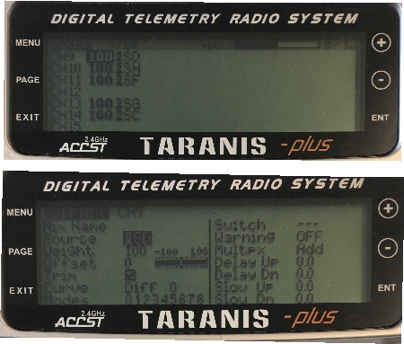

# Crazyflie 2.0

:::warning PX4에서는 이 자동항법장치를 제조하지 않습니다. 하드웨어 지원과 호환 문제는 [제조사](https://www.bitcraze.io/)에 문의하십시오.
:::

:::warning
이 비행 컨트롤러에 대한 PX4 지원은 [테스트중](../flight_controller/autopilot_experimental.md)입니다.
:::

Crazyflie 마이크로 쿼드 라인은 Bitcraze AB에서 제작하였습니다.. Crazyflie 2.0의 개요는 [여기](https://www.bitcraze.io/crazyflie-2/)를 참고하십시오.


## 요약

:::note
주요 하드웨어 문서는 여기를 참고하십시오. https://wiki.bitcraze.io/projects:crazyflie2:index
:::

* 메인 시스템온칩 : STM32F405RG 
  * CPU : 단정밀도 FPU의 168MHz ARM Cortex M4
  * RAM : 192KB SRAM
* nRF51822 무선 및 전력 관리 MCU
* MPU9250 가속 / 자이로 / 자력계
* LPS25H 기압계

## 구매처

* [Crazyflie 2.0](https://store.bitcraze.io/collections/kits/products/crazyflie-2-0).
* [Crazyradio PA 2.4GHz USB 동글](https://store.bitcraze.io/collections/kits/products/crazyradio-pa) : *QGroundControl*과 Crazyflie 2.0 간의 무선 통신에 사용됩니다.
* [브레이크 아웃 데크](https://store.bitcraze.io/collections/decks/products/breakout-deck) : 주변 장치 연결용 브레이크아웃 확장 보드입니다.
* [흐름 데크](https://store.bitcraze.io/collections/decks/products/flow-deck) :지면의 움직임을 측정하는 광류 센서와 지면까지의 거리를 측정하는 거리 센서가 포함되어 있습니다. 정확한 고도와 위치 제어에 유용합니다.
* [Z- 레인저 데크](https://store.bitcraze.io/collections/decks/products/z-ranger-deck)는지면까지의 거리를 측정하기 위해 Flow 데크와 동일한 거리 센서입니다. 정확한 고도와 위치 제어에 유용합니다.
* [SD 카드 데크](https://store.bitcraze.io/collections/decks/products/sd-card-deck) : 마이크로 SD 카드는 고속의 온보드 로깅에 사용됩니다.
* [Logitech Joystick](https://www.logitechg.com/en-ch/product/f310-gamepad).

## PX4 플래싱

PX4 개발 환경 설정후 Crazyflie 2.0에 PX4를 설치합니다.

1. PX4 부트 로더 소스 코드를 다운로드합니다. ```git clone https://github.com/PX4/Bootloader.git```
2. 소스 코드 최상위 디렉토리로 이동하여 다음 명령어를 실행하여 컴파일합니다. ```make crazyflie_bl```
3. Crazyflie 2.0을 DFU 모드로 전환합니다.
  
  * 처음에는 전원이 꺼져 있는지 확인하십시오.
  * 재설정 버튼을 누릅니다(아래 그림 참조).
  * 컴퓨터의 USB 포트에 연결합니다.
  * 1초 후 파란색 LED가 깜박이기 시작하고, 5초 후 더 빠르게 깜박이기 시작합니다.
  * 버튼을 뗍니다.

4. *dfu-util* 설치: 
  
      sudo apt-get update
       sudo apt-get install dfu-util

5. *dfu-util*을 사용하여 부트 로더를 플래시하고 완료되면 Crazyflie 2.0을 분리합니다. ```sudo dfu-util -d 0483:df11 -a 0 -s 0x08000000 -D ./build/crazyflie_bl/crazyflie_bl.bin``` Crazyflie 2.0의 전원을 키면, 노란색 LED가 깜박입니다.

6. PX4 자동조종장치 소스 코드를 다운로드합니다. ```git clone https://github.com/PX4/PX4-Autopilot.git```

7. 소스 코드의 최상위 디렉토리로 이동하여 다음 명령어를 실행하여 컴파일합니다. ```make bitcraze_crazyflie_default upload```
8. 장치를 연결하라는 메시지가 표시되면 Crazyflie 2.0을 연결합니다. 노란색 LED가 깜박이기 시작하면 부트 로더 모드입니다. 그런 다음 빨간색 LED가 켜지면, 깜박이는 프로세스가 시작되었음을 나타냅니다.
9. 완료될 때까지 기다리십시오.
10. 완료되면, [QGroundControl](https://docs.qgroundcontrol.com/en/SetupView/Sensors.html)을 사용하여 센서를 보정합니다.

:::note QGroundControl이 기체와 연결되지 않으면 crazyflie의 [nuttx-config](https://github.com/PX4/PX4-Autopilot/blob/master/boards/bitcraze/crazyflie/nuttx-config/nsh/defconfig)에서 `# CONFIG_DEV_LOWCONSOLE이 설정되지 않음`이 `CONFIG_DEV_LOWCONSOLE = y`로 대체되었는 지 확인하십시오. 이 작업은 *menuconfig*를 사용하여 수행하여야 합니다.

    make bitcraze_crazyflie_default menuconfig
    

또는 *qconfig* (GUI의 *직렬 드라이버 지원*에서 *저수준 콘솔 지원* 확인) :

    make bitcraze_crazyflie_default qconfig
    

:::

## 무선 설정 지침

온보드 nRF 모듈을 사용하여 Bluetooth나 2.4GHz Nordic ESB 프로토콜로 보드에 연결할 수 있습니다.

* [Crazyradio PA](https://www.bitcraze.io/crazyradio-pa/)를 권장합니다.
* Crazyflie 2.0을 블루투스 통신 비행 스마트폰 앱이 지원됩니다.

공식 Bitcraze** Crazyflie 앱** 사용 :

* 블루투스로 연결합니다.
* 설정에서 모드를 1 또는 2로 변경합니다.
* QGroundControl로 보정합니다.

**MAVLink** 연결 :

* 호환되는 GCS와 함께 Crazyradio PA를 제어합니다.
* *crazyflie-lib-python* 소스 코드를 다운로드합니다. ```git clone https://github.com/bitcraze/crazyflie-lib-python.git```

:::note
[cfbridge.py](https://github.com/bitcraze/crazyflie-lib-python/blob/master/examples/cfbridge.py)를 사용하여 Crazyflie 2.0(PX4로 깜박임)과 QGroundControl간의 무선 MAVlink 통신 링크를 설정합니다. *Cfbridge*를 사용하여 QGroundControl에서 crazyradio PA와 통신할 수 있습니다. [C 기반 cfbridge](https://github.com/dennisss/cfbridge)는 현재 데이터 손실 문제가 있으므로 **cfbridge.py**를 사용하는 것이 좋습니다.
:::

* USB 라디오를 사용을 위한 udev 권한을 설정 여부를 확인하십시오. [여기](https://github.com/bitcraze/crazyflie-lib-python#setting-udev-permissions)에 나열된 단계를 따라 컴퓨터를 **재 부팅**하십시오.
* USB를 통해 Crazyradio PA를 연결합니다.
* 아래의 방법으로 [로컬 Python 가상 환경](https://virtualenv.pypa.io/en/latest/)을 빌드합니다. ```pip install tox --user```
* crazyflie-lib-python 폴더로 이동하여 다음을 입력합니다. ```make venv```
* 가상 환경을 활성화합니다. ```source venv-cflib/bin/activate```
* 필요한 라이브러리들을 설치합니다. ```pip install -r requirements.txt --user```

Crazyflie 2.0을 crazyradio와 연결하기 위하여 아래의 단계에 따라 **cfbridge를 시작**합니다.

* Crazyflie 2.0의 전원을 껐다 켜고 부팅될 때까지 기다립니다.
* USB를 통해 Crazyflie 라디오 장치를 연결합니다.
* crazyflie-lib-python 폴더로 이동합니다.
* 가상 환경을 활성화합니다. ```source venv-cflib/bin/activate```
* examples 폴더로 이동하십시오. ```cd examples```
* cfbridge를 시작합니다. ```python cfbridge.py```
  
:::note
*Cfbridge*는 기본적으로 채널 80과 crazyflie 주소 0xE7E7E7E7E7을 사용하여 무선 통신을 시작합니다. 같은 방에서 [여러 개의 crazyflies과 crazyradios](https://github.com/dennisss/cfbridge/blob/master/README.md#advanced-swarming)를 사용하고 있고 각각에 대해 다른 채널과 주소를 사용하려면, 먼저 USB 케이블을 통해 crazyflie를 QGroundControl과 연결하고 QGroundControl의 syslink 매개 변수(채널, 주소)를 변경합니다. 그런 다음, 첫 번째와 두 번째 인수와 동일한 채널 및 주소를 각각 제공하여 cfbridge를 시작합니다. 예 : `python cfbridge.py 90 0x0202020202`
:::

* QGroundControl을 실행합니다.

* *cfbridge*를 사용 후 `CTRL + z`를 눌러 활성화 한 경우 virtualenv를 비활성화할 수 있습니다. 대부분의 경우에는 동일한 터미널에서 *cfbridge*를 다시 시작하면 crazyflie에 연결되지 않습니다.이 문제는 터미널을 닫고 새 터미널에서 *cfbridge*를 다시 시작하여 해결할 수 있습니다. 

:::tip
[crazyflie-lib-python](https://github.com/bitcraze/crazyflie-lib-python)에서 드라이버를 변경하거나 새 터미널에서 *cfbridge*를 실행하여도 crazyflie를 찾지 못하는 경우 crazyflie-lib-python 폴더로 이동해 볼 수 있습니다. 아래 스크립트를 실행하여 cflib를 다시 빌드하십시오.

    make venv
    

:::

:::note
Joystick을 사용하려면 QGroundControl의 `COM_RC_IN_MODE`를 "Joystick/No RC Checks"로 설정하십시오. 조이스틱을 보정하고 QGroundControl의 조이스틱 메시지 주파수를 5~14Hz(10Hz 권장)로 설정합니다. 주파수를 설정하려면 고급 옵션을 활성화하여야 합니다. 이것은 조이스틱 명령이 QGroundControl에서 Crazyflie 2.0으로 전송되는 속도입니다 (이렇게하려면 [여기](https://github.com/mavlink/qgroundcontrol)의 지침에 따라 최신 QGroundControl 소스 코드 (마스터)를 얻고 빌드해야합니다).
:::


## 하드웨어 설정

Crazyflie 2.0은 [안정화 모드](../flight_modes/manual_stabilized_mc.md), [고도 모드](../flight_modes/altitude_mc.md) 및 [위치 모드](../flight_modes/position_mc.md)에서 정확한 제어로 비행할 수 있습니다.

* *고도* 모드로 비행하려면 [Z 레인저 데크](https://store.bitcraze.io/collections/decks/products/z-ranger-deck)가 필요합니다. *포지션* 모드에서도 비행하고 싶다면 통합 Z-레인저 센서가있는 [플로우 데크](https://store.bitcraze.io/collections/decks/products/flow-deck)를 구입하는 것이 좋습니다.
* 온보드 기압계는 Crazyflie의 자체 프로펠러나 외부 바람에 매우 민감합니다. 따라서 우리는 기압계를 거품 조각으로 분리한 다음, 아래 그림과 같이 그 위에 거리 센서를 장착했습니다.


비행세부정보를 기록하기 위하여 아래와 같이 crazyflie 위에 SD 카드 데크를 장착할 수 있습니다.


양면 테이프를 사용하여 SD 카드 데크 위에 배터리를 부착합니다.


## 고도 제어

Crazyflie는 [Z-레인저 데크](https://store.bitcraze.io/collections/decks/products/z-ranger-deck)를 사용하면 *고도* 모드로 비행할 수 있습니다. 데이터 시트에 따르면 거리 측정기가 감지할 수있는 최대 고도(지면 위)는 2m입니다. 그러나, 어두운 바닥에서는 0.5m로 감소합니다. 밝은 바닥에서는 최대 1.3m까지 상승합니다. 즉, *고도* 또는 *위치* 비행 모드에서는 이 값 이상의 고도를 유지할 수 없습니다.

:::tip
Crazyflie 2.0 높이가 *고도 모드* 또는 *위치 모드*의 중간 스로틀 명령에서 드리프트되면 먼저 기체를 재부팅 하십시오. 그래도 문제가 해결되지 않으면, 가속계와 자기(나침반) 센서를 다시 보정하십시오.   
:::

:::note
온보드 기압계는 Crazyflie의 자체 프로펠러 바람에 민감하기 때문에 고도 유지용으로 사용하는 것은 적절하지 않습니다.
:::

## 위치 제어

[플로우 데크](https://store.bitcraze.io/collections/decks/products/flow-deck)을 사용하면 *위치 모드*에서 Crazyflie 2.0을 비행할 수 있습니다. PX4flow와 달리 플로우 데크에는 자이로가 없으므로 온보드 자이로가 유동 융합에 사용되어 로컬 위치 추정치를 찾습니다. 또한 플로우 데크는 SD 카드 데크와 동일한 SPI 버스를 공유하므로 *위치 모드*에서 비행시 SD 카드에 고속 로깅을 하지 않는 것이 좋습니다.

:::note
*위치* 모드의 비행에 대한 ulog는 [여기](https://logs.px4.io/plot_app?log=a0e68bf1-e905-410f-b828-f6146dba9d45)에서 사용할 수 있습니다. 이것은 비행 성능을 비교하기 위하여 참고용으로 사용할 수 있습니다.
:::

## FrSky Taranis RC 송신기를 조이스틱으로 사용

Taranis RC 송신기를 USB 조이스틱으로 설정할 수 있습니다.

* Taranis에서 새 모델을 만듭니다.
  
  

* *MODEL SETUP* 메뉴 페이지에서 내부와 외부 TX 모듈을 모두 끕니다.
  
  

* *OUTPUTS* 메뉴 페이지(일부 Taranis 송신기에서는 "SERVOS"페이지라고도 함)에서 스로틀 (CH1) 및 에일러론 (CH3)을 반전시킵니다.
  
  

Taranis 스위치를 사용하여 시동/시동 해제 및 다른 비행 모드로 전환하려면 :

* Taranis UI *MIXER* 메뉴 페이지에서 QGroundControl 조이스틱 설정의 버튼 0-7에 매핑되는 범위 채널 9-16의 채널에 스위치를 할당할 수 있습니다. 예를 들어, Taranis "SD"스위치는 Taranis UI에서 채널 9로 설정할 수 있습니다.
  
  

* Taranis를 USB 케이블로 PC에 연결하고 QGroundControl을 실행합니다.

* QGroundControl 조이스틱 설정에서 버튼을 켜면, 노란색으로 변하는 것을 볼 수 있습니다. 예를 들어, Taranis의 채널 9는 QGroundControl 조이스틱 설정의 버튼 0에 매핑됩니다. 이 버튼에 모든 모드(예: *고도* 모드)를 설정할 수 있습니다. 이제 "SD"스위치를 내리면 비행 모드가 *고도 모드*로 변경됩니다.
  
  

### ROS

MAVROS를 통해 Crazyflie 2.0에 연결하려면 :

* 위의 지침에 따라 *cfbridge*를 시작합니다.
* QGroundControl의 수신 UDP 포트 변경 : 
  * QGroundControl에서 **애플리케이션 설정 &gt; 일반**으로 이동하여 *다음 장치에 자동 연결* 아래의 모든 확인란을 선택 취소합니다.
  * **Comm Links**에 *UDP* 유형의 링크를 추가하고 *시작시 자동으로 연결* 옵션을 선택하고 *수신 포트*를 변경합니다. 14557에 Target Hosts : 127.0.0.1을 추가 한 다음 **OK**를 누릅니다.
* [MAVROS](https://github.com/mavlink/mavros/tree/master/mavros#installation)가 설치 여부를 확인합니다.
* 다음 명령으로 MAVROS를 시작합니다. ```roslaunch mavros px4.launch fcu_url:="udp://:14550@127.0.0.1:14551" gcs_url:="udp://@127.0.0.1:14557"```
* 연결이 되지 않으면 QGroundControl을 다시 시작하십시오.

## 비행

@[유투브](https://youtu.be/2Bcy3k1h5uc)