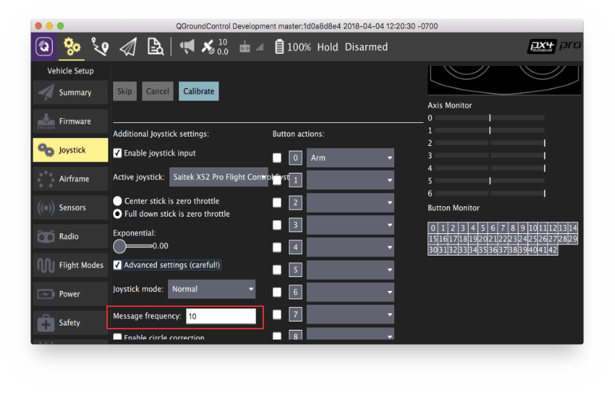

# Crazyflie 2.0 (Discontinued)

:::warning
*Crazyflie 2.0* has been [discontinued/superseded](../flight_controller/autopilot_experimental.md). Try [Bitcraze Crazyflie 2.1](../complete_vehicles/crazyflie21.md) instead!
:::

:::warning
- PX4 does not manufacture this (or any) autopilot. Contact the [manufacturer](https://www.bitcraze.io/) for hardware support or compliance issues.
- PX4 support for this flight controller is [experimental](../flight_controller/autopilot_experimental.md).
:::


The Crazyflie line of micro quads was created by Bitcraze AB. An overview of the Crazyflie 2.0 can be [found here](https://www.bitcraze.io/crazyflie-2/).


## 요약

:::note
주요 하드웨어 문서는 여기를 참고하십시오.
https://wiki.bitcraze.io/projects:crazyflie2:index
:::

* Main System-on-Chip: STM32F405RG
  * CPU: 168 MHz ARM Cortex M4 with single-precision FPU
  * RAM: 192 KB SRAM
* nRF51822 radio and power management MCU
* MPU9250 Accel / Gyro / Mag
* LPS25H barometer

## 구매처

* [Crazyflie 2.0](https://store.bitcraze.io/collections/kits/products/crazyflie-2-0).
* [Crazyradio PA 2.4 GHz USB dongle](https://store.bitcraze.io/collections/kits/products/crazyradio-pa): used for wireless communication between *QGroundControl* and Crazyflie 2.0.
* [Breakout deck](https://store.bitcraze.io/collections/decks/products/breakout-deck): breakout expansion board for connecting new peripherals.
* [Flow deck](https://store.bitcraze.io/collections/decks/products/flow-deck): contains an optical flow sensor to measure movements of the ground and a distance sensor to measure the distance to the ground. This will be useful for precise altitude and position control.
* [Z-ranger deck](https://store.bitcraze.io/collections/decks/products/z-ranger-deck) has the same distance sensor as the Flow deck to measure the distance to the ground. This will be useful for precise altitude control.
* [SD-card deck](https://store.bitcraze.io/collections/decks/products/sd-card-deck): used for high speed onboard logging to a micro SD card.
* [Logitech Joystick](https://support.logi.com/hc/en-us/articles/360024326793--Getting-Started-Gamepad-F310).

## PX4 플래싱

PX4 개발 환경 설정후 Crazyflie 2.0에 PX4를 설치합니다.

1. PX4 부트 로더 소스 코드를 다운로드합니다.
   ```
   git clone https://github.com/PX4/Bootloader.git
   ```
1. 소스 코드 최상위 디렉토리로 이동하여 다음 명령어를 실행하여 컴파일합니다.
   ```
   make crazyflie_bl
   ```
1. Crazyflie 2.0을 DFU 모드로 전환합니다.
   - 처음에는 전원이 꺼져 있는지 확인하십시오.
   - Hold down the reset button (see figure below...). 
   - 컴퓨터의 USB 포트에 연결합니다.
   - 1초 후 파란색 LED가 깜박이기 시작하고, 5초 후 더 빠르게 깜박이기 시작합니다.
   - 버튼을 뗍니다.

1. *dfu-util* 설치:
   ```
   sudo apt-get update
    sudo apt-get install dfu-util
   ```

1. Download the *crazyflie-lib-python* source code: `git clone https://github.com/bitcraze/crazyflie-lib-python.git`
   ```
   sudo dfu-util -d 0483:df11 -a 0 -s 0x08000000 -D ./build/crazyflie_bl/crazyflie_bl.bin
   ```
   Crazyflie 2.0의 전원을 키면, 노란색 LED가 깜박입니다.

1. PX4 자동조종장치 소스 코드를 다운로드합니다.
   ```
   git clone https://github.com/PX4/PX4-Autopilot.git
   ```
1. 소스 코드 최상위 디렉토리로 이동하여 다음 명령어를 실행하여 컴파일합니다.
   ```
   make bitcraze_crazyflie_default upload
   ```
1. 장치를 연결하라는 메시지가 표시되면 Crazyflie 2.0을 연결합니다. 노란색 LED가 깜박이기 시작하면 부트 로더 모드입니다. 그런 다음 빨간색 LED가 켜지면, 깜박이는 프로세스가 시작되었음을 나타냅니다.
1. 완료될 때까지 기다리십시오.
1. 완료되면,  Calibrate the sensors using [QGroundControl](https://docs.qgroundcontrol.com/master/en/SetupView/Sensors.html).

:::note QGroundControl이 기체와 연결되지 않으면 crazyflie의 [nuttx-config](https://github.com/PX4/PX4-Autopilot/blob/master/boards/bitcraze/crazyflie/nuttx-config/nsh/defconfig)에서 `# CONFIG_DEV_LOWCONSOLE이 설정되지 않음`이 `CONFIG_DEV_LOWCONSOLE = y`로 대체되었는 지 확인하십시오. 이 작업은 *menuconfig*를 사용하여 수행하여야 합니다.
```
make bitcraze_crazyflie_default menuconfig
```
또는 *qconfig* (GUI의 *직렬 드라이버 지원*에서 *저수준 콘솔 지원* 확인) :
```
make bitcraze_crazyflie_default qconfig
```
:::

## 무선 설정 지침

온보드 nRF 모듈을 사용하여 Bluetooth나 2.4GHz Nordic ESB 프로토콜로 보드에 연결할 수 있습니다.

- A [Crazyradio PA](https://www.bitcraze.io/crazyradio-pa/) is recommended.
- To fly the Crazyflie 2.0 right away, the Crazyflie phone app is supported via Bluetooth.

공식 Bitcraze** Crazyflie 앱** 사용 :

- Connect via Bluetooth.
- Change mode in settings to 1 or 2.
- Calibrate via QGroundControl.

**MAVLink** 연결 :

- Use a Crazyradio PA alongside a compatible GCS.
- Navigate to the crazyflie-lib-python folder and type: `make venv`
   ```
   git clone https://github.com/bitcraze/crazyflie-lib-python.git
   ```

:::note
[cfbridge.py](https://github.com/bitcraze/crazyflie-lib-python/blob/master/examples/cfbridge.py)를 사용하여 Crazyflie 2.0(PX4로 깜박임)과 QGroundControl간의 무선 MAVlink 통신 링크를 설정합니다. :::note [cfbridge.py](https://github.com/bitcraze/crazyflie-lib-python/blob/master/examples/cfbridge.py)를 사용하여 Crazyflie 2.0(PX4로 깜박임)과 QGroundControl간의 무선 MAVlink 통신 링크를 설정합니다. *Cfbridge*를 사용하여 QGroundControl에서 crazyradio PA와 통신할 수 있습니다.
:::

- Make sure you have set the udev permissions to use the USB Radio. To do this, follow the steps listed [here](https://www.bitcraze.io/documentation/repository/crazyflie-lib-python/master/installation/usb_permissions/) and **restart** your computer.
- Connect a Crazyradio PA via USB.
- Build a [virtual environment (local python environment)](https://virtualenv.pypa.io/en/latest/) with package dependencies using the following method:
    ```
    pip install tox --user
    ```
- Navigate to the crazyflie-lib-python folder and type:
    ```
    make venv
    ```
- Activate the virtual environment:
    ```
    source venv-cflib/bin/activate
    ```
- Install required dependencies:
    ```
    pip install -r requirements.txt --user
    ```

Crazyflie 2.0을 crazyradio와 연결하기 위하여 아래의 단계에 따라 **cfbridge를 시작**합니다.
- Power off and power on Crazyflie 2.0 and wait for it to boot up.
- Connect a Crazyflie radio device via USB.
- Navigate to the crazyflie-lib-python folder.
- Activate the environment:
    ```
    source venv-cflib/bin/activate
    ```
- Navigate to the examples folder:
    ```
    cd examples
    ```
- Launch cfbridge:
    ```
    python cfbridge.py
    ```

:::note
*Cfbridge* by default tries to initiate the radio link communication on channel 80 and with crazyflie address 0xE7E7E7E7E7. If you are using [multiple crazyflies and/or crazyradios](https://github.com/dennisss/cfbridge/blob/master/README.md#advanced-swarming) in the same room and want to use a different channel and/or address for each, first connect the crazyflie with QGroundControl via a USB cable and change the syslink parameters (channel, address) in QGroundControl. Next, launch the cfbridge by giving the same channel and address as   the first and second arguments respectively, e.g: `python cfbridge.py 90 0x0202020202`
:::
- Open QGroundControl.
- After using *cfbridge*, you can deactivate the virtualenv if you activated it by pressing `CTRL+z`. Most of the time, launching *cfbridge* again from the same terminal doesn't connect to crazyflie, this can be solved by closing the terminal and relaunching *cfbridge* in a new terminal.

Launch cfbridge: `python cfbridge.py`

```
make venv
```
:::

:::note
Joystick을 사용하려면 QGroundControl의 `COM_RC_IN_MODE`를 "Joystick/No RC Checks"로 설정하십시오. 조이스틱을 보정하고 QGroundControl의 조이스틱 메시지 주파수를 5~14Hz(10Hz 권장)로 설정합니다. 주파수를 설정하려면 고급 옵션을 활성화하여야 합니다. 이것은 조이스틱 명령이 QGroundControl에서 Crazyflie 2.0으로 전송되는 속도입니다 (이렇게하려면 [여기](https://github.com/mavlink/qgroundcontrol)의 지침에 따라 최신 QGroundControl 소스 코드 (마스터)를 얻고 빌드해야합니다).
:::



## 하드웨어 설정

Crazyflie 2.0 is able to fly with precise control in [Stabilized mode](../flight_modes_mc/manual_stabilized.md), [Altitude mode](../flight_modes_mc/altitude.md) and [Position mode](../flight_modes_mc/position.md).

* You will need the [Z-ranger deck](https://store.bitcraze.io/collections/decks/products/z-ranger-deck) to fly in *Altitude* mode. If you also want to fly in the *Position* mode, it is recommended you buy the [Flow deck](https://store.bitcraze.io/collections/decks/products/flow-deck) which also has the integrated Z-ranger sensor.
* The onboard barometer is highly susceptible to any external wind disturbances including those created by Crazyflie's own propellers. Hence, we isolated the barometer with a piece of foam, and then mounted the distance sensor on top of it as shown below:


비행세부정보를 기록하기 위하여 아래와 같이 crazyflie 위에 SD 카드 데크를 장착할 수 있습니다.


양면 테이프를 사용하여 SD 카드 데크 위에 배터리를 부착합니다.


## 고도 제어

Crazyflie는 [Z-레인저 데크](https://store.bitcraze.io/collections/decks/products/z-ranger-deck)를 사용하면 *고도* 모드로 비행할 수 있습니다. 데이터 시트에 따르면 거리 측정기가 감지할 수있는 최대 고도(지면 위)는 2m입니다. 그러나, 어두운 바닥에서는 0.5m로 감소합니다. 밝은 바닥에서는 최대 1.3m까지 상승합니다. 즉, *고도* 또는 *위치* 비행 모드에서는 이 값 이상의 고도를 유지할 수 없습니다.

:::tip
Crazyflie 2.0 높이가 *고도 모드* 또는 *위치 모드*의 중간 스로틀 명령에서 드리프트되면 먼저 기체를 재부팅 하십시오. 그래도 문제가 해결되지 않으면, 가속계와 자기(나침반) 센서를 다시 보정하십시오.   
:::

:::note
온보드 기압계는 Crazyflie의 자체 프로펠러 바람에 민감하기 때문에 고도 유지용으로 사용하는 것은 적절하지 않습니다.
:::

## 위치 제어

[플로우 데크](https://store.bitcraze.io/collections/decks/products/flow-deck)을 사용하면 *위치 모드*에서 Crazyflie 2.0을 비행할 수 있습니다. Unlike [PX4FLOW](../sensor/px4flow.md), the flow deck does not house a gyro, hence the onboard gyro is used for flow fusion to find the local position estimates. PX4flow와 달리 플로우 데크에는 자이로가 없으므로 온보드 자이로가 유동 융합에 사용되어 로컬 위치 추정치를 찾습니다.

## FrSky Taranis RC 송신기를 조이스틱으로 사용

Taranis RC 송신기를 USB 조이스틱으로 설정할 수 있습니다.

- Create a new model in Taranis.

  

- In *MODEL SETUP* menu page, turn off both internal and external TX modules.

  

- In *OUTPUTS* menu page (also called “SERVOS” page in some Taranis transmitters), invert Throttle (CH1) and Aileron (CH3).

  


Taranis 스위치를 사용하여 시동/시동 해제 및 다른 비행 모드로 전환하려면 :

- In Taranis UI *MIXER* menu page, you can assign the switches to any channel in the range channel 9-16 which map to the buttons 0-7 in the QGroundControl Joystick setup. For example, Taranis “SD” switch can be set to channel 9 in Taranis UI:

  

- Connect Taranis to PC with a USB cable and Open QGroundControl.
- In QGroundControl Joystick Setup, you can see the buttons turning yellow when you switch them on. For example, channel 9 in Taranis maps to button 0 in QGroundControl Joystick setup. You can assign any mode to this button e.g. *Altitude* mode. Now when you lower the switch "SD", flight mode will change to *Altitude*.

  

### ROS

MAVROS를 통해 Crazyflie 2.0에 연결하려면 :

- Start up *cfbridge* using the above instructions.
- Change the UDP port QGroundControl listens to:
  - In QGroundControl, navigate to **Application Settings > General** and uncheck all the boxes under *Autoconnect to the following devices*.
  - Add in **Comm Links** a link of type *UDP*, check the *Automatically Connect on Start* option, change the *Listening Port* to 14557, add Target Hosts: 127.0.0.1 and then press **OK**.
- Make sure you have [MAVROS](https://github.com/mavlink/mavros/tree/master/mavros#installation) installed.
- Start MAVROS with command:

  ```
  roslaunch mavros px4.launch fcu_url:="udp://:14550@127.0.0.1:14551" gcs_url:="udp://@127.0.0.1:14557"
  ```
- Restart QGroundControl if it doesn't connect.

## 비행

@[유투브](https://youtu.be/2Bcy3k1h5uc)
