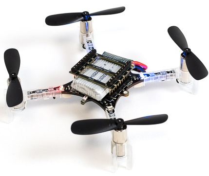
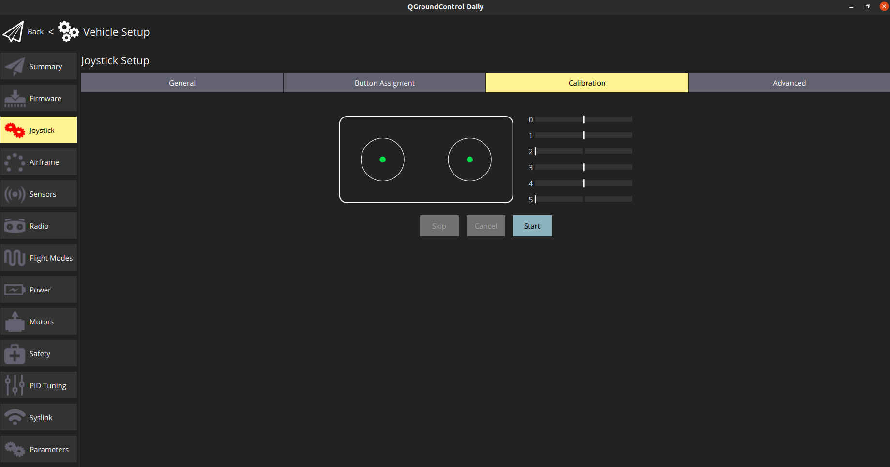
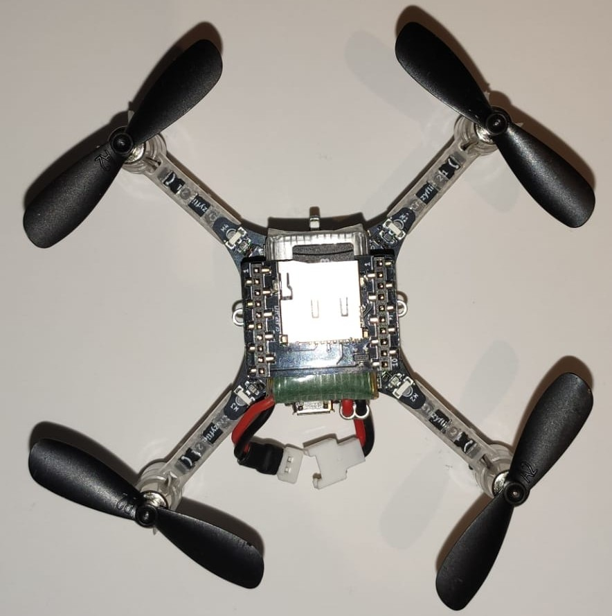

# Crazyflie 2.1

:::warning PX4에서는 이 제품을 제조하지 않습니다. 하드웨어 지원과 호환 문제는 [제조사](https://www.bitcraze.io/)에 문의하십시오.
:::

:::warning
이 비행 컨트롤러에 대한 PX4 지원은 [테스트중](../flight_controller/autopilot_experimental.md)입니다.
:::

:::warning
Crazyflie 2.1 is only able to fly in [Manual/Stabilized mode](../flight_modes_mc/manual_stabilized.md).
:::

Crazyflie 마이크로 쿼드 라인은 Bitcraze AB에서 제조하였습니다. Crazyflie 2.1의 개요는 [여기](https://www.bitcraze.io/products/crazyflie-2-1/)를 참고하십시오.




## 요약

:::note
주요 하드웨어 문서는 [여기](https://wiki.bitcraze.io/projects:crazyflie2:index)를 참고하십시오.
:::

* 메인 시스템온칩 : STM32F405RG
  * CPU : 단정밀도 FPU의 168MHz ARM Cortex M4
  * RAM : 192KB SRAM
* nRF51822 무선 및 전력 관리 MCU
* BMI088 3축 가속도계/자이로스코프
* BMP388 고정밀 압력 센서
* uUSB 커넥터
* 100mA, 500mA 및 980mA 용량의 온보드 LiPo 충전기
* 최고 속도의 USB 인터페이스
* 부분 USB OTG 기능(USB OTG가 있지만 5V 출력이 없음)
* 8KB EEPROM

## 구매처

다음 주소에서 구매할 수 있습니다 : [Crazyflie 2.1](https://store.bitcraze.io/products/crazyflie-2-1) (store.bitcraze.io)

유용한 주변 장치는 다음과 같습니다.

* [Crazyradio PA 2.4GHz USB 동글](https://store.bitcraze.io/collections/kits/products/crazyradio-pa) : *QGroundControl*과 Crazyflie 2.0 간의 무선 통신에 사용됩니다
* [브레이크 아웃 데크](https://store.bitcraze.io/collections/decks/products/breakout-deck) : 주변 장치 연결용 브레이크아웃 확장 보드입니다.
* [플로우 데크 v2](https://store.bitcraze.io/collections/decks/products/flow-deck-v2) : 고도 위치 제어를위한 광류 센서 및 거리 센서.
* [Z- 레인저 데크 v2](https://store.bitcraze.io/collections/decks/products/z-ranger-deck-v2) : 고도 제어용 거리 센서(플로우 데크와 동일한 센서).
* [다중 레인저 데크](https://store.bitcraze.io/collections/decks/products/multi-ranger-deck) 다 방향 물체 감지
* [부저 데크](https://store.bitcraze.io/collections/decks/products/buzzer-deck) 배터리 부족 또는 충전 완료와 같은 시스템 이벤트에 대한 오디오 피드백입니다.
* [브레이크 아웃 데크](https://store.bitcraze.io/collections/decks/products/breakout-deck) : 납땜없이 하드웨어를 쉽게 테스트 가능한 확장 보드입니다.
* [SD 카드 데크](https://store.bitcraze.io/collections/decks/products/sd-card-deck) : 마이크로 SD 카드는 고속의 온보드 로깅에 사용됩니다
* [Logitech 조이스틱](https://support.logi.com/hc/en-us/articles/360024326793--Getting-Started-Gamepad-F310)

## Crazyflie 2.1 조립

* [Bitcraze crazyflie 2.1 시작하기](https://www.bitcraze.io/documentation/tutorials/getting-started-with-crazyflie-2-x/).

## PX4 플래싱

:::note
Ubuntu에서만 테스트하였습니다.
:::

PX4 개발환경 설정후 Crazyflie 2.1에 PX4를 설치합니다.

1. PX4 부트 로더 소스 코드를 다운로드합니다.
   ```
   git clone https://github.com/PX4/Bootloader.git --recurse-submodules
   ```
1. 소스 코드 최상위 디렉토리로 이동하여 다음 명령어를 실행하여 컴파일합니다.
   ```
   make crazyflie21_bl
   ```
1. Crazyflie 2.1을 DFU 모드로 전환합니다.
   - 처음에는 전원이 꺼져 있는지 확인하십시오.
   - 배터리가 분리되었는지 확인하십시오.
   - 재설정 버튼을 누릅니다(아래 그림 참조).
   - 컴퓨터 USB 포트에 연결합니다.
   - 1초 후 파란색 LED가 깜박이기 시작하고, 5초 후 더 빠르게 깜박이기 시작합니다.
   - 버튼을 뗍니다.

1. *dfu-util* 설치:
   ```
   sudo apt-get update
   sudo apt-get install dfu-util
   ```

1. *dfu-util*을 사용하여 부트 로더를 플래시하고 완료되면 Crazyflie 2.1을 분리합니다.
   ```
   sudo dfu-util -d 0483:df11 -a 0 -s 0x08000000 -D ./build/crazyflie21_bl/crazyflie21_bl.bin
   ```
   Crazyflie 2.1의 전원을 키면, 노란색 LED가 깜박입니다.

1. PX4 자동조종장치 소스 코드를 다운로드합니다.
   ```
   git clone https://github.com/PX4/PX4-Autopilot.git
   ```
1. 소스 코드 최상위 디렉토리로 이동하여 다음 명령어를 실행하여 컴파일합니다.
   ```
   cd PX4-Autopilot/
   make bitcraze_crazyflie21_default upload
   ```
1. 장치를 연결하라는 메시지가 나타나면, Crazyflie 2.1을 연결합니다. 노란색 LED가 깜박이기 시작하면 부트로더 모드를 나타냅니다. 그런 다음 빨간색 LED가 켜지면, 깜박이는 프로세스가 시작되었음을 나타냅니다.
1. 완료될 때까지 기다리십시오.
1. 완료되면,  Calibrate the sensors using [QGroundControl](https://docs.qgroundcontrol.com/master/en/SetupView/Sensors.html).

## 원본 Bitcraze 펌웨어 플래싱

1. 최신 [Crazyflie 2.1 부트 로더](https://github.com/bitcraze/crazyflie2-stm-bootloader/releases)를 다운로드합니다.
1. Crazyflie 2.1을 DFU 모드로 전환합니다.
   - 처음에는 전원이 꺼져 있는지 확인하십시오.
   - 배터리가 분리되었는지 확인하십시오.
   - 재설정 버튼을 누릅니다.
   - 컴퓨터 USB 포트에 연결합니다.
   - 1초 후 파란색 LED가 깜박이기 시작하고, 5초 후 더 빠르게 깜박이기 시작합니다.
   - 버튼을 뗍니다.
1. *dfu-util*을 사용하여 부트 로더를 플래시하고 완료되면 Crazyflie 2.1을 분리합니다.
   ```
   sudo dfu-util -d 0483:df11 -a 0 -s 0x08000000 -D cf2loader-1.0.bin
   ```
   Crazyflie 2.1의 전원을 키면, 노란색 LED가 깜박입니다.
1. Install the latest Bitcraze Crazyflie 2.1 Firmware using [this](https://www.bitcraze.io/documentation/tutorials/getting-started-with-crazyflie-2-x/#update-fw) tutorial.

## 무선 설정 방법

온보드 nRF 모듈을 사용하여 Bluetooth나 2.4GHz Nordic ESB 프로토콜로 보드에 연결할 수 있습니다.

- [Crazyradio PA](https://www.bitcraze.io/crazyradio-pa/)를 권장합니다.
- Crazyflie 2.1을 블루투스 통신 비행 스마트폰 앱이 지원됩니다.

**MAVLink** 연결 :

- 호환되는 GCS와 함께 Crazyradio PA를 제어합니다.
- *crazyflie-lib-python* 소스 코드를 다운로드합니다.
   ```
   git clone https://github.com/bitcraze/crazyflie-lib-python.git
   ```

:::note
[cfbridge.py](https://github.com/bitcraze/crazyflie-lib-python/blob/master/examples/cfbridge.py)를 사용하여 Crazyflie 2.1(PX4로 깜박임)과 QGroundControl간의 무선 MAVlink 통신 링크를 설정합니다. *Cfbridge*를 사용하여 QGroundControl에서 crazyradio PA와 통신할 수 있습니다. [C 기반 cfbridge](https://github.com/dennisss/cfbridge)는 현재 데이터 손실 문제가 있으므로 **cfbridge.py**를 사용하는 것이 좋습니다.
:::

- USB 라디오를 사용을 위한 udev 권한을 설정 여부를 확인하십시오. To do this, follow the steps listed [here](https://www.bitcraze.io/documentation/repository/crazyflie-lib-python/master/installation/usb_permissions/) and **restart** your computer.
- USB를 통해 Crazyradio PA를 연결합니다.
- 아래의 방법으로 [로컬 Python 가상 환경](https://virtualenv.pypa.io/en/latest/)을 빌드합니다.
    ```
    pip install tox --user
    ```
- crazyflie-lib-python 폴더로 이동하여 다음을 입력합니다.
    ```
    make venv
    ```
- 가상 환경을 활성화합니다.
    ```
    source venv/bin/activate
    ```
- 필요한 라이브러리들을 설치합니다.
    ```
    pip install cflib
    pip install -r requirements.txt
    ```

Crazyflie 2.1을 crazyradio와 연결하기 위하여 아래의 단계에 따라 **cfbridge를 시작**합니다.
- Crazyflie 2.1의 전원을 껐다 켜고 부팅될 때까지 기다립니다.
- USB를 통해 Crazyflie 라디오 장치를 연결합니다.
- crazyflie-lib-python 폴더로 이동합니다.
- 가상 환경을 활성화합니다.
    ```
    source venv/bin/activate
    ```
- examples 폴더로 이동하십시오.
    ```
    cd examples
    ```
- cfbridge를 시작합니다.
    ```
    python cfbridge.py
    ```

:::note
*Cfbridge*는 기본적으로 채널 80과 crazyflie 주소 0xE7E7E7E7E7을 사용하여 무선 통신을 시작합니다. 같은 방에서 [여러 개의 crazyflies과 crazyradios](https://github.com/dennisss/cfbridge/blob/master/README.md#advanced-swarming)를 사용하고 있고 각각에 대해 다른 채널과 주소를 사용하려면, 먼저 USB 케이블을 통해 crazyflie를 QGroundControl과 연결하고 QGroundControl의 syslink 매개 변수(채널, 주소)를 변경합니다. 그런 다음, 첫 번째와 두 번째 인수와 동일한 채널 및 주소를 각각 제공하여 cfbridge를 시작합니다. 예 : `python cfbridge.py 90 0x0202020202`
:::
- QGroundControl을 실행합니다.
- *cfbridge*를 사용 후 `CTRL + z`를 눌러 활성화 한 경우 virtualenv를 비활성화할 수 있습니다. 대부분의 경우에는 동일한 터미널에서 *cfbridge*를 다시 시작하면 crazyflie에 연결되지 않습니다.이 문제는 터미널을 닫고 새 터미널에서 *cfbridge*를 다시 시작하여 해결할 수 있습니다.

:::tip
If you change any driver in [crazyflie-lib-python](https://github.com/bitcraze/crazyflie-lib-python) or if launching *cfbridge* in a new terminal does not find crazyflie, you can try navigating to the crazyflie-lib-python folder and run the script below to rebuild cflib.
```
make venv
```
:::

:::note
The Joystick menu in QGC, only appears after you connect the controller to the PC (for example a Playstation 3 controller).


:::

## 하드웨어 설정

Crazyflie 2.1 is only able to fly in [Stabilized mode](../flight_modes_mc/manual_stabilized.md).

비행세부정보를 기록하기 위하여 아래와 같이 crazyflie 위에 SD 카드 데크를 장착할 수 있습니다.



## FrSky Taranis RC 송신기를 조이스틱으로 사용

Taranis RC 송신기를 USB 조이스틱으로 설정할 수 있습니다.

- Taranis에서 새 모델을 만듭니다.

  

- *MODEL SETUP* 메뉴 페이지에서 내부와 외부 TX 모듈을 모두 끕니다.

  

- *OUTPUTS* 메뉴 페이지(일부 Taranis 송신기에서는 "SERVOS"페이지라고도 함)에서 스로틀 (CH1) 및 에일러론 (CH3)을 반전시킵니다.

  


Taranis 스위치를 사용하여 시동/시동 해제 및 다른 비행 모드로 전환하려면 :

- Taranis UI *MIXER* 메뉴 페이지에서 QGroundControl 조이스틱 설정의 버튼 0-7에 매핑되는 범위 채널 9-16의 채널에 스위치를 할당할 수 있습니다. 예를 들어, Taranis "SD"스위치는 Taranis UI에서 채널 9로 설정할 수 있습니다.

  

- Taranis를 USB 케이블로 PC에 연결하고 QGroundControl을 실행합니다.
- QGroundControl 조이스틱 설정에서 버튼을 켜면, 노란색으로 변하는 것을 볼 수 있습니다. 예를 들어, Taranis의 채널 9는 QGroundControl 조이스틱 설정의 버튼 0에 매핑됩니다. 이 버튼에 모든 모드(예:  *고도* 모드)를 설정할 수 있습니다. 이제 "SD"스위치를 내리면 비행 모드가 *고도 모드*로 변경됩니다.

  

### ROS

MAVROS를 통해 Crazyflie 2.1에 연결하려면 :

- 위의 지침에 따라 *cfbridge*를 시작합니다.
- QGroundControl의 수신 UDP 포트 변경 :
  - QGroundControl에서 **애플리케이션 설정 &gt; 일반**으로 이동하여 *다음 장치에 자동 연결* 아래의 모든 확인란을 선택 취소합니다.
  - Add in **Comm Links** a link of type *UDP*, check the *Automatically Connect on Start* option, change the *Listening Port* to 14557, add Target Hosts: 127.0.0.1 and then press **OK**.
- [MAVROS](https://github.com/mavlink/mavros/tree/master/mavros#installation)가 설치 여부를 확인합니다.
- 다음 명령으로 MAVROS를 시작합니다.
  ```
  roslaunch mavros px4.launch fcu_url:="udp://:14550@127.0.0.1:14551" gcs_url:="udp://@127.0.0.1:14557"
  ```
- 연결이 되지 않으면 QGroundControl을 다시 시작하십시오.

## 비행

@[유투브](https://www.youtube.com/watch?v=0qy7O3fVN2c)
