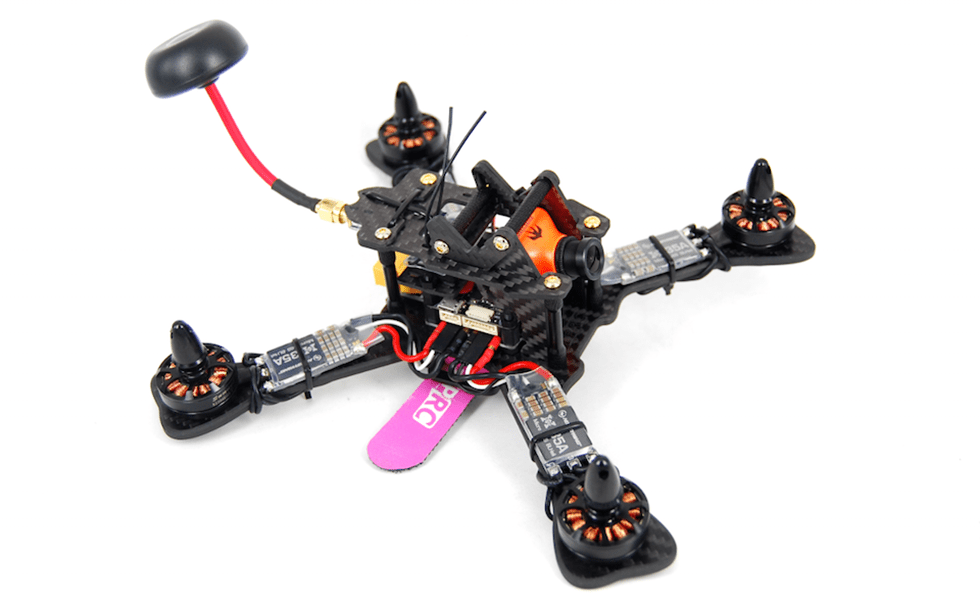

## MindRacer 210

### 요약

전체 PX4/MindPX 스택을 실행하여 즉시 비행이 가능한 레이싱 드론입니다. 최대 10:1 추력중량비에 도달할 수 있습니다!

MR210은 MindRacer를 비행 컨트롤러로 사용합니다.  MR210은 모듈화된 스택형 RTF 레이싱 드론입니다. 납땜이 필요없는 SEP/WEP 소켓을 사용하면 조종사가 납땜없이 파손된 부품을 신속하게 교체할 수 있습니다. 조종사는 간편한 조립 방법으로 스태킹 부품을 추가하거나 교체하여 더 강력한 드론을 만들 수 있습니다.

### 주요 특징

1. 진정한 'X', 4mm 두께, 210mm 대각선 탄소 섬유 프레임.
2. 무 납땜 ESC 연결 및 부품 교체를위한 스택형 SEP/WEP 소켓.
3. 30A/4S/OneShot 지원 BLHeli ESC.
4. 카메라와 VTX를 포함한 모든 항공 전자 기기를위한 5V 범용 전압 공급.
5. DroneCode &reg; 표준 준수 JST GH 커넥터.
6. PPM/S.Bus/Specktrum DSM 수신기에 대한 옵션이 있습니다.

### 사용자 가이드

:::note
사용자 가이드는 [여기](http://mindpx.net/assets/accessories/MR210usermanual_pdf.pdf)를 참고하십시오.
:::

### 구매처

MindRacer 210 is available at [AirMind Store](https://airmind.mindpx.net/node/78). Amazon&reg; 또는 eBay&reg;에서도 MindRacer를 구매할 수 있습니다.

### 지원

자세한 내용은 http://www.mindpx.org를 참고하십시오. 문의 사항이나 도움이 필요한 경우에는 [support@mindpx.net](mailto:support@mindpx.net)에 이메일을 보내십시오.
