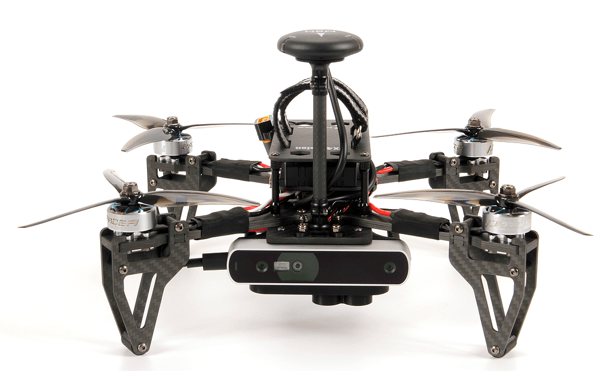
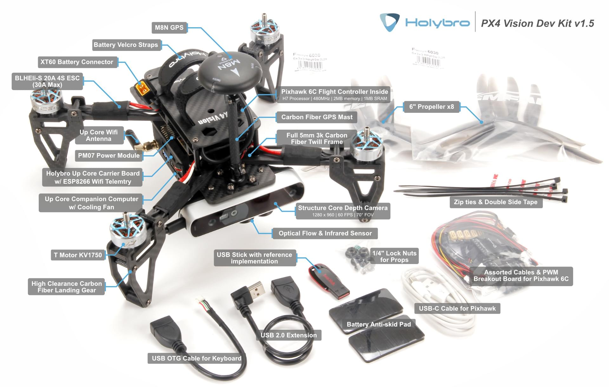

# PX4 Vision Autonomy 개발 키트

The [*PX4 Vision Autonomy Development Kit*](https://holybro.com/collections/multicopter-kit/PX4-Vision) is a robust and inexpensive kit for enabling computer vision development on autonomous vehicles.



The kit contains a near-ready-to-fly carbon-fiber quadcopter equipped with a *Pixhawk 4* or *Pixhawk 6C* (on V1.5) flight controller, a *UP Core* companion computer (4GB memory & 64GB eMMC), and a Occipital *Structure Core* depth camera sensor.

:::note
이 제품에는 사전 설치된 소프트웨어가 없습니다. A USB stick is included in the kit with an example of an [obstacle avoidance](../computer_vision/obstacle_avoidance.md) feature implementation, based on the [PX4 Avoidance](https://github.com/PX4/PX4-Avoidance) project. This example is intended as a reference only and serves to demonstrate the capabilities of the platform. The software is not compatible with the latest version of PX4, nor is it actively maintained or supported.
:::

이 가이드는 기체 비행 준비에 필요한 최소한의 추가 설정을 설명합니다(RC 시스템과 배터리 설치). 또한 처녀 비행과 컴퓨터 비전 코드 수정 방법을 설명합니다.

## Where to Buy

- [PX4 Vision Dev Kit v1.5](https://holybro.com/collections/multicopter-kit/products/px4-vision-dev-kit-v1-5)
- [PX4 Vision Dev Kit v1 (Discontinued)](https://holybro.com/collections/multicopter-kit/products/px4-vision)

## Px4 비전 가이드 콘텐츠
- [경고와 알림](#warnings-and-notifications)
- [내부 내용](#what-is-inside)
- [그 외 필요한 것](#what-else-do-you-need)
- [최초 설정](#first-time-setup)
- [드론 회피 비행](#fly-the-drone-with-avoidance)
- [키트 개발](#development-using-the-kit)
- [PX4 Vision Carrier Board Pinouts](#px4-vision-carrier-board-pinouts)
- [기타 개발 리소스](#other-development-resources)
- [기술 지원 방법](#how-to-get-technical-support)

## 경고와 알림

1. 이 키트는 전방 카메라를 사용하는 컴퓨터 비전 프로젝트용입니다. 하향 또는 후방 깊이 카메라가 없습니다. 따라서, 추가 수정없이는 [안전 착륙](../computer_vision/safe_landing.md) 또는 하방향 카메라가 필요한 다른 기능들을 테스트할 수 없습니다.
1. Obstacle avoidance in missions can only be tested when GPS is available (missions use GPS coordinates). 충돌 방지는 GPS와 광학 흐름에서 위치 잠금시에 위치 모드에서 테스트할 수 있습니다.
1. `USB1`로 표시된 포트는 *USB3* 주변 장치와  동시에 사용하는 경우에는 GPS를 방해할 수 있습니다(임무를 포함한 GPS 종속 기능 비활성화). 이로 인하여, 부팅 이미지가 *USB2.0* 메모리 스틱으로 제공됩니다.
1. PX4 Vision v1 with ECN 010 or above (carrier board RC05 and up), the *UP Core* can be powered by either the DC plug or with battery.

    
1. All PX4 Vision v1.5 *UP Core* can be powered by either the DC plug or with battery.

:::warning
For PX4 Vision v1 with ECN below 010/carrier board below RC04, the *UP Core* should only be powered using the battery (do not remove the *UP Core power* socket safety cover). This does not apply to PX4 Vision v1.5


:::

## 내부 내용

:::note
Difference between the PX4 Vision V1 and V1.5 can be found [here](https://docs.holybro.com/drone-development-kit/px4-vision-dev-kit-v1.5/v1-and-v1.5-difference)
:::



What's inside the PX4 Vision V1 can be found here in the [PX4 v1.13 Docs here](https://docs.px4.io/v1.13/en/complete_vehicles/px4_vision_kit.html#what-is-inside).

PX4 Vision DevKit에는 아래의 내용물들이 포함되어 있습니다.
- 핵심 구성 요소:
  - 1x Pixhawk 4 or Pixhawk 6C (for v1.5) flight controller
  - 1x PMW3901 광학 유량 센서
  - 1x TOF 적외선 거리 센서 (PSK‐CM8JL65‐CC5)
  - 1x 구조 코어 깊이 카메라
    - 160도 와이드 비전 카메라
    - 스테레오 적외선 카메라
    - 온보드 IMU
    - 강력한 NU3000 멀티 코어 깊이 프로세서
  - 1x *UP Core* 컴퓨터 (4GB 메모리 및 64GB eMMC, Ubuntu 및 PX4 회피 기능)
    - Intel® Atom ™ x5-z8350 (최대 1.92GHz)
    - 호환 OS : Microsoft Windows 10 정식 버전, Linux (ubilinux, Ubuntu, Yocto), Android
    - 비행 컨트롤러에 연결된 FTDI UART
    - `USB1` : USB3.0 USB2.0 스틱에서 PX4 회피 환경을 부팅용 포트입니다(USB3.0 주변 장치를 연결하면 GPS 장애 발생할 수 있음).
    - `USB2` : JST-GH 커넥터의 USB2.0 포트. 두 번째 카메라, LTE 등에 사용할 수 있습니다. (또는 개발용 키보드 / 마우스).
    - `USB3` : 깊이 카메라에 연결된 USB2.0 JST-GH 포트
    - `HDMI` : HDMI 출력
    - SD 카드 슬롯
    - WiFi 802.11 b/g/n @ 2.4GHz (외부 안테나 #1에 연결됨). 컴퓨터 인터넷 액세스와 업데이트를 위하여 홈 WiFi 네트워크에 액세스할 수 있습니다.


- 기계적 사양 :
  - 프레임 : 전체 5mm 3k 탄소 섬유 능직
  - Motors: T-MOTOR KV1750
  - ESC : BEHEli-S 20A ESC
  - GPS: M8N GPS module
  - 전원 모듈 : Holybro PM07
  - 축거 : 286mm
  - 중량 : 854g (배터리 또는 소품 제외)
  - 텔레메트리 : 비행 컨트롤러에 연결된 ESP8266 (외부 안테나 #2에 연결됨). 지상국에 대한 무선 연결을 활성화합니다.


- A USB2.0 stick with pre-flashed software that bundles:
  - Ubuntu 18.04 LTS
  - ROS Melodic
  - 후두 구조 코어 ROS 드라이버
  - MAVROS
  - [PX4 회피 기능](https://github.com/PX4/PX4-Avoidance)


- 다양한 케이블, 8x 프로펠러, 2x 배터리 스트랩 (설치됨) 및 기타 액세서리 (추가 주변 장치 연결용으로 사용할 수 있음).

## 그 외 필요한 것

이 키트에는 별도로 구매하여야 하는 배터리와 무선 제어 시스템을 제외한 필수적인 드론 하드웨어들이 포함되어 있습니다.
- 배터리:
  - XT60 암 커넥터가있는 4S LiPo
  - 길이 115mm 미만 (전원 커넥터와 GPS 마스트 사이에 맞음)
- 무선 제어 시스템
  - 모든 [PX4 호환 RC 시스템](../getting_started/rc_transmitter_receiver.md)을 사용할 수 있습니다.
  - R-XSR 수신기가 있는 *FrSky Taranis* 송신기는 많이 사용되는 설정입니다.
- H2.0 Hex 키 (RC 수신기를 연결할 수 있도록 상단 플레이트 나사를 푸는 용도)

또한, 사용자는 지상국 하드웨어와 소프트웨어가 필요합니다.
- Laptop or tablet running [QGroundControl](https://docs.qgroundcontrol.com/master/en/getting_started/download_and_install.html) (QGC).

## 최초 설정

1. Attach a [compatible RC receiver](../getting_started/rc_transmitter_receiver.md#connecting-receivers) to the vehicle (not supplied with kit):
   - H2.0 육각 도구를 사용하여 상단 플레이트 (배터리가가는 곳)를 분리합니다.
   - [수신기를 비행 컨트롤러에 연결합니다](../assembly/quick_start_pixhawk4.md#radio-control).
   - 상단 플레이트를 다시 부착합니다.
   - RC 수신기를 기체 후면의 *UP Core* 캐리어 보드 플레이트에 장착합니다 (지퍼 또는 양면 테이프 사용).
   - 안테나에 장애물이 없는 지, 프레임에서 전기적으로 절연되어 있는지 확인합니다 (예 : 캐리어 보드 아래 또는 기체 팔 또는 다리에 고정).

1. RC 지상 및 공중 유닛을 [바인딩](../getting_started/rc_transmitter_receiver.md#binding)합니다 (아직 수행하지 않은 경우). 바인딩 절차는 사용된 무선 시스템에 따라 다릅니다 (수신기 설명서 참조).
1. GPS 마스트를 수직 위치로 올리고 덮개를 베이스 플레이트의 홀더에 조입니다. (Not required for v1.5)

   

1. 키트에서 사전 이미징된 USB2.0 스틱을 `USB1` (아래 강조 표시됨)이라고 표시된 *UP Core* 포트에 삽입합니다.

   
1. 완전히 충전된 배터리로 기체의 전원을 공급하십시오.  :::note
배터리를 연결하기 전에 프로펠러가 제거되었는 지 확인하십시오.

:::
1. 아래의 로그인 정보를 사용하여 지상국을 기체 WiFi에 연결합니다 (몇 초 후).
   - **SSID:** pixhawk4
   - **비밀번호:** pixhawk4

:::tip
연결 후(원하는 경우), 웹 브라우저에서 URL `http://192.168.4.1`을 열어 WiFi 네트워크 SSID, 암호 및 기타 로그인 정보를 변경할 수 있습니다. 전송 속도 921600을 변경하지 마십시오.
:::

1. 지상국에서 *QGroundControl*을 시작합니다.
1. 차량 [설정 및 보정](../config/README.md) :

   :::note
기체는 사전 보정된 상태로 수령하여야합니다 (예 : 펌웨어, 기체, 배터리 및 센서가 모두 설정됨).
그러나, 방금 연결한 무선 시스템을 보정하여야 하며, 나침반 보정을 다시 수행하여야 하는 경우가 많습니다.
:::

   - [라디오 시스템 보정](../config/radio.md)
   - [나침반 보정](../config/compass.md)


1. (선택 사항) 조종기에서 [비행 모드 선택 스위치](../config/flight_mode.md)를 설정합니다.

:::note
모드는 *QGroundControl*을 사용하여 변경할 수 있습니다.
:::

   RC 컨트롤러 스위치는 다음에 대해 정의하는 것이 좋습니다.
   - [Position Mode](../flight_modes_mc/position.md) - a safe manual flight mode that can be used to test collision prevention.
   - [임무 모드](../flight_modes/mission.md) - 임무를 실행하고 장애물 회피를 테스트합니다.
   - [귀환 모드](../flight_modes/return.md) - 기체를 출발 지점으로 안전하게 복귀하여 착륙합니다.


1. 그림과 같이 프로펠러를 부착합니다.

   

   - 프로펠러 방향(*6045* (정상, 시계 반대 방향), _6045_ **R** (반전, 시계 방향)을 레이블에서 확인할 수 있습니다.

     

   - 제공된 프로펠러 너트를 사용하여 단단히 조입니다.

     


## 드론 회피 비행

위의  기체 설정이 완료되면 :

1. 기체에 전원 공급 배터리를 연결하십시오.

1. 부팅 순서가 완료되고 회피 시스템이 시작될 때까지 기다리십시오 (부팅중에는 기체는은 무장 명령을 거부합니다).

:::tip
부팅/시작 프로세스는 제공된 USB 스틱에서 약 1 분 (또는 [내부 메모리](#install_image_mission_computer)에서 30 초) 정도 소요됩니다.
:::

1. 회피 시스템이 제대로 시작되었는 지 확인하십시오.

   - *QGroundControl* 알림 로그에 **Avoidance system connected** 메시지가 표시됩니다.

     
   - *Structure Core* 카메라 전면에 빨간색 레이저가 보입니다.
1. GPS LED가 녹색으로 바뀔 때까지 기다리십시오. 이것은 기체에 GPS 준비가 완료되어 비행 준비가 완료되었음을 의미합니다!
1. 지상국을 기체 WiFi에 연결합니다.
1. PX4 비전을 테스트하기 위해 나무나 기타 편리한 장애물이 있는 비행하기에 안전한 실외 위치를 찾으십시오.

1. To test [collision prevention](../computer_vision/collision_prevention.md), enable [Position Mode](../flight_modes_mc/position.md) and fly manually towards an obstacle. 기체의 속도를 줄인 다음 장애물로부터 6m 이내에 정지해야합니다(거리는 [CP_DIST](../advanced_config/parameter_reference.md#CP_DIST) 매개 변수를 사용하여 [변경](../advanced_config/parameters.md) 할 수 있음).

1. [장애물 회피](../computer_vision/obstacle_avoidance.md)를 테스트 하려면 경로에 장애물이 있는 임무를 만드십시오. 그런 다음, [임무 모드](../flight_modes/mission.md)로 전환하여 임무를 실행하고 장애물을 돌아다니는 기체를 관찰한 다음 계획된 코스로 돌아갑니다.


## 키트를 사용한 개발

다음 섹션에서는 컴퓨터 비전 소프트웨어를 개발 키트를 사용하는 방법에 대하여 설명합니다.

### PX4 회피 개요

*PX4 회피* 시스템은 *비행 컨트롤러*에서 실행되는 PX4 비행 스택에 장애물과 경로 정보를 제공하는 보조 컴퓨터 (연결된 깊이 카메라 포함)에서 실행되는 컴퓨터 비전 소프트웨어로 구성됩니다.

Documentation about the companion computer vision/planning software can be found on github here: [PX4/PX4-Avoidance](https://github.com/PX4/PX4-Avoidance). 이 프로젝트는 다양한 플래너 구현 (ROS 노드로 패키징)을 제공합니다.
- PX4 Vision Kit는 기본적으로 *localplanner*를 실행하며 이것은 소프트웨어에 권장되는 시작점입니다.
- *globalplanner*는이 키트로 테스트되지 않았습니다.
- *착륙 플래너*에는 아래쪽을 향한 카메라가 필요하며, 먼저 카메라 장착을 수정하지 않고는 사용할 수 없습니다.

PX4와 보조 컴퓨터는 다음 인터페이스를 사용하여 [MAVLink](https://mavlink.io/en/)를 통하여 데이터를 교환합니다.
- [경로 계획 인터페이스](../computer_vision/path_planning_interface.md) - 자동 모드에서 회피 기능을 구현 API.
- [충돌 방지 인터페이스](../computer_vision/collision_prevention.md) - 장애물 맵을 기반으로하는 수동 위치 모드에서 차량 기반 회피를위한 API (현재 충돌 방지에 사용됨).

<a id="install_image_mission_computer"></a>

### 보조 컴퓨터에 이미지 설치

*UP Core*에 이미지를 설치하고 내부 메모리(USB 스틱 대신)에서 부팅할 수 있습니다.

내부 메모리 부팅이 훨씬 빠르며 USB 스틱보다 더 많은 메모리를 제공하며 USB 포트를 더 확보할 수 있습니다.

:::note
내장 메모리에서 부팅은 약 30 초가 걸리며, 제공된 USB2 스틱으로 부팅은 약 1분 정도 걸립니다(다른 카드는 더 오래 걸릴 수 있음).
:::

USB 이미지를 *UP Core*로 플래시하려면 :

1. 사전 플래시된 USB 드라이브를 `USB1`이라고 표시된 *UP Core* 포트에 삽입합니다.
1. [보조 컴퓨터에 로그인](#login_mission_computer)합니다(위 설명 참조).
1. 터미널에서 다음 명령어를 실행하여 이미지를 내부 메모리 (eMMC)에 복사합니다. 터미널은 깜박이는 프로세스동안에 여러가지 응답을 요청합니다.
   ```sh
   cd ~/catkin_ws/src/px4vision_ros/tools
   sudo ./flash_emmc.sh
   ```

:::note
이 스크립트를 실행하면 *UP Core*에 저장된 모든 정보가 삭제됩니다.
:::

1. USB 스틱을 꺼냅니다.
1. 기체를 재부팅합니다. 이제 *UP Core* 컴퓨터가 내부 메모리 (eMMC)에서 부팅됩니다.

### 보조 컴퓨터 부팅

먼저 제공된 USB2.0 스틱을 `USB1`이라고 표시된 *UP Core* 포트에 삽입한 다음 4S 배터리를 사용하여 기체에 전원을 공급합니다. 회피 시스템은 약 1 분 이내에 시작되어야 합니다(제공된 USB 스틱에 따라 다름).

:::tip
[Fly the Drone with avoidance](#fly-the-drone-with-avoidance)는 회피 시스템이 활성화 여부를 확인하는 방법을 추가로 설명합니다.
:::

이미 [보조  컴퓨터에 이미지를 설치](#install_image_mission_computer) 한 경우에는 기체에 전원을 공급하기만하면 됩니다(즉, USB 스틱이 필요하지 않음). 회피 시스템은 약 30 초 이내에 가동 및 실행되어야 합니다.

시작되면 보조 컴퓨터를 비전 개발 환경과 소프트웨어 실행 환경으로 사용할 수 있습니다.

<a id="login_mission_computer"></a>

### 보조 컴퓨터 로그인

보조 컴퓨터에 로그인하려면 :
1. 포트 `USB2`를 통하여 키보드와 마우스를 *UP Core*에 연결합니다.

   
   - 키트의 USB-JST 케이블을 사용하여 USB A 커넥터를 얻습니다.

     
   - 키보드와 마우스에 별도의 커넥터가 있는 경우 USB 허브를 케이블에 연결할 수 있습니다.
1. 모니터를 *UP Core* HDMI 포트에 연결합니다.

   

   그러면 Ubuntu 로그인 화면이 모니터에 표시됩니다.
1. 아래의 로그인 정보로 *UP Core*에 로그인합니다.
   - **사용자 이름:** px4vision
   - **비밀번호:** px4vision


### PX4 회피 기능 추가 개발

PX4 비전의 *UP Core* 컴퓨터는 PX4 회피 소프트웨어를 확장을 위한 최적의 개발 환경을 제공합니다 (일반적으로 ROS 2를 사용하여 새로운 컴퓨터 비전 알고리즘을 개발함). You should develop and test your software on the vehicle, sync it to your own git repository, and share any fixes and improvements with the wider PX4 community on the github [PX4/PX4-Avoidance](https://github.com/PX4/PX4-Avoidance) repo.

catkin 작업 공간은 `~/catkin_ws`에 있으며 PX4 회피 로컬 플래너를 실행하도록 사전에 설정되어 있습니다. 부팅에서 시작 파일(`avoidance.launch`)은 `px4vision_ros` 패키지에 있습니다. 실행되는 플래너를 변경하려면 이 파일을 수정하십시오.

회피 패키지는 부팅시 시작됩니다. 다른 플래너를 통합하려면이 기능을 비활성화하여야 합니다.

1. 다음 명령을 사용하여 회피 프로세스를 비활성화 하십시오.
   ```sh
   systemctl stop avoidance.service
   ```
   시스템을 재부팅하여 서비스를 다시 시작할 수 있습니다.

   기타 유용한 명령은 다음과 같습니다.
   ```sh
   # 서비스 재시작
systemctl start avoidance.service

# 서비스 비활성화 (서비스를 중지하고 부팅후 다시 시작하지 않음)
systemctl disable avoidance.service

# 서비스 활성화 (서비스 시작 및 부팅후 재시작 활성화)
systemctl enable avoidance.service  
   ```

1. The source code of the obstacle avoidance package can be found in https://github.com/PX4/PX4-Avoidance which is located in `~/catkin_ws/src/avoidance`.

1. 코드를 변경하십시오! 최신 회피 코드를 얻으려면 회피 저장소에서 코드를 가져 오십시오.
   ```sh
   git pull origin
   git checkout origin/master
   ```
1. 패키지 빌드
   ```
   catkin build local_planner
   ```

ROS 작업 공간은 `~/catkin_ws`에 있습니다. ROS에서 개발하고 catkin 작업 공간을 사용하는 방법에 대한 참조는 [ROS catkin 튜토리얼](http://wiki.ros.org/catkin/Tutorials)을 참고하십시오.


### PX4 펌웨어 개발

이 키트는 보조 컴퓨터에서 실행되고 PX4의 유연한 경로 계획 및 충돌 방지 인터페이스와 통합되는 컴퓨터 비전 소프트웨어를 만들기 위하여 설계되었습니다.

PX4 자체를 수정하고 [사용자 지정 펌웨어로 설치](../config/firmware.md#custom) 할 수도 있습니다.
- You will need to connect *QGroundControl* to the kit's *Pixhawk* **via USB** in order to update firmware.
- 새 펌웨어를 로드 한 후 *PX4 Vision DevKit* 기체를 선택합니다. 

:::note
대부분의 컴퓨터 비전 사용 사례를 충족하기 위해 PX4 코드를 수정할 필요는 *없습니다 *. To discuss the interfaces or how to integrate other features join the [PX4 support channels](../contribute/support.md).
:::

## PX4 Vision Carrier Board Pinouts

Information for the PX4 Vision 1.15 can be found at [https://docs.holybro.com](https://docs.holybro.com/drone-development-kit/px4-vision-dev-kit-v1.5). The carrier board pinouts and other information are in the [downloads section](https://docs.holybro.com/drone-development-kit/px4-vision-dev-kit-v1.5/downloads).

## 기타 개발 리소스

- [*UP Core* Wiki](https://github.com/up-board/up-community/wiki/Ubuntu) - *Up Core* companion computer technical information
- [후두 개발자 포럼](https://structure.io/developers) - *구조 코어* 카메라 정보
- [Pixhawk  4 개요](../flight_controller/pixhawk4.md)
- [Pixhawk 6C Overview](../flight_controller/pixhawk6c.md)
- [PX4 회피 소프트웨어 / 문서](https://github.com/PX4/PX4-Avoidance)
- [경로 계획 인터페이스](../computer_vision/path_planning_interface.md)

## 기술 지원 방법

하드웨어 문제는 Holybro([productservice@holybro.com](mailto:productservice@holybro.com))에 문의하십시오.

소프트웨어 문제는 아래의 커뮤니티 지원 채널을 사용하십시오.
- [Holybro PX4 비전 위키 팩토리](https://wikifactory.com/+holybro/px4-vision)
- [PX4 Support channels](../contribute/support.md)
