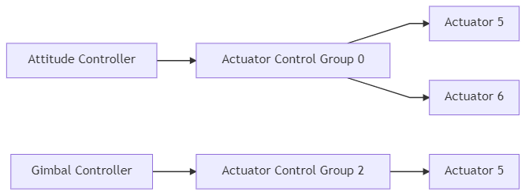
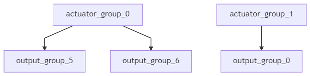

# 혼합과 액추에이터

<!-- there is a useful doc here that we should still mine to further improve this topic: https://docs.google.com/document/d/1xCEQh48uDWyo7TjqedW6gYxBxMtNyuYZ2Xkt2MBb2-w -->

PX4 아키텍처는 기체 레이아웃이 코어 콘트롤러에서 특별한 케이스들을 처리 하지 않도록 합니다.

혼합이란 강제 명령(예: `우회전`)을 받아 모터나 서보를 제어하는 액추에이터 명령으로 변환하는 것을 의미합니다. 에일러론당 하나의 서보가 있는 비행기에는 하나는 높게, 다른 하나는 낮게 명령하는 것을 의미합니다. 멀티콥터에도 동일하게 적용됩니다. 앞으로 나아가려면 모든 모터의 속도를 변경하여야 합니다.

실제 자세 콘트롤러에서 믹서 로직을 분리하면 재사용성이 크게 향상됩니다.

## 파이프라인 콘트롤

특정 콘트롤러는 특정 정규화된 힘 또는 토크 요구(-1..+1에서 조정됨)를 믹서로 보내고, 이에 따라 개별 액추에이터를 설정합니다. 그런 다음 출력 드라이버(예: UART, UAVCAN 또는 PWM)를 액츄에이터 기본 단위로 확장합니다. PWM 값은 1300입니다.



<!-- Mermaid Live Version: https://mermaid-js.github.io/mermaid-live-editor/#/edit/eyJjb2RlIjoiZ3JhcGggTFI7XG4gIGF0dF9jdHJsW0F0dGl0dWRlIENvbnRyb2xsZXJdIC0tPiBhY3RfZ3JvdXAwW0FjdHVhdG9yIENvbnRyb2wgR3JvdXAgMF1cbiAgZ2ltYmFsX2N0cmxbR2ltYmFsIENvbnRyb2xsZXJdIC0tPiBhY3RfZ3JvdXAyW0FjdHVhdG9yIENvbnRyb2wgR3JvdXAgMl1cbiAgYWN0X2dyb3VwMCAtLT4gb3V0cHV0X2dyb3VwNVtBY3R1YXRvciA1XVxuICBhY3RfZ3JvdXAwIC0tPiBvdXRwdXRfZ3JvdXA2W0FjdHVhdG9yIDZdXG4gIGFjdF9ncm91cDJbQWN0dWF0b3IgQ29udHJvbCBHcm91cCAyXSAtLT4gb3V0cHV0X2dyb3VwMFtBY3R1YXRvciA1XVxuXHRcdCIsIm1lcm1haWQiOnsidGhlbWUiOiJkZWZhdWx0In19 --->

## 콘트롤 그룹

PX4는 제어 그룹(입력)과 출력 그룹을 사용합니다. 개념적으로 매우 간단합니다. 통제 그룹은 예를 들어 핵심 비행 제어의 경우 `attitude`, 페이로드의 경우 `gimbal` 입니다. 출력 그룹은 하나의 물리적 버스(예: 서보용 처음 8개의 PWM 출력)입니다. 이 그룹 각각에는 믹서를 통하여 매핑하고 확장할 수 있는 8개의 정규화된(-1..+1) 명령 포트가 있습니다. 믹서는 컨트롤의 이러한 8개 신호 각각이 8개의 출력에 연결되는 방식을 정의합니다.

간단한 평면 제어의 경우 0(롤)은 출력 0(에일러론)에 직접 연결됩니다. 멀티콥터의 경우 상황이 약간 다릅니다. 컨트롤 0(롤)은 4개의 모터 모두에 연결되고 스로틀과 결합됩니다.

### 콘트롤 그룹 #0(비행 콘트롤)

* 0: roll (-1..1)
* 1: pitch (-1..1)
* 2: yaw (-1..1)
* 3: throttle(0..1 정상 범위, 가변 피치/추력 리버서의 경우 -1..1)
* 4: flaps (-1..1)
* 5: spoilers (-1..1)
* 6: airbrakes (-1..1)
* 7: landing gear (-1..1)

### 콘트롤 그룹 #1(비행 제어 VTOL/대체)

* 0: roll ALT (-1..1)
* 1: pitch ALT (-1..1)
* 2: yaw ALT (-1..1)
* 3: throttle ALT(0..1 정상 범위, 가변 피치/추력 리버서의 경우 -1..1)
* 4: reserved / aux0
* 5: reserved / aux1
* 6: reserved / aux2
* 7: reserved / aux3

### 컨트롤 그룹 #2 (Gimbal)

* 0: gimbal roll
* 1: gimbal pitch
* 2: gimbal yaw
* 3: gimbal shutter
* 4: camera zoom
* 5: reserved
* 6: reserved
* 7: reserved (낙하산, -1..1)

### 콘트롤 그룹 #3 (수동 통과)

* 0: RC roll
* 1: RC pitch
* 2: RC yaw
* 3: RC throttle
* 4: RC 모드 스위치([RC_MAP_FLAPS](../advanced_config/parameter_reference.md#RC_MAP_FLAPS)에 의해 매핑된 RC 채널의 통과)
* 5: RC aux1([RC_MAP_AUX1](../advanced_config/parameter_reference.md#RC_MAP_AUX1)에 의해 매핑된 RC 채널의 통과)
* 6: RC aux2([RC_MAP_AUX2](../advanced_config/parameter_reference.md#RC_MAP_AUX2)에 의해 매핑된 RC 채널의 통과)
* 7: RC aux3([RC_MAP_AUX3](../advanced_config/parameter_reference.md#RC_MAP_AUX3)에 의해 매핑된 RC 채널의 통과)

:::note
이 그룹은 *일반 작동* 동안 특정 출력에 대한 RC 입력의 매핑을 정의하는 데만 사용됩니다(믹서에서 AUX2가 조정되는 예는 [quad_x.main.mix](https://github.com/PX4/PX4-Autopilot/blob/master/ROMFS/px4fmu_common/mixers/quad_x.main.mix#L7) 참조). 수동 IO 안전 장치 무시의 경우(PX4FMU가 PX4IO 보드와의 통신을 중지하는 경우) 롤, 피치, 요 및 스로틀에 대해 제어 그룹 0 입력으로 정의된 매핑/믹싱만 사용됩니다(다른 매핑은 무시됨).
:::

<a id="control_group_6"></a>

### 컨트롤 그룹 #6 (첫째 페이로드)

* 0: function 0
* 1: function 1
* 2: function 2
* 3: function 3
* 4: function 4
* 5: function 5
* 6: function 6
* 7: function 7

## 가상 콘트롤 그룹

:::warning
*가상 콘트롤 그룹*은 VTOL 코드를 생성하는 개발자에게만 관련이 있습니다. 믹서에 사용하면 안 되며, "완벽함"을 위해서만 제공됩니다.
:::

이 그룹은 믹서 입력이 아니지만 고정익과 멀티콥터 컨트롤러 출력을 VTOL 거버너 모듈에 공급하는 메타 채널 역할을 합니다.

### Control Group #4 (Flight Control MC VIRTUAL)

* 0: roll ALT (-1..1)
* 1: pitch ALT (-1..1)
* 2: yaw ALT (-1..1)
* 3: throttle ALT (0..1 normal range, -1..1 for variable pitch / thrust reversers)
* 4: reserved / aux0
* 5: reserved / aux1
* 6: reserved / aux2
* 7: reserved / aux3

### Control Group #5 (Flight Control FW VIRTUAL)

* 0: roll ALT (-1..1)
* 1: pitch ALT (-1..1)
* 2: yaw ALT (-1..1)
* 3: throttle ALT (0..1 normal range, -1..1 for variable pitch / thrust reversers)
* 4: reserved / aux0
* 5: reserved / aux1
* 6: reserved / aux2
* 7: reserved / aux3

## Mapping

Since there are multiple control groups (like flight controls, payload, etc.) and multiple output groups (first 8 PWM outpus, UAVCAN, etc.), one control group can send command to multiple output groups.

The mixer file does not explicitly define the actual *output group* (physical bus) where the outputs are applied. Instead, the purpose of the mixer (e.g. to control MAIN or AUX outputs) is inferred from the mixer [filename](#mixer_file_names), and mapped to the appropriate physical bus in the system [startup scripts](../concept/system_startup.md) (and in particular in [rc.interface](https://github.com/PX4/PX4-Autopilot/blob/master/ROMFS/px4fmu_common/init.d/rc.interface)).

:::note
This approach is needed because the physical bus used for MAIN outputs is not always the same; it depends on whether or not the flight controller has an IO Board (see [PX4 Reference Flight Controller Design > Main/IO Function Breakdown](../hardware/reference_design.md#main-io-function-breakdown)) or uses UAVCAN for motor control. The startup scripts load the mixer files into the appropriate device driver for the board, using the abstraction of a "device". The main mixer is loaded into device `/dev/uavcan/esc` (uavcan) if UAVCAN is enabled, and otherwise `/dev/pwm_output0` (this device is mapped to the IO driver on controllers with an I/O board, and the FMU driver on boards that don't). The aux mixer file is loaded into device `/dev/pwm_output1`, which maps to the FMU driver on Pixhawk controllers that have an I/O board.
:::

Since there are multiple control groups (like flight controls, payload, etc.) and multiple output groups (busses), one control group can send commands to multiple output groups.


<!--- Mermaid Live Version: https://mermaid-js.github.io/mermaid-live-editor/#/edit/eyJjb2RlIjoiZ3JhcGggVEQ7XG4gIGFjdHVhdG9yX2dyb3VwXzAtLT5vdXRwdXRfZ3JvdXBfNVxuICBhY3R1YXRvcl9ncm91cF8wLS0-b3V0cHV0X2dyb3VwXzZcbiAgYWN0dWF0b3JfZ3JvdXBfMS0tPm91dHB1dF9ncm91cF8wIiwibWVybWFpZCI6eyJ0aGVtZSI6ImRlZmF1bHQifSwidXBkYXRlRWRpdG9yIjpmYWxzZX0 -->

:::note
In practice, the startup scripts only load mixers into a single device (output group). This is a configuration rather than technical limitation; you could load the main mixer into multiple drivers and have, for example, the same signal on both UAVCAN and the main pins.
:::

## PX4 Mixer Definitions

Mixers are defined in plain-text files using the [syntax](#mixer_syntax) below.

Files for pre-defined airframes can be found in [ROMFS/px4fmu_common/mixers](https://github.com/PX4/PX4-Autopilot/tree/master/ROMFS/px4fmu_common/mixers). These can be used as a basis for customisation, or for general testing purposes.

<a id="mixer_file_names"></a>

### Mixer File Names

A mixer file must be named **XXXX._main_.mix** if it is responsible for the mixing of MAIN outputs or **XXXX._aux_.mix** if it mixes AUX outputs.

<a id="loading_mixer"></a>

### Simple Mixer

The default set of mixer files (in PX4 firmware) are defined in [px4fmu_common/init.d/airframes/](https://github.com/PX4/PX4-Autopilot/blob/master/ROMFS/px4fmu_common/init.d/airframes/). These can be overridden by mixer files with the same name in the SD card directory **/etc/mixers/** (SD card mixer files are loaded by preference).

PX4 loads mixer files named **XXXX._main_.mix** onto the MAIN outputs and **YYYY._aux_.mix** onto the AUX outputs, where the prefixes depend on the airframe and airframe configuration. Commonly the MAIN and AUX outputs correspond to MAIN and AUX PWM outputs, but these may be loaded into a UAVCAN (or other) bus when that is enabled.

The MAIN mixer filename (prefix `XXXX`) is set in the airframe configuration using `set MIXER XXXX` (e.g. [airframes/10015_tbs_discovery](https://github.com/PX4/PX4-Autopilot/blob/master/ROMFS/px4fmu_common/init.d/airframes/10015_tbs_discovery) calls `set MIXER quad_w` to load the main mixer file **quad_w._main_.mix**).

Each file may define more than one mixer; the allocation of mixers to actuators is specific to the device reading the mixer definition, and the number of actuator outputs generated by a mixer is specific to the mixer.
- `MIXER_AUX` can be used to *explicitly* set which AUX file is loaded (e.g. in the aiframe configuration, `set MIXER_AUX vtol_AAERT` will load `vtol_AAERT.aux.mix`).
- Multicopter and Fixed-Wing airframes load [pass.aux.mix](https://github.com/PX4/PX4-Autopilot/blob/master/ROMFS/px4fmu_common/mixers/pass.aux.mix) by default (i.e if not set using `MIXER_AUX`). :::tip `pass.aux.mix` is the *RC passthrough mixer*, which passes the values of 4 user-defined RC channels (set using the [RC_MAP_AUXx/RC_MAP_FLAPS](../advanced_config/parameter_reference.md#RC_MAP_AUX1) parameters) to the first four outputs on the AUX output.
:::
- VTOL frames load the AUX file specified using `MIXER_AUX` if set, or the value specified by `MIXER` if not.
- Frames with gimbal control enabled (and output mode set to AUX) will *override* the airframe-specific MIXER_AUX setting and load `mount.aux.mix` on the AUX outputs.

:::note
Mixer file loading is implemented in [ROMFS/px4fmu_common/init.d/rc.interface](https://github.com/PX4/PX4-Autopilot/blob/master/ROMFS/px4fmu_common/init.d/rc.interface).
:::

<a id="loading_custom_mixer"></a>

### Loading a Custom Mixer

PX4 loads appropriately named mixer files from the SD card directory **/etc/mixers/**, by preference, and then the version in Firmware.

To load a custom mixer, you should give it the same name as a "normal" mixer file (that is going to be loaded by your airframe) and put it in the **etc/mixers** directory on your flight controller's SD card.

Most commonly you will override/replace the **AUX** mixer file for your current airframe (which may be the RC passthrough mixer - [pass.aux.mix](https://github.com/PX4/PX4-Autopilot/blob/master/ROMFS/px4fmu_common/mixers/pass.aux.mix)). See above for more information on [mixer loading](#loading_mixer).

:::tip
You can also *manually* load a mixer at runtime using the [mixer load](../modules/modules_command.md#mixer) command  (thereby avoiding the need for a reboot). For example, to load a mixer **/etc/mixers/test_mixer.mix** onto the MAIN PWM outputs, you could enter the following command in a [console](../debug/consoles.md):
```
mixer load /dev/pwm_output0 /fs/microsd/etc/mixers/test_mixer.mix
```
:::

<a id="mixer_syntax"></a>

### Syntax

Mixer files are text files that define one or more mixer definitions: mappings between one or more inputs and one or more outputs.

There are four types of mixers definitions: [multirotor mixer](#multirotor_mixer), [helicopter mixer](#helicopter_mixer), [summing mixer](#summing_mixer), and [null mixer](#null_mixer).
- [Multirotor mixer](#multirotor_mixer) - Defines outputs for 4, 6, or 8 rotor vehicles with + or X geometry.
- [Helicopter mixer](#helicopter_mixer) - Defines outputs for helicopter swash-plate servos and main motor ESCs (the tail-rotor is a separate [summing mixer](#summing_mixer).)
- A simple mixer combines zero or more control inputs into a single actuator output. Inputs are scaled, and the mixing function sums the result before applying an output scaler.
- [Null mixer](#null_mixer) - Generates a single actuator output that has zero output (when not in failsafe mode).

:::tip
Use *multirotor* and *helicopter mixers* for the respective types, the *summing mixer* for servos and actuator controls, and the *null mixer* for creating outputs that must be zero during normal use (e.g. a parachute has 0 normally, but might have a particular value during failsafe). A [VTOL Mixer](#vtol_mixer) combines the other mixer types.
:::

The number of outputs generated by each mixer depends on the mixer type and configuration. For example, the multirotor mixer generates 4, 6, or 8 outputs depending on the geometry, while a summing mixer or null mixer generate just one output.

You can specify more than one mixer in each file. The output order (allocation of mixers to actuators) is specific to the device reading the mixer definition; for a PWM device the output order matches the order of declaration. For example, if you define a multi-rotor mixer for a quad geometry, followed by a null mixer, followed by two summing mixers then this would allocate the first 4 outputs to the quad, an "empty" output, and the next two outputs.

Each mixer definition begin with a line of the form:
```
<tag>: <mixer arguments>
```

The `tag` selects the mixer type (see links for detail on each type):
- The tail rotor can be controller by adding a [simple mixer](#simple-mixer):
- `H`: [Helicopter mixer](#helicopter_mixer)
- `M`: [Summing mixer](#summing_mixer)
- `Z`: [Null mixer](#null_mixer)

Some mixers definitions consist of a number of tags (e.g. `O` and `S`) that follow the mixer-type tag above.

:::note
Any line that does not begin with a single capital letter followed by a colon may be ignored (so explanatory text can be freely mixed with the definitions).
:::

<a id="summing_mixer"></a>

#### Summing Mixer

Summing mixers are used for actuator and servo control.

A summing (simple) mixer combines zero or more control inputs into a single actuator output. Inputs are scaled, and the mixing function sums the result before applying an output scaler. A minimal actuator traversal time limit can also be specified in the output scaler (inverse of a slew rate).

A simple mixer definition begins with:

```
M: <control count>
O: <-ve scale> <+ve scale> <offset> <lower limit> <upper limit> <traversal time>
```

If `<control count>` is zero, the sum is effectively zero and the mixer will output a fixed value that is `<offset>` constrained by `<lower limit>` and `<upper limit>`.

The second line defines the output scaler with scaler parameters as discussed above. While the calculations are performed as floating-point operations, the values stored in the definition file are scaled by a factor of 10000; i.e. an offset of -0.5 is encoded as -5000. The `<traversal time>` (optional) on the output scaler is intended for actuators that may be damaged if they move too fast — like the tilting actuators on a tiltrotor VTOL vehicle. It can be used to limit the rate of change of an actuator (if this is not specified then no rate limit is applied). For example, a `<traversal time>` value of 20000 will limit the rate of change of the actuator such that it takes at least 2 seconds from the `<lower limit>` to the `<upper limit>` and vice versa.

:::note
- The `<traversal time>` should only be used if the hardware requires it!
- Do not apply any limit on actuators controlling the attitude of a vehicle (such as servos for the aerodynamic surfaces), as this could easily lead to controller instability.
:::

The definition continues with `<control count>` entries describing the control inputs and their scaling, in the form:

```
S: <group> <index> <-ve scale> <+ve scale> <offset> <lower limit> <upper limit>
```

:::note
The `S:` lines must be below the `O:` line.
:::

:::note
Any mixer output that has a throttle input (an `S:`-line with `<group>=0` and `<index>=3`) won't work in disarmed or prearmed state. For example, a servo that has four inputs (roll, pitch, yaw and throttle) won't move in disarmed state even with roll/pitch/yaw signals.
:::

The `<group>` value identifies the control group from which the scaler will read, and the `<index>` value an offset within that group. These values are specific to the device reading the mixer definition.

When used to mix vehicle controls, mixer group zero is the vehicle attitude control group, and index values zero through three are normally roll, pitch, yaw and thrust respectively.

The remaining fields on the line configure the control scaler with parameters as discussed above. Whilst the calculations are performed as floating-point operations, the values stored in the definition file are scaled by a factor of 10000; i.e. an offset of -0.5 is encoded as -5000.

An example of a typical mixer file is explained [here](../dev_airframes/adding_a_new_frame.md#mixer-file).

<a id="null_mixer"></a>

#### Null Mixer

A null mixer consumes no controls and generates a single actuator output with a value that is always zero.

Typically a null mixer is used as a placeholder in a collection of mixers in order to achieve a specific pattern of actuator outputs. It may also be used to control the value of an output used for a failsafe device (the output is 0 in normal use; during failsafe the mixer is ignored and a failsafe value is used instead).

The null mixer definition has the form:
```
Z:
```

<a id="multirotor_mixer"></a>

#### Multirotor Mixer

The multirotor mixer combines four control inputs (roll, pitch, yaw, thrust) into a set of actuator outputs intended to drive motor speed controllers.

The mixer definition is a single line of the form:
```
R: <geometry> <roll scale> <pitch scale> <yaw scale> <idlespeed>
```

The supported geometries include:

* 4x - quadrotor in X configuration
* 4+ - quadrotor in + configuration
* 6x - hexacopter in X configuration
* 6+ - hexacopter in + configuration
* 8x - octocopter in X configuration
* 8+ - octocopter in + configuration

Each of the roll, pitch and yaw scale values determine scaling of the roll, pitch and yaw controls relative to the thrust control. Whilst the calculations are performed as floating-point operations, the values stored in the definition file are scaled by a factor of 10000; i.e. an factor of 0.5 is encoded as 5000.

Roll, pitch and yaw inputs are expected to range from -1.0 to 1.0, whilst the thrust input ranges from 0.0 to 1.0. Output for each actuator is in the range -1.0 to 1.0.

Idlespeed can range from 0.0 to 1.0. Idlespeed is relative to the maximum speed of motors and it is the speed at which the motors are commanded to rotate when all control inputs are zero.

In the case where an actuator saturates, all actuator values are rescaled so that the saturating actuator is limited to 1.0.

<a id="helicopter_mixer"></a>

#### Helicopter Mixer

The helicopter mixer combines three control inputs (roll, pitch, thrust) into four outputs (swash-plate servos and main motor ESC setting). The first output of the helicopter mixer is the throttle setting for the main motor. The subsequent outputs are the swash-plate servos. The tail-rotor can be controlled by adding a simple mixer.

The thrust control input is used for both the main motor setting as well as the collective pitch for the swash-plate. It uses a throttle-curve and a pitch-curve, both consisting of five points.

:::note
The throttle- and pitch- curves map the "thrust" stick input position to a throttle value and a pitch value (separately). This allows the flight characteristics to be tuned for different types of flying. An explanation of how curves might be tuned can be found in [this guide](https://www.rchelicopterfun.com/rc-helicopter-radios.html) (search on *Programmable Throttle Curves* and *Programmable Pitch Curves*).
:::

The mixer definition begins with:

```
H: <number of swash-plate servos, either 3 or 4>
T: <throttle setting at thrust: 0%> <25%> <50%> <75%> <100%>
P: <collective pitch at thrust: 0%> <25%> <50%> <75%> <100%>
```
`T:` defines the points for the throttle-curve. `P:`  defines the points for the pitch-curve. Both curves contain five points in the range between 0 and 10000. For simple linear behavior, the five values for a curve should be `0 2500 5000 7500 10000`.

This is followed by lines for each of the swash-plate servos (either 3 or 4) in the following form:
```
S: <angle> <arm length> <scale> <offset> <lower limit> <upper limit>
```

The `<angle>` is in degrees, with 0 degrees being in the direction of the nose. Viewed from above, a positive angle is clock-wise. The `<arm length>` is a normalized length with 10000 being equal to 1. If all servo-arms are the same length, the values should al be 10000. A bigger arm length reduces the amount of servo deflection and a shorter arm will increase the servo deflection.

The servo output is scaled by `<scale> / 10000`. After the scaling, the `<offset>` is applied, which should be between -10000 and +10000. The `<lower limit>` and `<upper limit>` should be -10000 and +10000 for full servo range.

The tail rotor can be controller by adding a [summing mixer](#summing_mixer):
```
M: 1
S: 0 2  10000  10000      0 -10000  10000
```
By doing so, the tail rotor setting is directly mapped to the yaw command. This works for both servo-controlled tail-rotors, as well as for tail rotors with a dedicated motor.

The [blade 130 helicopter mixer](https://github.com/PX4/PX4-Autopilot/blob/master/ROMFS/px4fmu_common/mixers/blade130.main.mix) can be viewed as an example.
```
H: 3
T:      0   3000   6000   8000  10000
P:    500   1500   2500   3500   4500
# Swash plate servos:
S:      0  10000  10000      0  -8000   8000
S:    140  13054  10000      0  -8000   8000
S:    220  13054  10000      0  -8000   8000

# Tail servo:
M: 1
S: 0 2  10000  10000      0 -10000  10000
```
- The throttle-curve starts with a slightly steeper slope to reach 6000 (0.6) at 50% thrust.
- It continues with a less steep slope to reach 10000 (1.0) at 100% thrust.
- The pitch-curve is linear, but does not use the entire range.
- At 0% throttle, the collective pitch setting is already at 500 (0.05).
- At maximum throttle, the collective pitch is only 4500 (0.45).
- Using higher values for this type of helicopter would stall the blades.
- The swash-plate servos for this helicopter are located at angles of 0, 140 and 220 degrees.
- The servo arm-lenghts are not equal.
- The second and third servo have a longer arm, by a ratio of 1.3054 compared to the first servo.
- The servos are limited at -8000 and 8000 because they are mechanically constrained.

<a id="vtol_mixer"></a>

#### VTOL Mixer

VTOL systems use a [multirotor mixer](#multirotor_mixer) for the multirotor outputs, and [summing mixers](#summing_mixer) for the fixed-wing actuators (and the tilting servos in case of a tiltrotor VTOL).

The mixer system for a VTOL vehicle can be either combined into a single mixer, where all the actuators are connected to either the IO or the FMU port, or split into separate mixer files for IO and for AUX. If separated, we recommend that all the multicopter motors are on one port, and all the servos and the fixed-wing motor on the other.

:::note
The FMU output can only be used for multirotor motors starting from PX4 v1.11. To use the FMU output set [VT_MC_ON_FMU=1](../advanced_config/parameter_reference.md#VT_MC_ON_FMU) (otherwise they are not switched off when in fixed-wing flight mode).
:::
