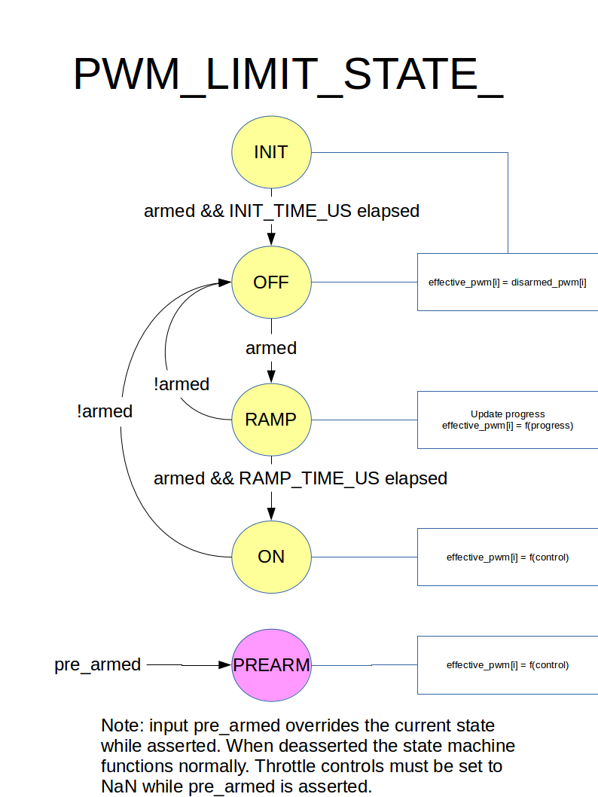

# PWM 제한 상태 머신

[PWM 제한 상태 머신]은 사전 준비와 준비 입력의 기능으로 PWM 출력을 제어합니다. "armed"의 어설션과 준비된 신호의 어설션에 대한 스로틀 증가 사이의 지연을 제공합니다.

## 요약
**입력**
  * armed: 회전하는 프로펠러와 같은 위험한 행동을 가능하게 한다고 주장
  * pre-armed: 제어 표면을 움직이는 것과 같은 양성 행동을 가능하게 하기 위하여 주장
   * 이 입력은 현재 상태를 재정의합니다
   * assertion of pre-armed immediately forces behavior of state ON, regardless of current state
   * deassertion of pre-armed reverts behavior to current state

**States**
  * INIT and OFF
    * pwm outputs set to disarmed values.
  * RAMP
    * pwm ouputs ramp from disarmed values to min values.
  * ON
    * pwm outputs set according to control values.

## State Transition Diagram

