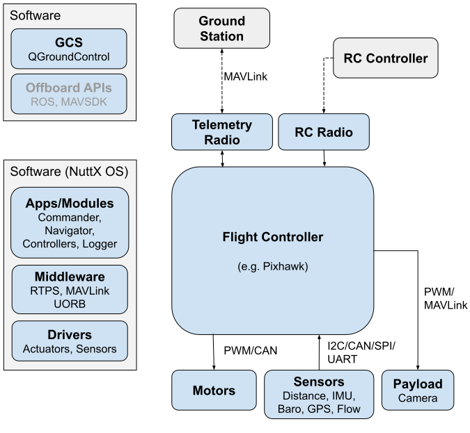
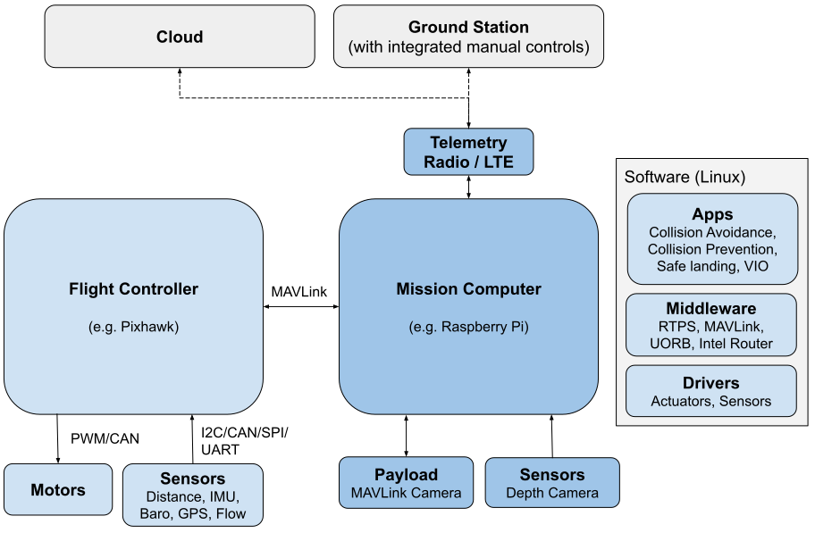

# PX4 시스템 아키텍처

아래 섹션에서는 "일반적인" PX4 시스템의 하드웨어와 소프트웨어 개요를 제공합니다. 하나는 비행 콘트롤러만 있는 것이고 다른 하나는 비행 컨트롤러와 보조 컴퓨터("미션 컴퓨터"라고도 함)가 있습니다.

:::note
[PX4 아키텍처 개요](../concept/architecture.md)는 플라이트 스택과 미들웨어 정보를 제공합니다. Offboard APIs are covered in [ROS](../ros/README.md) and [MAVSDK](https://mavsdk.mavlink.io/main/en/).
:::

## 비행 콘트롤러

아래 다이어그램은 비행 콘트롤러 기반 PX4 시스템 개요입니다.

<!-- Source for drawing: https://docs.google.com/drawings/d/1_2n43WrbkWTs1kz0w0avVEeebJbfTj5SSqvCmvSOBdU/edit -->

하드웨어 구성
- [비행 콘트롤러](../flight_controller/README.md)(PX4 비행 스택 실행). 콘트롤러에는 대부분 내부 IMU, 나침반 및 기압계가 포함되어 있습니다.
- [모터 ESC](../peripherals/esc_motors.md)는 [PWM 출력](../peripherals/pwm_escs_and_servo.md), [UAVCAN](../peripherals/uavcan_escs.md)(UAVCAN은 그림과 같이 단일 방향이 아닌 양방향 통신을 허용함) 또는 기타 버스에 연결됩니다.
- I2C, SPI, UAVCAN, UART 등을 통해 연결된 센서([GPS](../gps_compass/README.md), [나침반](../gps_compass/README.md), 거리 센서, 기압계, 광류, 기압계, ADSB 트랜스폰더 등)
- [카메라](../peripherals/camera.md) 또는 기타 페이로드. 카메라는 PWM 출력에 연결하거나 MAVLink로 연결할 수 있습니다.
- 지상국 컴퓨터/소프트웨어에 연결하기 위한 [텔레메트리 라디오](../telemetry/README.md).
- 수동 제어를 위한 [RC 제어 시스템](../getting_started/rc_transmitter_receiver.md)

The left hand side of the diagram shows the software stack, which is horizontally aligned (approximately) with the hardware parts of the diagram.
- 지상국 컴퓨터는 일반적으로 [QGroundControl](../getting_started/px4_basic_concepts.md#qgroundcontrol)(또는 일부 다른 지상국 소프트웨어)을 실행합니다. 또한 [MAVSDK](https://mavsdk.mavlink.io/) 또는 [ROS](../ros/README.md)와 같은 로봇 소프트웨어를 실행할 수 있습니다.
- 비행 컨트롤러에서 실행되는 PX4 비행 스택에는 [드라이버](../modules/modules_driver.md), [통신 모듈](../modules/modules_communication.md), [컨트롤러](../modules/modules_controller.md), [추정기](../modules/modules_controller.md) 및 기타 <3 >미들웨어 및 시스템 모듈</a> 등이 포함됩니다.

## 비행 콘트롤러와 보조 컴퓨터

아래 다이어그램은 비행 콘트롤러와 보조 컴퓨터(여기서는 "임무 컴퓨터"라고 함)를 포함하는 PX4 시스템을 나타냅니다.

<!-- source for drawing: https://docs.google.com/drawings/d/1zFtvA_B-BmfmxFmAd-XIvAZ-jRqOydj0aBtqSolBcqI/edit -->

비행 콘트롤러는 일반 PX4 비행 스택을 실행하고, 보조 컴퓨터는 [물체 회피](../computer_vision/obstacle_avoidance.md) 및 [충돌 방지](../computer_vision/collision_prevention.md)와 같은 고급 기능을 제공합니다. 두 시스템은 고속 직렬 또는 IP 링크로 연결되며, 일반적으로 [MAVLink 프로토콜](https://mavlink.io/en/)로 통신합니다. 지상국 및 클라우드와의 통신은 일반적으로 보조 컴퓨터를 통해 라우팅됩니다(예: Intel의 [MAVLink 라우터](https://github.com/mavlink-router/mavlink-router) 사용).

PX4 systems typically run a Linux OS on the companion computer (because the [PX4/PX4-Avoidance](https://github.com/PX4/PX4-Avoidance) project delivers ROS-based avoidance libraries designed for Linux). Linux는 NuttX보다 "일반" 소프트웨어 개발을 위한 플랫폼입니다. 많은 Linux 개발자와 유용한 소프트웨어가 이미 개발되어 있습니다(예: 컴퓨터 비전, 통신, 클라우드 통합, 하드웨어 드라이버용). 보조 컴퓨터는 때때로 같은 이유로 Android를 사용합니다.

:::note
다이어그램은 여러 PX4 기반 시스템에서 사용된 접근 방식인 LTE를 통한 클라우드 또는 지상국 연결 방법을 나타냅니다.
PX4는 특별히 LTE와 클라우드 통합을 위한 소프트웨어를 제공하지 않습니다(사용자 맞춤형 개발이 필요함). 
:::

