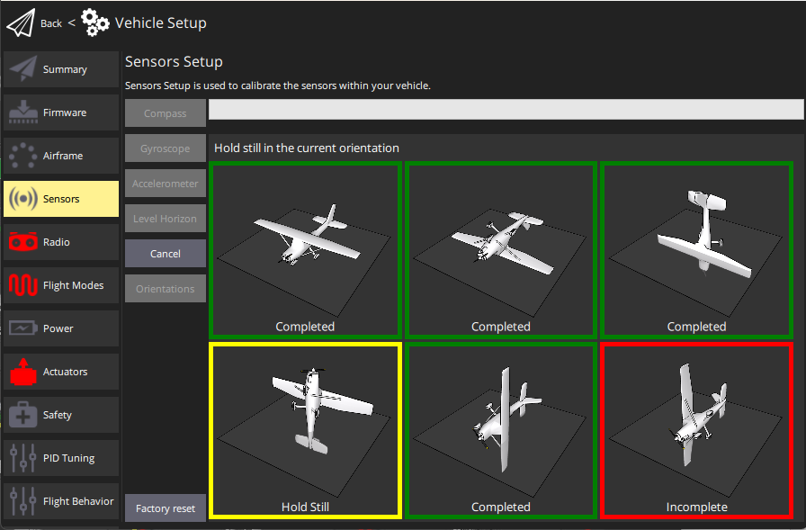

# Accelerometer Calibration

PX4를 처음 사용하거나, 비행 콘트롤러의 방향이 변경된 경우에는 가속도계를 보정하여야 합니다. 기존 장비를 계속 사용하는 경우에는 보정 작업이 필요하지 않습니다. 온도가 낮은 겨울철이나, 제조단계에서 [별도의 교정을 받지 않은 경우](../advanced_config/sensor_thermal_calibration.md)에는 보정하는 것이 좋습니다.

:::note
잘못된 가속도계 보정은 사전비행 단계나 시동 거부 메시지로 확인될 수  있습니다. QGroundControl 경고 메시지는 일반적으로 "높은 가속도 값"이나 "일관성 검사 실패"를 의미합니다.
:::

:::tip
차량을 회전하지 않고 고정한다는 점외에는 [나침반 보정](../config/compass.md)작업과 유사합니다.
:::

## 보정 절차

_QGroundControl_ will guide you to place and hold your vehicle in a number of orientations (you will be prompted when to move between positions).

보정 절차는 다음과 같습니다:

1. Start _QGroundControl_ and connect the vehicle.
1. 상단 도구 모음에서 **톱니 바퀴** 아이콘(기체 설정)을 선택한 다음에, 가장자리 표시줄에서 **센서**를 선택합니다.
1. Click the **Accelerometer** sensor button.

   

:::note
이 작업 이전에 [비행콘트롤러 방향](../config/flight_controller_orientation.md)을 미리 설정하여야 합니다. 미리 설정하지 않았다면, 여기에서 설정할 수 있습니다.
:::

1. 보정을 시작하려면 **확인**을 클릭합니다.
1. Position the vehicle as guided by the _images_ on the screen. Once prompted (the orientation-image turns yellow) hold the vehicle still. 현재 방향에 대해 보정이 완료되면 화면의 그림이 녹색으로 바뀝니다.

   ::: info
The calibration uses a least squares 'fit' algorithm that doesn't require you to have "perfect" 90 degree orientations.
각 축이 보정 단계별로 어느 시점에 대부분 위아래를 가리키고, 차량이 고정되어 있으면 정확한 방향은 중요하지 않습니다.
:::

   

1. 드론의 모든 방향에 대해 보정 과정을 반복합니다.

Once you've calibrated the vehicle in all the positions _QGroundControl_ will display _Calibration complete_ (all orientation images will be displayed in green and the progress bar will fill completely). 그런 다음 다음 센서의 보정 작업을 진행합니다.

## 추가 정보

- [QGroundControl 사용 설명서 > 센서](https://docs.qgroundcontrol.com/master/en/qgc-user-guide/setup_view/sensors_px4.html#accelerometer)
- [PX4 설치 비디오 - @1m46s](https://youtu.be/91VGmdSlbo4?t=1m46s) (Youtube)
