# 액추에이터 설정 및 테스트

_액추에이터 설정_ 보기는 기체의 특정 지오메트리를 사용자가 지정하고, 액츄에이터와 모터를 비행 컨트롤러 출력에 할당하고, 액츄에이터와 모터 응답을 테스트 합니다.

## 개요

여기에서 *QGroundControl* 보기를 오픈합니다. **"Q"(앱 메뉴) > 차량 설정 > 액추에이터**(탭). 표시되는 요소는 [선택한 프레임](../config/airframe.md)에 따라 달라지며, 출력은 [기체 참조](../airframes/airframe_reference.md)와 같이 기본적으로 매핑됩니다.

보기에는 세 개의 섹션이 있습니다.

- [기하](#geometry): [선택한 기체](../config/airframe.md)의 기하 도형을 설정합니다. 여기에는 [모터](#motor-geometry)의 수, 위치 및 속성과 [제어 표면](#control-surfaces-geometry) 및 [모터 틸트 서보](#motor-tilt-servo-geometry)의 수와 속성이 포함됩니다.
- [액추에이터 출력](#actuator-outputs): 모터, 제어 표면 및 기타 액추에이터를 특정 출력에 할당합니다.
- [액추에이터 테스트](#actuator-testing): 모터와 액추에이터가 예상대로 방향과 속도로 움직이는 지 테스트합니다.

쿼드콥터에는 아래와 같은 설정 화면이 있을 수 있습니다. 이것은 X-지오메트리를 가진 4-로터 헬리콥터를 정의합니다. 4개의 모터를 AUX1에서 AUX4 출력으로 매핑하고, DShot1200 ESC에 연결하도록 설정합니다. 또한 낙하산 및 착륙 장치를 제어하기 위한 PWM400 AUX 출력을 매핑합니다.

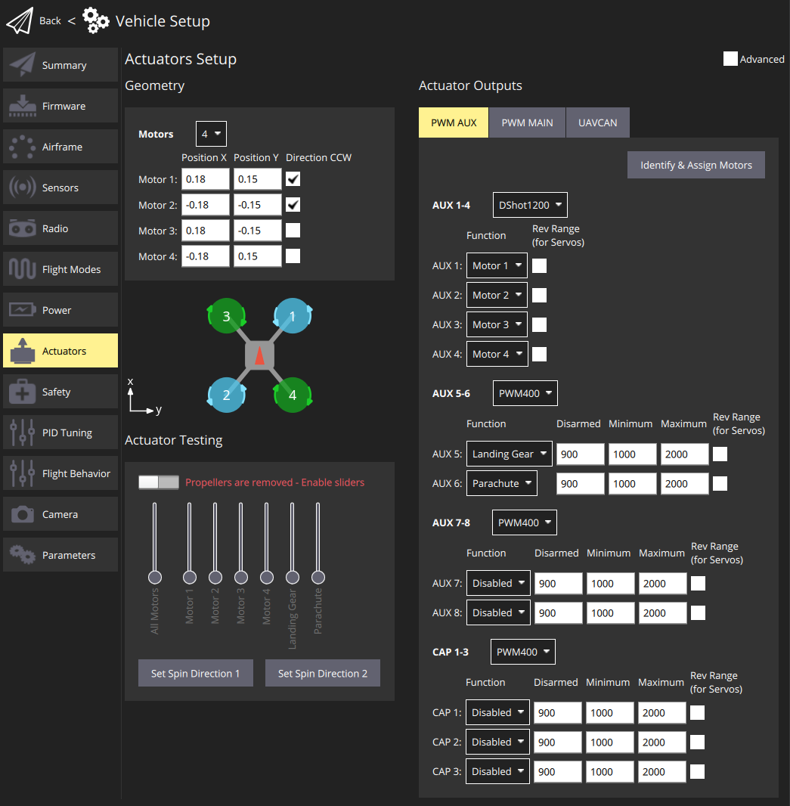

:::note
기본적으로 가장 일반적인 설정만 표시됩니다. 모든 설정을 표시하려면 오른쪽 상단 모서리에 있는 **고급** 확인란을 선택합니다.
:::

## 지오메트리

지오메트리 섹션은 선택한 [기체](../config/airframe.md)에 대해 구성 가능한 지오메트리 관련 매개변수를 설정하는 데 사용됩니다. 여기에는 [모터](#motor-geometry)의 수와 위치, [제어 표면](#control-surfaces-geometry)의 수, 기능 및 속성이 포함됩니다. VTOL 틸트로터 차량의 경우 [틸트 서보](#motor-tilt-servo-geometry)의 수와 속성도 포함됩니다.

:::note UI는 선택한 기체에 맞게 사용자 지정됩니다:

- 선택한 기체 유형에 대한 _구성 가능_ 필드만 표시됩니다. 기체에 대해 구성할 수 없는 필드는 숨겨져 있습니다.
- 모터 위치 다이어그램은 현재 멀티콥터 프레임에만 표시됩니다.
:::

### 모터 지오메트리

모터 지오메트리 섹션에서는 모터 수, 상대 위치 및 각 모터의 기타 속성을 설정합니다.

대부분의 모터 속성은 모든 프레임에 적용됩니다. 몇 가지 속성이 특정 프레임에 적용됩니다. 예를 들어, `기울기` 및 `축`은 각각 [틸트로터 VTOL](#motor-geometry-vtol-tiltrotor) 및 [표준 VTOL](#motor-geometry-standard-vtol) 기체에 해당됩니다.

멀티콥터 기체의 기하학적 구성은 각 모터의 상대적 x,y 위치를 보여주는 다이어그램을 제공합니다. 다른 프레임의 모터 위치에 대한 광범위한 이해는 [기체 참조](../airframes/airframe_reference.md)를 참고하십시오.

코어 지오메트리 개념과 다양한 프레임에 대한 설정은 다음 섹션에서 제공됩니다.

#### 모터 지오메트리: 멀티콥터

The image below shows the geometry setup for a quadrotor multicopter frame with and without advanced settings.

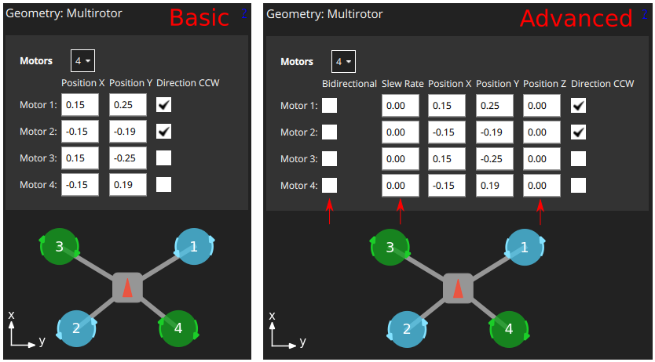

먼저, **모터** 드롭다운 설정을 통하여 모터 수(위 예의 경우 4개)를 선택할 수 있습니다.

각 모터에 대해 다음을 설정할 수 있습니다:

- `위치 X`: [X 위치](#motor-position-coordinate-system), 미터 단위.
- `위치 Y`: [Y 위치](#motor-position-coordinate-system), 미터 단위.
- `위치 Z`: [Z 위치](#motor-position-coordinate-system), 미터 단위.
- (고급) `CCW 방향`: 모터가 시계 반대 방향으로 회전하는 것을 나타내는 확인란입니다(시계 방향의 경우 선택 취소).
- (고급) `양방향`: 모터가 [양방향](#bidirectional-motors)임을 나타내는 확인란
- (고급) `슬루율`: 자세한 내용은 [제어 표면 기하학](#control-surfaces-geometry) 섹션을 참조하십시오.

:::note
`X`, `Y`, `Z` 위치는 _무게 중심_을 기준으로 [FRD 좌표계에 있습니다. ](#motor-position-coordinate-system). 이것은 비행 컨트롤러의 위치와 동일하지 않을 수 있습니다.
:::

#### 모터 지오메트리: VTOL Quadrotor Tailsitter

The motor geometry for a [VTOL Quad Tailsitter](../airframes/airframe_reference.md#vtol-tailsitter) is shown below (the approach for configuring other tailsitter VTOL vehicles will be similar).

모터는 [멀티콥터 지오메트리](#motor-geometry-multicopter)와 동일한 구성 필드를 갖습니다.

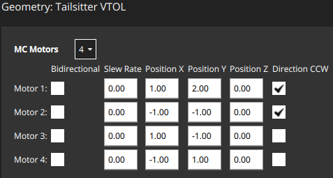

#### 모터 지오메트리: VTOL 틸트로터

[일반 쿼드플레인 VTOL 틸트로터](../airframes/airframe_reference.md#vtol_vtol_tiltrotor_generic_quadplane_vtol_tiltrotor)의 모터 지오메트리는 아래에 기술되어 있습니다(다른 [VTOL 틸트로터](../airframes/airframe_reference.md#vtol_vtol_tiltrotor_generic_quadplane_vtol_tiltrotor)를 구성하는 방식도 유사함).

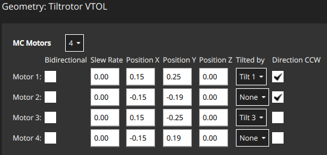

- `기울기`: 모터를 기울이는 데 사용되는 관련 서보입니다. 이 서보의 속성은 [모터 틸트 서보 지오메트리](#motor-tilt-servo-geometry)에 정의되어 있습니다.

#### 모터 형상: 표준 VTOL

The motor geometry for a [Generic Standard VTOL](../airframes/airframe_reference.md#vtol_standard_vtol_generic_standard_vtol) is shown below (the approach for configuring other "Standard VTOL" will be similar).

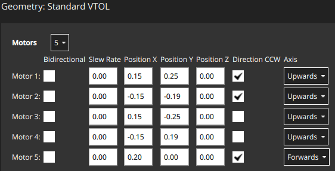

모터는 [멀티콥터 지오메트리](#motor-geometry-multicopter)와 대부분 동일한 구성 필드를 갖습니다. 모터가 차량을 움직이는 방향을 나타내는 추가 필드가 있습니다(표준 VTOL의 경우 호버 모터는 일반적으로 "위쪽"으로 설정되고 푸셔 모터는 "앞으로"로 설정됨).

- `축`: `위로`, `아래로`, `앞으로`, `뒤로`, ` 중 하나 왼쪽으로`, `오른쪽으로`, `사용자 지정`
  - `사용자 지정`을 선택하면 UI에 모터 방향 설정을 위한 세 개의 추가 필드가 표시됩니다.

#### 모터 지오메트리: 기타 기체

다른 기체 유형은 프레임 유형에 적합한 모터 형상을 정의합니다. 다시 한 번 이러한 모터는 일반적으로 위에 표시된 것과 같은 종류의 속성을 가집니다.

예를 들어, 고정익에는 단일 푸셔 모터만 있을 수 있지만, 차동 조향 장치가 있는 로버에는 스로틀 및 조향용 모터가 있습니다.

#### 모터 위치 좌표계

모터 위치를 나타내는 좌표계는 FRD(몸체 프레임 내)이며, 여기서 X축은 앞쪽, Y축은 오른쪽, Z축은 아래쪽을 가르킵니다.

원점은 차량의 **무게 중심(COG)**입니다. 이것은 자동조종장치 내부의 위치가 **아닐** 수 있습니다.

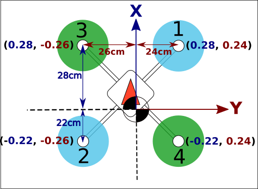

#### 양방향 모터

일부 차량은 양방향 모터(즉, 양방향 회전을 지원하는 모터)를 사용할 수 있습니다. 예를 들어, 전진 및 후진을 원하는 지상 차량 또는 어느 방향으로든 회전할 수 있는 푸셔 모터가 있는 VTOL 차량이 있습니다.

양방향 모터를 사용하는 경우 해당 모터에 대해 **가역성** 확인란을 선택하여야 합니다(확인란은 "고급" 옵션으로 표시됨).

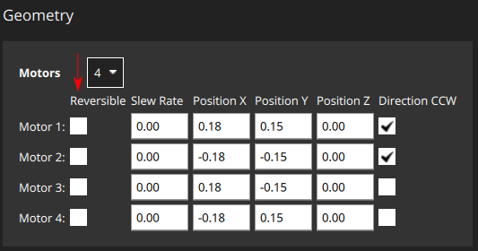

양방향 모터와 연결된 ESC가 적절하게 구성되었는지도 확인하여야 합니다(예: [DShot 명령](../peripherals/dshot.md#commands)을 통해 달성할 수 있는 DShot ESC에 대해 활성화된 3D 모드).

### 조종면 지오메트리

지오메트리 패널의 조종면 섹션에서는 기체 조종면의 갯수와 유형을 설정할 수 있습니다. 경우에 따라 트림 및 슬루율 값을 설정할 수도 있습니다. 고급 사용자는 롤 스케일, 요 스케일 및 피치 스케일을 구성할 수 있습니다(일반적으로 기본값이 허용되며 필요하지 않음). 2개의 에일러론이 있는 차량의 "예시" 제어 표면 섹션이 아래에 나와 있습니다. 에일러론은 롤에만 영향을 미치므로 피치 및 요 필드는 비활성화됩니다.

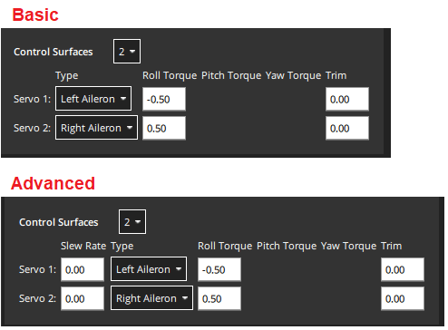

:::note
기본적으로 가장 일반적인 설정만 표시됩니다. Select the **Advanced** checkbox in the top right corner of the view to display all settings.
:::

항목들은 다음과 같습니다.

- `조종면`: 조종면의 갯수(먼저 설정하십시오!)
- `유형`: 각 조종면의 유형: `LeftAileron`, `RightAileron`, `Elevator`, `Rudder</0 >, <code>왼쪽 엘레본`, `오른쪽 엘레본`, `왼쪽 V-Tail`, `오른쪽 V-Tail`, `왼쪽 플랩`, `오른쪽 플랩`, `에어브레이크`, `맞춤형`.
- `Roll Torque`: Effectiveness of actuator around roll axis (normalised: -1 to 1). [일반적으로 기본 액추에이터 값을 사용하여야 합니다](#actuator-roll-pitch-and-yaw-scaling).
- `Pitch Torque`: Effectiveness of actuator around pitch axis (normalised: -1 to 1). [일반적으로 기본 액추에이터 값을 사용하여야 합니다](#actuator-roll-pitch-and-yaw-scaling).
- `Yaw Torque`: Effectiveness of actuator around yaw axis (normalised: -1 to 1). [일반적으로 기본 액추에이터 값을 사용합니다](#actuator-roll-pitch-and-yaw-scaling).
- `트림`: 입력 없이 중앙에 오도록 액추에이터에 추가된 오프셋입니다. 이것은 시행착오를 거쳐 결정될 수 있습니다.
- (Advanced) `Slew Rate`: Minimum time allowed for the motor/servo signal to pass through the full output range, in seconds.
  - 설정은 액츄에이터의 변화율을 제한합니다(지정하지 않으면 비율 제한이 적용되지 않음). 틸트로터 VTOL 차량의 틸팅 액추에이터와 같이 너무 빨리 움직일 경우 손상될 수 있는 액추에이터를 위한 것입니다.
  - 예를 들어, 2.0으로 설정하면 모터 및 서보가 2초 이내에 작동을 완료하는 속도로 0에서 1로 이동하도록 명령되지 않음을 의미합니다(가역 모터의 경우 범위는 -1에서 1).
- (Advanced) `Flap Scale`: How much this actuator is deflected at the "full flaps configuration" \[0, 1\] (see [Flap Scale and Spoiler Scale Configuration](#flap-scale-and-spoiler-scale-configuration) below). Can be used to configure aerodynamic surface as flap or to compensate for generated torque through main flaps.
- (Advanced) `Spoiler Scale`: How much this actuator is deflected at the "full spoiler configuration" \[0, 1\] (see [Flap Scale and Spoiler Scale Configuration](#flap-scale-and-spoiler-scale-configuration) below). Can be used to configure aerodynamic surface as spoiler or to compensate for generated torque through main spoiler.
- (VTOL only) `Lock control surfaces in hover`:
  - `사용`: 대부분의 차량은 호버링 시 조종면을 사용하지 않습니다. 이 설정을 사용하여 기체 역학에 영향을 미치지 않도록 잠그십시오.
  - `비활성화`: 듀오 테일시터(피치 및 요 제어에 엘레본 사용)와 같이 호버링에서 조종면을 사용하는 기체를 설정합니다. 또한 조종면을 사용하여 고속으로 이동할 때 호버 모드에서 추가 안정화를 제공하거나 강한 바람이 부는 기체에 대하여 설정합니다.

#### Flap Scale and Spoiler Scale Configuration

"Flap-control" and "Spoiler-control" are aerodynamic configurations that can either be commanded manually by the pilot (using RC, say), or are set automatically by the controller. For example, a  pilot or the landing system might engage "Spoiler-control" in order to reduce the airspeed before landing.

The configurations are an _abstract_ way for the controller to tell the allocator how much it should adjust the aerodynamic properties of the wings relative to the "full flaps" or "full spoiler" configuration (between `[0,1]`, where "1" indicates the full range). The allocator then uses any of the available control surfaces it wants in order to achieve the requested configuration: usually flaps, ailerons, and elevator.

The `flap scale` and `spoiler scale` settings in the actuator UI inform the allocator how much ailerons, elevators, flaps, spoilers, and other control surfaces, contribute to a requested "Flap-control" and/or "Spoiler-control" value. Specifically, they indicate how much each control surface should be deflected when the controller is demanding "full flaps" or "full spoiler".

In the following example, the vehicle has two ailerons, one elevator, one rudder and two flaps as control surfaces:

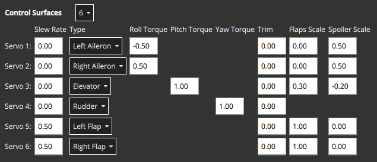

- The flaps have both `Flap Scale` set to 1, meaning that they will be fully deflected with the flap-control at 1. They also have a slew rate of 0.5/s, meaning that it will take 2s to fully deflect them (a slew rate on the flaps is generally recommended to reduce the disturbances their movement creates).
- The ailerons are primarily tasked to provide the commanded roll torque. They also have `Spoiler Scale` set to 0.5, and will additionally be deflected upwards 50% if the controller demands full spoiler configuration. The aileron deflection is thus the sum of the (asymmetrical) deflection for the roll torque, plus the (symmetrical) deflection for the spoiler setpoint.
- The elevator is primarily tasked to provide pitch torque. It also has non-zero entries in the `Flap Scale` and `Spoiler Scale` fields. These are the elevator deflections added to compensate for the pitching moments generated by the flaps and spoiler actuators. In the case here the elevator would be deflected 0.3 up when the flaps are fully deployed to counteract the pitching down moment caused by the flaps.

#### 액추에이터 롤, 피치 및 요 스케일링

:::note
대부분의 기체 설정에서 각 조종면 유형의 기본값은 변경되어서는 안 됩니다.
:::

`롤 스케일`, `피치 스케일` 및 `요 스케일` 값은 해당 축 주위의 액츄에이터의 정규화된 효율성을 나타냅니다.

값 조정은 낮은/수준/고급 주제이며 일반적으로 결합된 제어 표면(피치와 롤을 모두 제어하는 elevon과 같은)을 조정시에만 필요합니다. 이 경우 주의해야할 사항은 다음과 같습니다.

- 입력된 숫자는 할당 매트릭스에 직접 입력되며, 원하는 순간(정규화)에서 제어 신호를 얻기 위해 반전됩니다.
- 배율을 높이면 제어 표면의 처짐이 _감소_됩니다(역전될 때).

<!-- For more information see:  (PX4 Dev Summit, 2022) -->

#### 조종면 처짐 규칙

아래 다이어그램은 편향 규칙을 나타냅니다.

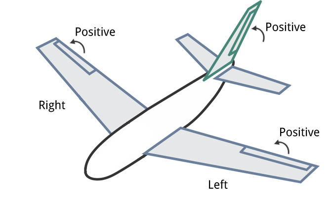

요약:

- **수평 조종면:** 위쪽으로 이동하면 양의 편향이 발생합니다. 에일러론 등 포함
- **수직 조종면:** 오른쪽으로 이동하면 양의 편향이 발생합니다. 러더 등이 포함됩니다.
- **혼합 조종면:** 위쪽/오른쪽 방향 움직임은 양수입니다(위와 같이). V-Tail 등이 포함됩니다.

<!-- Also see this comment: https://github.com/PX4/PX4-Autopilot/blob/96b03040491e727752751c0e0beed87f0966e6d4/src/modules/control_allocator/module.yaml#L492 -->

### 모터 틸트 서보 지오메트리

[VTOL 틸트로터 차량](../frames_vtol/tiltrotor.md)은 호버링과 전방 비행 사이를 전환하기 위해 모터를 기울일 수 있습니다. 이 섹션은 틸팅 서보의 속성을 정의합니다. 이는 틸트로터의 모터 형상에서 특정 모터에 매핑됩니다.

아래 예는 [위에 표시된 틸트로터 모터 형상](../config/actuators.md#motor-geometry-vtol-tiltrotor)에 대한 틸트 서보 설정을 나타냅니다.

설정 가능한 값들은 다음과 같습니다.

- `틸트 서보`: 서보(틸트 가능한 모터)의 수입니다.
- `최소 기울기 각도`: z축을 기준으로 한 [최대 기울기 각도](#tilt-servo-coordinate-system)(도)
- `최대 기울기 각도`: Z축을 기준으로 한 [최소 기울기 각도](#tilt-servo-coordinate-system)(도)
- `기울기 방향`: `앞쪽으로`(양의 x 방향) 또는 `오른쪽으로`(양의 y 방향).
- `제어에 사용`: [요/피치에 사용되는 틸트 서보](#tilt-servos-for-yaw-pitch-control)
  - `없음`: 토크 제어를 사용하지 않습니다.
  - `요`: 요를 제어하는 데 사용되는 틸트 서보입니다.
  - `피치`: 피치를 제어하는 데 사용되는 틸트 서보입니다.
  - `요 및 피치 모두`: 틸트 서보는 요와 피치를 모두 제어하는 데 사용됩니다.

#### 틸트 서보 좌표계

틸트 로터 각도의 좌표계는 아래와 같습니다. 기울기 각도의 기준 방향은 위쪽(0도)입니다. 차량의 앞쪽 또는 오른쪽을 향한 틸트 각도는 양수이고 뒤쪽 또는 왼쪽을 향한 틸트 각도는 음수입니다.

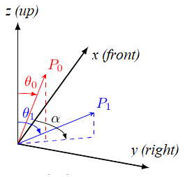

`최소 기울기 각도` 및 `최대 기울기 각도`는 기울기 서보의 이동 범위를 나타냅니다. 최소 기울기는 두 각도 중 더 작은 _숫자값_(절대값 아님)입니다.

위와 같이 최대/최소 기울기 벡터가 **P0** 및 **P1**이면 두 기울기 각도가 모두 양수이지만, **θ0**은 더 작습니다.

- `최소 기울기 각도` = **θ0**
- `최대 기울기 각도` = **θ1**

:::note
다이어그램이 미러링되어 **P0** 및 **P1**이 -x, -y 사분면으로 기울어진 경우 , 그러면 두 기울기 각도가 모두 음수가 됩니다. **θ1**이 **θ0**보다 음수(작음)가 더 크기 때문에  `최소 기울기의 각도`가 됩니다.

이와 마찬가지로, 서보는 다음과 같이 동작합니다:

- between the upright and forward positions would have `min=0` and `max=90`.
- 수직 위치를 중심으로 대칭적으로 45도는 `최소=-45` 및 `최대=45`입니다.
- 수직 위치와 후방 위치 사이의 값은 `min=-90` 및 `max=0`입니다.
:::

`기울기 방향`은 비행기에서 서보가 차량의 `전면` 또는 `오른쪽`을 향하여 기울기를 나타냅니다. 다이어그램에서 이것은 0(앞) 또는 90(오른쪽) 값만 사용할 수 있는 **α**로 표시됩니다.

#### 요/피치 제어용 틸트 서보

틸트 서보는 하나 이상의 축에 토크를 제공할 수 있으며, 이는 차량을 요잉 또는 피치를 제어할 수 있습니다.

- Yaw는 일반적으로 이러한 방식으로 설정되지만 모터는 4개 이상의 모터가 있는 기체에서 대신 사용되는 경우가 많습니다.
- 피치는 일반적으로 차동 모터 추력을 사용하여 제어합니다. 틸트 서보를 사용한 제어는 [Bicopter](https://www.youtube.com/watch?v=hfss7nCN40A)와 같이 차동 추력을 사용할 수 없는 기체에 유용합니다.

이 기능의 사용 여부는 `제어에 사용`에서 설정합니다.

## 액추에이터 출력

_액추에이터 출력_ 섹션은 모터, 제어 표면 서보 및 특정 프레임에서 사용하는 기타 액츄에이터를 비행 컨트롤러의 물리적 출력에 할당하고 해당 출력에 대한 매개변수를 설정합니다.

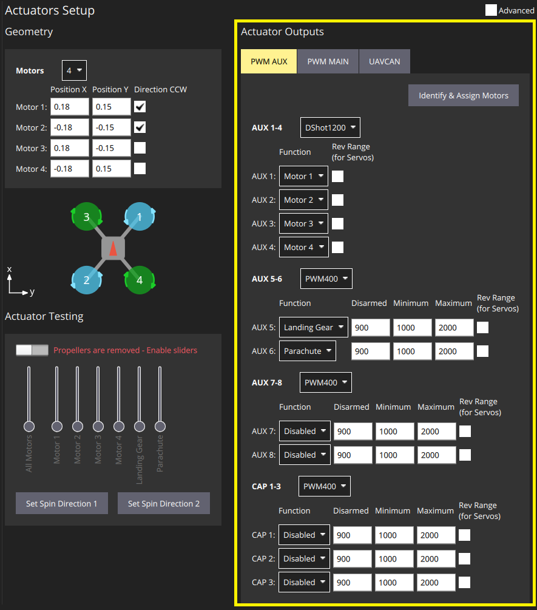

Separate tabs are displayed for each output bus supported by the connected flight controller: PWM MAIN (I/O Board output), PWM AUX (FMU Board output), UAVCAN.

Motors and actuators (which are referred to as "[functions](#output-functions)") can be assigned to any physical output on any of the available buses.

:::note
PWM AUX 출력은 모터 제어용 PWM MAIN 출력보다 선호됩니다(지연 시간이 더 짧음).
:::

PWM 출력은 하드웨어 타이머 그룹을 기반으로 그룹화됩니다. 즉, 한 그룹의 모든 출력은 동일한 프로토콜에서 동일한 속도로 작동하여야 합니다(예: 한 그룹의 모든 출력에 대해 400Hz의 PWM 신호). 그러므로, 일반적으로 서로 다른 속도로 작동하기 때문에 동일한 출력 그룹에서 서보와 모터를 매핑하는 것은 불가능합니다.

PWM AUX 탭에는 일반적으로 [카메라 캡처/트리거 입력](../peripherals/camera.md#trigger-configuration)으로 사용되는 CAP 출력이 있습니다. 그러나, CAP 출력을 다른 출력 기능에 매핑할 수 있으며 다른 AUX 출력을 카메라 캡처/트리거 입력으로 사용 가능합니다.

:::note
카메라 캡처/트리거 입력 설정을 적용하려면 재부팅하여야 합니다.
:::

모터 및 서보의 물리적 배선과 일치하는 출력에 기능을 할당하고 아래에 설명된 [액추에이터 테스트](#actuator-testing) 섹션을 사용하여 적절한 출력 매개변수 값을 결정하여야 합니다. 이 단계는 [출력 할당 및 구성](#output-assignment-and-configuration)에서 설명합니다.

### Output Functions

Output functions are used to map the "logical functions" of an airframe, such as `Motor 1` or `Landing gear`, to physical outputs like FMU output pin 2. This makes it easy to use a particular output pin for almost any purpose.

Some functions are only relevant to particular frames or output types, and will not be offered on others.

Functions include:

- `Disabled`: Output has no assigned function.
- `Constant_Min`: Output set to constant minimum value (-1).
- `Constant_Max`: Output is set to constant maximum value (+1).
- `Motor 1` to `Motor 12`: Output is indicated motor. Only motors allowed for airframe are displayed.
- `Servo 1` to `Servo 8`: Servo output. These are further assigned a specific meaning based on airframe, such as "tilt servo", "left aileron".
- `Offboard Acutator Set 1` to `Offboard Acutator Set 6`: [Payloads > Generic Actuator Control with MAVLink](../payloads/README.md#generic-actuator-control-with-mavlink).
- `Landing Gear`: Output is landing gear.
- `Parachute`: Output is parachute. The minimum value is sent in normal use and the maximum value is emitted when a failsafe is triggered.
- `RC Roll`: Output is passthrough roll from RC ([RC_MAP_ROLL](../advanced_config/parameter_reference.md#RC_MAP_ROLL) maps an RC channel to this output). An RC channel is mapped to the output using .
- `RC Pitch`: Output is passthrough pitch from RC ([RC_MAP_PITCH](../advanced_config/parameter_reference.md#RC_MAP_PITCH) maps an RC channel to this output).
- `RC Throttle`: Output is passthrough throttle from RC ([RC_MAP_THROTTLE](../advanced_config/parameter_reference.md#RC_MAP_THROTTLE) maps an RC channel to this output).
- `RC Yaw`: Output is yaw from RC ([RC_MAP_YAW](../advanced_config/parameter_reference.md#RC_MAP_YAW) maps an RC channel to this output).
- `RC Flaps`: Output is flaps from RC ([RC_MAP_FLAPS](../advanced_config/parameter_reference.md#RC_MAP_FLAPS) maps an RC channel to this output).
- `RC AUXn` to `RC AUX1`: Outputs used for [arbitrary payloads triggered by RC passthrough](../payloads/README.md#generic-actuator-control-with-rc)
- `Gimbal Roll`: Output controls gimbal roll.
- `Gimbal Pitch`: Output controls Gimbal pitch.
- `Gimbal Yaw`: Output controls Gimbal pitch.

The following functions can only be applied to FMU outputs:

- `Camera_Trigger`: Output to trigger camera. Enabled when [`TRIG_MODE==0`](../advanced_config/parameter_reference.md#TRIG_MODE). Configured via `TRIG_*` parameters.
- `Camera_Capture`: Input to get image capture notification. Enabled when [CAM_CAP_FBACK==0](../advanced_config/parameter_reference.md#CAM_CAP_FBACK). Configured via `CAM_CAP_*` parameters.
- `PPS_Input`: Pulse-per-second input capture. Used for GPS synchronisation. Enabled when [`PPS_CAP_ENABLE==0`](../advanced_config/parameter_reference.md#PPS_CAP_ENABLE)

:::note
This list is correct at PX4 v1.13. The functions are defined in source at [/src/lib/mixer_module/output_functions.yaml](https://github.com/PX4/PX4-Autopilot/blob/release/1.14/src/lib/mixer_module/output_functions.yaml).
:::

## 액추에이터 테스트

오른쪽 하단의 _액추에이터 테스트_ 섹션에는 액츄에이터 및 모터 설정을 테스트(및 결정)하는 데 사용할 수 있는 슬라이더가 있습니다. [액추에이터 출력](#actuator-outputs) 섹션에 정의된 각 출력에 대해 슬라이더가 제공됩니다. 아래 슬라이더 예는 일반적인 VTOL Tiltrotor 기체에 대한 섹션을 나타냅니다.

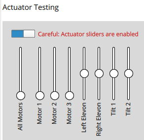

이 섹션에는 슬라이더를 사용하기 전에 전환해야 하는 **슬라이더 활성화** 스위치가 있습니다. 슬라이더는 전체 동작 범위에서 모터/서보에 전원을 공급하고 무장 해제 및 최소 위치로 "스냅"할 수 있습니다.

:::note
**슬라이더 활성화** 스위치를 토글한 후 액추에이터/모터는 해당 슬라이더가 _이동_될 때까지 아무 작업도 하지 않습니다. 이것은 스위치가 활성화된 후 갑작스러운 모터 움직임을 방지하기 위한 안전 장치입니다.
:::

슬라이더를 사용하여 다음을 확인할 수 있습니다.

1. 액추에이터(모터, 제어 표면 등)는 예상 출력에 할당됩니다.
1. PWM 출력 값이 `해제`일 때 모터가 회전하지 않습니다.
1. 모터는 `최소` PWM 출력 값에서 거의 회전하지 않습니다.
1. 모터가 예상 방향으로 **양의 추력**을 제공합니다.
1. 조종면은 출력 값 `시동`에 대하여 올바른 유휴 위치에 있습니다.
1. Control Surfaces move in the direction as defined in the [Control Surface Convention](#control-surface-deflection-convention)
1. 모터 틸트 서보가 출력 값 `해제`에 대해 올바른 유휴 위치에 있습니다.
1. Motor Tilt Servos move in the direction as defined in the [Tilt Servo Convention](#tilt-servo-coordinate-system)

## 출력 할당 및 설정

Outputs are assigned to functions and configured in the [Actuator Outputs](#actuator-outputs) section, while the  [Actuator Testing](#actuator-testing) sliders are commonly used to determine appropriate configuration values to enter:

- MC vehicles that have connected motors to PWM outputs can use the [Identify & Assign Motors](#multicopter-pwm-motor-assignment) button to perform motor assignment "semi-automatically".
- 모터와 액추에이터의 출력 할당은 슬라이더를 사용하여 수행/확인할 수 있습니다([출력 할당(수동)](#output-assignment-manual) 참조).
- 모든 출력에 대한 해제, 최소 및 최대 설정도 슬라이더를 사용하여 결정할 수 있습니다. This is shown as part of [Motor Configuration](#motor-configuration), [Control Surface Setup](#control-surface-setup), [Tilt servo setup](#tilt-servo-setup)

### 멀티콥터 PWM: 모터 할당

**식별 & 모터 할당** 버튼은 반자동 프로세스를 사용하여 모터를 PWM 출력에 할당합니다.

:::note
이것은 모터를 할당하는 가장 쉬운 방법이지만 현재 PWM 출력에 연결된 **멀티콥터 차량**의 모터에만 지원됩니다(UAVCAN 출력 및 기타 프레임 유형은 이 기능을 지원하지 않음). 다른 프레임에서는 [출력 할당(수동)](#output-assignment-manual)의 지침을 따를 수 있습니다.
:::

:::warning
출력이나 테스트를 할당하기 전에 모터에서 프로펠러를 제거하십시오.
:::

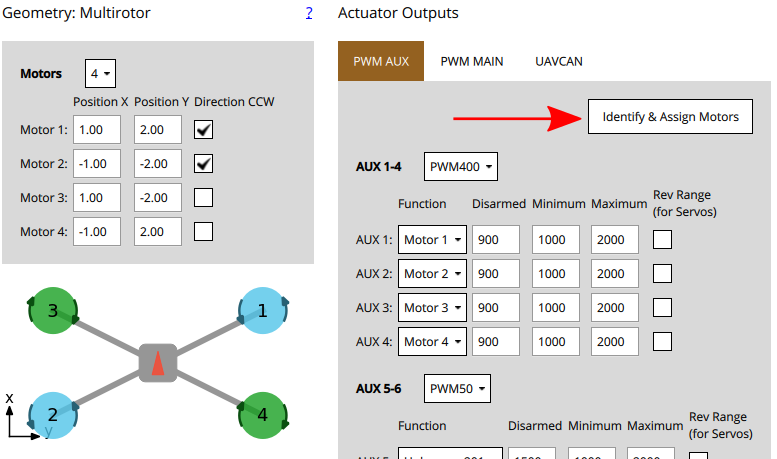

버튼을 클릭하면 QGC가 명령을 전송하여 모터를 회전시킵니다. 해당 모터를 출력에 할당하려면 화면에 표시된 해당 모터를 선택합니다. 그런 다음, QGC는 할당할 다음 모터를 회전하는 식으로 계속됩니다.

설명:

1. 프레임의 모터와 일치하도록 모터 형상을 설정합니다.
1. 모터를 할당할 PWM 탭을 선택합니다.
1. **식별 & 모터 할당** 버튼을 클릭합니다.
1. 하나의 모터가 회전하기 시작합니다(참고할 수 없을 정도로 회전이 너무 빨리 멈추면 **모터 다시 회전** 클릭).

   지오메트리 섹션에서 해당 모터를 선택합니다.

   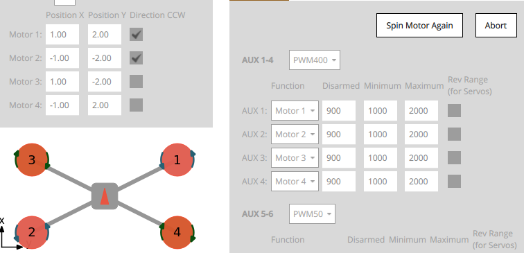

1. 모든 모터를 할당한 후 도구는 출력에 대한 올바른 모터 매핑을 설정한 다음 종료됩니다.

### 출력 할당(수동)

:::warning
출력이나 테스트를 할당하기 전에 모터에서 프로펠러를 제거하십시오.
:::

모터와 서보의 액추에이터 출력은 [액추에이터 테스트](#actuator-testing) 섹션의 슬라이더를 사용하여 _수동으로_ 할당할 수 있습니다.

액추에이터에 할당하려면:

1. 먼저 _액추에이터 출력_ 섹션에서 정확할 것으로 _가능성이 있는_ 출력에 기능을 할당합니다.
1. _액추에이터 테스트_ 섹션에서 **슬라이더 사용** 스위치를 전환합니다.
1. 테스트하려는 액추에이터의 슬라이더를 이동합니다.
   - 모터는 최소 추력 위치로 이동하여야 합니다.
   - 서보는 중간 위치 근처로 이동하여야 합니다.
1. 어떤 액츄에이터가 차량에서 움직이는 지 확인하십시오. 이것은 지오메트리에 대한 액추에이터 위치와 일치해야 합니다([기체 참조](../airframes/airframe_reference.md)는 여러 표준 기체에 대한 모터 위치를 나타냅니다).
   - 올바른 액츄에이터가 움직이면 다음 단계로 진행합니다.
   - 잘못된 액츄에이터가 움직이면 출력 할당을 변경합니다.
   - 아무 것도 움직이지 않으면, 슬라이더를 범위 중간에 늘리고 필요한 경우 더 높입니다. 그 후 아무 것도 움직이지 않으면, 출력이 연결되지 않거나 모터에 전원이 공급되지 않거나 출력 설정에 오류가 있을 수 있습니다. 문제를 해결하여야 합니다("무엇이든"이 움직이는지 확인하기 위하여 다른 액추에이터 출력을 시도할 수 있음).
1. 슬라이더를 "무장 해제" 위치로 되돌립니다(모터의 경우 슬라이더 하단, 서보의 경우 슬라이더 중앙).
1. 모든 액추에이터에 대하여 반복합니다.

### 모터 설정

:::note
If using PWM or OneShot ESCs, you should first perform [ESC Calibration](../advanced_config/esc_calibration.md) (this topic also covers PWM specific motor configuration).

[DShot](../peripherals/dshot.md) ESCs do not require configuration of the command limits but only rotation direction.
:::

:::warning
Remove propellers!
:::

모터 설정에서는 모터의  출력 값을 설정합니다.

- don't spin when disarmed (at the `disarmed` PWM output value).
- barely but reliably spin up at the `minimum` PWM output value.
- have the _lowest_ `maximum` PWM output value that spins the motor at its _highest_ rate.
- give **positive thrust** in the expected direction.

각각의 모터에 대하여:

1. 모터 슬라이더를 아래로 당겨서 아래쪽에 찰칵 소리가 나도록 합니다. In this position the motor is set to the outputs `disarmed` value.
   - 모터가 이 위치에서 회전하지 않는 지 확인하십시오.
   - If the motor spins, reduce the corresponding PWM `disarmed` value in the [Actuator Outputs](#actuator-outputs) section to below the level at which it still spins.
2. 슬라이더가 _최소_ 위치에 고정될 때까지 슬라이더를 천천히 위로 이동합니다. In this position the motor is set to the outputs `minimum` value.
   - 이 위치에서 모터가 매우 느리게 회전하는 지 확인합니다.
   - If the motor is not spinning, or spinning too fast you will need to adjust the corresponding PWM `minimum` value in the [Actuator Outputs](#actuator-outputs) such that the motors barely spin.

     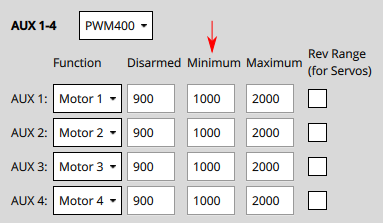   :::note
  For DShot output, this is not required.

:::
3. 모터가 올바른 방향으로 회전하고 있고 예상 방향으로 긍정적인 추진력을 제공하는 지 확인할 수 있는 수준으로 슬라이더 값을 증가시킵니다.
   - 예상 추력 방향은 차량 유형에 따라 다를 수 있습니다. For example in multicopters the thrust should always point upwards, while in a fixed-wing vehicle the thrust will push the vehicle forwards.
   - For VTOL, thrust should point upwards when the Tilt Servo is at 0 degrees as defined the [Tilt Servo Convention](#tilt-servo-coordinate-system). Testing of the [Tilt Servo](#tilt-servo-setup) is covered below as well.
   - 추력이 잘못된 방향인 경우 [모터를 역전](#reversing-motors)해야 할 수 있습니다.

4. Increase the slider value to the maximum value, so the motor is spinning quickly. Reduce the value of the PWM output's `maximum` value just below the default. Listen to the tone of the motors as you increase the value in small (25us) increments. The "optimal" maximum value is the value at which you last hear a change in the tone.

### 조종면 설정

먼저 각 출력 그룹에 사용되는 서보의 _프레임 속도_를 설정합니다. 이것은 일반적으로 서보가 지원하는 최대값으로 설정합니다. 아래에서는 PWM50(가장 일반적인 값)으로 설정하는 방법을 설명합니다.

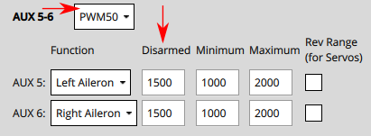

:::note
지원이 드물기 때문에 기본 400Hz에서 펄스 속도를 변경해야 할 것이 거의 확실합니다(지원되지 않는 경우 서보는 일반적으로 "이상한" 소음을 냄). PWM 서보를 사용하는 경우에는 PWM50이 훨씬 더 일반적입니다. 고속 서보가 _절실하게_ 필요한 경우에는 DShot을 사용하는 것이 더 좋습니다.
:::

각각의 조종면에 대하여:

1. 무장 해제 시 표면이 중립 위치를 유지하도록 `비시동 해제` 값을 설정합니다. 이것은 일반적으로 PWM 서보의 경우 약 `1500`입니다.
2. Move the slider for the surface upwards (positive command) and verify that it moves in the direction defined in the [Control Surface Convention](#control-surface-deflection-convention).
   - 조종면이 반대 방향으로 이동하는 경우 `Rev Range` 확인란을 클릭하여 범위를 반대로 설정합니다.
3. 슬라이더를 다시 가운데로 이동하고 조종면이 날개의 중립 위치에 정렬되어 있는 지 확인합니다.
   - 정렬되지 않은 경우 조종면에 대한 **트림** 값을 설정할 수 있습니다. :::note 이것은 일반적으로 "시행 착오"를 통해 지오메트리 패널의 `자르기` 설정에서 수행됩니다. 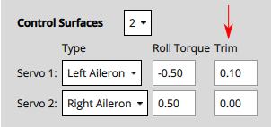
:::

   - 조종면의 트림을 설정한 후 슬라이더를 중앙에서 멀리 이동하고 놓은 다음 다시 무장 해제(가운데) 위치로 되돌립니다. 표면이 중립 위치에 있는지 확인합니다.

     슬라이더가 이미 중간 위치에 있더라도 _슬라이더를 **반드시** 움직여야 합니다_(움직일 때까지 명령을 받기 시작하지 않음).

:::note
Another way to test without using the sliders would be to set the [`COM_PREARM_MODE`](../advanced_config/parameter_reference.md#COM_PREARM_MODE) parameter to `Always`:

- 이렇게 하면 기체가 무장 해제된 경우에도 서보 제어가 가능하며 제어 표면에 트림 설정이 지속적으로 적용됩니다.
- Trim에 대해 다른 값을 설정하고 정렬을 확인한 다음 만족하는 값으로 설정할 수 있습니다.
:::

### 틸트 서보 설정

먼저 각 출력 그룹에 사용되는 서보의 _프레임 속도_를 설정합니다. 이것은 일반적으로 서보가 지원하는 최대값으로 설정합니다. 그 아래는 PWM50(가장 일반적인 값)으로 설정됩니다. 설정의 이 부분은 위의 조종면과 동일합니다.

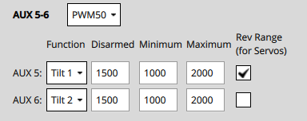

각 틸트 서보에 대하여:

1. `Disarmed` 값(예: PWM Servo의 경우 `1000` 또는 `2000`)을 설정하여 설정 _해제_ 시 서보가 예상 방향으로 위치하도록 합니다.
2. 서보의 슬라이더를 가장 낮은 위치에 놓고 양수 값 증가가 `최소 기울기 각도`(기하학 섹션에 정의됨)를 가리키는 지 확인합니다.

   
3. 서보의 슬라이더를 가장 높은 위치에 놓고 양의 모터 추력이 `최대 기울기 각도`를 가리키는 지 확인합니다(기하학 섹션에 정의됨).

### 기타 참고 사항

- 안전 버튼을 쿨러야 액츄에이트를 테스트 할 수 있습니다.
- 중지 스위치를 사용하면 모터를 즉시 중지할 수 있습니다.
- 해당 슬라이더가 변경될 때까지 서보는 실제로 이동하지 않습니다.
- 매개 변수 [COM_MOT_TEST_EN](../advanced_config/parameter_reference.md#COM_MOT_TEST_EN)을 사용하여 액츄에이터 테스트를 완전히 비활성화 할 수 있습니다.
- 셸에서 [actuator_test](../modules/modules_command.md#actuator-test)는 액추에이터를 테스트할 수 있습니다.
- VTOL은 **고정익 비행** 중에 위쪽을 가리키는 모터를 자동으로 끕니다.
  - 표준 VTOL: 멀티콥터 모터로 정의된 모터가 꺼집니다.
  - 틸트로터: 연결된 틸트 서보가 없는 모터는 꺼집니다.
  - 테이시터는 고정익 비행시에도 모터를 끄지 않습니다.

### 모터 역전

모터는 지오메트리 설정에서 정의된 방향으로 회전하여야 합니다("**Direction CCW**" 확인란). 모터가 올바른 방향으로 회전하지 않으면, 역전하여야 합니다.

회전 반향을 변경하는 방법은 다음과 같습니다:

- If the ESCs are configured as [DShot](../peripherals/dshot.md) you can permanently reverse the direction via UI. The **Set Spin Direction** buttons are displayed below the Actuator sliders (if DShot motors are used). These popup a dialog in which you select the motor for which you want to apply the direction.

  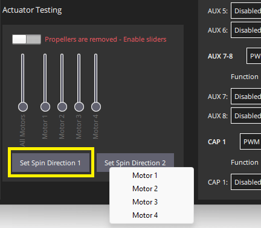

  Note that the current direction cannot be queried, so you may need to try both options.

- 모터 케이블 3개 중 2개를 변경하면됩니다(어떤 케이블이든 상관 없음).

  :::note
모터가 총알 커넥터를 사용하지 않은 경우에는 납땜을 다시 하여야 합니다 (이러한 이유로 DShot ESC를 선호합니다).
:::
