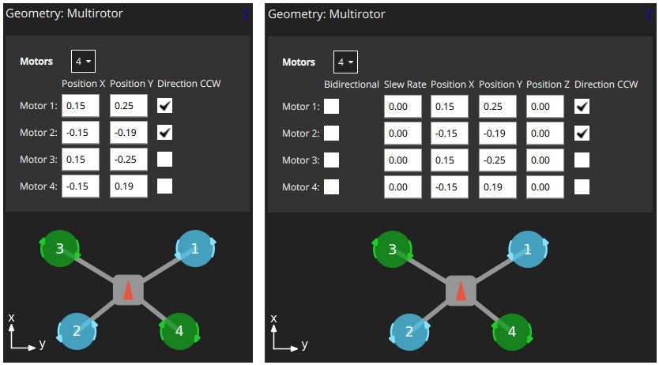
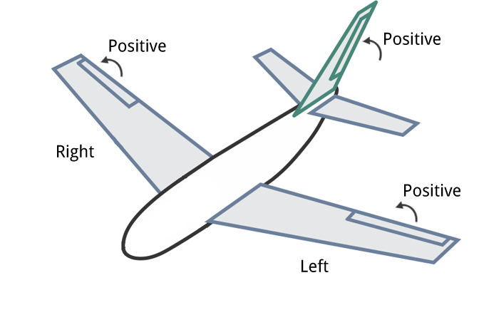
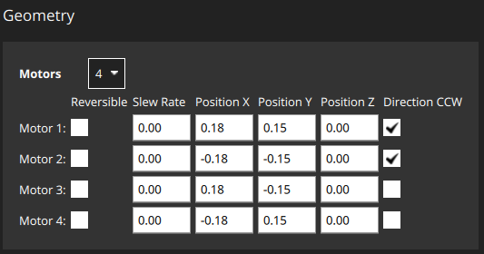

# Actuator Configuration and Testing

:::note
The *Actuators* view is only displayed if dynamic control allocation is enabled using the [SYS_CTRL_ALLOC](../advanced_config/parameter_reference.md#SYS_CTRL_ALLOC) parameter. This replaces geometry and mixer configuration files with configuration using parameters. You should also ensure that the appropriate airframe type is selected using [CA_AIRFRAME](../advanced_config/parameter_reference.md#CA_AIRFRAME).

The easiest way to try this out in simulation is to use the following make target, which has control allocation pre-enabled:
```
make px4_sitl gazebo_iris_ctrlalloc
```
:::

After selecting an [airframe](../config/airframe.md) you will generally need to configure the specific geometry, assign actuators to outputs, and test the actuator response. This can be done in *QGroundControl*, under the **Vehicle Setup > Actuators** tab.

The multicopter configuration screen looks like this.


Note that some settings are hidden unless you select the **Advanced** checkbox in the top right corner.

## Geometry

The geometry section is used to configure any additional geometry-related settings for the selected [airframe](../config/airframe.md). The UI displays a customised view for the selected type; if there are no configurable options this may display a static image of the frame geometry, or nothing at all.

The screenshot below shows the geometry screen for a multicopter frame, which allows you to select the number of motors, their relative positions on the frame, and their expected spin directions (select "**Direction CCW**" for counter-clockwise motors). This particular frame also includes an image showing the motor positions, which dynamically updates as the motors settings are changed.



A fixed wing airframe would instead display the parameters that define control surfaces, while a VTOL airframe could display both motors and control surfaces.


### Conventions

The following sections contain the conventions and explanations for configuring the geometry.

#### Coordinate system

The coordinate system is NED (in body frame), where the X axis points forward, the Y axis to the right and the Z axis down. Positions are relative to the center of gravity (in meters).

#### Control Surfaces and Servo Direction

Control surfaces use the following deflection direction convention:
- horizontal (e.g. Aileron): up = positive deflection
- vertical (e.g. Rudder): right = positive deflection
- mixed (e.g. V-Tail): up = positive deflection



:::note
If a servo does not move in the expected direction set in the geometry, you can reverse it using a checkbox on the Actuator Output.
:::


### Motor Tilt Servos

Tilt servos are configured as follows:
- The reference direction is upwards (negative Z direction).
- Tilt direction: **Towards Front** means the servo tilts towards positive X direction, whereas **Towards Right** means towards positive Y direction.
- Minimum and maximum tilt angles: specify the physical limits in degrees of the tilt at minimum control and maximum respectively. An angle of 0° means to point upwards, then increases towards the tilt direction. :::note Negative angles are possible. For example tiltable multirotors have symmetrical limits and one could specify -30 as minimum and 30 degrees as maximum. ::: :::note If a motor/tilt points downwards and tilts towards the back it is logically equivalent to a motor pointing upwards and tilting towards the front.
:::
- Control: depending on the airframe, tilt servos can be used to control torque on one or more axis (it's possible to only use a subset of the available tilts for a certain torque control):
  - Yaw: the tilts are used to control yaw (generally desired). If four or more motors are used, the motors can be used instead.
  - Pitch: typically differential motor thrust is used to control pitch, but some airframes require pitch to be controlled by the tilt servos. Bicopters are among those.
- Tiltable motors are then assigned to one of the tilt servos.


### Bidirectional Motors

Some vehicles may use bidirectional motors (i.e. motor spins in direction 1 for lower output range and in direction 2 for the upper half). For example, ground vehicles that want to move forwards and backwards, or VTOL vehicles that have pusher motors that go in either direction.

If bidiectional motors are used, make sure to select the **Reversible** checkbox for those motors (the checkbox is displayed as an "advanced" option).



Note that you will need to also ensure that the ESC associated with bidirectional motors is configured appropriately (e.g. 3D mode enabled for DShot ESCs, which can be achieved via [DShot commands](../peripherals/dshot.md#commands)).


## Actuator Outputs

The actuators and any other output function can be assigned to any of the physical outputs. Each output has its own tab, e.g. the PWM MAIN or AUX output pins, or UAVCAN.

PWM outputs are grouped according to the hardware groups of the autopilot. Each group allows to configure the PWM rate or DShot/Oneshot (if supported).

:::note
For boards with MAIN and AUX, prefer the AUX pins over the MAIN pins for motors, as they have lower latency.
:::

The AUX pins have additional configuration options for camera capture/triggering. Selecting these requires a reboot before they are applied.


## Actuator Testing

<!-- Not documented: "Identify and assign motors" -->
 
When testing actuators, make sure that:
- Motors spin at the "minimum thrust" position.

  The sliders snap into place at the lower end, and motors are turned off (disarmed). The "minimum thrust" position is the next slider position, which commands the minimum thrust. For PWM motors, adjust the minimum output value such that the motors spin at that slider position (not required for DShot). :::note VTOLs will automatically turn off motors pointing upwards during fixed-wing flight. For Standard VTOLs these are the motors defined as multicopter motors. For Tiltrotors these are the motors that have no associated tilt servo. Tailsitters use all motors in fixed-wing flight.
:::
- Servos move into the direction of the convention described above. :::note A trim value can be configured for control surfaces, which is also applied to the test slider.
:::

Note the following behaviour:
- If a safety button is used, it must be pressed before actuator testing is allowed.
- The kill-switch can still be used to stop motors immediately.
- Servos do not actually move until the corresponding slider is changed.
- The parameter [COM_MOT_TEST_EN](../advanced_config/parameter_reference.md#COM_MOT_TEST_EN) can be used to completely disable actuator testing.
- On the shell, [actuator_test](../modules/modules_command.md#actuator-test) can be used as well.

### Reversing Motors

The motors must turn in the direction defined in configured geometry ("**Direction CCW**" checkboxes). If any motors do not turn in the correct direction they must be reversed.

There are several options:
- If the ESCs are configured as [DShot](../peripherals/dshot.md) you can reverse the direction via UI (**Set Spin Direction** buttons). Note that the current direction cannot be queried, so you might have to try both options.
- Swap 2 of the 3 motor cables (it does not matter which ones).

:::note
If motors are not connected via bullet-connectors, re-soldering is required (this is a reason, among others, to prefer DShot ESCs).
:::
